## 🚀 들어가며

cFS를 공부할 때, 이 프레임워크를 리눅스 가상 환경에서만 맛보기로 체험해 보는 것이 아니라 실제 보드에 올려 실습해 보고 싶다는 생각이 들었다. 당시 공식적으로 제공되는 BSP는 pc-linux, pc-rtems, mcp750-vxworks밖에 없어 고민이 많았는데, 포기하지 않고 검색한 결과 비글본블랙 보드에 cFS를 포팅한 데모를 찾아냈다.

학부 시절 아두이노, 라즈베리파이와 같은 학습용 보드는 다루어 봤지만 산업용 보드는 처음인데, 그만큼 차곡차곡 학습하는 것이 이롭겠다 싶어 비글본블랙에 내장된 프로세서(SoC)와 여러 장치를 유튜브 강의를 바탕으로 정리해 본다.

**참고자료**

- [BeagleBone Black Online Documentation](https://docs.beagleboard.org/boards/beaglebone/black/index.html)

- [AM335x ARM® Cortex™-A8 Microprocessors Technical Reference Manual (PDF)](https://www.mouser.com/pdfdocs/spruh73h.pdf?srsltid=AfmBOoqV7OqtQrYUVazQdlEfYgLsu4ZbBq-H_LOOi2k_dSfkvYlTmZnw)

- [BeagleBone Black Schematic Diagram (PDF)](https://github.com/beagleboard/beaglebone-black/blob/master/BBB-SCH.pdf)

### AM335x Functional Overview Part 1

> 썸네일을 클릭하면 유튜브 영상을 시청하실 수 있습니다.

### AM335x Functional Overview Part 2

> 썸네일을 클릭하면 유튜브 영상을 시청하실 수 있습니다.

## 🤔 SoC는 왜 등장했으며 어떻게 사용될까?

기존에 보드 설계를 할 때는, 사용할 주변장치마다 별도의 컨트롤러 칩을 달아 주어야 했다. UART, 이더넷, USB, DMA 정도의 기본 장치만 사용하려 해도 칩이 벌써 네 개나 더 필요한 셈이다.

칩이 늘어나니 PCB 크기가 커질 수밖에 없었고, 제조사들의 입장에서는 이것 또한 비용 부담이 컸다. 이를 위한 대안으로 설계된 것이 System-on-Chip으로, 각종 컨트롤러를 하나의 칩 위에 올려버린 형태이다.

이렇게 칩 벤더 기업이 SoC를 생산하면 보드 제조사는 이를 구입해 필요한 외부 장치를 붙인다. 그래픽 LCD, 플래시 메모리, DDR 메모리 등 웬만한 페리퍼럴에 대한 온칩 컨트롤러가 갖추어져 있으니 보드가 컴팩트해지고, 우리가 실제 사용하는 손바닥만한🖐🏻 완제품 보드를 만드는 것이 가능해졌다.

## 🐶 비글본블랙 PCB/SoC 레이아웃

AM335x에 내장된 컨트롤러들을 표로 정리해 보았다. 이 주변장치를 BBB가 모두 사용하고 있는 것은 아니고, 필요에 따라서 활성화한 것도 있고 쓰지 않는 것도 있다.

### AM335x 내장 온칩 페리퍼럴 목록

<table>
  <thead>
    <tr>
      <th>구분</th>
      <th>페리퍼럴</th>
    </tr>
  </thead>
  <tbody>
    <tr>
      <td rowspan="6">시리얼 통신</td>
      <td>UART × 6</td>
    </tr>
    <tr><td>SPI × 2</td></tr>
    <tr><td>I2C × 3</td></tr>
    <tr><td>McASP (멀티채널 오디오 시리얼 포트)</td></tr>
    <tr><td>CAN (Controller Area Network)</td></tr>
    <tr><td>고속 USB</td></tr>
    <tr>
      <td rowspan="6">시스템 관련</td>
      <td>EDMA (Enhanced Direct Memory Access Controller)</td>
    </tr>
    <tr><td>타이머</td></tr>
    <tr><td>ADC</td></tr>
    <tr><td>Watchdog Timer</td></tr>
    <tr><td>RTC</td></tr>
    <tr><td>PWM</td></tr>
    <tr>
      <td rowspan="4">병렬 데이터 / 스토리지</td>
      <td>GPIO</td>
    </tr>
    <tr><td>MMC</td></tr>
    <tr><td>SD 카드</td></tr>
    <tr><td>SD I/O</td></tr>
    <tr>
      <td>네트워크</td>
      <td>Ethernet MAC × 2</td>
    </tr>
  </tbody>
</table>

### 비글본블랙 보드 주요 부품 목록

<figure style="margin-bottom: 16px;">
  
  <figcaption>Key Components</figcaption>
</figure>

- **[U2]** TPS65217C PMIC — 보드 각 부품에 전원 레일을 공급
- **[U5]** Sitara AM3358BZCZ100 (1GHz) — 보드의 프로세서
- **[U11]** HDMI Framer — 어댑터를 통해 HDMI/DVI-D 디스플레이를 제어
- **[U12]** Micron 512MB DDR3L 또는 Kingston 512MB DDR3 — Dual Data Rate RAM
- **[U13]** Micron eMMC — 최대 4GB 데이터를 담는 온보드 MMC 칩
- **[U14]** SMSC 이더넷 PHY — 네트워크 물리 계층 인터페이스

### Connectors, LEDs, and Switches

<figure style="margin-bottom: 16px;">
  
  <figcaption>Connectors, LEDs, and Switches</figcaption>
</figure>

- **[S1]** 리셋 버튼 — 프로세서 리셋
- **[S2]** BOOT 스위치 — 전원을 껐다 켤 때 이 스위치를 누르고 있으면 microSD 카드로 강제 부팅 가능
- **[S3]** 파워 버튼 — 프로세서에 파워다운 시퀀스를 알리는 버튼으로, 보드를 끌 때 사용
- **[P1]** DC 전원 잭 — 5V를 입력받는 메인 전원 커넥터
- **[P3]** USB 호스트 — Wi-Fi, 블루투스, 키보드 등 다양한 USB 장치 연결 가능
- **[P4]** USB 클라이언트 — PC와 연결하는 미니 USB 포트로, 여기로 보드에 전원을 공급할 수도 있음
- **[P5]** 10/100 이더넷 — LAN 연결 포트
- **[P6]** microHDMI 커넥터 — 디스플레이 연결용
- **[P10]** microSD 슬롯
- **[D2]–[D5]** 사용자가 자유롭게 쓸 수 있는 파란색 LED 4개
- **[J1]** 시리얼 디버그 포트

## 🌐 스키매틱 따라가기 실습 1. 이더넷 PHY

유튜브 강의 파트 1의 마지막 부분과 파트 2는 실제 데이터시트를 따라가며 각 부품을 어떻게 알아보고 공부하면 되는지 알려준다. 이 부분이 꽤 유익해서 꼭 포스팅하고 싶었다. ㅎㅎ

---

1. 보드에 있는 RJ45 커넥터(`P5`)를 스키매틱에서 검색한다.

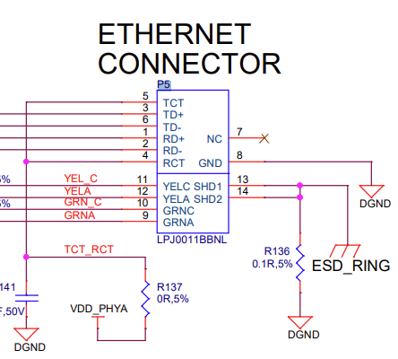

---

2. 이더넷 커넥터의 부품명 LPJ0011BBNL을 인터넷에 검색하면 제조사 홈페이지에서 부품 정보를 확인할 수 있다.

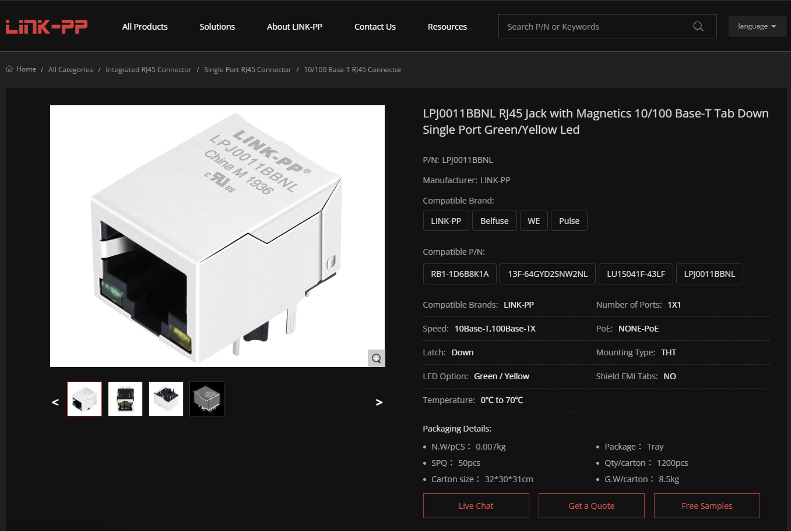

간략한 제품 설명을 살펴보니 이 커넥터는 PoE(Power over Ethernet)를 지원하지 않는다. 더 상세한 정보가 필요하다면 홈페이지에서 3D 도면이나 데이터시트도 다운로드받을 수 있다.

---

3. 이번에는 LPJ0011BBNL 커넥터가 어떤 IC에 연결되어 있는지 추적한다.

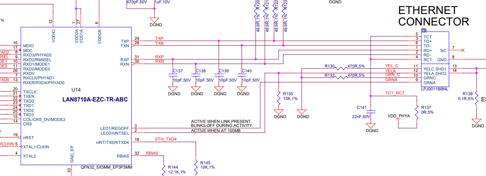

바로 왼쪽을 보면 스키매틱 번호 `U14`의 `LAN8710A-EZC-TR-ABC` 이더넷 PHY에 연결되어 있는 것을 볼 수 있다.

---

4. 해당 IC의 파트 넘버로 데이터시트를 검색하면, 이 칩이 마이크로칩(Microchip)사의 `LAN8710A` 이더넷 PHY라는 것을 확인할 수 있다. 

간단 설명을 확인하면 *10/100 Base-T/TX Ethernet Transceiver with MII/RMII Interface* 라고 서술되어 있으며, 이를 통해 이 PHY는 RMII(Reduced Media Independent Interface)를 통해 SoC의 MAC 계층과 연결된다는 사실을 알 수 있다.

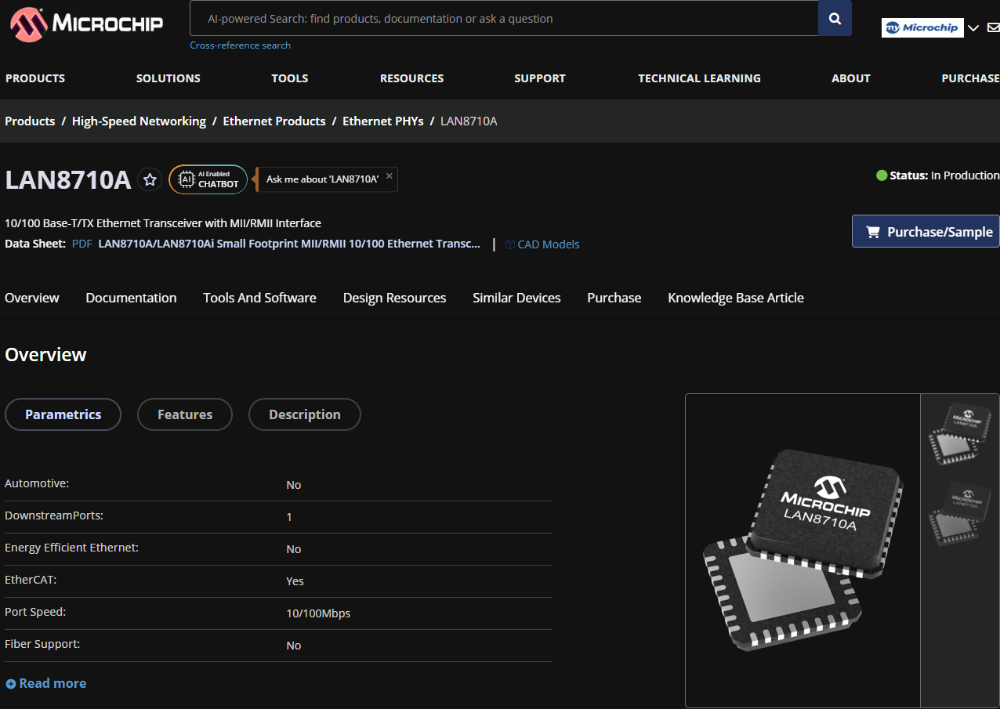

## 🧭 스키매틱 따라가기 실습 2. DDR3 메모리

1. 비글본블랙 DDR3 메모리 스키매틱 번호 `U12`를 검색한다.

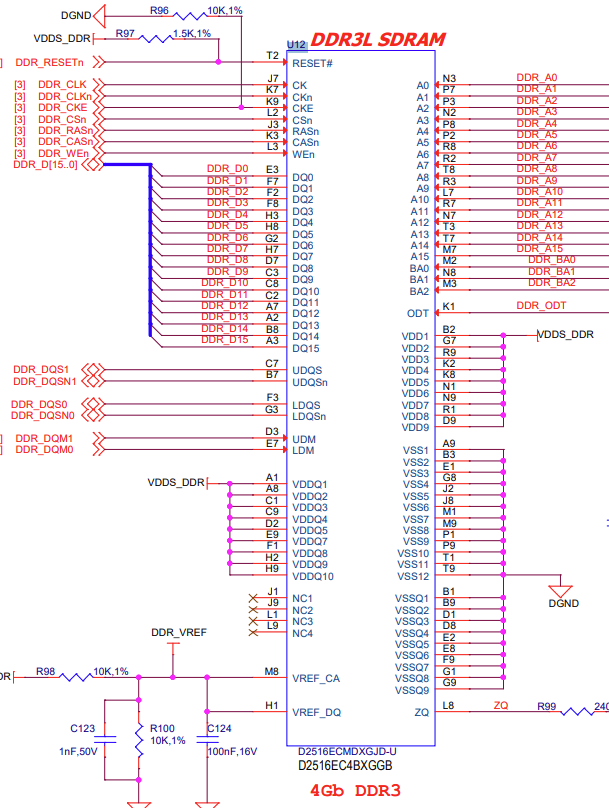

4Gb(=512MB) DDR3 SDRAM을 비휘발성 저장장치로 활용하고 있고, 해당 부품의 명칭은 `D2516EC4BXGGB`임이 확인된다.

---

2. 부품명을 검색하니 해당 DDR3는 Kingston Technology의 DDR3 SDRAM이며, 현재는 단종된 부품이라는 결과를 얻을 수 있었다.

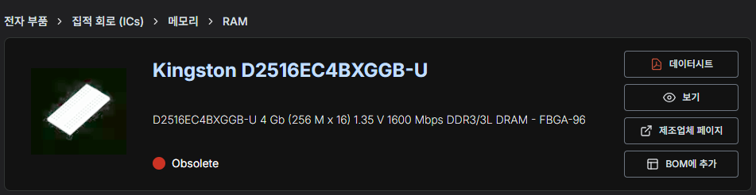

---

3. 데이터시트 상 칩 용량은 4Gb(=512MB), 메모리 구성은 256M×16, 최대 전송률은 약 12,800Mbps(DDR3-1600급)이다.

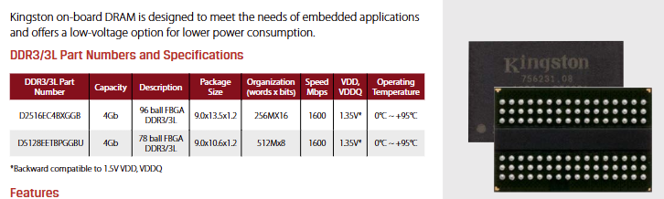

---

4. 1번 항목의 스키매틱을 보면 DDR 신호선들이 있다. `DDR_A[15..0]`, `DDR_BA[2..0]`, `DDR_D[15..0]` 등의 핀이 어디로 연결되어 있는지 검색해 본다.

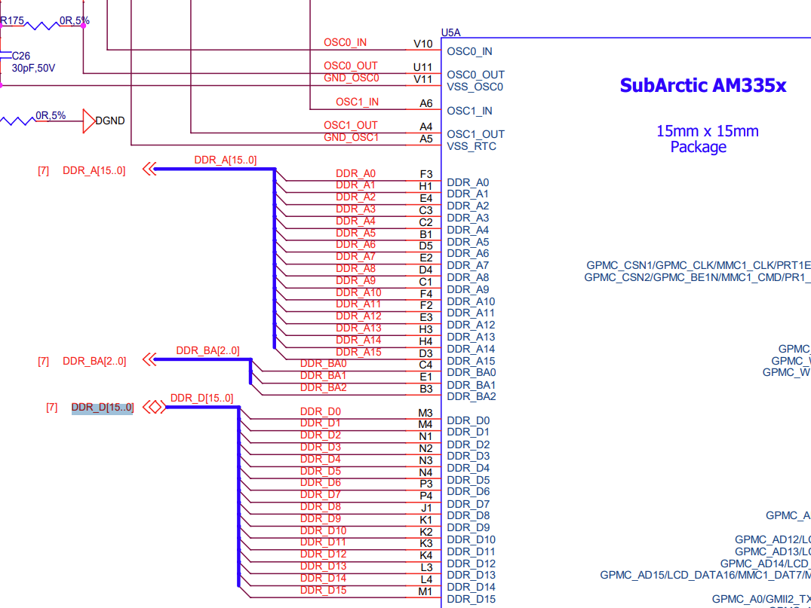

신호선을 따라가면 SoC에 내장된 EMIF(DDR 전용 컨트롤러) 핀들로 그대로 이어지는 것을 확인할 수 있다. 별도의 외장 DDR 컨트롤러 칩 없이 SoC에 이미 내장된 컨트롤러만으로 DDR3 메모리를 바로 붙일 수 있음을 검증해 보았다.

## 👣 스키매틱 따라가기 실습 3. eMMC 메모리

1. BBB에 전원을 넣으면 디폴트로 eMMC(embedded Multi-Media Card)에서 부팅한다. eMMC는 `U13`으로 등록되어 있다. 이 번호를 스키매틱에서 검색한다.

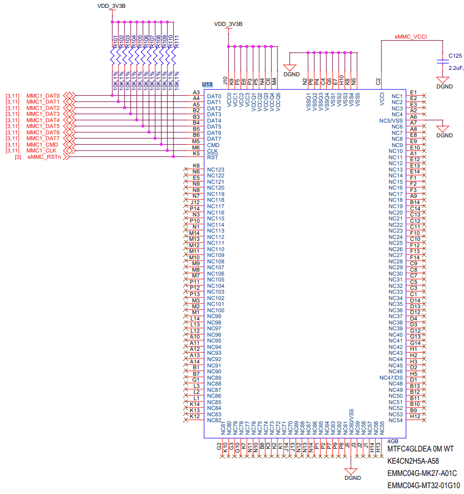

---

2. 4가지 일련번호 중 어떤 것이 부품명인지 잘 모르겠어서 일단 `MTFC4GLDEA 0M WT`를 먼저 검색해 보았는데, 바로 Micron사의 MMC 메모리 정보가 나왔다.

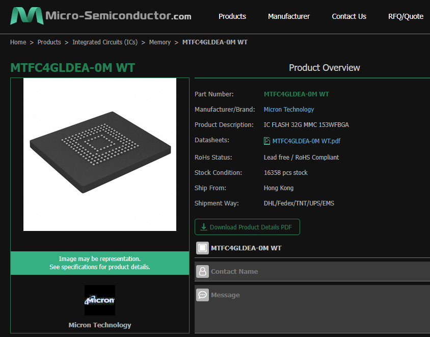

---

3. 데이터시트를 확인하면 비슷한 메모리 부품이 2GB/4GB/8GB/16GB 등 다양한 용량으로 제공됨을 확인할 수 있다. 우리는 이 중 두 번째 행 4GB 메모리를 탑재한 BBB 보드를 살펴보고 있다.

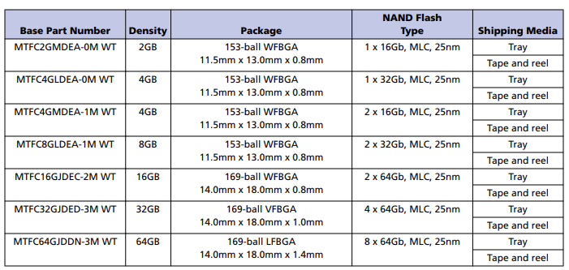

---

4. 1번의 블록도를 보면, SoC의 MMC1와 연결하는 라인이 있다. 이를 따라가면 AM335x SoC가 나오고, 조금 더 밑을 보면 MMC1 외에도 MMC0 인터페이스가 존재한다.

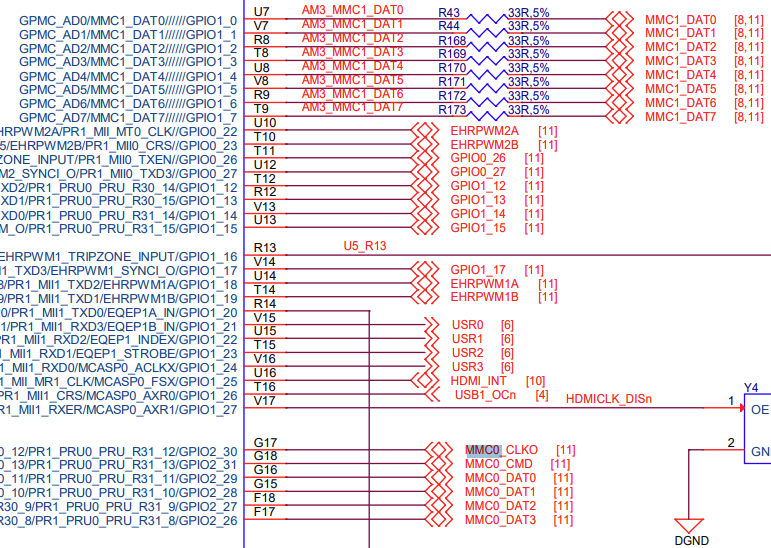

일부 핀은 GPMC 등 다른 기능과 멀티플렉싱되어 있기도 하다.

---

5. MMC0 인터페이스는 어디에 연결되어 있을까? 바로 microSD이다.

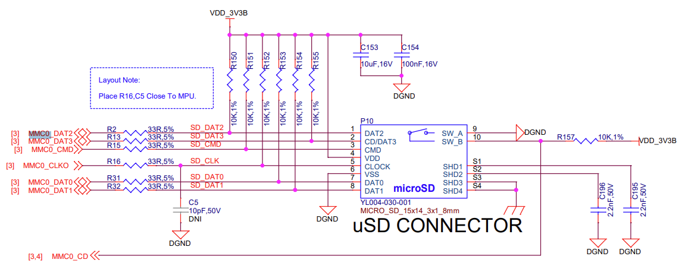

비글본블랙 부팅 시 그냥 전원을 넣는 것이 아니라 microSD를 장착하고 부트 버튼을 누른 채 전원을 연결하면 microSD에서부터 부팅이 된다. 이를 가능하게 하는 것이 MMC0 인터페이스 연결인 것이다.

## ✨ 마치며

세 가지 실습 모두 데이터시트를 어떻게 읽고, 보드 위 부품들이 실제로 어떤 역할을 하는지 확인하는 법을 보여 주는 좋은 예시이다. 실제로 데이터시트를 눈이 빠져라 보아도 뭘 어떻게 접근해야 하는지 몰라 곤욕을 치렀던 적이 있어서 정말 좋은 실습이 되었다.

포스트에서는 비글본블랙 보드 요소 위주로 다루었는데, 강의는 AM335x SoC를 좀 더 심도 있게 파고든다. 메인 칩에 관심이 있다면 영상을 시청하며 공부하면 큰 도움이 될 것이다.