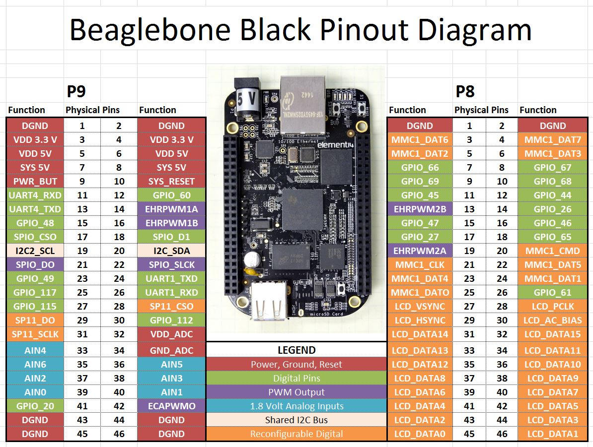
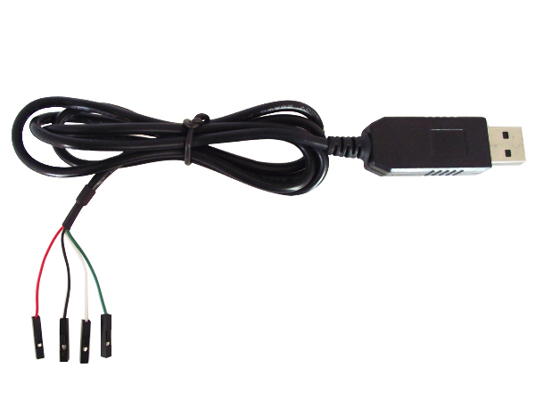
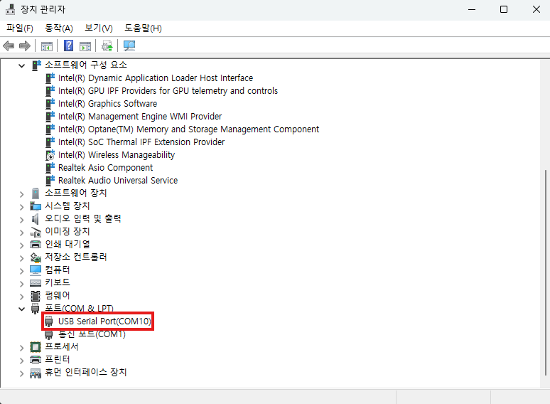
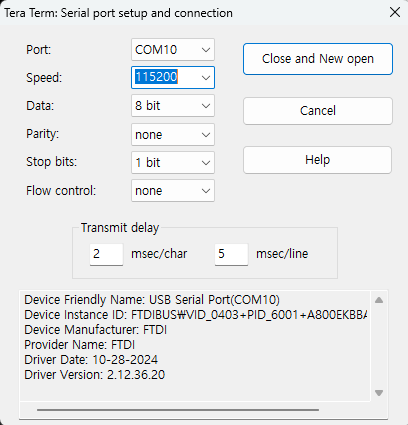
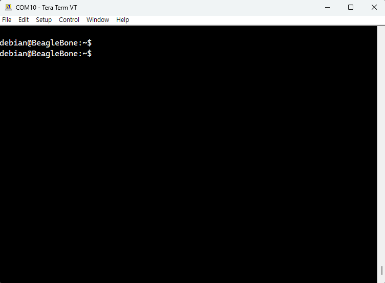

## 🚀 들어가며

아두이노, 라즈베리파이, 비글본블랙 등 소형 보드로 임베디드에 입문하면 가장 먼저 여러 센서를 달아 아날로그와 디지털 입출력을 살펴보게 된다. 이때 사용하는 것이 각종 핀들인데, 각 핀이 어떤 기능을 하는지 알아야 올바른 방법으로 연결할 수 있다.

## 🦴 BeagleBone Black 전체 핀아웃 다이어그램

BeagleBone Black에는 두 개의 핀 헤더가 있으며, 각 46개씩 총 92개이다.

사진과 같이 5V 플러그가 위쪽을 향하도록 보드를 놓았을 때 왼쪽 헤더가 P9, 오른쪽 헤더가 P8이다.
 
## 🔴 Power, Ground, Reset

전원 공급 및 접지에 사용되는 핀들이다.

| 번호 | 핀 이름 | 설명 |
|---|---|---|
| `P8` 1-2, `P9` 1-2, 43-46 | `DGND` | 디지털 접지 (0V 기준선) |
| `P9` 3-4 | `VDD 3.3V` | 3.3V 전원 공급 |
| `P9` 5-6 | `VDD 5V` | 5V 전원 공급 |
| `P9` 7-8 | `SYS 5V` | 시스템 5V (USB 경유 공급) |
| `P9` 9 | `PWR_BUT` | 전원 버튼 |
| `P9` 10 | `SYS_RESET` | 시스템 리셋 핀 |
| `P9` 32 | `VDD_ADC` | 1.8V 아날로그 기준 전압 (ADC용) |
| `P9` 34 | `GND_ADC` | ADC 전용 접지 |

### 전원 핀

**DGND (Digital Ground)**

모든 전압은 '기준점 대비 얼마나 높은가'로 측정된다. 센서나 모듈을 연결할 때 반드시 이 핀과 센서의 GND를 서로 묶어주어야 보드와 외부 장치가 같은 0V 기준을 공유하게 되어 신호가 제대로 해석된다.

**VDD_3V3 (3.3V 전원 출력)**

외부 센서나 모듈에 3.3V 전원을 공급할 때 사용한다. 핀당 최대 250mA까지 출력이 가능하고, 그 이상 전류가 필요한 장치는 별도 전원을 써야 한다.

**VDD_5V**

5V 양방향 라인으로, 평소엔 보드가 5V를 출력하지만, 반대로 외부에서 안정된 5V를 넣어주면 별도의 전원 잭 없이 이 핀을 통해 보드 전체에 전원을 공급할 수 있다.

**SYS_5V**

5V의 전압을 출력하지만 `VDD_5V`보다 전류 용량이 더 작아 핀당 최대 250mA를 출력한다. 소용량 주변장치 전원용으로 사용할 수 있다.

### 제어/신호 핀

**PWR_BUT (Power Button)**

평소엔 5V로 풀업되어 있고, 이 핀을 GND로 끌어내리면(pull down) 전원 장치가 이를 감지해서 정상적인 종료 절차를 밟는다. 물리적인 전원 버튼과 동일하게 동작하므로 외부 버튼이나 스위치를 달아서 전원 버튼처럼 사용할 수 있다.

**SYS_RESET**

이 핀이 0V로 떨어질 때 보드 전체, 즉 프로세서뿐 아니라 이더넷 PHY 같은 다른 칩들도 함께 리셋된다. 외부에서 리셋 버튼을 달거나, 반대로 보드가 지금 리셋 상태인지 감지하는 용도로도 쓸 수 있다.

### ADC(아날로그 입력) 관련 핀

**VDD_ADC**

1.8V 전압이 지속적으로 출력된다. 아날로그 센서 및 회로를 구동할 때 `VDD_ADC`를 전원으로 사용하면 센서 출력이 1.8V를 넘지 않아 AIN이 안전하다.

**GND_ADC**

ADC 전용 Ground 핀이다. 디지털 신호(`DGND`)와 아날로그 신호(`GND_ADC`)의 접지를 분리해둔 이유는, 디지털 신호가 스위칭될 때 생기는 노이즈가 민감한 아날로그 측정값에 섞여 들어가는 것을 막기 위해서이다. 아날로그 전압을 측정할 땐 항상 `DGND`가 아니라 `GND_ADC`를 기준으로 잡아야 한다.

## 🟢 Digital GPIO (디지털 범용 입출력)

`GPIO_XX` 핀들은 General Purpose Input/Output으로, 범용 디지털 입출력 핀이라는 의미를 가진다. HIGH(3.3V) / LOW(0V) 신호를 읽거나(Input) 출력(Output)할 수 있어 각종 디지털 센서를 연결해 활용한다.

주의할 점은, `GPIO_XX`의 숫자가 물리적 핀 번호가 아닌 Linux GPIO 번호라는 것이다. AM335x는 GPIO를 32개씩 4개 뱅크(GPIO0~GPIO3)로 나누는데, 다음과 같이 계산된다.

    GPIO 번호 = 뱅크 번호 × 32 + 뱅크 내 오프셋

예시로 `GPIO_48`은 GPIO1 뱅크의 16번째 핀(`GPIO1_16`)이 된다.

또한 `UART_XX` 핀들은 UART 시리얼 통신 기능을 담당한다. 보통 BBB의 시리얼 디버그 포트 J1을 사용해 콘솔 출력을 확인하는데, 그 대신 여기에 연결해서 입출력을 받을 수도 있다.

| 번호 | 버스 | 핀 이름 | 설명 |
|---|---|---|---|
| `P9` 11 | UART4 | `UART4_RXD` | 수신 |
| `P9` 13 | UART4 | `UART4_TXD` | 송신 |
| `P9` 24 | UART1 | `UART1_TXD` | 송신 |
| `P9` 26 | UART1 | `UART1_RXD` | 수신 |

## 🟣 PWM Output (아날로그 유사 출력)

PWM은 Pulse Width Modulation을 뜻하며, 0 ~ 3.3V 범위의 아날로그 출력을 시뮬레이션한다. LED 밝기 조절, 모터 속도 제어 등 미세한 조절이 필요한 곳에 사용할 수 있다.

`EHRPWM`은 하나의 카운터를 A/B 두 채널이 공유하는 구조로, 모터 드라이버의 상보 신호 생성 등에 활용된다. `ECAPWM0`는 eCAP 모듈을 PWM 출력 용도로 전환한 것이라 채널이 하나뿐이다.

| 번호 | 버스 | 핀 이름 | 설명 |
|---|---|---|---|
| `P9` 14 | EHRPWM1 | `EHRPWM1A` | 출력 채널 A |
| `P9` 16 | EHRPWM1 | `EHRPWM1B` | 출력 채널 B |
| `P8` 19 | EHRPWM2 | `EHRPWM2A` | 출력 채널 A |
| `P8` 13 | EHRPWM2 | `EHRPWM2B` | 출력 채널 B |
| `P9` 42 | ECAP0 | `ECAPWM0` | 단일 채널 (A/B 구분 없음) |

## 🔵 1.8V Analog Inputs (아날로그 입력)

ADC(아날로그-디지털 변환) 핀으로, 아날로그 전압을 가하면 디지털 값으로 읽는다. 이때 핀이 손상될 수 있으므로 절대 아날로그 전압 1.8V를 초과하여 인가하면 안 된다.

앞서 설명한 `VDD_ADC`를 기준 전압으로, `GND_ADC`를 접지로 사용하는 것이 올바른 방법이다.

| 번호 | 핀 이름 | 설명 |
|---|---|---|
| `P9` 33 | `AIN4` | 아날로그 입력 4 |
| `P9` 35 | `AIN6` | 아날로그 입력 6 |
| `P9` 36 | `AIN5` | 아날로그 입력 5 |
| `P9` 37 | `AIN2` | 아날로그 입력 2 |
| `P9` 38 | `AIN3` | 아날로그 입력 3 |
| `P9` 39 | `AIN0` | 아날로그 입력 0 |
| `P9` 40 | `AIN1` | 아날로그 입력 1 |

## 🟡 Shared I2C Bus 및 SPI 통신

연한 주황색으로 표시된 두 개의 핀은 I2C 프로토콜 통신에 사용되는 핀들이다. 센서, OLED 디스플레이, EEPROM 등 I2C 디바이스 연결에 사용할 수 있다.

| 번호 | 핀 이름 | 설명 |
|---|---|---|
| `P9` 19 | `I2C2_SCL` | 클럭 신호 |
| `P9` 20 | `I2C2_SDA` | 데이터 신호 |

SPI 통신에 사용되는 핀들은 따로 색상 분류가 안 되어 있고, 각 다른 디지털/아날로그 핀 그룹에 포함되어 있다. 모아서 정리하면 다음과 같다.

SPI 통신은 플래시 메모리, ADC/DAC 모듈 등 고속 통신이 필요한 장치 연결에 사용한다.

| 번호 | 버스 | 핀 이름 | 설명 |
|---|---|---|---|
| `P9` 17 | SPI0 | `SPI0_CS0` | Chip Select |
| `P9` 18 | SPI0 | `SPI0_D1` | 데이터 (MOSI) |
| `P9` 21 | SPI0 | `SPI0_D0` | 데이터 (MISO) |
| `P9` 22 | SPI0 | `SPI0_SCLK` | 클럭 |
| `P9` 28 | SPI1 | `SPI1_CS0` | Chip Select |
| `P9` 29 | SPI1 | `SPI1_D0` | 데이터 (MISO) |
| `P9` 30 | SPI1 | `SPI1_D1`* | 데이터 (MOSI), 다이어그램에서 `GPIO_112`로 표기됨 |
| `P9` 31 | SPI1 | `SPI1_SCLK` | 클럭 |

## 🟠 Reconfigurable Digital / LCD (LCD 및 재설정 가능 핀)

주로 LCD 스크린 연결에 사용되는 핀들인데, LCD를 사용하지 않는 경우 HDMI 출력을 비활성화하면 이 핀들을 일반 GPIO로 재설정하여 활용할 수 있다.

| 번호 | 핀 이름 | 설명 |
|---|---|---|
| `P8` 27 | `LCD_VSYNC` | 수직 동기 신호 |
| `P8` 28 | `LCD_PCLK` | 픽셀 클럭 |
| `P8` 29 | `LCD_HSYNC` | 수평 동기 신호 |
| `P8` 30 | `LCD_AC_BIAS` | AC 바이어스 |
| `P8` 31-46 | `LCD_DATA0`-`LCD_DATA15` | 데이터 |

## 📟 UART 시리얼 출력 확인하기

비글본블랙은 SoC 기반의 싱글보드 컴퓨터로, 운영체제를 탑재하여 구동할 수 있다. 보통 eMMC 메모리에 기본적으로 리눅스 이미지가 설치되어 있고, 부팅 시 여기서 이미지를 가져와 리눅스를 실행한다.

리눅스가 실행된다면 터미널을 통해 셸과 상호작용할 수 있어야 한다. 보드와 PC를 UART로 연결하고 PuTTY, Tera Term 등의 터미널 프로그램을 통해 포트를 열면 되는데, 이를 가능하게 하는 핀이 아래 사진 10시 방향의 Debug Serial Header이다.

<figure style="margin-bottom: 16px;">
  
  <figcaption>Connectors, LEDs, and Switches</figcaption>
</figure>

### USB to UART 변환 장치

J1 헤더를 통해 시리얼 출력을 확인할 때 사용할 수 있는 부품에는 두 종류가 있다.

**1. USB to UART 케이블**

먼저 초심자를 위해 권장하는 방법은 'USB to UART 케이블'을 사용하는 것이다. 아래와 같이 생겼다.

점퍼선이 세 개인 것, 네 개인 것, 여섯 개인 것 등 다양한데 적당히 용도에 맞게 선택하면 된다. 세 개면 충분한데, 이후를 위해 네 개짜리나 여섯 개 짜리를 구매해도 상관없다.

**2. FTDI adapter**

두 번째 방법은 직렬 어댑터를 활용하는 것이다. 'FTDI adapter'라고 검색하면 다음과 같이 생긴 어댑터 모듈이 나온다. 

<figure style="margin-bottom: 16px;">
  
  <figcaption>FT232RL 3.3V 5.5V FTDI USB to TTL Serial Adapter</figcaption>
</figure>

### 변환 장치를 이용해 터미널 연결

이제 구매한 부품을 활용해 보드와 PC를 연결해 보자.

  <figure style="margin: 0; flex: 0 0 auto;">
    
  </figure>
  <table>
    <thead>
      <tr><th>핀 번호</th><th>신호</th></tr>
    </thead>
    <tbody>
      <tr><td>1</td><td>Ground (<code>GND</code>)</td></tr>
      <tr><td>4</td><td>Receive(<code>RX</code>)</td></tr>
      <tr><td>5</td><td>Transmit(<code>TX</code>)</td></tr>
    </tbody>
  </table>

사진의 흰 점 쪽이 1번 핀이며, 밑으로 내려가면서 1~6번 핀이 위치한다.

여기서 주의할 점이, 표의 TX/RX가 보드 기준이라는 것이다. 보드에서 TX되는 데이터가 모듈의 RX로 들어가야 하는 구조이다.

따라서 4번 핀(RX)에는 점퍼선의 TX 선을, 5번 핀(TX)에는 점퍼선의 RX 선을 연결해야 한다. 

그 후 USB쪽을 PC에 연결하고, 장치 관리자를 켜 포트가 제대로 잡혔는지 확인한다.

COM10으로 포트가 잡힌 것을 볼 수 있다. 이제 터미널 프로그램을 켜 시리얼 포트로 연결한다.

비글본블랙은 UART 속도가 115200로 구성되어 있으므로, baudrate를 115200로 설정한다. 

올바르게 열렸다면 5V DC 전원을 연결한다. 부팅 후 프롬프트가 나타날 것이다.

## ✨ 마치며

FTDI 모듈을 이용해서 UART 출력을 확인할 때, 안정적으로 파워 공급을 하려면 USB 케이블이 아닌 5V DC 잭으로 전원을 연결하는 것이 좋다. USB로는 500mA까지밖에 출력할 수 없어서 파워가 많이 필요한 작업을 하면 보드가 멈춰버릴 수 있다.

비글본블랙을 활용하는 방법은 이렇게 터미널을 연결해 실제 리눅스 셸에 접근하는 방법도 있지만, USB 케이블을 사용하여 비글본블랙이 호스팅하는 로컬 개발 서버에 웹으로 접속하는 방법도 있다. 이렇게 웹에서 비글본블랙을 제어하는 방법도 추후 다룰 예정이다.