## 🚀 들어가며

비글본블랙은 임베디드 장비이기 때문에, 확장성 있는 우분투보다는 안정적인 데비안을 올려 사용한다. 처음 구매해 보드를 켜 봤다면 굉장히 오래된 버전의 데비안이 저장되어 있는 것을 보았을 것이다. 본격적인 보드 활용 전, 리눅스 이미지를 미리 업데이트해 더이상 deprecation에 고통받지 말자.

이 내용은 동봉되어 있는 종이 매뉴얼에 기재되어 있는 대로 접속해서 확인할 수도 있다. PC와 보드를 연결해 보드에 저장되어 있는 HTML 매뉴얼을 확인하도록 안내할 것이다. 해당 내용은 참고자료 섹션의 'Connecting Up Your BeagleBone Black'과 동일하다.

**참고자료**
- [Connecting Up Your BeagleBone Black (Web)](https://docs.beagleboard.org/boards/beaglebone/black/ch03.html)
- [BeagleBone Black Latest Software Images (Official Website)](https://www.beagleboard.org/distros)

### Beaglebone Black eMMC booting (1)

> 썸네일을 클릭하면 유튜브 영상을 시청하실 수 있습니다.

[](https://youtu.be/HFchi27dE_U?si=mfekgRVgQYWjVcUG)

### Beaglebone Black eMMC booting (2)

> 썸네일을 클릭하면 유튜브 영상을 시청하실 수 있습니다.

[](https://youtu.be/fd4gzfVGSC4?si=wSnZWRedqjF1r_Xu)

### Beaglebone Black eMMC booting (3)

> 썸네일을 클릭하면 유튜브 영상을 시청하실 수 있습니다.

[](https://youtu.be/VE-wha_8tI8?si=7-eBq6bDA1QihKx0)


## 📸 현재 이미지 버전 확인

본격적으로 업데이트를 진행하기 전 현재 어떤 이미지가 올라가 있는지부터 확인한다.

```bash
lsb_release -da
```
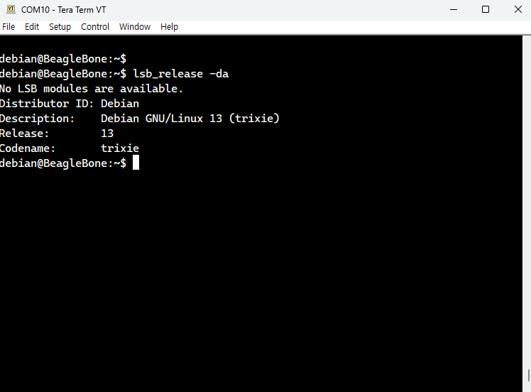

내 보드는 예전에 한 번 업데이트를 진행해서 Debian 13 Trixie가 저장되어 있기는 하지만, username을 내 이름으로 바꿔서 다시 구워 확인해 보도록 하자.

## 🍳 BeagleBoard Imaging Utility로 SD카드 굽기

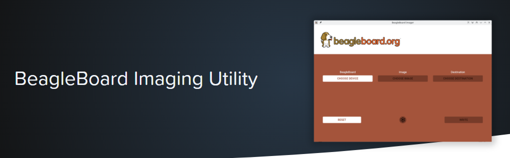

가장 쉬운 방법은 BeagleBoard.org에서 공식 제공하는 이미지 플래싱 프로그램을 이용하는 것이다. 

먼저 [BeagleBoard Imaging Utility 다운로드 링크(클릭)](https://beagleboard.github.io/bb-imager-rs/bb-imager/1.0.14/install-gui.html)에 접속해 사용하는 운영체제에 맞는 설치파일을 다운로드해 실행한다.

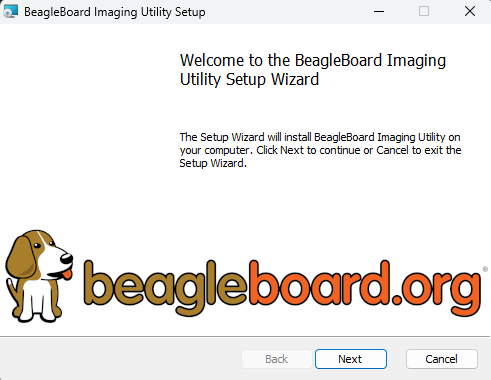

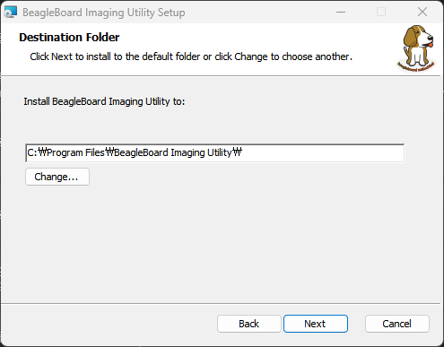

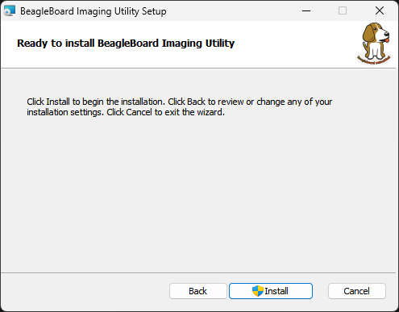

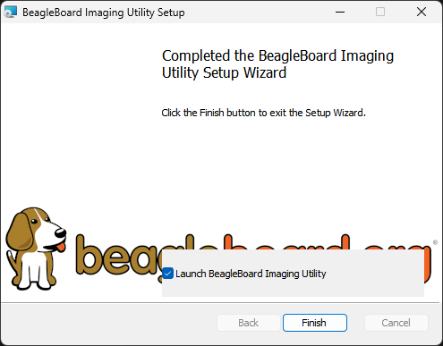

설치가 완료되었다면 BeagleBoard Imaging Utility를 실행해 보자.

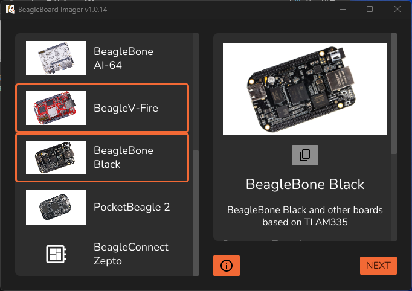

BeagleBoard Imaging Utility를 사용할 때에는 이미지를 따로 다운로드할 필요가 없다. 프로그램 안에서 내가 업데이트할 보드의 종류와 그에 맞는 이미지를 선택한다.

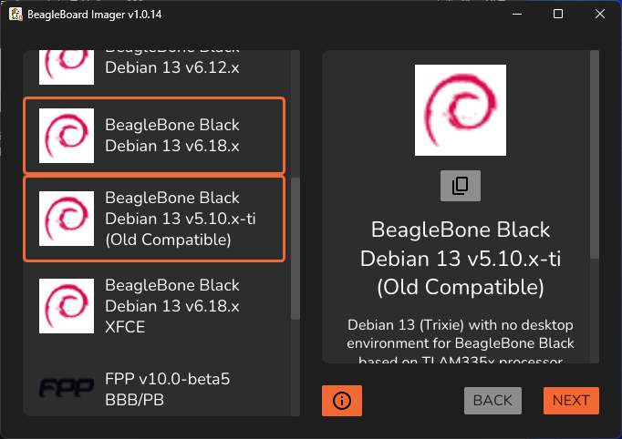

비슷비슷해보이는 이미지가 굉장히 많은데, 이 중 Xface는 HDMI 연결로 실제 모니터와 마우스 등을 연결해 쓸 수 있는 GUI가 포함되어 있고, IoT는 그렇지 않다.

또한 버전 태그 끝에 x가 붙어 있으면 일반 데비안 이미지이고, ti가 붙어 있다면 Texas Instruments에서 AM335x SoC에 맞게 직접 패치한 커널 브랜치이다. 주변장치 드라이버들이 훨씬 완성도 있게 포함되어 있다.

우리는 임베디드 환경을 경험할 것이므로 IoT v5.10-ti를 권장한다.

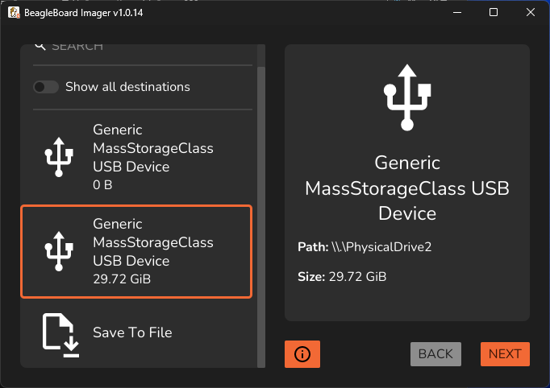

이미지를 구울 SD 디스크를 올바르게 선택해 준다.

<br>

<div style="display: flex; justify-content: center; flex-wrap: wrap;" >
  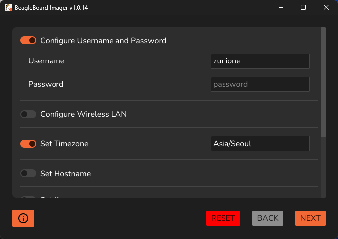
  
</div>

이미지를 굽기 전 기본적인 configuration을 설정할 수 있다. 원하는 항목을 골라 구성하고 이미지 쓰기를 시작한다.

<br>

<div style="display: flex; justify-content: center; flex-wrap: wrap;" >
  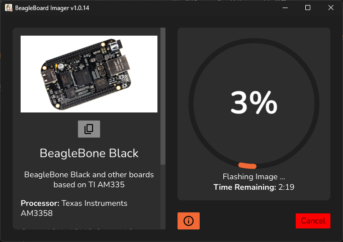
  
</div>

이미지 플래싱이 완료되면 창을 끄고 SD카드를 슬롯에서 꺼낸다.

## 🪟 Win32 Disk Imager로 SD카드 굽기

따로 BeagleBoard에서 제공하는 유틸리티를 사용하지 않고 이미지를 플래싱할 수도 있다. 리눅스 이미지를 따로 다운받아 로컬 프로그램으로 굽는 방식이다.

### 설치할 데비안 이미지 다운로드

이미지 다운로드를 위해 [BeagleBoard Latest Software Images(클릭)](https://www.beagleboard.org/distros) 사이트에 접속한다.


필터 옵션으로 BeagleBone Black을 선택하면 비글본블랙에 대한 데비안 이미지 목록이 나온다.


앞서 설명했듯, 이 중 IoT v5.10-ti 이미지를 선택해 다운받는다.

### 이미지 압축 해제

다운받은 `.xz` 파일을 압축 해제해서 이미지를 추출해야 한다. 간단하게는 반디집을 사용하는 방법이 있고, 7-zip을 사용해 압축을 풀 수도 있다.

- [7-zip 다운로드](https://www.7-zip.org/download.html)

윈도우 버전에 따라 기본 압축 해제 유틸리티로도 가능한 경우가 있으니 잘 확인해 맞는 방법으로 진행하면 된다.

### Win32 Disk Imager 다운로드

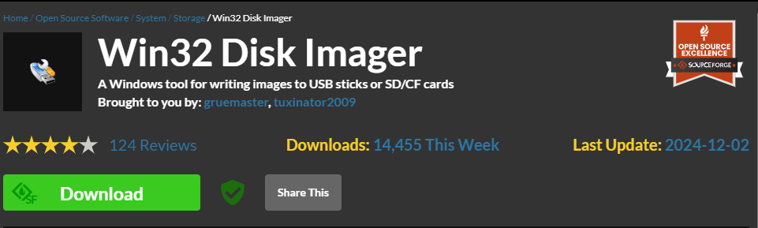

오픈소스 프로그램 공유 사이트 [SourceForge의 Win32 Disk Imager 다운로드 페이지(클릭)](https://sourceforge.net/projects/win32diskimager)에서 프로그램을 다운로드한다.

유의할 점은, Win32 Disk Imager는 공식적으로 윈도우 10까지만 지원하므로 윈도우 11부터는 예상치 못한 문제가 생길 수도 있음을 염두에 둬야 한다.

### SD카드 Image Flashing

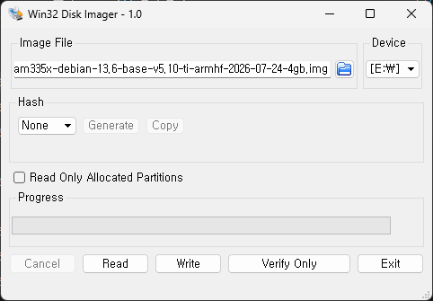

압축을 해제한 `img` 파일과 이미지를 쓸 디바이스를 선택한 후 `write` 버튼을 누르면 플래싱이 진행된다. 작업이 끝나면 창을 끄고 SD카드를 꺼낸다.

이 방법을 사용할 때는 이미지의 username을 설정할 수 없다.

## 🐣 SD카드를 장착하고 부팅

비글본블랙 보드의 SD카드 슬롯에 카드를 장착하고 부팅을 시작한다. 이때 부팅의 시작부터 제대로 확인하기 위해서는 다음 순서를 따라야 한다.

> 1. FTDI 부품으로 PC-보드를 UART 연결
> 2. PuTTY, Tera Term 등의 터미널 프로그램으로 시리얼 터미널 오픈
> 3. S1 버튼을 누른 채로
> 4. 5V 전원 연결

FTDI 부품으로 PC-보드를 UART 연결해 터미널로 띄우는 방법은 [이전 포스트의 'UART 시리얼 출력 확인하기' 항목(클릭)](http://zunione.github.io/bbb-pinout-diagram/#-UART-%EC%8B%9C%EB%A6%AC%EC%96%BC-%EC%B6%9C%EB%A0%A5-%ED%99%95%EC%9D%B8%ED%95%98%EA%B8%B0)에서 확인할 수 있다.

<figure style="margin-bottom: 16px;">
  
  <figcaption>Connectors, LEDs, and Switches</figcaption>
</figure>

또한 S1 버튼은 보드를 자세히 들여다보면 찾을 수도 있는데, 위 사진의 Reset 버튼이다. 

사실 S1 버튼을 누르지 않아도 SD카드가 삽입되어 있으면 대부분의 경우 SD카드에서 부팅을 하긴 하는데, 이따금씩 멋대로 eMMC 부팅을 하는 경우가 있어 S1버튼을 누르고 하는 것을 권장한다.😅

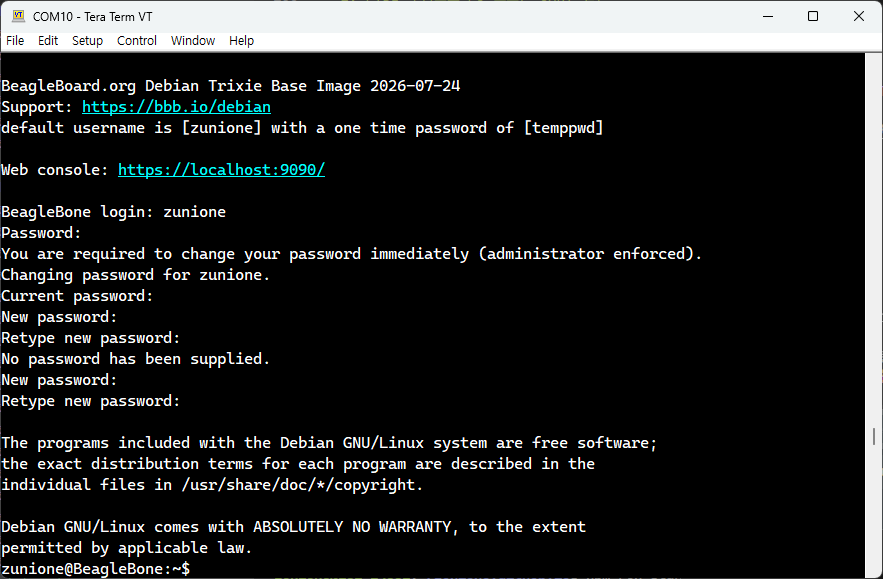

순서를 잘 맞춰 전원을 공급하면 SD카드로부터 부팅이 진행된다. 약 3분 정도 로그가 쭉 올라가고, 마지막에 로그인 프롬프트가 뜨면 아이디와 패스워드 입력 후 로그인하면 된다.

비밀번호가 기본 비밀번호일 경우 변경하라고 안내하는데, 이때 빈 패스워드는 입력할 수 없으므로 자신이 자주 사용하는 비밀번호로 변경해 비밀번호를 까먹는 일이 없도록 하자.

## 🌀 eMMC 메모리에 새로운 데비안 이미지 저장

사용해야 하는 리눅스 이미지가 SD카드에만 저장되어 있다면 매우 불편할 것이다. SD카드가 없어도 기본 eMMC 부팅으로 사용할 리눅스 이미지를 불러올 수 있도록 eMMC 메모리를 업데이트해 보도록 하자.

```bash
cat /boot/uEnv.txt
```

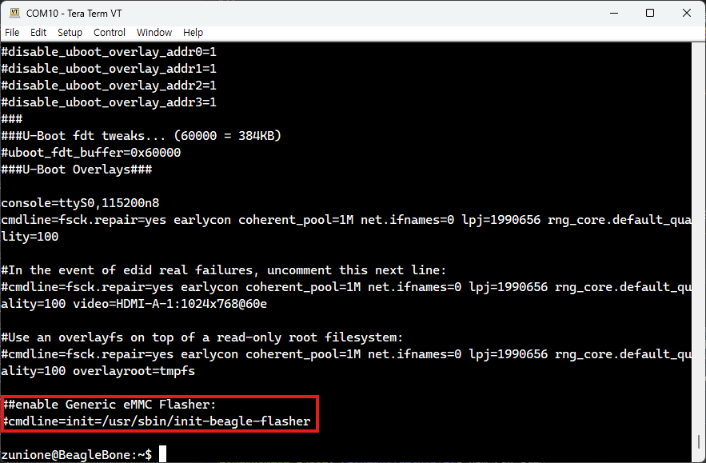

마지막 줄 `cmdline=init=/usr/sbin/init-beagle-flasher`의 주석이 해제되어 있으면 부팅 시 u-boot가 uEnv.txt를 읽고 자동으로 `init-beagle-flasher` 스크립트를 실행해서 eMMC에 리눅스 이미지를 플래싱한다.

다시 말하면 eMMC 플래싱의 핵심은 `init-beagle-flasher` 스크립트이므로, 이것만 실행하면 된다는 
뜻이다. 그럼 해당 디렉토리로 가서 스크립트를 실행한다.

```bash
cd /usr/sbin
sudo ./init-beagle-flasher
```

<div style="display: flex; justify-content: center; flex-wrap: wrap;" >
  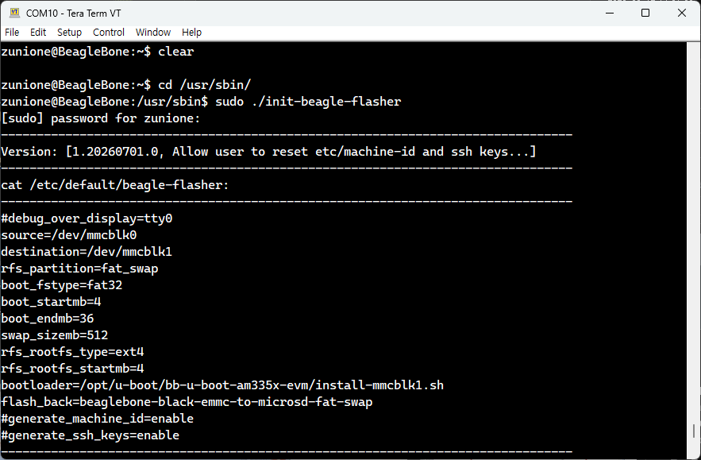
  
</div>

성공적으로 플래싱이 진행되어 프롬프트가 뜬 모습이다. 

이제 보드 전원을 끈 후, SD카드를 제거하고 다시 보드를 켜면 SD카드에서 불러왔던 것과 똑같은 리눅스 커널이 켜지는 걸 확인할 수 있을 것이다.

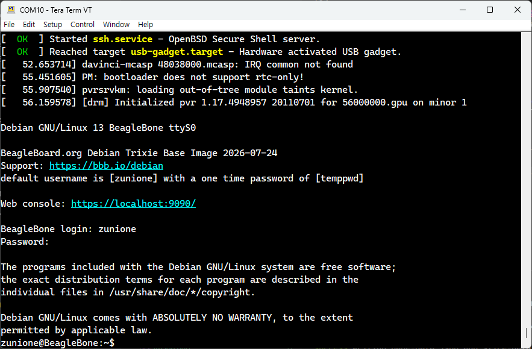

Username이 이미지를 구울 때 설정한 것과 같고, 비밀번호를 쳐 보니 기본 비밀번호가 아닌 직접 변경한 비밀번호로 설정되어 있었다. 플래싱 성공이다!🎆

## ✨ 마치며

비글본블랙 보드에 처음 탑재되어 있는 데비안 6/7과 같은 커널은 비교적 가벼워서 microUSB 포트로도 전원이 잘 들어왔을 것이다. 하지만 데비안 13은 훨씬 무거워졌기 때문에 microUSB로 공급하는 전원으로는 부팅이 중간에 멈춘다. 이제부터는 항상 5V 전원으로 전원을 공급하고 UART 연결로 시리얼 출력을 확인해야 한다.

인터넷이 필요할 경우, Wi-Fi 동글을 구매해 장착하거나 이더넷 케이블을 연결하면 인터넷을 사용할 수 있다. microUSB 포트를 연결해 설정하는 방법도 있지만 다소 복잡하고 속도가 느려 권장하지는 않는다.