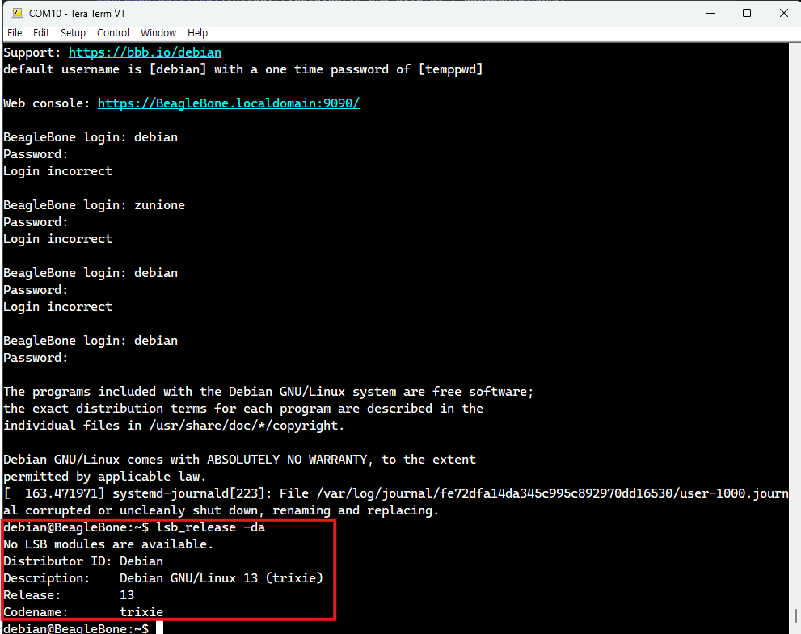
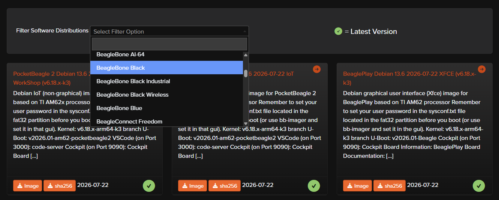
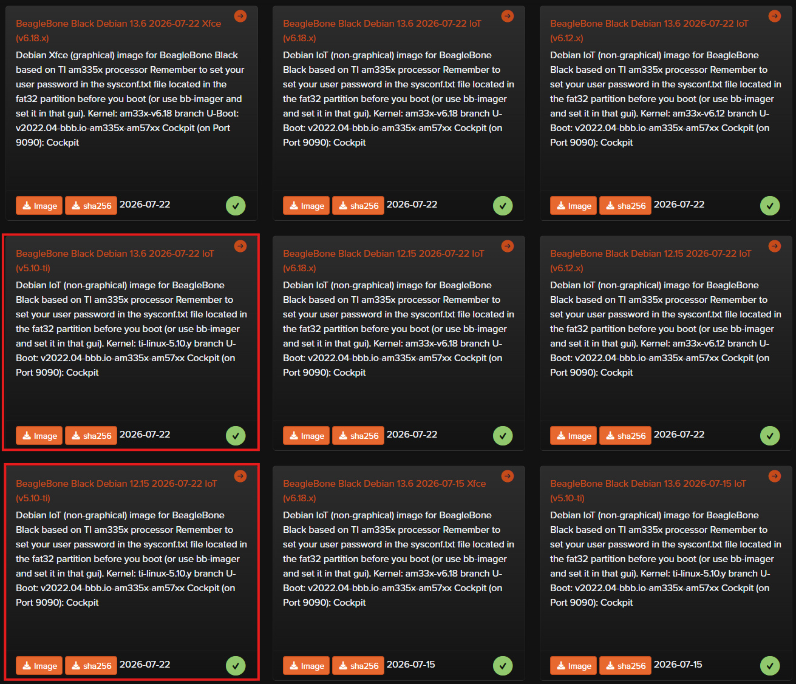

## 🚀 들어가며

비글본블랙은 임베디드 장비이기 때문에, 확장성 있는 우분투보다는 안정적인 데비안을 올려 사용한다. 처음 구매해 보드를 켜 봤다면 굉장히 오래된 버전의 데비안이 저장되어 있는 것을 보았을 것이다. 본격적인 보드 활용 전, 리눅스 이미지를 미리 업데이트해 더이상 deprecation에 고통받지 말자.

이 내용은 동봉되어 있는 종이 매뉴얼에 기재되어 있는 대로 접속해서 확인할 수도 있다. PC와 보드를 연결해 보드에 저장되어 있는 HTML 매뉴얼을 확인하도록 안내할 것이다. 해당 내용은 참고자료 섹션의 'Connecting Up Your BeagleBone Black'과 동일하다.

**참고자료**
- [Connecting Up Your BeagleBone Black (Web)](https://docs.beagleboard.org/boards/beaglebone/black/ch03.html)
- [BeagleBone Black Latest Software Images (Official Website)](https://www.beagleboard.org/distros)

### Beaglebone Black eMMC booting (1)

> 썸네일을 클릭하면 유튜브 영상을 시청하실 수 있습니다.

[](https://youtu.be/HFchi27dE_U?si=mfekgRVgQYWjVcUG)

### Beaglebone Black eMMC booting (2)

> 썸네일을 클릭하면 유튜브 영상을 시청하실 수 있습니다.

[](https://youtu.be/fd4gzfVGSC4?si=wSnZWRedqjF1r_Xu)

### Beaglebone Black eMMC booting (3)

> 썸네일을 클릭하면 유튜브 영상을 시청하실 수 있습니다.

[](https://youtu.be/VE-wha_8tI8?si=7-eBq6bDA1QihKx0)


## 📸 현재 이미지 버전 확인

본격적으로 업데이트를 진행하기 전 현재 어떤 이미지가 올라가 있는지부터 확인한다.

```bash
lsb_release -da
```



내 보드는 예전에 한 번 업데이트를 진행해서 Debian 13 Trixie가 저장되어 있다. 오늘의 포스트에서는 두 가지 방법을 이용해서 업데이트를 할 예정이기 때문에, 계속 13을 설치하기보다는 Debian 12 Bookworm을 한 번 구웠다가 다시 Debian 13을 설치하여 업데이트가 잘 되었는지 눈으로 볼 수 있도록 해보려 한다.

## 🌀 설치할 데비안 이미지 다운로드

이미지 다운로드를 위해 [BeagleBoard Latest Software Images(클릭)](https://www.beagleboard.org/distros) 사이트에 접속한다.



필터 옵션으로 BeagleBone Black을 선택하면 비글본블랙에 대한 데비안 이미지 목록이 나온다.



비슷비슷해보이는 이미지가 굉장히 많은데, 이 중 Xface는 HDMI 연결로 실제 모니터와 마우스 등을 연결해 쓸 수 있는 GUI가 포함되어 있고, IoT는 그렇지 않다.

또한 버전 태그 끝에 x가 붙어 있으면 일반 데비안 이미지이고, ti가 붙어 있다면 Texas Instruments에서 AM335x SoC에 맞게 직접 패치한 커널 브랜치이다. 주변장치 드라이버들이 훨씬 완성도 있게 포함되어 있다.

우리는 임베디드 환경을 경험할 것이므로 IoT v5.10-ti를 권장한다.


## ✨ 마치며
