## 🚀 들어가며

Debian 13 Trixie는 MicroUSB를 통해 웹 콘솔을 호스팅한다. 이 웹 콘솔을 통해 터미널도 볼 수 있고, 이더넷 케이블로 인터넷을 연결하면 설치된 apt 패키지들과 업데이트 현황도 볼 수 있다.

## 🖥️ 웹 콘솔 접속

MicroUSB로 PC와 비글본블랙 보드를 연결하고, 전원이 제대로 들어오면 웹 브라우저에서 http://192.168.7.2:9090 으로 접속한다. 이때 MicroUSB만으로는 전원이 부족하기 때문에 꼭 5V 전원도 연결해 주어야 한다.

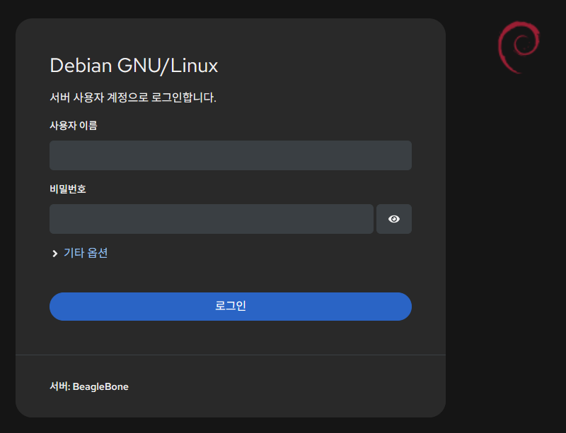

접속하면 로그인 창이 뜬다. UART 연결로 터미널에 접속할 때와 같은 아이디, 비밀번호를 입력한다.

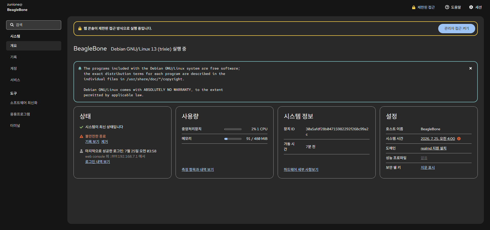

로그인에 성공하면 전체 시스템을 한눈에 파악할 수 있는 대시보드가 있다. 여기서 시스템 정보, 현재 CPU 사용량 등을 확인할 수 있다.

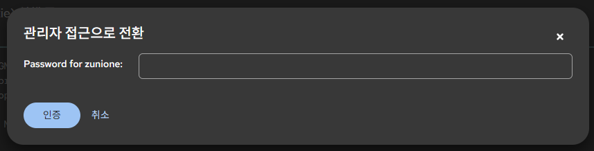

오른쪽 위의 "관리자 접근 켜기" 버튼을 누르면 sudo 권한을 취득하기 위한 비밀번호 입력 창이 뜬다. 현재 접속 유저에게 sudo 권한이 있을 것이므로 로그인 시 입력했던 비밀번호를 입력하면 된다.

## 🍽️ 웹 콘솔 메뉴 목록

### 시스템 메뉴

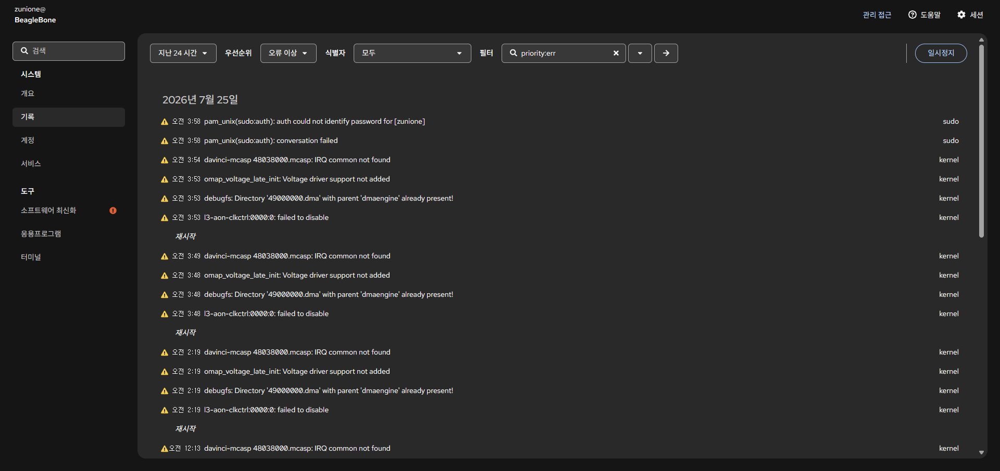

"기록" 메뉴에서는 시스템 로그를 확인할 수 있다. 에러나 경고가 발생하면 즉각적으로 기록된다.

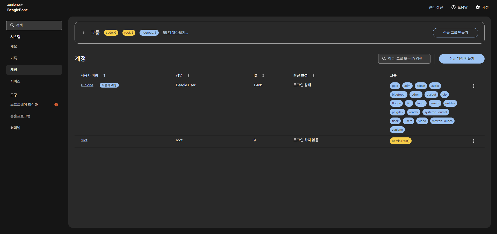

현재 시스템에 등록된 사용자와 그룹을 알 수 있다. 현재 사용자의 경우 `admin` 그룹에 들어가 있기 때문에 관리자 권한으로 전환이 가능한 것이다.

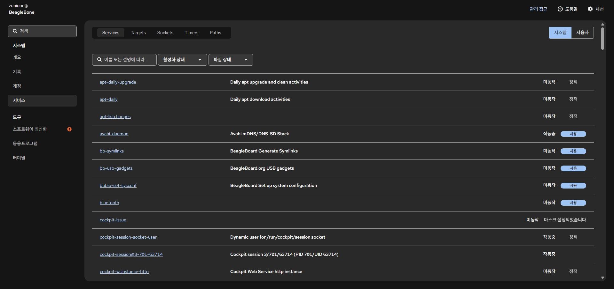

현재 설치된 패키지들과 해당 패키지가 현재 활성화되어 있는지를 확인할 수 있다.


### 도구 메뉴

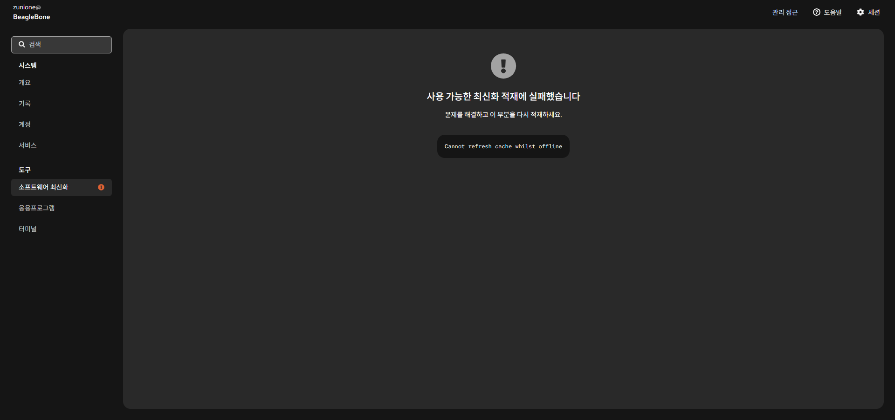

설치된 소프트웨어 패키지 중 업데이트 가능한 패키지를 보여준다. 현재는 인터넷이 연결되지 않아 최신 소프트웨어 정보를 불러올 수 없는 상태이다.

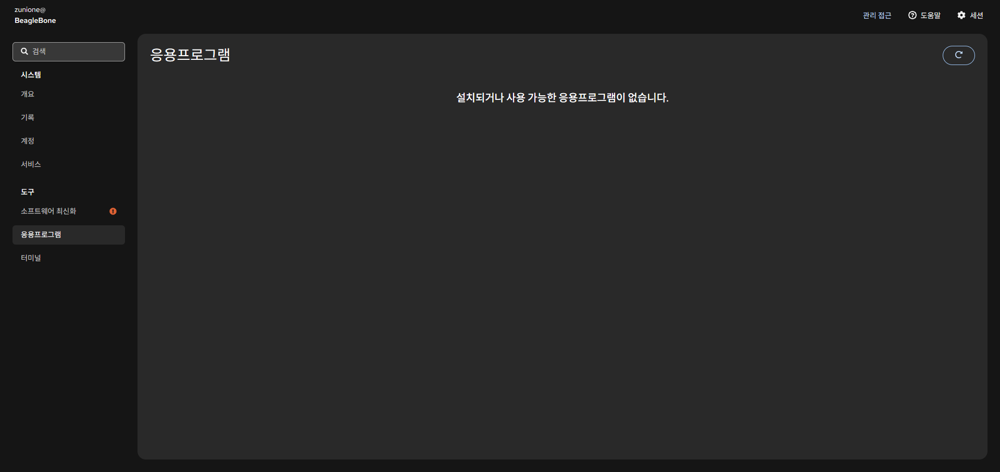

현재 설치된 소프트웨어 패키지 외에 추가로 설치할 수 있는 앱들을 보여준다. 마찬가지로 인터넷이 연결되어야 최신 정보를 볼 수 있다.

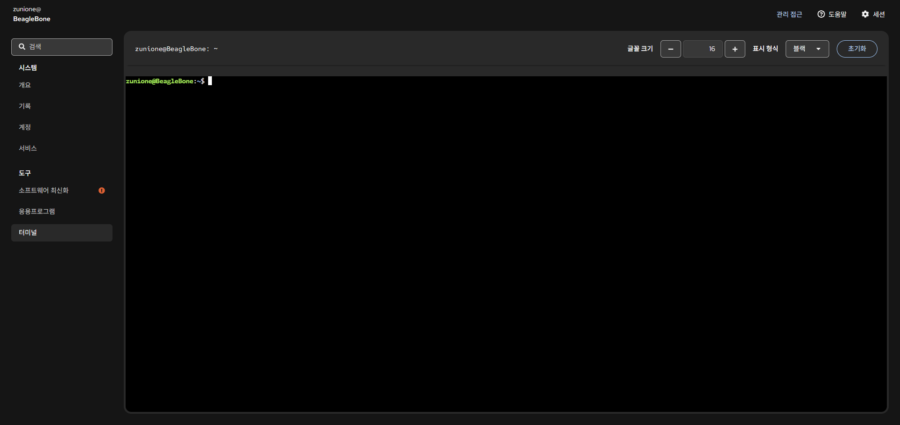

UART 연결로 보았던 콘솔과 같은 화면이다. 

## 🪬 보드에 SSH로 접속하기

앞에서 살펴본 웹 콘솔은 IP번호 '192.168.7.2'로 로컬 서버에 호스팅되고 있었다.

그런데 우리는 IP를 알면, VScode로 서버에 SSH로 접속해 훨씬 편하게 개발 환경을 구성할 수 있다.

### SSH Extension 설치

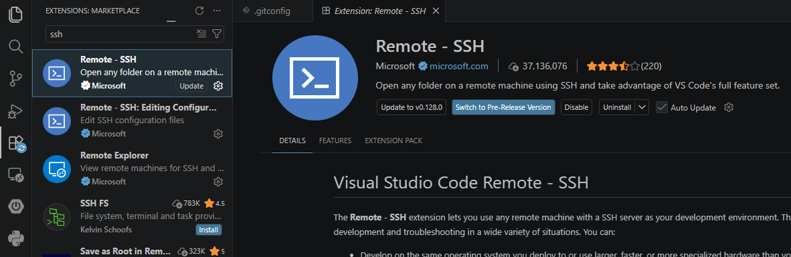

먼저 VScode에 SSH 익스텐션이 설치되어 있는지 확인하고, 없다면 설치해 주자.

### SSH Host 등록

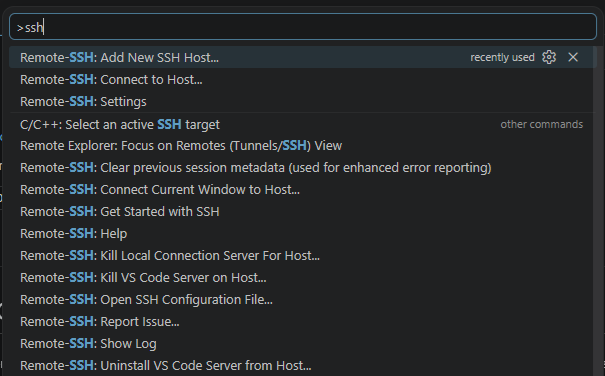

`F1` 버튼을 누르면 VScode 내부 기능을 검색할 수 있다. 'ssh'를 검색해 'Add New SSH Host' 메뉴를 선택한다.

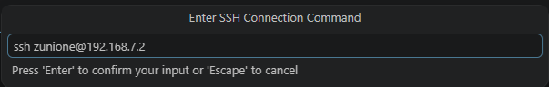

SSH 연결 명령어를 입력하는 창이 뜬다. 다음과 같이 입력한다.

```bash
ssh username@192.168.7.2
```

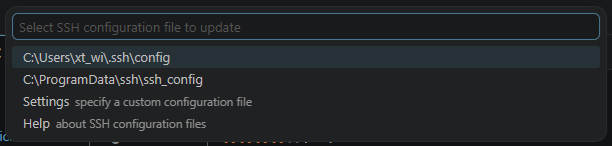

호스트 정보를 어디에 저장할지 선택하는 단계이다. ProgramData 폴더보다는 유저 설정 파일에 저장하는 것을 권장한다.

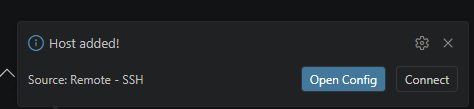

등록을 완료하면 우측 하단에 호스트가 등록되었다는 알림이 뜬다. 

### 등록한 SSH 호스트에 연결

앞에서 뜬 알림에서 'Connect' 버튼을 클릭한다. 만약 알림이 사라져 버렸다면 다시 `F1` 버튼을 누른 뒤 'Connect to SSH Host' 메뉴를 클릭하면 된다.

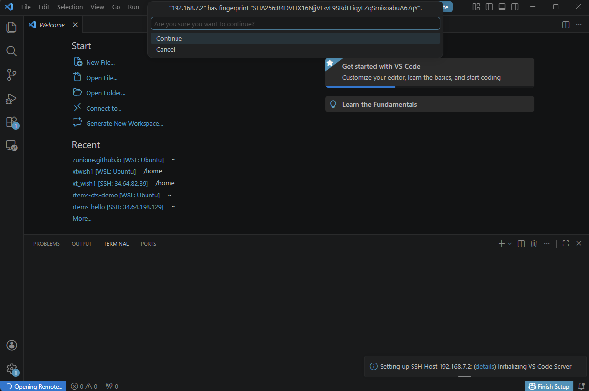

호스트와 연결된 새로운 VScode 윈도우가 뜰 것이다. Continue를 누른다.

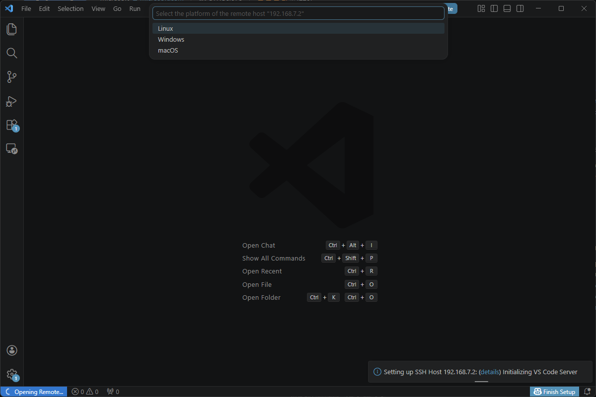

운영체제를 선택해야 한다. Linux를 선택하고 잠시 기다리면 접속이 완료될 것이다.

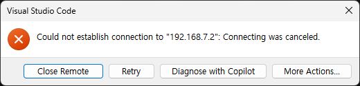

첫 접속 때는 다운로드받아야 하는 파일이 많아서, 비글본블랙 보드가 트래픽을 감당하지 못할 수도 있다. 만약 그래서 접속하지 못했다는 알림이 뜬다면 Retry 버튼을 눌러 다시 접속을 시도한다.

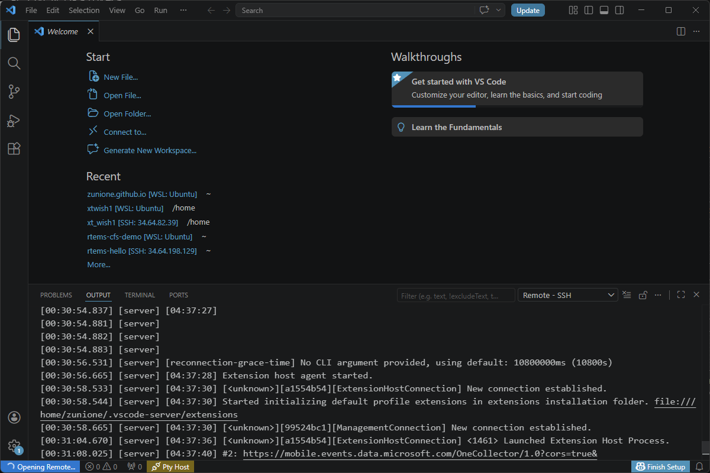

일부 파일은 다운로드된 상태였기 때문에 재접속하면 트래픽이 조금 줄어 잘 접속될 것이다. 접속이 잘 이루어진 모습니다.

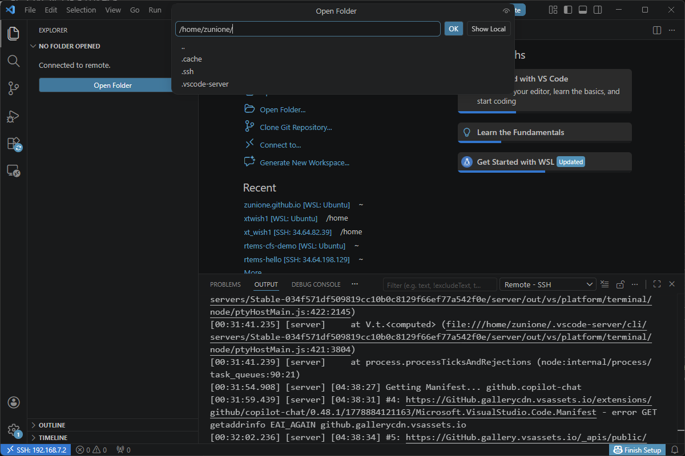

왼쪽 폴더 아이콘을 클릭하고 'Open Folder' 버튼을 누르면 보드 내부 파일시스템의 폴더들에 액세스할 수 있다.

## ✨ 마치며

UART로 접속해 개발하는 것도 하나의 방법이지만 터미널 하나로는 영 불편할 수 있다. 이렇게 보드에서 기본으로 제공하는 서버 호스팅을 활용하면 시스템 상태도 한눈에 확인하고, SSH 접속으로 코드 에디터도 사용할 수 있다.

본인에게 편한 방법으로 잘 선택해 사용하면 될 것 같다. 참고로, microUSB를 활용한 서버 호스팅은 PC 방화벽 정책에 따라 동작하지 않을 수도 있다.