## 🚀 들어가며

온도 관련 두 어플리케이션을 등록했지만 우리의 설계대로 완벽히 동작하는 상태는 아니다. 간단한 동작을 확인했으니 실제 cFS 내에서 맡은 역할을 수행할 수 있도록 기능을 보완해야 한다.

## 🪃 어플리케이션 기능 리마인드

### `TEMP_IO` 기능 요약

`TEMP_IO` 앱의 기능은 다음과 같이 정리할 수 있다.

1. **명령어 처리**
    - Wake-Up & Send-Hk: 애플리케이션 활성화 및 Housekeeping 데이터 전송
    - No-Op & Reset: 동작 없음 명령 및 카운터 리셋
    - Set-Current-Temp: 현재 온도 값 설정
    - Set-Delta-Value: 온도 변화량(Delta) 값 설정

2. **센서 데이터 읽기**: 시뮬레이션된 온도 센서로부터 데이터를 읽어온다.
3. **데이터 퍼블리싱**: 새로운 온도 데이터를 소프트웨어 버스(Software Bus)를 통해 각 모듈에 공유한다.
4. **실행 주기**: 1Hz 주기로 동작한다 (1초에 1번 실행).

### `TEMP_MON` 기능 요약

`TEMP_MON` 앱의 기능은 다음과 같이 정리할 수 있다.

1. **명령어 처리**
    - Wake-Up & Send-Hk: 애플리케이션 활성화 및 Housekeeping 데이터 전송
    - No-Op & Reset: 동작 없음 명령 및 카운터 리셋
    - Set-Cold-Limit: 저온(Cold) 임계값 설정
    - Set-Hot-Limit: 고온(Hot) 임계값 설정

2. **온도 값 업데이트**: 새로운 온도 값을 받아서 처리하고, 현재 값을 이전 값(old value)으로 저장한다.
3. **온도 분석**
    - 방향 판단: 온도가 증가했는지/감소했는지 비교 및 판단
    - 범위 판단: 온도가 어느 범위에 속하는지 비교 및 판단 - Nominal, Hot, Cold
4. **데이터 퍼블리싱**: 온도 방향(direction)과 범위(range) 정보를 소프트웨어 버스를 통해 각 모듈에 공유한다.
5. **실행 주기**: 1Hz 주기로 동작한다 (1초에 1번 실행).

## 🌊 `TEMP_IO` 어플리케이션 수정

`TEMP_IO` 어플리케이션 소스코드를 수정하기 위해 다음 디렉토리로 이동한다.

```bash
cd /home/dev/Training_workspace/CFS-101/apps/temp_io/fsw/src
```

### 새로운 명령어 구현

`Set-Current-Temp`, `Set-Delta-Value` 명령어를 추가하기 위해 몇 개의 헤더 파일을 수정한다.

먼저, 새로운 명령 메시지를 위한 명령 코드를 추가한다.

```bash
vi temp_io_msg.h
```

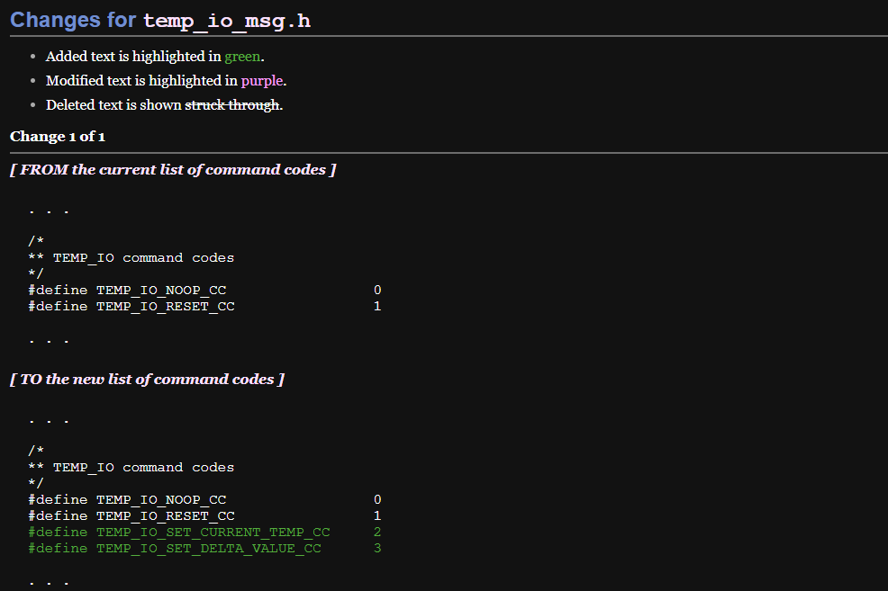

새로운 명령 메시지를 위한 데이터 구조를 추가한다.

```bash
vi temp_io_private_types.h
```

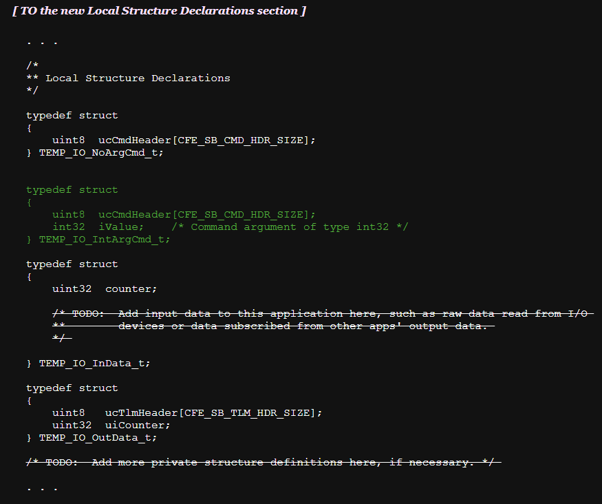

센서 데이터를 실제로 측정하기는 어렵기 때문에 이를 시뮬레이션해 사용할 예정이다. 이때 센서 데이터 생성에 사용할 지역 변수를 정의한다.

```bash
vi temp_io_app.h
```

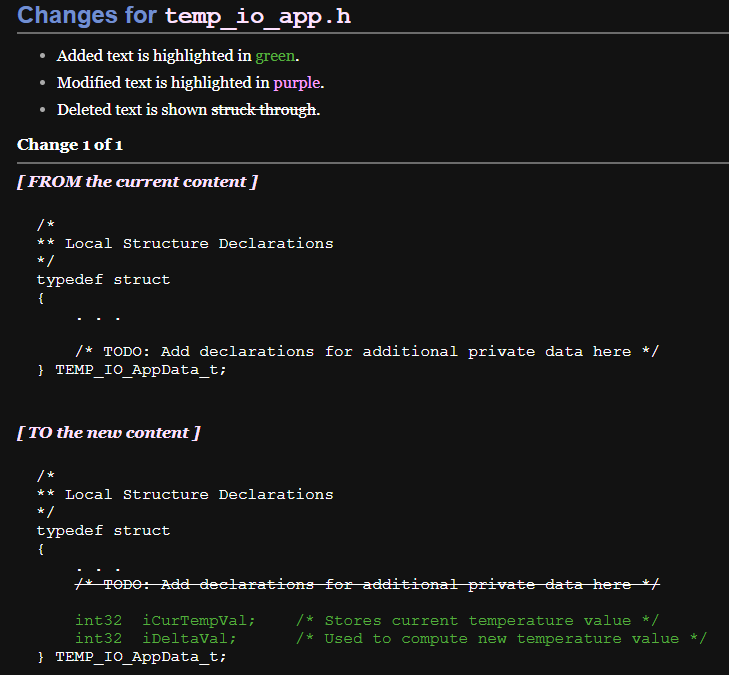

`TEMP_IO_ProcessNewAppCmds()` 함수에 각 명령에 대한 응답 처리를 추가한다.

```bash
vi temp_io_app.c
```

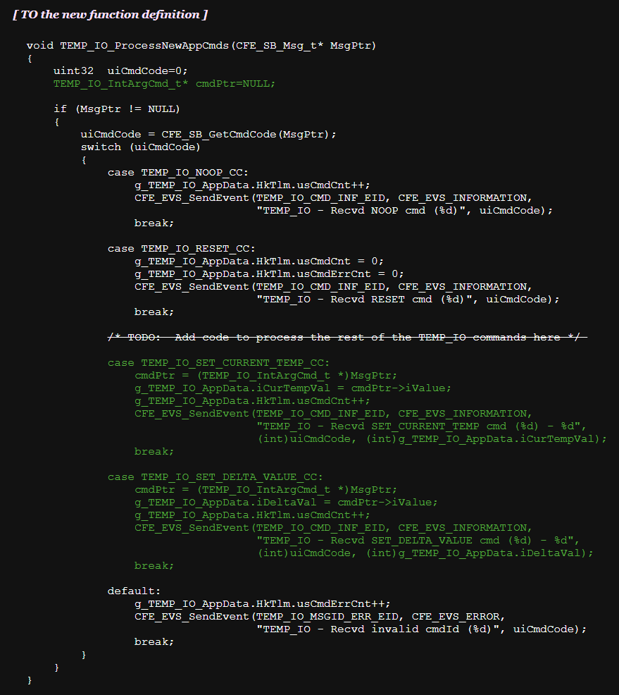

이렇게 코드를 수정하고 나면 `TEMP_IO_SET_CURRENT_TEMP_CC` 명령은 현재 온도 값을 수신한 값으로 설정하고, `TEMP_IO_SET_DELTA_VALUE_CC` 명령은 현재 델타 값을 수신한 값으로 설정하도록 기능한다.

### 데이터 읽기 (센서 시뮬레이션)

센서 데이터 시뮬레이션 시 값 생성은 다음과 같다.

$$
새로운 온도 값 = 현재 온도 값 + 현재 델타 값
$$

이 계산은 `TEMP_IO`의 매 Wakeup 사이클이 시작할 때 수행된다. 앞서 언급했듯이 이 Wakeup 사이클은 1Hz의 속도를 갖는다.

`temp_io_app.c` 파일을 켜서, 먼저 지역 변수 초기화를 위해 `TEMP_IO_InitData()` 함수를 수정해 보자.

```bash
vi temp_io_app.c
```

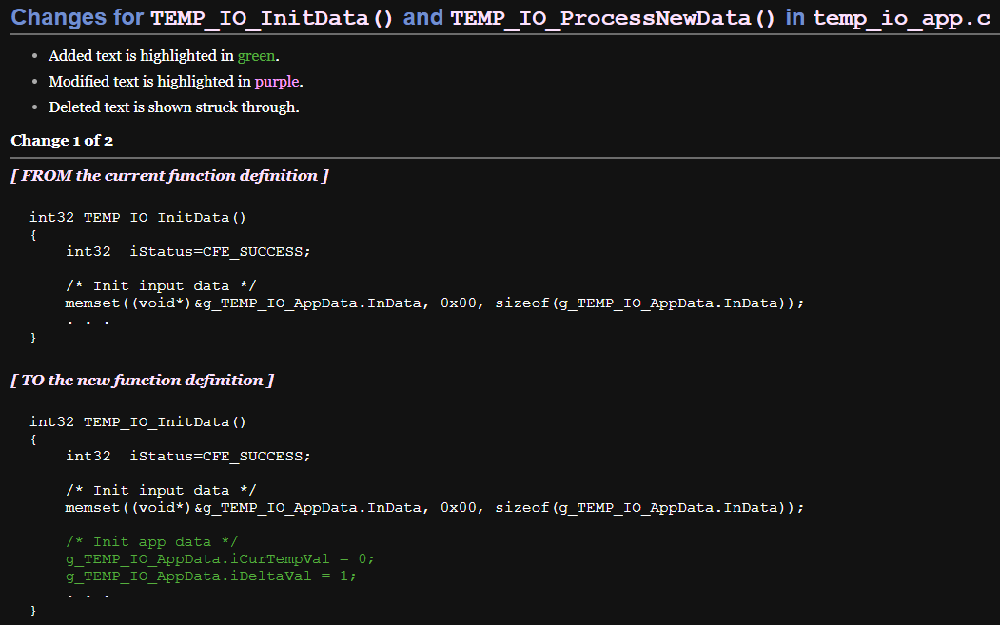

이후 시뮬레이션된 센서 값 계산을 위해 `TEMP_IO_ProcessNewData()` 함수를 수정한다.

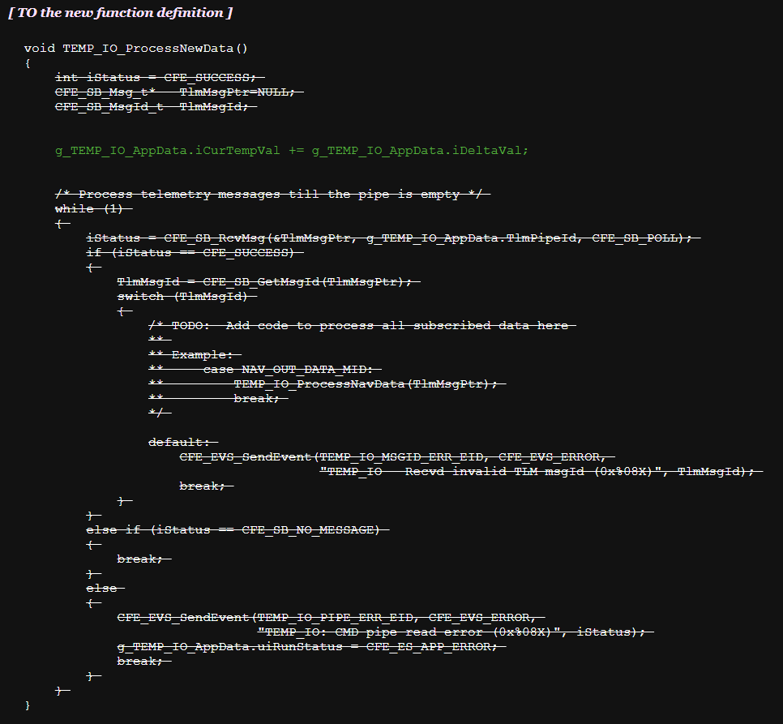

### 데이터 배포

다른 애플리케이션이 온도 데이터를 사용할 수 있도록, `TEMP_IO`의 매 Wakeup 사이클의 끝에서 해당 데이터를 배포한다.

먼저 배포할 데이터인 `TEMP_IO_OutData_t` 구조체를 `temp_io_private_types.h` 헤더 파일에 추가한다.

```bash
vi temp_io_private_types.h
```

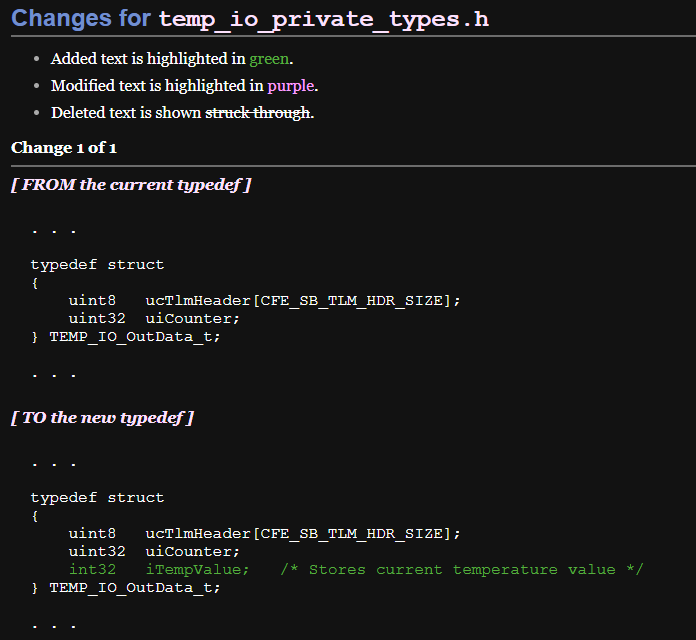

이후 `temp_io_app.c`의 `TEMP_IO_SendOutData()` 함수에 데이터 배포 로직을 추가한다.

```bash
vi temp_io_app.c
```

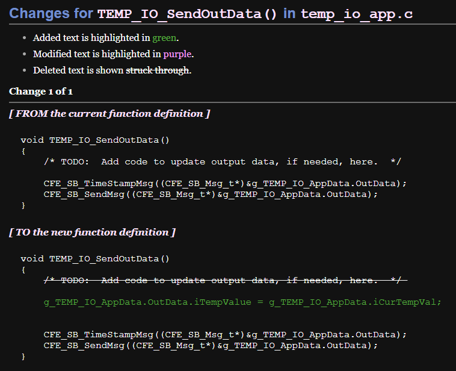

## 🦅 `TEMP_MON` 어플리케이션 수정

`TEMP_MON` 어플리케이션 소스코드를 수정하기 위해 다음 디렉토리로 이동한다. 수정사항이 `TEMP_IO` 어플리케이션과 비슷하니 헷갈리지 않도록 하자.☝🏻

```bash
cd /home/dev/Training_workspace/CFS-101/apps/temp_mon/fsw/src
```

### 새로운 명령어 구현

`Set-Cold-Limit`, `Set-Hot-Limit` 명령어를 추가하기 위해 몇 개의 헤더 파일을 수정한다.

먼저, 새로운 명령 메시지를 위한 명령 코드를 추가한다.

```bash
vi temp_mon_msg.h
```

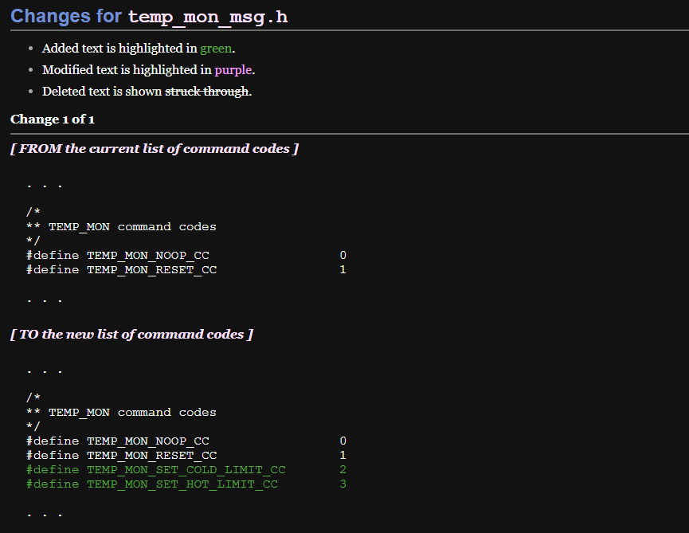

새로운 명령 메시지를 위한 데이터 구조를 추가한다.

```bash
vi temp_mon_private_types.h
```

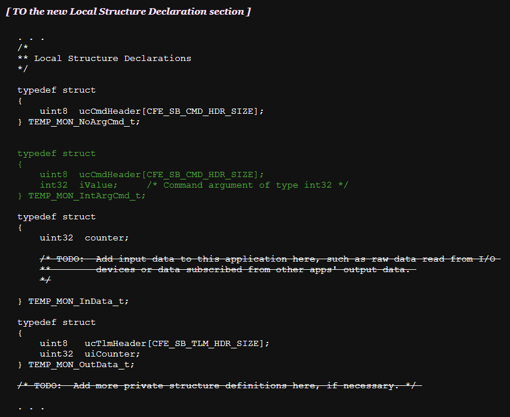

데이터 추적에 사용할 변수를 선언한다.

```bash
vi temp_mon_app.h
```

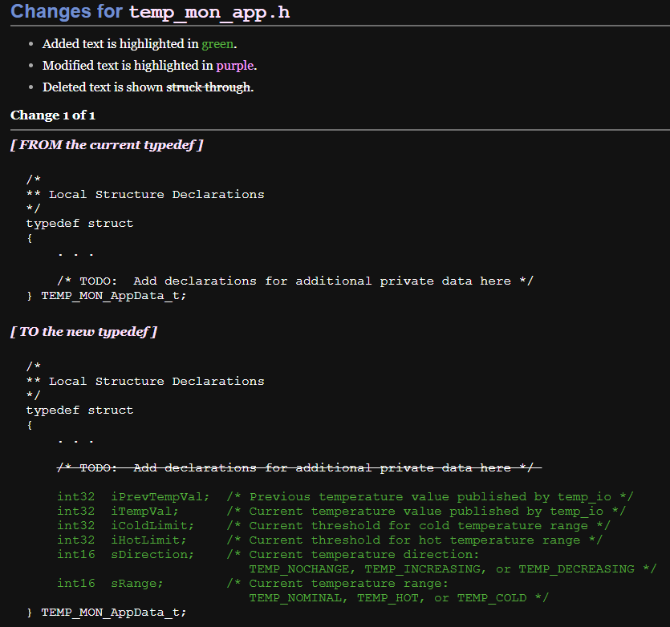

`TEMP_MON_ProcessNewAppCmds()` 함수에 각 명령에 대한 응답 처리를 추가한다.

```bash
vi temp_mon_app.c
```

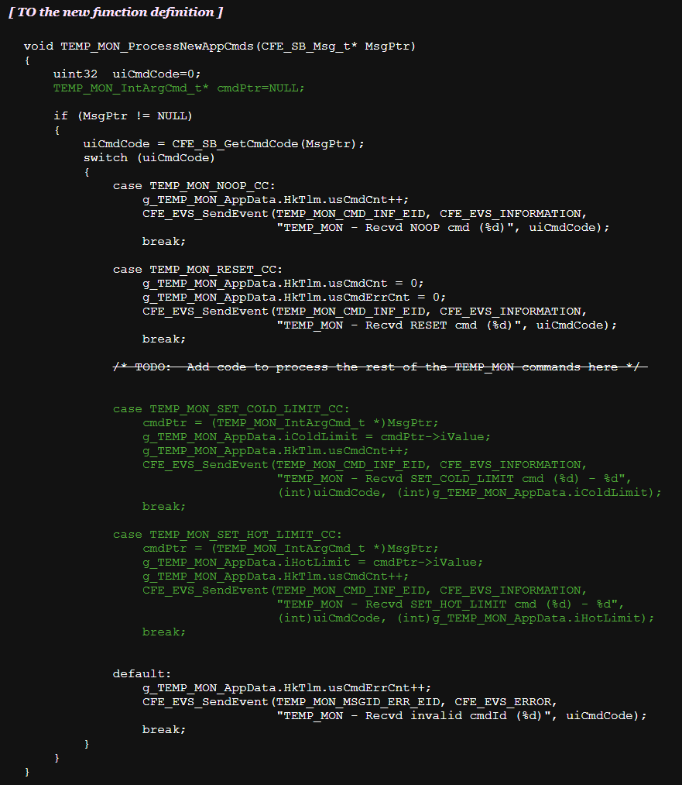

이렇게 코드를 수정하고 나면 `TEMP_MON_SET_COLD_LIMIT` 명령은 저온 임계값을 설정하고, `TEMP_MON_SET_HOT_LIMIT` 명령은 고온 임계값을 설정하도록 기능한다.

### 데이터 계산 (온도 분석)

`TEMP_MON`은 매 Wakeup 사이클이 시작할 때 이전 온도, 현재 온도, 온도 임계값을 비교하여 방향과 범위를 결정한다.

먼저 범위 및 방향 판단에 사용할 매크로 상수를 정의한다.

```bash
vi temp_mon_msg.h
```

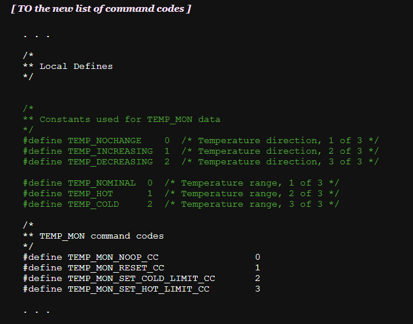

이제 `temp_mon_app.c` 파일을 켜서, 필요한 헤더 파일을 추가한다.

```bash
vi temp_mon_app.c
```

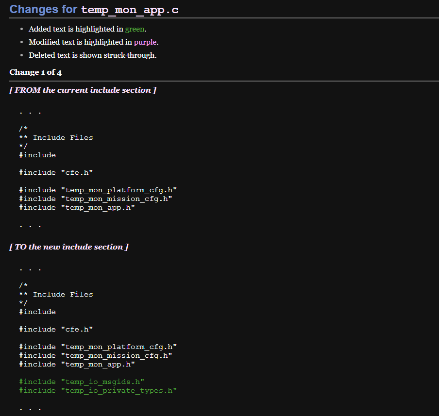

다음으로 같은 파일에서 `TEMP_MON_InitData()` 함수를 수정해 지역 변수를 초기화해야 한다.

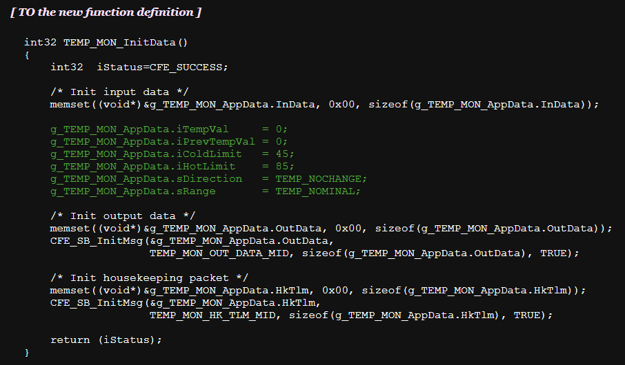

마찬가지로 TEMP_IO 데이터를 구독해 빠르게 업데이트할 수 있도록 `TEMP_MON_InitPipe()` 함수를 수정한다.

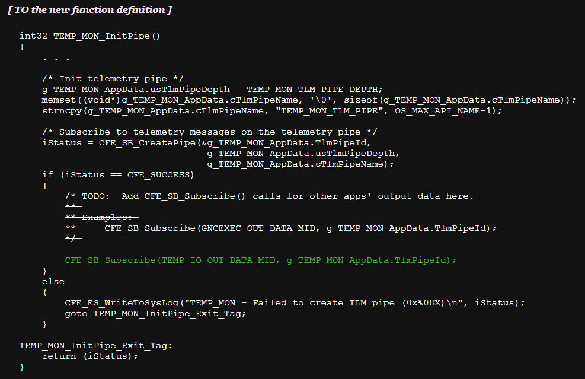

마지막으로 온도 범위 및 방향 판단 로직을 `TEMP_MON_ProcessNewData()` 함수에 추가한다.

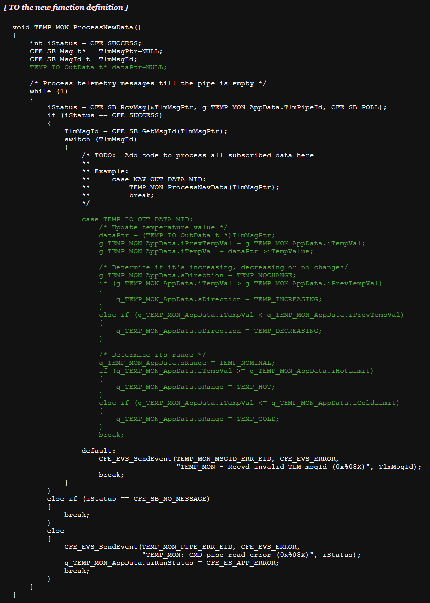

### 데이터 배포

위성(우주선)에서 지상국으로 데이터를 전송하려면 데이터 배포가 선행되어야 한다. `SCH`로부터 `TEMP_MON_SEND_HK_MID` 명령 메시지를 수신했을 때 배포가 실행된다.

먼저 `temp_mon_msg.h` 파일의 `TEMP_MON_HkTlm_t` 구조체를 사용하여 배포할 데이터를 추가한다.

```bash
vi temp_mon_msg.h
```

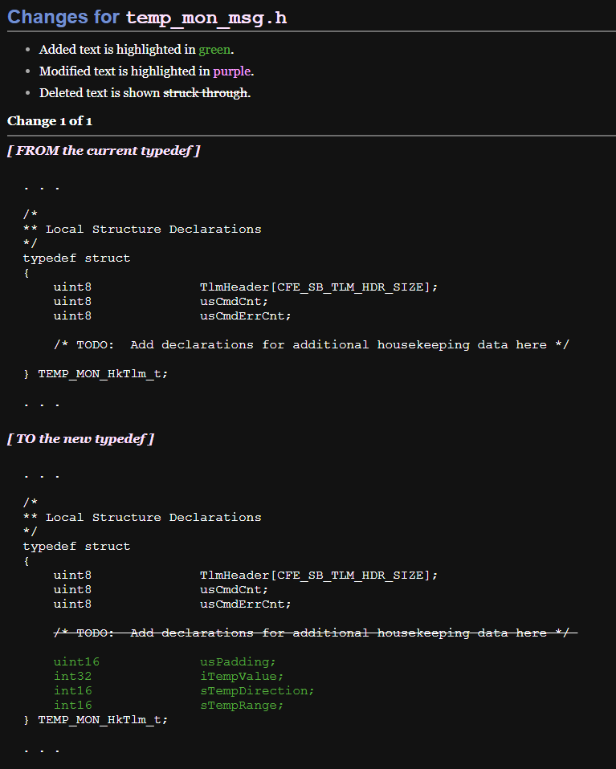

이후 `temp_mon_app.c`의 `TEMP_MON_ReportHousekeeping()` 함수에 데이터 배포 로직을 추가한다.

```bash
vi temp_mon_app.c
```

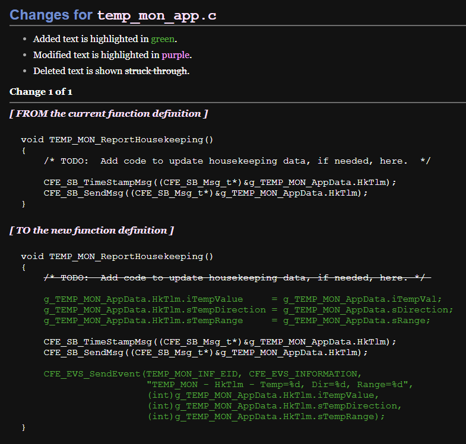

## ⚒️ 수정한 cFS FSW 빌드

이제 수정한 어플리케이션들이 정상적으로 컴파일 및 동작하는지 확인할 차례이다. 다음 명령어로 cFS를 빌드하자.

```bash
cd /home/dev/Training_workspace/CFS-101
rm -rf build
make
make install
```

손으로 일일이 코드를 입력했기 때문에 분명히 에러가 엄청나게 뜰 것이다. 에러 메시지에 압도되지 말고 침착하게 파일명과 라인 번호를 파악해 수정해 나가면 된다.

생각보다 간단한 오타일 때가 많으니 너무 짜증내지 말자.☠️ 물론 나는 엄청나게 짜증이 났다..ㅎㅎ

빌드를 완료했다면 이전과 같은 방법으로 실행해 보자! 아마 무리 없이 동작할 것이다.

```bash
cd build/exe/cpu1/
./core-cpu1
```

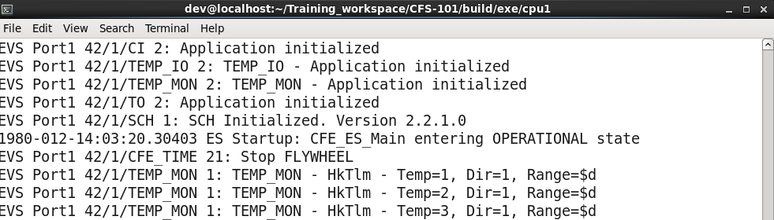

출력을 확인하면 이렇게 `TEMP_MON`에서 로그를 출력하고 있다!

나는 `%d`를 실수로 `$d`로 입력하는 바람에 Range 파라미터가 제대로 출력되고 있지 않긴 한데, 일단 동작하니 다음에 수정하는 걸로.

## ✨ 마치며

CFS-101의 과정을 밟아나가면서 느낀 점은, 이 문서를 자세히 공부하고 코드 하나하나 뜯어보며 제대로 분석한다면 cFS를 활용하여 어플리케이션을 개발하는 데 엄청난 도움이 될 것 같다는 것이다.

내가 지금 맡아서 개발하고 있는 부분은 어플리케이션 단이 아니라 못내 아쉬웠는데 이렇게 양질의 오픈소스 자료로 cFS의 핵심 부분인 어플리케이션 개발을 학습할 수 있어 기쁘다.

다음 포스트에서는 목표대로 기능하는 이 두 개의 어플리케이션을 GroundSystem으로 지상국과 통신시킬 것이다. 그러면 정말 CFS-101이 마무리되니 조금만 더 힘을 내자.💪🏻