## 🚀 들어가며

기능 구현을 완료한 `TEMP_IO`, `TEMP_MON` 앱으로 GroundSystem telemetry 실습까지 하면 CFS-101이 모두 마무리된다. 이전에 실습했던 내용이라 익숙하게 따라올 수 있을 테니 끝까지 완주하자! 🏃🏻‍♀️

## 🧩 새로운 GroundSystem 명령어 추가하기

### `TEMP_IO` 명령어 추가

먼저 `temp_io_msg_for_grnd.h`를 수정하여 필요한 정의와 구조체를 추가한다.

```bash
cd /home/dev/Training_workspace/CFS-101/apps/temp_io/fsw/src
vi temp_io_msg_for_grnd.h
```

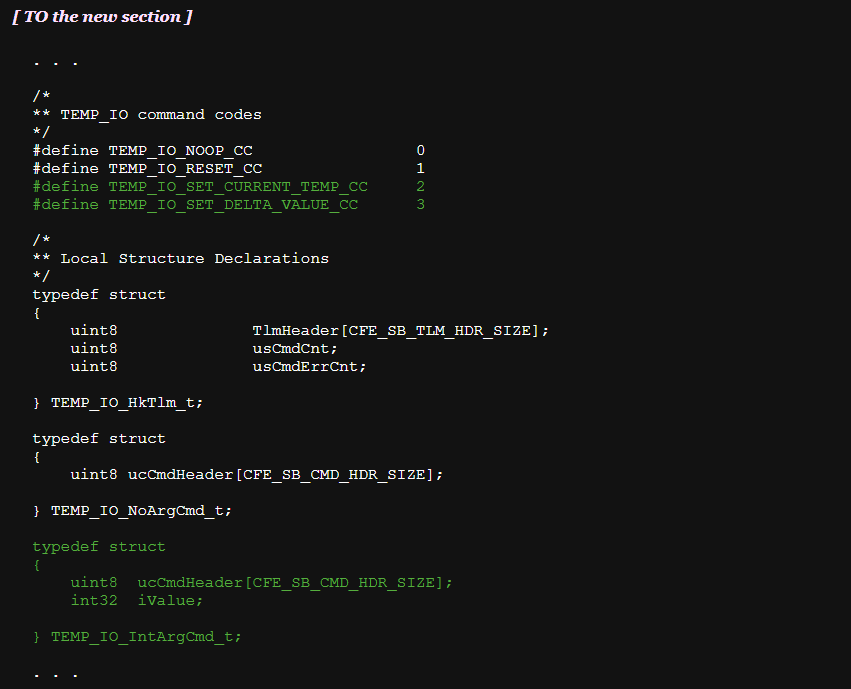

이후 GroundSystem 디렉토리로 이동해 새로운 명령어를 생성할 텐데, 이전에 했던 것과 동일하게 자동화되어있기 때문에 경로를 잘 설정하는 것이 중요하다.

```bash
cd /home/dev/Training_workspace/CFS-101/tools/cFS-GroundSystem/Subsystems/cmdGui
vi CHeaderParser-hdr-paths.txt
```

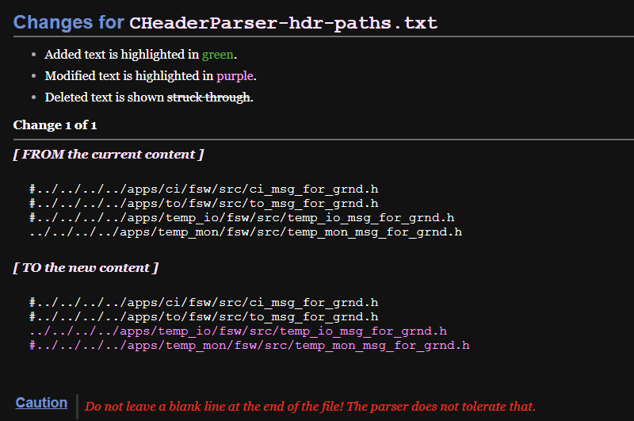

이제 스크립트로 명령어를 생성한다. 아래와 같이 입력값을 바르게 입력하면 빠르게 완료된다. 좀 더 자세한 로그를 보고 싶다면 CFS-101의 가이드 문서를 참고하는 것을 추천한다.

```bash
python CHeaderParser.py
```

```
/* temp_io Input For CHeaderParser.py Script */

What would you like the command file to be saved as? temp_io_cmd_msg
Do any commands in temp_io_cmd_msg require parameters? (yes/no): yes
Which command would you like to add parameters to (-1 to exit)? 2
Which of the above structures would you like to use? 2
Enter the line of the parameter from the above print-out (-1 to stop): 2
Enter the line of the parameter from the above print-out (-1 to stop): -1
Which command would you like to add parameters to (-1 to exit)? 2
Which of the above structures would you like to use? 2
Enter the line of the parameter from the above print-out (-1 to stop): 2
Enter the line of the parameter from the above print-out (-1 to stop): -1
Which command would you like to add parameters to (-1 to exit)? -1
```

### `TEMP_MON` 명령어 추가

마찬가지로 `temp_mon_msg_for_grnd.h`를 수정하여 필요한 정의와 구조체를 추가한다.

```bash
cd /home/dev/Training_workspace/CFS-101/apps/temp_mon/fsw/src
vi temp_mon_msg_for_grnd.h
```

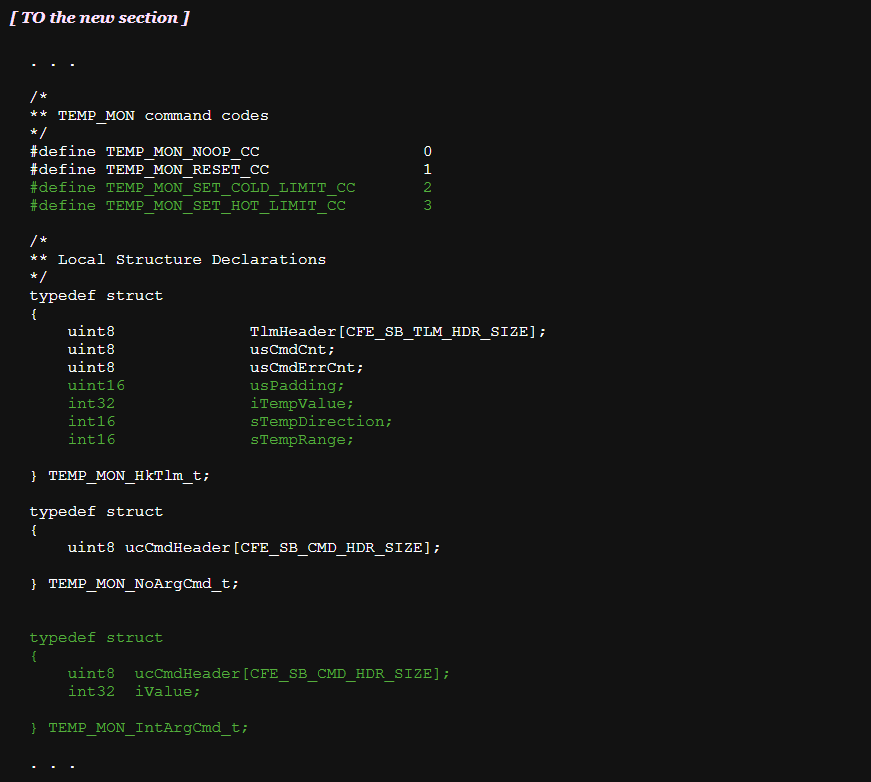

그 뒤 명령어 생성 자동화 스크립트를 위해 GroundSystem 디렉토리에서 경로를 다시 설정해 준다.

```bash
cd /home/dev/Training_workspace/CFS-101/tools/cFS-GroundSystem/Subsystems/cmdGui
vi CHeaderParser-hdr-paths.txt
```

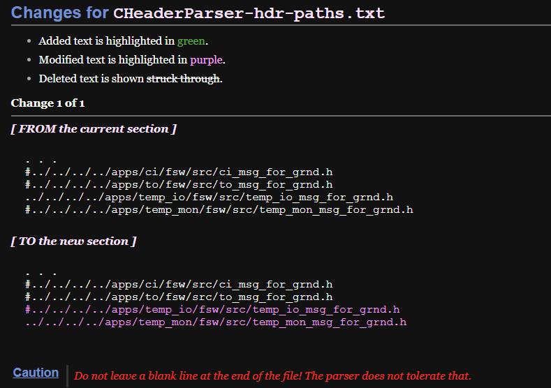

동일하게 스크립트를 활용해 명령어를 생성한다.

```bash
python CHeaderParser.py
```

```
/* temp_io Input For CHeaderParser.py Script */

What would you like the command file to be saved as? temp_mon_cmd_msg
Do any commands in temp_io_cmd_msg require parameters? (yes/no): yes
Which command would you like to add parameters to (-1 to exit)? 2
Which of the above structures would you like to use? 2
Enter the line of the parameter from the above print-out (-1 to stop): 2
Enter the line of the parameter from the above print-out (-1 to stop): -1
Which command would you like to add parameters to (-1 to exit)? 2
Which of the above structures would you like to use? 2
Enter the line of the parameter from the above print-out (-1 to stop): 2
Enter the line of the parameter from the above print-out (-1 to stop): -1
Which command would you like to add parameters to (-1 to exit)? -1
```

## 🚁 새로운 어플리케이션 조작 명령 전송하기

이제 다시 cFE core를 실행하고 GroundSystem을 켜서 실제 명령을 전송해보자.

```bash
cd /home/dev/Training_workspace/CFS-101/build/exe/cpu1
./core-cpu1

# 다른 터미널에서
cd /home/dev/Training_workspace/CFS-101/tools/cFS-GroundSystem
python GroundSystem.py
```

### `TEMP_IO` 명령어 전송

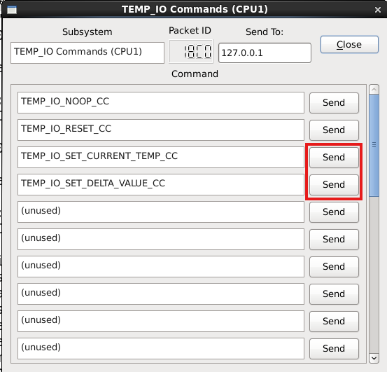

`TEMP_IO` 명령어 창을 확인하면 위와 같이 새로운 명령어들이 추가된 것을 확인할 수 있다.

이 중 `TEMP_IO_SET_CURRENT_TEMP_CC` 명령을 먼저 전송해 보자. 파라미터를 `101`로 입력하여 현재 온도를 101도로 설정한다.


다음과 같이 현재 온도가 101로 먼저 설정된 다음, 1초 후 델타값 1만큼 증가한 온도인 102가 출력된다.


이번에는 `TEMP_IO_SET_DELTA_VALUE_CC` 명령어를 통해 델타값을 변경해 보자. 파라미터를 `10`으로 입력하고 명령을 전송한다.

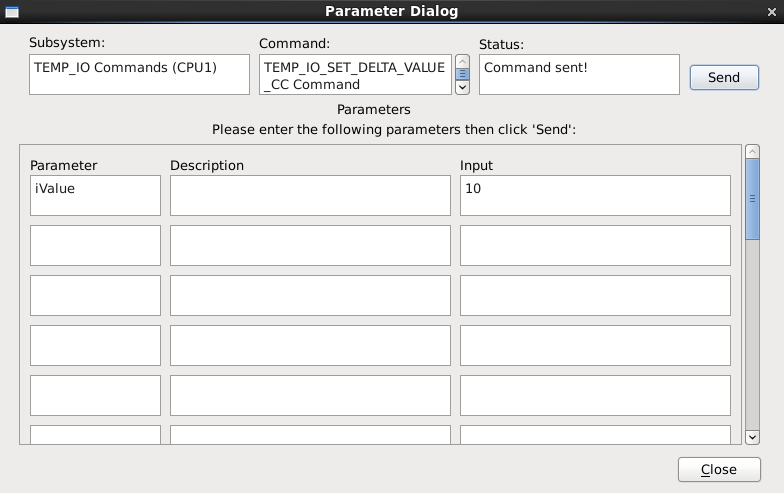

cFS core 로그를 확인하면 현재 온도가 10씩 증가하는 것을 확인할 수 있다.

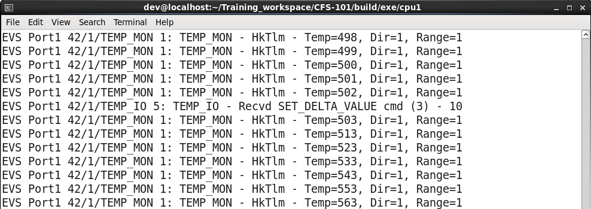

### `TEMP_MON` 명령어 전송

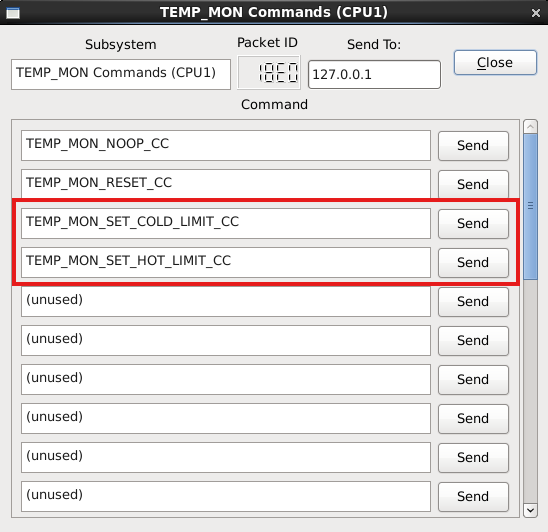

`TEMP_MON` 명령어 창을 확인하면 위와 같이 새로운 명령어들이 추가된 것을 확인할 수 있다.

이제 `TEMP_MON_SET_COLD_LIMIT_CC` 명령으로 온도 하한선을 -10도로, `TEMP_MON_SET_HOT_LIMIT_CC` 명령으로 온도 상한선을 200도로 설정해 본다.

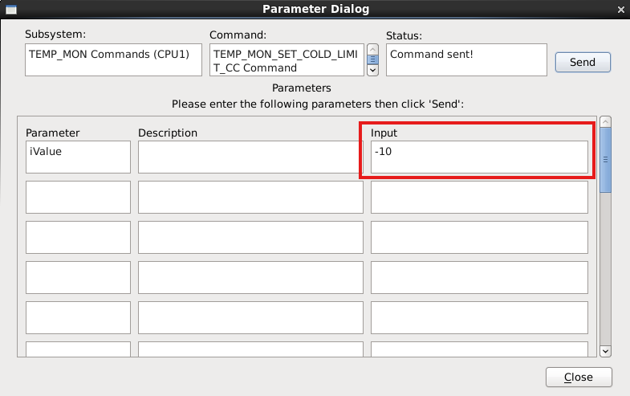

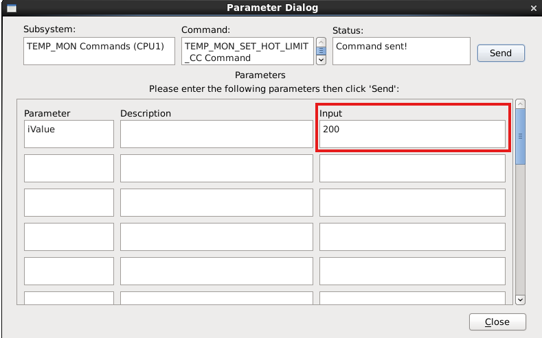

cFS core 로그를 확인하면 온도 임계값 변경에 대한 명령이 제대로 전송된 것을 확인할 수 있다.

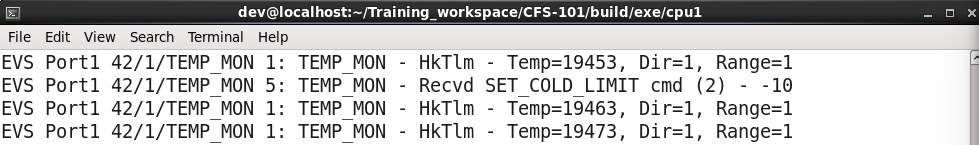
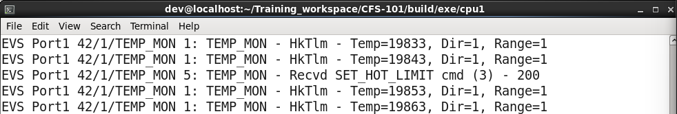

## ☄️새로운 어플리케이션으로부터 텔레메트리 수신

위성에서 지상국으로 수신된 데이터를 표현하기 위해 새 터미널을 켜고 `cfs-temp-mon-hk-tlm.txt` 파일에 필요한 정의를 추가한다.

```bash
cd /home/dev/Training_workspace/CFS-101/tools/cFS-GroundSystem/Subsystems/tlmGUI
vi cfs-temp-mon-hk-tlm.txt
```


이전 GroundSystem 실습에서 했던 대로 Telemetry System Main Page를 켠 뒤 Command System에서 Telemetry Output을 활성화한다.

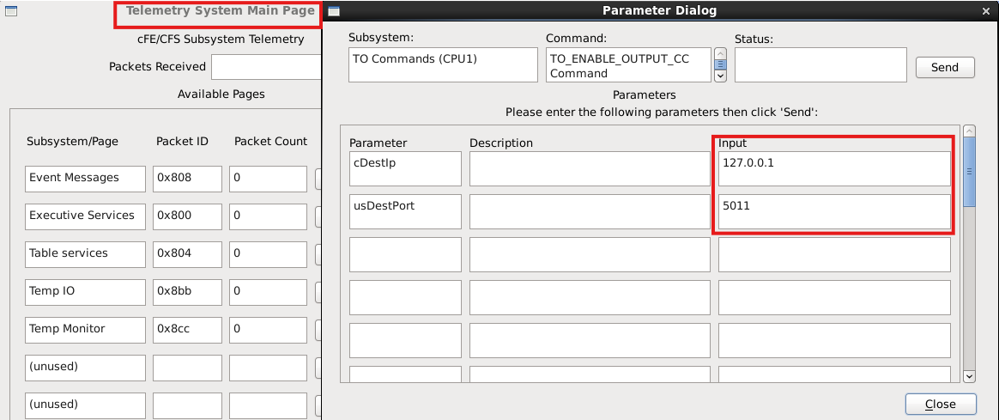

다음과 같이 텔레메트리가 수신되는 것을 확인할 수 있다.

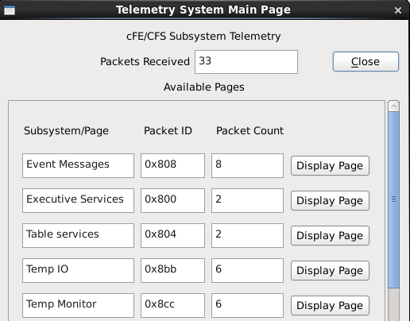

추가로 CFS-101(4)에서 진행했던 어플리케이션별 텔레메트리 확인도 진행해보길 권장한다.

## ✨ 마치며

이렇게 CFS-101 세션이 모두 끝이 났다! 긴 여정이었는데 모두 마무리할 수 있어 매우 뿌듯하다.

가이드 문서를 보면 이 다음 단계로 `SCH` 어플리케이션을 현재 100Hz에서 40Hz로 동작하도록 변경하는 과제를 제시한다. `/home/dev/Training_workspace/CFS-101/apps/sch/docs` 에 있는 `SCH` 유저 가이드를 참고하면 어렵지 않게 할 수 있을 것으로 예상된다.

지금 생각으로는 `SCH` 어플리케이션 과제를 해 보고 이제 실제 cFS 메인 브랜치로 간단한 실습을 하는 법을 포스팅할까 하는데, 실제 일정을 어떻게 짜게 될 지는 잘 모르겠다. 😅

아직 cFS의 잠재력은 무궁무진하다. CFS-101은 이제 시작일 뿐이다.