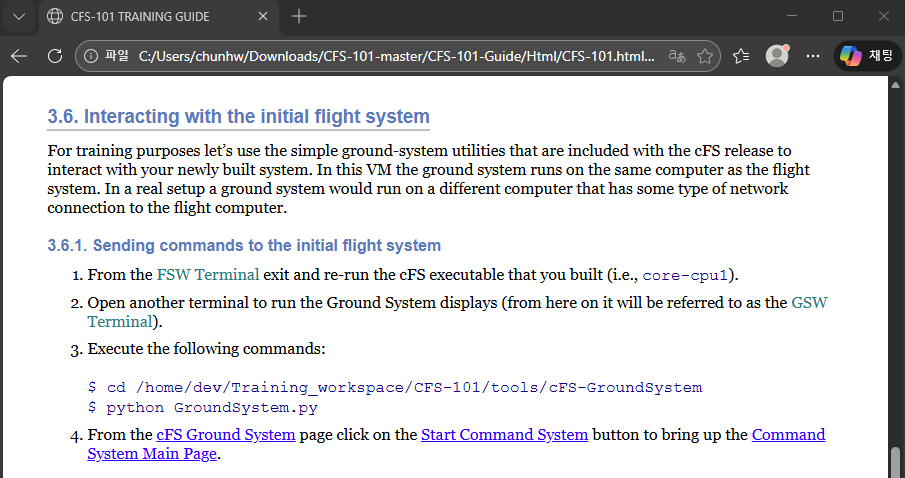
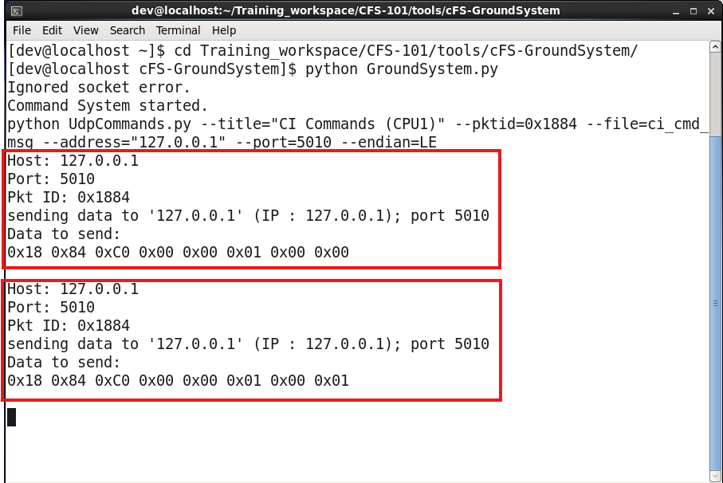
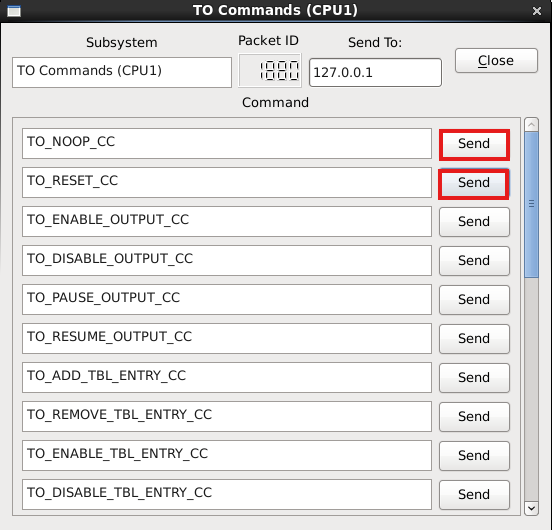
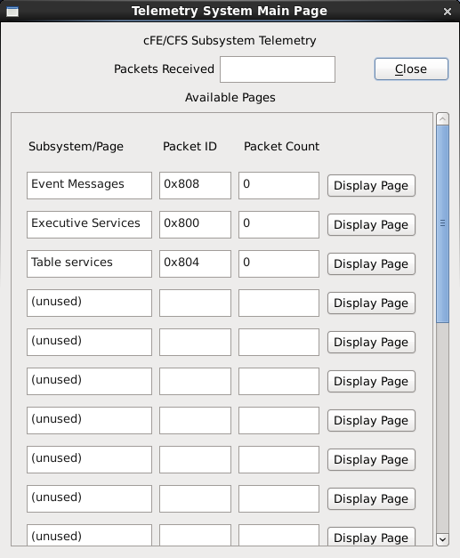
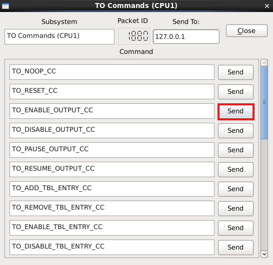
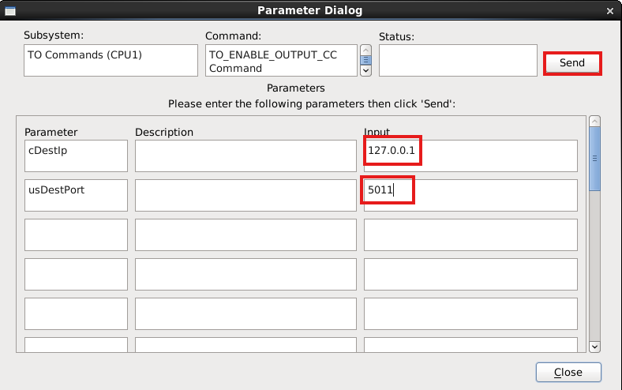
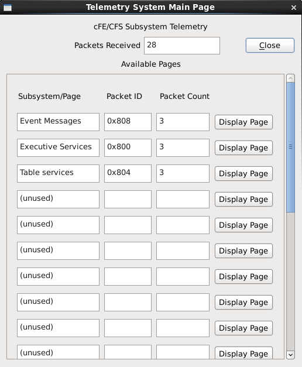

## 🚀 들어가며

게속해서 `CFS-101-Guide` 문서를 활용하여 실습을 진행해 보자!🚂💨

이전 포스트에서 진행했던 cFE Core 실행은 가이드 문서 상 `3.5. Running the initial flight system` 파트 까지이고, 이번 포스트에서는 `3.6. Interacting with the initial flight system` 부터 시작한다.

cFS에서 기본 제공하는 Tool 중에서 `GroundSystem`을 활용해 위성체와 지상국 사이의 명령 통신을 재현하는 실습이다.



## 📡 GroundSystem 실행

통신 시스템을 운용하기 위해서는 cFS executable이 실행 중인 상태여야 한다. 만약 실행을 종료시켰다면 다시 다음 명령으로 cFE core를 활성화한다.

```bash
cd /home/dev/Training_workspace/CFS-101/build/exe/cpu1
./core-cpu1
```

코어가 실행되었다면 새로운 터미널을 열고 다음 명령으로 GroundSystem을 실행한다. 메인 페이지 GUI 창이 나타날 것이다.

```bash
cd /home/dev/Training_workspace/CFS-101/tools/cFS-GroundSystem
python GroundSystem.py
```


## 🛸 Command System으로 위성체에 명령 보내기


GroundSystem 메인 화면에서 'Command System'을 눌러 커맨드 페이지 윈도우를 켠다. 이제 Command Ingest(CI)와 Telemetry Output(TO) 서비스를 활용해 실제 명령을 전송해 볼 차례이다.

### CI Commands


'Display Page' 버튼을 누르면 나오는 커맨드 상세 화면이다. 여기서 `no-op` 명령과 `reset` 명령을 차례로 클릭하면 cFE core 터미널과 GroundSystem 터미널에 로그가 찍힌다.




### TO Commands



마찬가지로 `no-op` 명령과 `reset` 명령을 전송해볼 수 있다. 이번에는 로그에 `CI` 대신 `TO`가 나타난다. 실제로 서로 다른 명령이 전송되고 있다는 것을 알 수 있는 부분이다.


## 📲 Telemetry System으로 위성체로부터 명령 수신하기

다시 GroundSystem Main Page(가장 작은 화면)으로 돌아가서 Telemetry System 버튼을 클릭하면 다음과 같은 윈도우가 나타난다. 아직은 아무 것도 수신하고 있지 않다.



패킷을 수신받기 위해서는 위성체로부터 들어오는 텔레메트리를 활성화시켜야 한다. 다시 TO Commands 화면으로 돌아간다.



`TO_ENABLE_OUTPUT` 명령어 옆의 `send` 버튼을 클릭하면 아래와 같은 파라미터 입력 윈도우가 나타난다.



`cDestIp` 파라미터에 로컬을 뜻하는 `127.0.0.1` IP를 입력하고 `usDestPort` 파라미터에 `5011`번 포트를 입력하고 `send`버튼을 클릭한다.


GroundSystem과 cFE core 터미널에서 모두 정상적으로 로그가 찍힌다.



또한 다시 Telemetry System Main Page로 돌아와 확인하면 GroundSystem이 패킷을 수신하기 시작했다는 것이 바로 확인된다.

## ✨ 마치며

cFS 시스템 자체를 실행해 보는 것도 중요하지만 시스템이 의도대로 동작하고 있는지 확인하는 것도 매우 중요하다. 그런 면에서 GroundSystem 실습은 cFS가 정말 위성체에서 운용되며 통신이 원활한지 검증하는 좋은 실습이라고 생각한다.

다음 실습은 cFS에 새로운 앱을 추가하여 mission-specific한 cFS 소프트웨어를 만들 수 있는 기반을 다지는 단계이다. CFS-101 수료가 머지않았다!🌞