## 🚀 들어가며

이전 포스팅에서 소개했던 대로 이제 새로운 앱을 cFS에 추가해 볼 차례이다.

구현할 서비스는 온도 센서와 관련된 `TEMP_IO`와 `TEMP_MON`으로, 각각 온도 데이터를 읽는 모듈과 해당 데이터를 모니터링하는 모듈이다.

이전 실습을 진행하면서 cFE core 또는 GroundSystem이 아직 실행 중이라면 이제 종료해도 무방하다.

## 🎭 애플리케이션 소개

### `TEMP_IO` (데이터 생성기)

`TEMP_IO` 앱은 온도 데이터를 읽고 배포하는 역할을 하며, 우리는 이를 1Hz(초당 1회) 주기로 실행되도록 스케줄링할 것이다. 다음 사이클을 따라 데이터를 처리한다.

1. **수신된 명령 처리**

    ```
    Wake-Up 및 Send-Hk (상태 보고)
        v
    No-Op (아무것도 안 함) 및 Reset (초기화)
        v
    Set-Current-Temp (현재 온도 설정)
        v
    Set-Delta-Value (변화량 설정)
    ```

2. **온도 센서 값 읽기** (시뮬레이션된 센서)

3. **새로운 온도 값을 시스템에 배포**

### `TEMP_MON` (데이터 소비자)

`TEMP_MON` 앱은 `TEMP_IO`에서 배포하는 온도 데이터를 구독하여 변화 추이를 감시하고 상태(정상/고온/저온)를 분류한다. 이 또한 1Hz 주기로 실행되도록 설정할 것이다.

1. **수신된 명령 처리**

    ```
    Wake-Up 및 Send-Hk
        v
    No-Op 및 Reset
        v
    Set-Cold-Limit (저온 임계값 설정)
        v
    Set-Hot-Limit (고온 임계값 설정)

2. **`TEMP_IO`가 배포한 온도 데이터를 구독(Subscription)을 통해 수신**

3. **데이터 비교 및 판별**
    - 온도 변화: 상승(Increased) / 하강(Decreased) / 변화 없음(No change)
    - 온도 범위: 정상(Nominal) / 고온(Hot) / 저온(Cold)

4. **처리 및 분석된 결과 데이터 배포**

## 🌱 애플리케이션 생성

새 터미널을 열고 다음 명령으로 `gen_app_code` 디렉토리로 이동해 앱을 생성한다.

```bash
cd /home/dev/Training_workspace/CFS-101/tools/gen_app_code
python gen_app_code.py MISSION CFS-101 OWNER "Jane Smith" OUTDIR /home/dev/Training_workspace/CFS-101/apps APPS temp_io temp_mon
```

`OWNER` 파라미터의 "Jane Smith"는 우리의 "홍길동"같은 예시 이름이므로, 그대로 실행해도 되고 나의 이름을 넣어서 실행해도 된다.

이후 `apps` 디렉토리에서 생성된 앱 목록을 확인한다.

```bash
cd /home/dev/Training_workspace/CFS-101/apps
ls
```

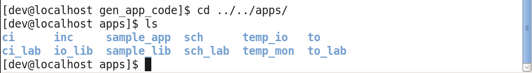

### 고유 Message ID 변경

파이썬 스크립트는 기본 MID로 앱을 생성하기 때문에 이를 고유 값으로 다시 설정해줘야 한다.

`/home/dev/Training_workspace/CFS-101/apps/temp_mon/fsw/platform_inc`에서 값을 변경한다.

```bash
cd /home/dev/Training_workspace/CFS-101/apps/temp_mon/fsw/platform_inc
vi temp_mon_msgids.h
```


### 컴파일을 위한 CMake 파일 생성

다음 명령어로 `CI`의 `CMakeLists.txt`를 복사하고 이를 수정한다.

```bash
cd /home/dev/Training_workspace/CFS-101/apps
cp ./ci/CMakeLists.txt ./temp_io
cp ./ci/CMakeLists.txt ./temp_mon

vi temp_io/CMakeLists.txt
vi temp_mon/CMakeLists.txt
```

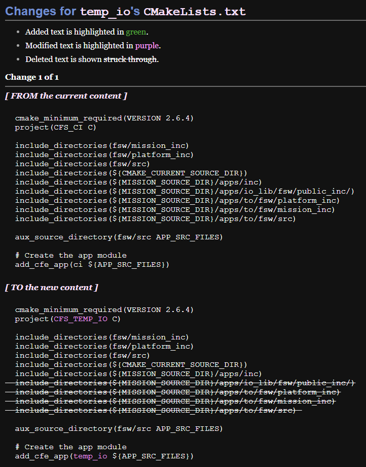

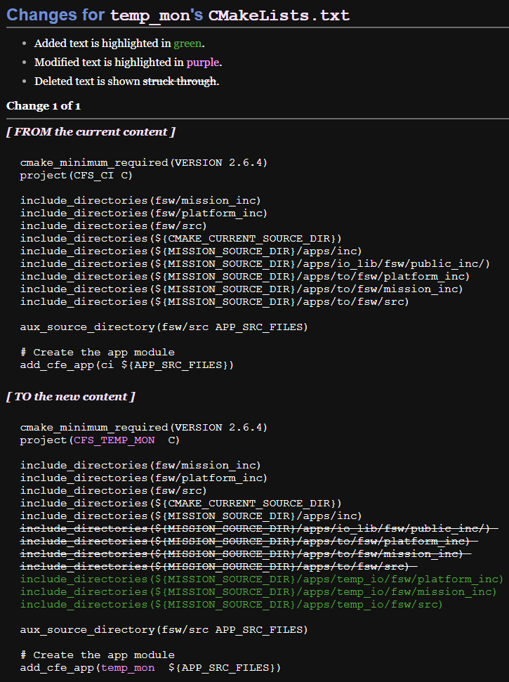

### GroundSystem 등록을 위해 헤더 파일 추가

앱 생성 이후 GroundSystem을 통해 앱 동작 실습을 하게 된다. 이를 위해 다음 명령어로 헤더 파일을 추가하고 내용을 수정한다.

```bash
cd /home/dev/Training_workspace/CFS-101/apps/temp_io/fsw/src
cp temp_io_msg.h temp_io_msg_for_grnd.h
vi temp_io_msg_for_grnd.h
```

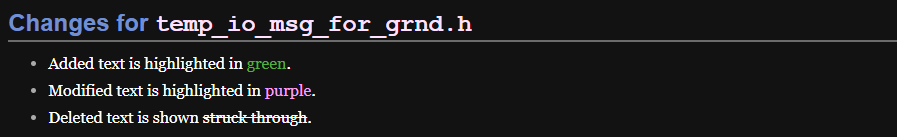
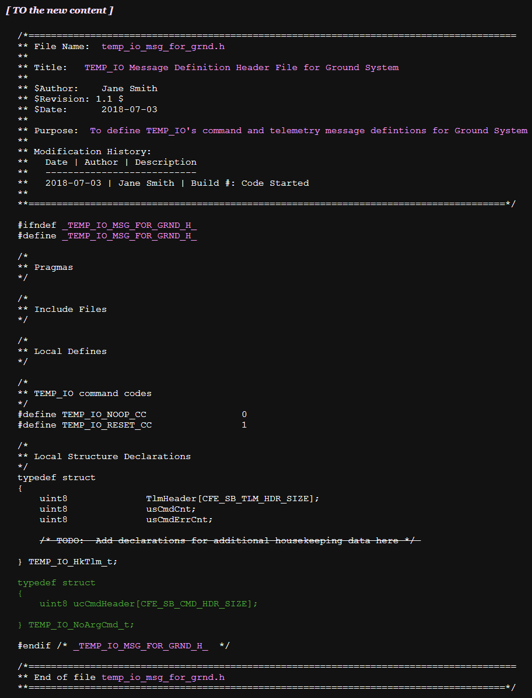

`TEMP_MON`에서도 마찬가지로 진행한다.

```bash
cd /home/dev/Training_workspace/CFS-101/apps/temp_mon/fsw/src
cp temp_mon_msg.h temp_mon_msg_for_grnd.h
vi temp_mon_msg_for_grnd.h
```

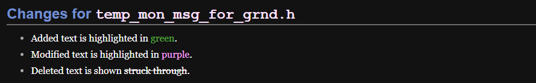
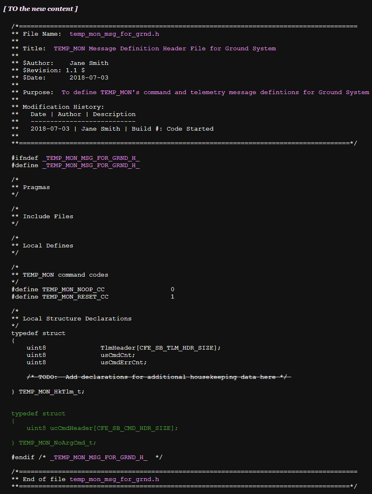

## ⏰ `TO` 구독 테이블과 `SCH` 스케줄링 테이블 업데이트

### 다운링크(Downlink)를 위한 `TO` 구독 추가

TO는 구독 테이블(Subscription Table)을 사용하여 어떤 메시지를 지상으로 보낼지 관리하는데, 새로 만든 `TEMP_IO`와 `TEMP_MON`의 데이터 메시지도 지상으로 전송될 수 있도록 이 테이블에 등록해야 한다.

```bash
cd /home/dev/Training_workspace/CFS-101/apps/to
vi fsw/tables/to_config.c
vi CMakeLists.txt
```

`to_config.c` 파일과 `CMakeLists.txt` 파일을 각각 다음과 같이 수정한다.

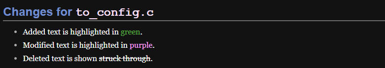
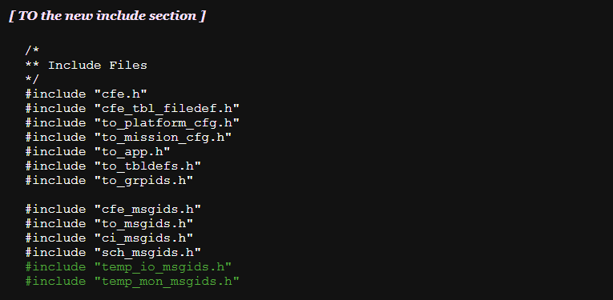
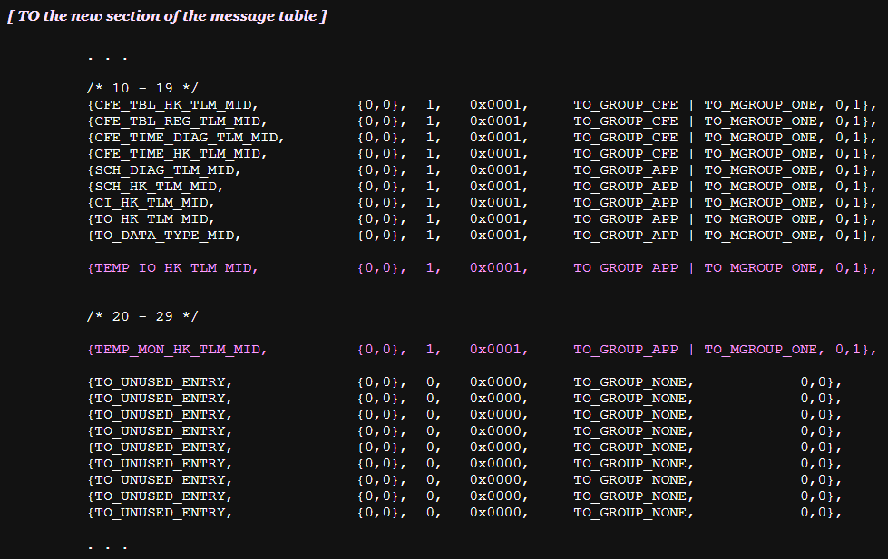

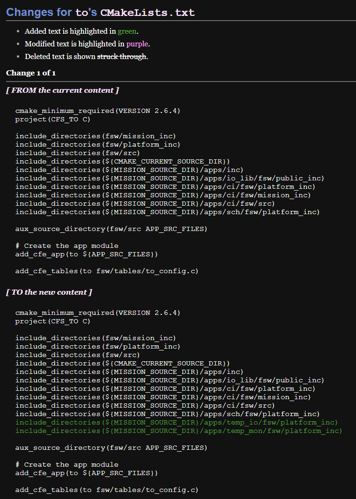

### `SCH`에 새 애플리케이션 스케줄링 등록

새로운 애플리케이션들이 자동으로 동작하게 하기 위해서는 스케줄러(SCH)가 정해진 시간마다 Wake-Up 명령을 보내야 한다. 또한, 상태 정보를 보내게 하려면 Send-Hk 명령도 함께 보내야 한다.

이 두 가지 명령(Wake-Up, Send-Hk)을 `TEMP_IO`와 `TEMP_MON`에게 주기적으로 보내도록 `SCH`를 설정한다.

```bash
cd /home/dev/Training_workspace/CFS-101/apps/sch
vi fsw/tables/sch_def_msgtbl.c
vi fsw/tables/sch_def_schtbl.c
vi CMakeLists.txt
```
`sch_def_msgtbl.c`, `sch_def_schtbl.c` `CMakeLists.txt` 파일을 각각 다음과 같이 수정한다.

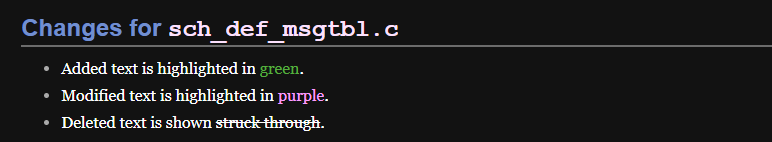
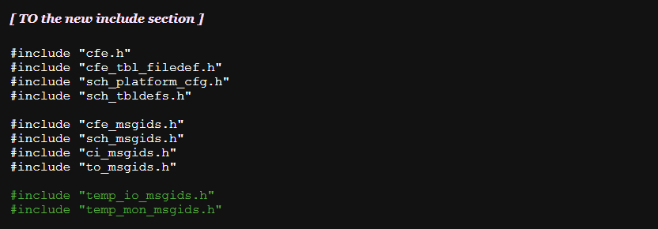
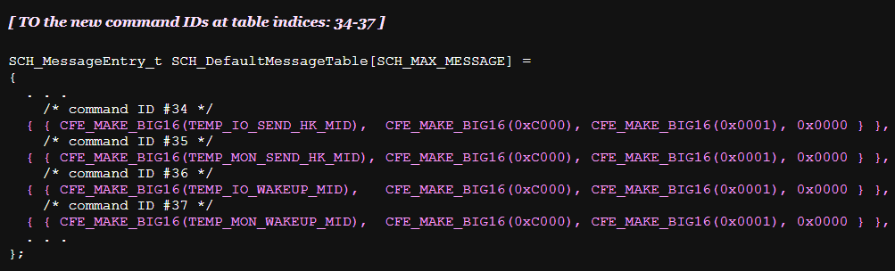

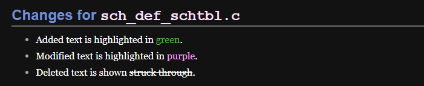
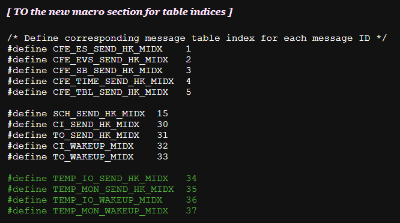


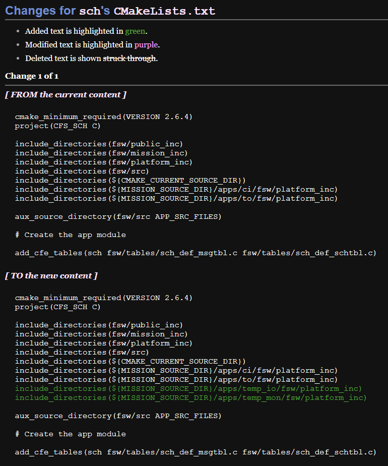

## 🏗️ 빌드 시스템에 새로운 앱 등록

이제 우리가 생성한 `TEMP_IO`와 `TEMP_MON` 앱들을 실제 빌드 시스템에 등록하고 cFE core를 이 앱들과 함께 실행해 볼 차례이다. 

이를 위해서는 `targets.cmake` 파일과 `cpu1_cfe_es_startup.scr` 파일을 수정해야 한다. 먼저 해당 파일들의 위치로 이동한다.

```bash
cd /home/dev/Training_workspace/CFS-101
```

다음 명령어로 각각의 파일을 수정한다.

```bash
vi ./cfs101_defs/targets.cmake
vi ./cfs101_defs/cpu1_cfe_es_startup.scr
```

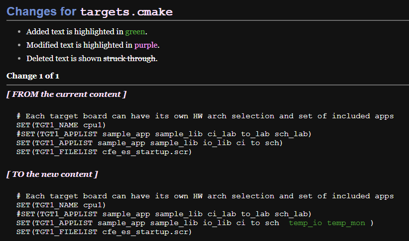

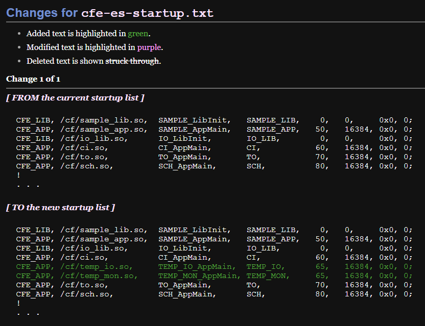

마지막으로, 우리의 새로운 cFS를 빌드하고 실행한다! 🤩

```bash
rm -rf build
make
make install

cd /home/dev/Training_workspace/CFS-101/build/exe/cpu1
./core-cpu1
```

### 오타로 인해 cFS가 정상 작동하지 않을 경우

아무래도 VM에서 켠 Vi editor에는 복사/붙여넣기가 제대로 작동하지 않다 보니, 직접 입력하면서 typo가 생길 수 밖에 없다.

컴파일 및 빌드 타임에서 에러가 나면 비교적 위치 찾기가 쉽지만 `./core-cpu1` 실행 단계에서 문제가 생기면 위치를 찾기가 더 어려워지는 것이 사실..😿

특히 실행 이후에 `Ctrl + C`로 cFS를 종료하고 오타를 찾은 후 다시 실행하면 CI socket 오류가 뜨는데, CI 애플리케이션이 사용하려는 포트가 이미 사용 중이라는 뜻이다. 해결하기 위해서는 해당 프로세스의 PID를 확인하고 종료해야 한다.

```bash
ps aux | grep core-cpu1
```

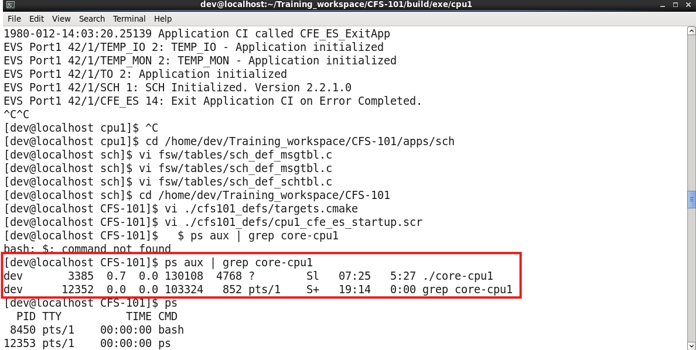

PID(dev 오른쪽 숫자)를 확인했다면 해당 프로세스를 종료하는 명령을 내린다.

```bash
kill -9 <PID> # In this case, 3385
```

### 결과

에러 없이 실행되었다면 다음과 같은 로그 화면을 확인할 수 있다.

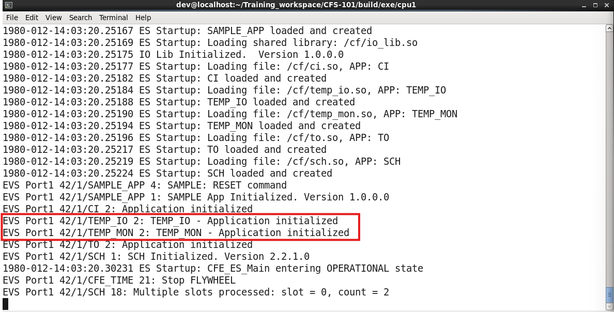

## ✨ 마치며

어려운 과정은 아니지만 직접 코드를 하나하나 입력하는 게 조금 까다로운 세션이다. Vi 에디터에 익숙하다면 조금 시간이 단축되니, 나중에 시간을 들여서 Vim 키맵을 공부하는 것도 추천한다. 만약 나처럼 Neovim을 사용하는 사람이라면 아마 조금 더 익숙할 테다.✌🏻

다음 포스트에서는 새로운 앱들을 활용해 GroundSystem 실습을 한 번 더 진행한다. 정상적으로 앱이 등록되어 실행되는 걸 로그로 확인했으니, 이제 실제 명령을 내리며 어떤 동작을 하는지 확인할 차례이다.

CFS-101 시리즈는 총 5~6개 포스트로 구성될 것으로 예상된다.