## 🚀 들어가며

이제 우리가 만든 `TEMP_IO`, `TEMP_MON` 앱과 통신할 차레이다.

GroundSystem 툴을 이용할 예정인데, 바로 사용할 수는 없고 몇 개의 command와 telemetry를 추가해야 한다.

Step-by-step으로 천천히 개발해 보자.🏄🏻‍♀️

## 💬 새 애플리케이션용 Ground Commands 추가

`cFE-GroundSystem` 툴을 사용하면 간편하게 새로운 애플리케이션을 위한 명령을 추가할 수 있다.

### `TEMP_IO` 커맨드 생성

내장 tool로 커맨드를 생성하기 위해 해당 디렉토리로 이동한다.

```bash
cd /home/dev/Training_workspace/CFS-101/tools/cFS-GroundSystem/Subsystems/cmdGui
```

우리가 사용하게 될 파이썬 스크립트에서 경로를 명확히 파악할 수 있도록 `CHeaderParser-hdr-paths.txt` 파일을 다음과 같이 수정한다. 이때 **파일의 마지막 부분에 빈 라인이 있어서는 안 된다.**

```bash
vi CHeaderParser-hdr-paths.txt
```

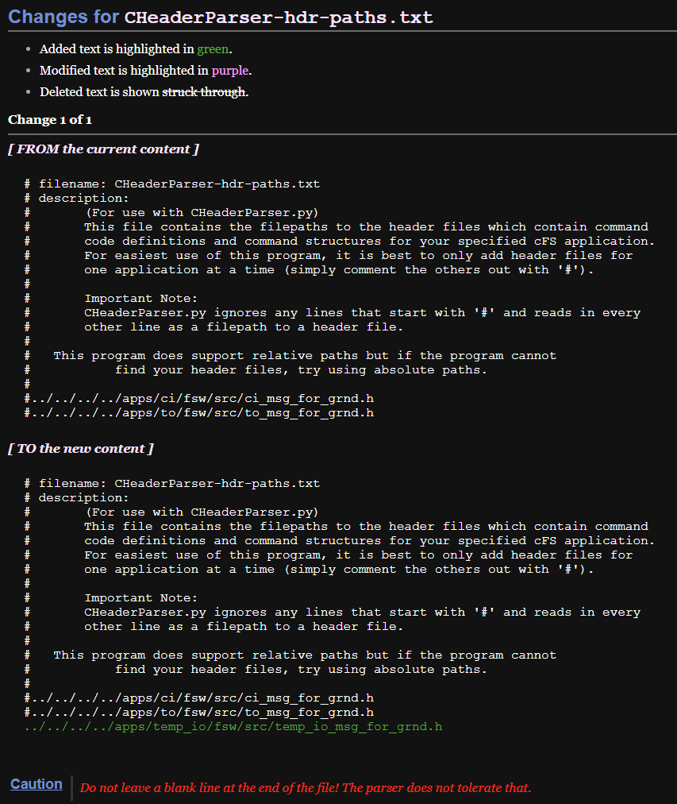

이제 스크립트를 통해 명령을 생성한다!🪄

```bash
python CHeaderParser.py
```

스크립트에서 input을 요구할 것이다. 다음과 같이 입력한다.

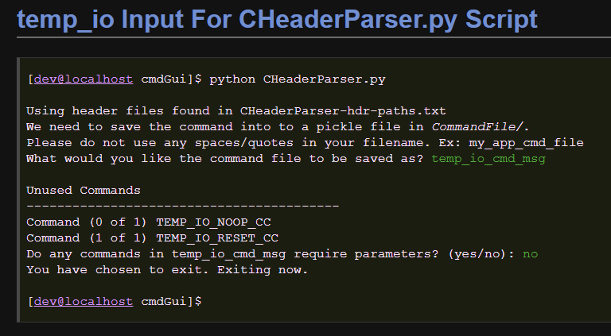

### `TEMP_MON` 커맨드 생성

마찬가지로 `TEMP_MON`을 위한 GroundSystem 커맨드를 생성하기 위해 동일하게 진행한다. 동일한 디렉토리에서 `CHeaderParser-hdr-paths.txt` 파일을 한 번 더 수정한다.

```bash
vi CHeaderParser-hdr-paths.txt
```

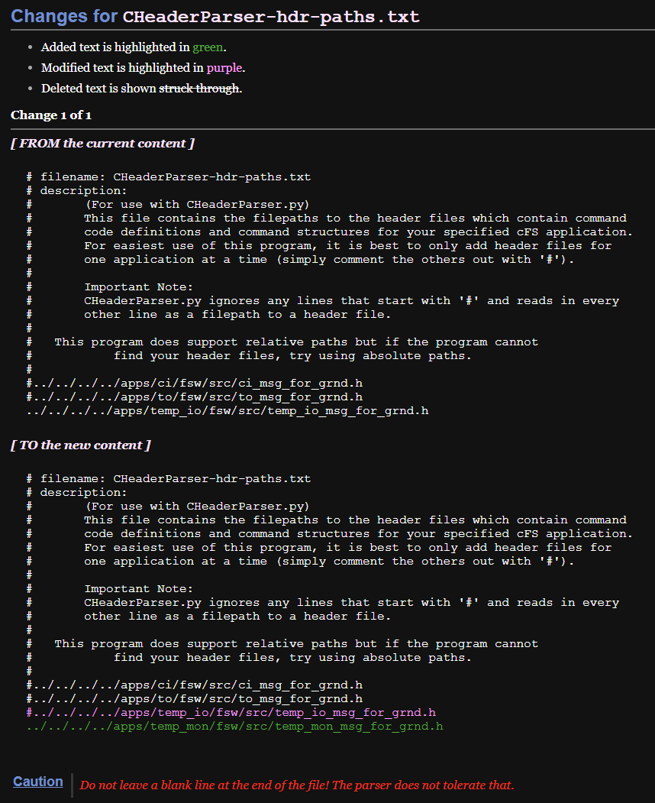

스크립트를 실행하고 필요한 입력값을 넣어준다.

```bash
python CHeaderParser.py
```


### 명령 페이지에 새 애플리케이션 추가

GroundSystem을 켜면 다음과 같은 작은 창이 떴던 것을 기억할 것이다.


이때 'Start Command System'을 누르면 나오는 Command Page에 우리가 만든 애플리케이션을 추가해야 한다. 이를 위해 `command-pages.txt` 파일을 수정한다.

```bash
vi command-pages.txt
```

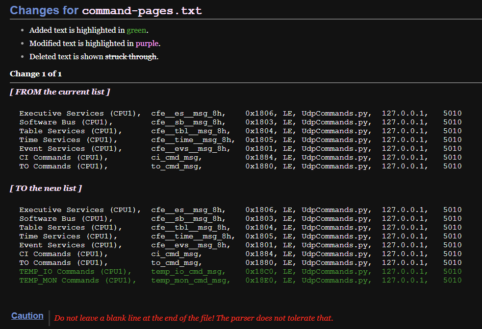

## 🕹️ 실제 GroundSystem에서 명령 보내보기

cFE core와 GroundSystem을 다시 시작하고 'Command System Main Page'에 진입한다.

```bash
cd /home/dev/Training_workspace/CFS-101/build/exe/cpu1/
./core-cpu1

# 새로운 터미널에서
cd /home/dev/Training_workspace/CFS-101/tools/cFS-GroundSystem
python GroundSystem.py
```

Command System Main Page에서 `TEMP_IO`와 `TEMP_MON` Command 들이 정상적으로 등록된 것을 확인할 수 있다.

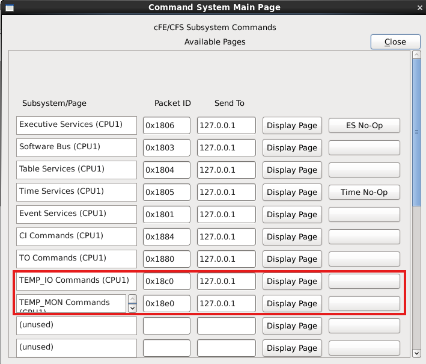

### `TEMP_IO` 명령 전송

Command System Main Page에서 `TEMP_IO` 앱의 상세 페이지 버튼을 클릭한다.

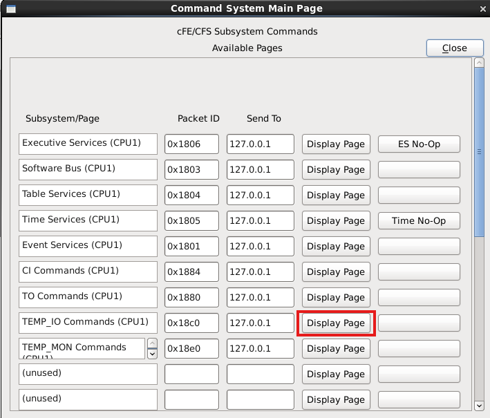

TEMP_IO Commands 페이지에서 `TEMP_IO_NOOP_CC` 명령과 `TEMP_IO_RESET_CC` 명령을 전송한다. 

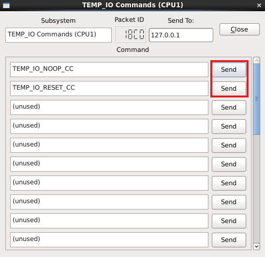

cFE core 터미널과 GroundSystem 터미널에서 각각 다음과 같은 로그가 나타난다.

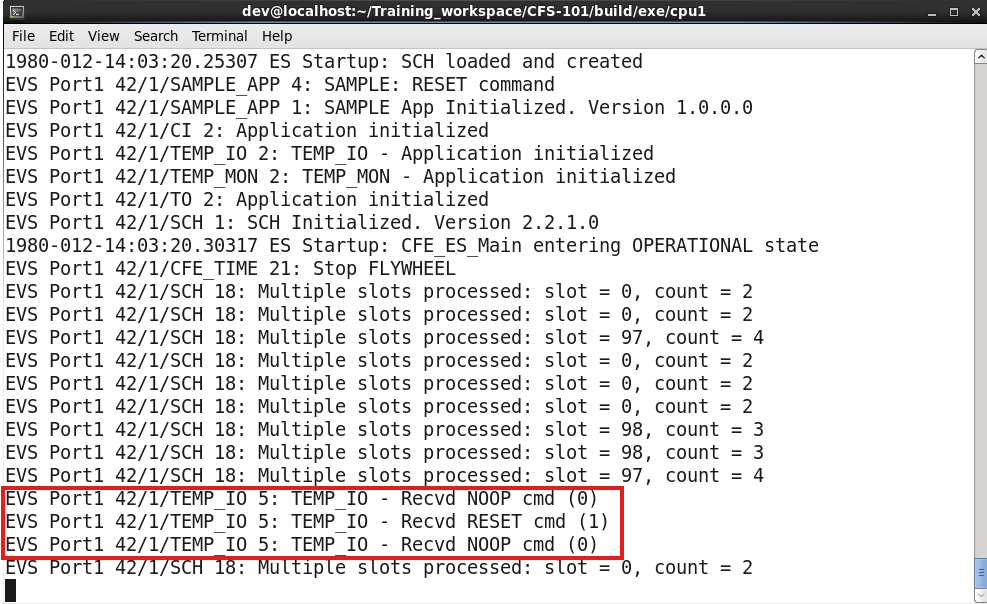

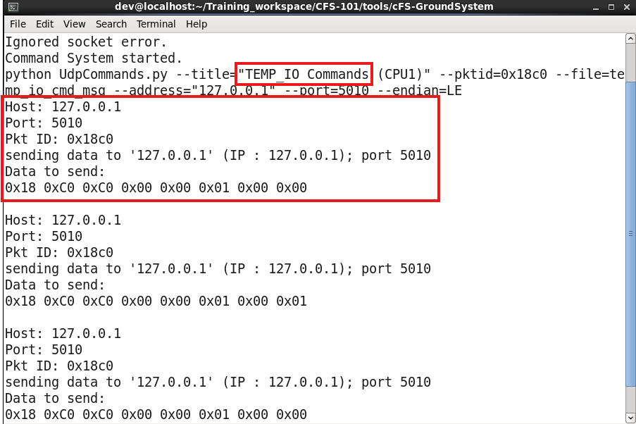

### `TEMP_MON` 명령 전송

마찬가지로 Command System Main Page에서 `TEMP_MON` 앱의 상세 페이지 버튼을 클릭한다.

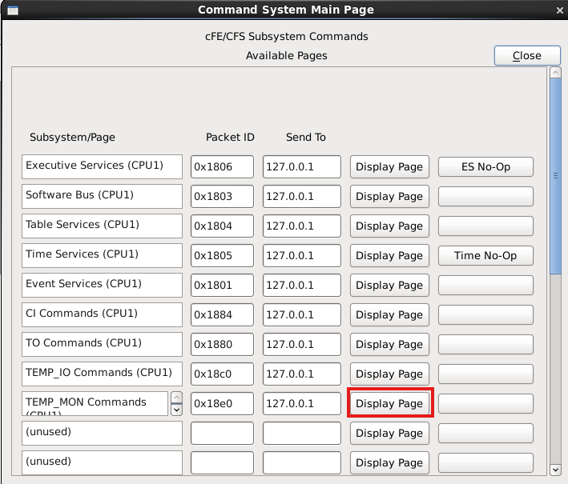

TEMP_MON Commands 페이지에서 `TEMP_MON_NOOP_CC` 명령과 `TEMP_MON_RESET_CC` 명령을 전송한다. 

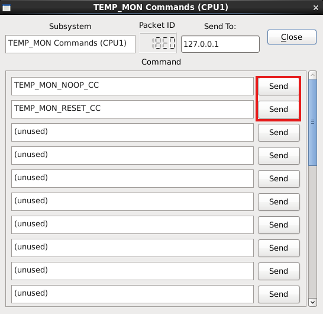

cFE core 터미널과 GroundSystem 터미널에서 각각 다음과 같은 로그가 나타난다.

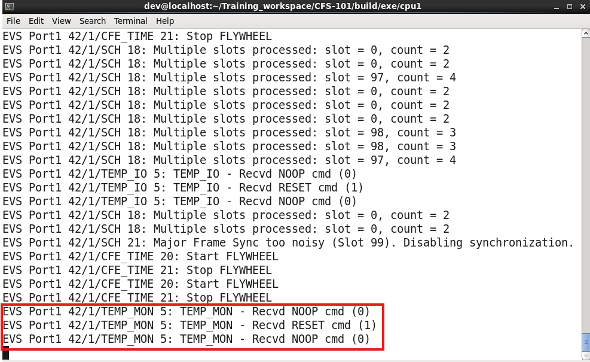


## 📈 새 애플리케이션의 Telemetry 추가하기


GroundSystem 메인 페이지를 다시 보면 Telemetry System 관련 버튼이 있다. 이 Telemetry 또한 `TEMP_IO`와 `TEMP_MON`을 사용할 수 있도록 코드를 추가한다.

먼저 기존 GroundSystem 창을 모두 닫는다.

### Telemetry 생성

Telemetry 생성을 위한 tool이 위치한 디렉토리로 이동한 후, 필요한 파일을 생성한다.

```bash
cd /home/dev/Training_workspace/CFS-101/tools/cFS-GroundSystem/Subsystems/tlmGUI
vi cfs-temp-io-hk-tlm.txt
vi cfs-temp-mon-hk-tlm.txt
```

아래와 같이 내용을 입력해주면 되는데, VirtualBox 내부 Vim 에디터라서 복사-붙여넣기가 잘 동작하지 않는다. 나는 두 파일 모두 주석을 제외한 마지막 두 라인만 입력했다.

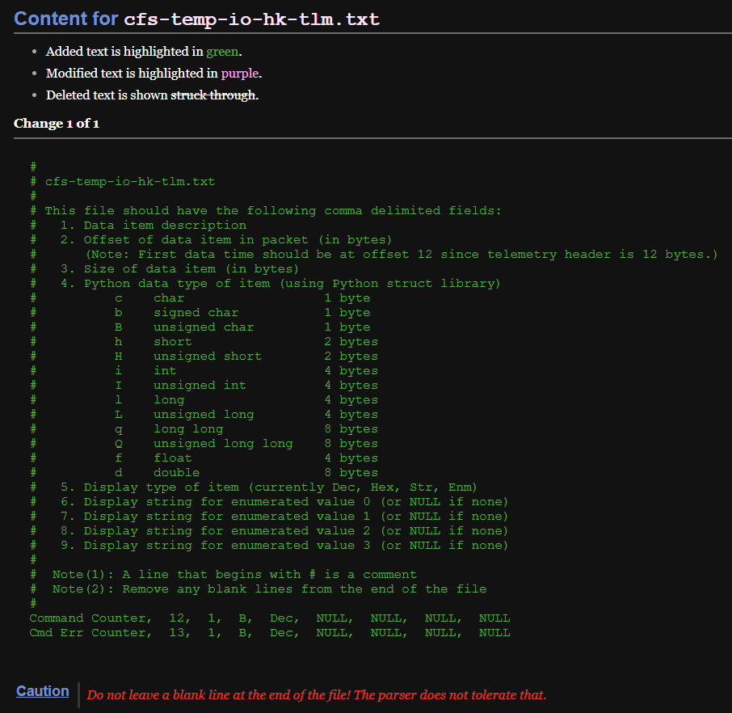

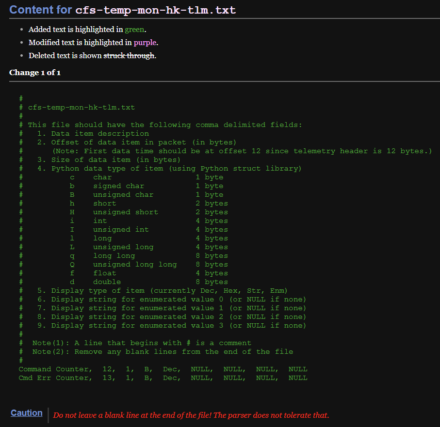

### Telemetry에 애플리케이션 추가

이제 생성한 Telemetry들을 `telemetry-pages.txt` 파일에 추가한다.

```bash
vi telemetry-pages.txt
```

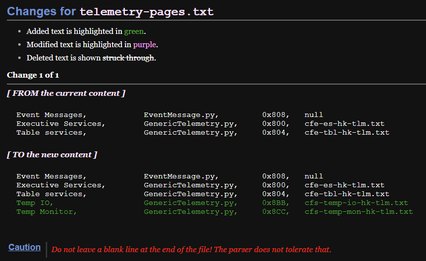

## 📻 실제 GroundSystem에서 Telemetry 수신하기

이제 Telemetry를 추가했으니 다시 GroundSystem을 켜 보자.

```bash
cd /home/dev/Training_workspace/CFS-101/tools/cFS-GroundSystem
python GroundSystem.py
```

이전 포스트에서 했던 것과 동일한 방법으로 Telemetry를 활성화한다. 먼저 Telemetry System Main Page를 켜고, 이후 다시 Command System Main Page에서 `TO_ENABLE_OUTPUT_CC` 커맨드를 보낸다.

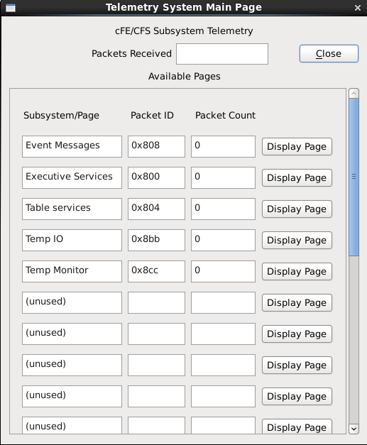

맨 처음에는 아무 패킷도 받지 않는 모습이다.

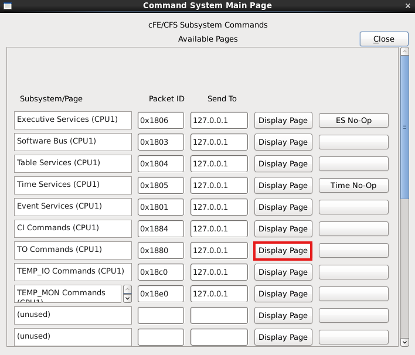

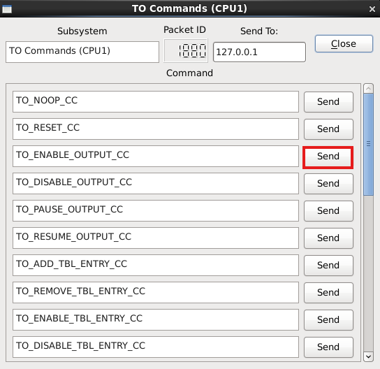

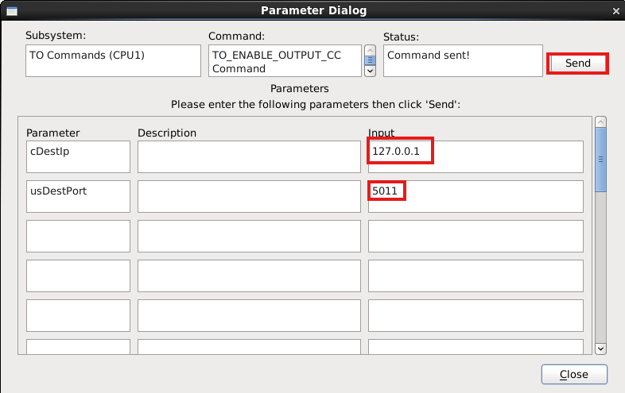

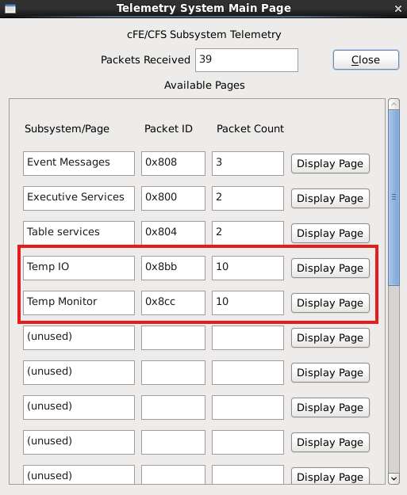

`TO_ENABLE_OUTPUT_CC` 명령을 전송하면 텔레메트리를 수신하기 시작한다.

## 🎪 애플리케이션별 텔레메트리 확인

Telemetry System Main Page를 닫고 다시 GroundSystem 메인 페이지로 돌아가면, IP 주소를 선택해서 확인할 수 있는 드롭다운이 있다. 클릭하여 `127.0.0.1`을 선택한다.

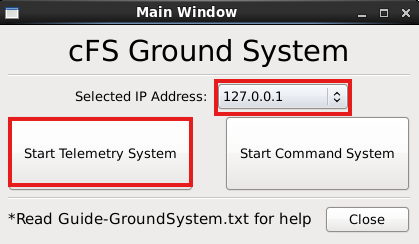

IP 주소를 선택했다면 Start Telemetry System 버튼을 클릭해 Telemetry System Main Page를 다시 켠다.

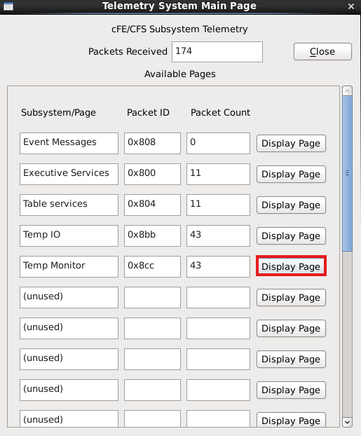

이후 Temp Monitor 옆의 Display Page를 클릭해 Temp Monitor telemetry page를 띄운다.

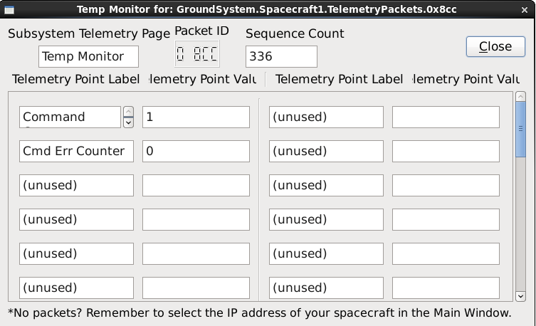

Sequence Count가 계속 증가한다면 시스템이 제대로 동작하고 있는 것이다.

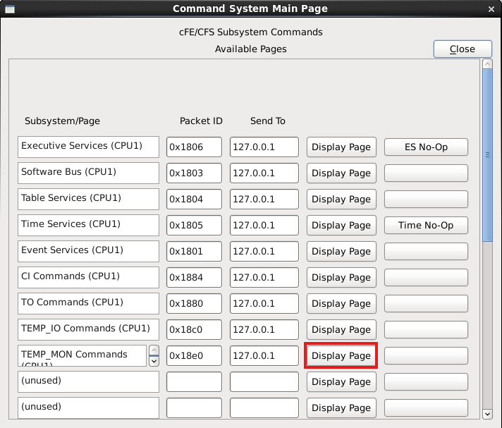

Temp Monitor의 패킷이 제대로 수신되는지 확인하기 위해 Command System에서 패킷을 보내 볼 것이다. 진입하여 `TEMP_MON` 옆의 Display Page 버튼을 클릭한다.

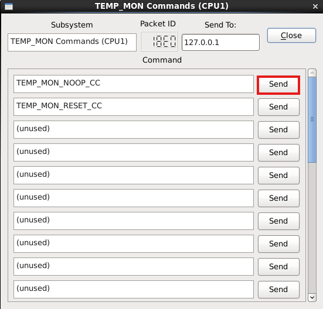

`no-op` 명령을 몇 번 보내 보자.

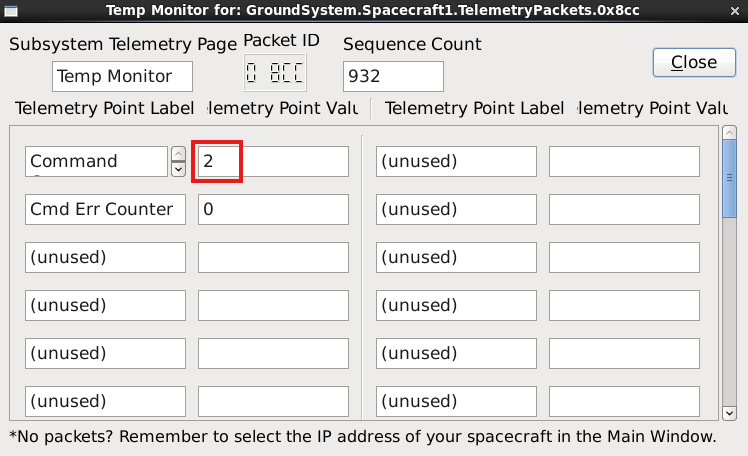

Command Counter가 증가한 모습이다.

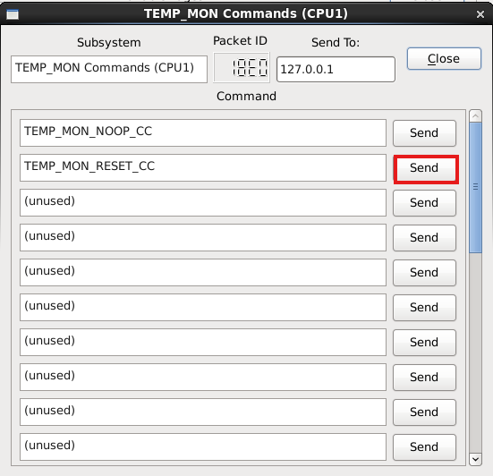

만약 `reset` 명령을 보낸다면?

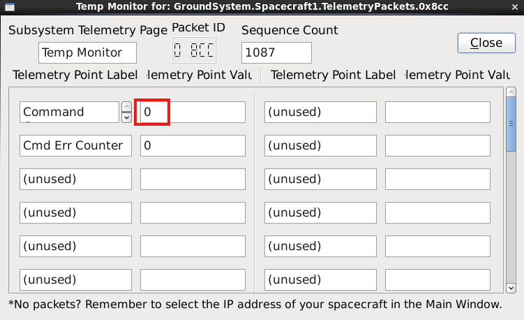

깔끔하게 초기화된다!😎💅🏻

## ✨ 마치며

이것저것 코드 수정할 게 자잘하게 많아서 쉽지 않은 과정이라고 생각한다. 게다가 가이드를 보고 있는 사람은 알겠지만.. `TEMP_IO`, `TEMP_MON`을 수정하고 또 GroundSystem을 고치는 과정이 남아 있어서.. 다소 맥이 빠지고 까마득하게 느껴짐😭

그래도 어째. 해야지 뭐. 사실상 이제부터가 본 게임이다.