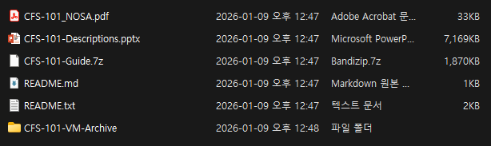
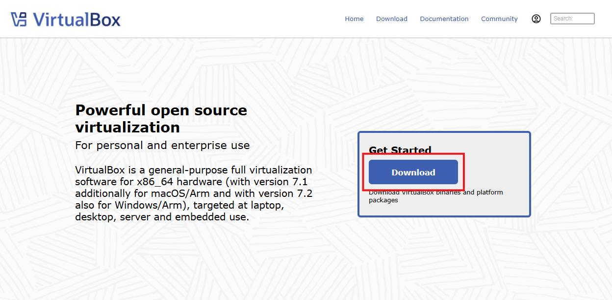
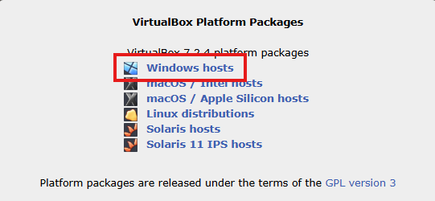
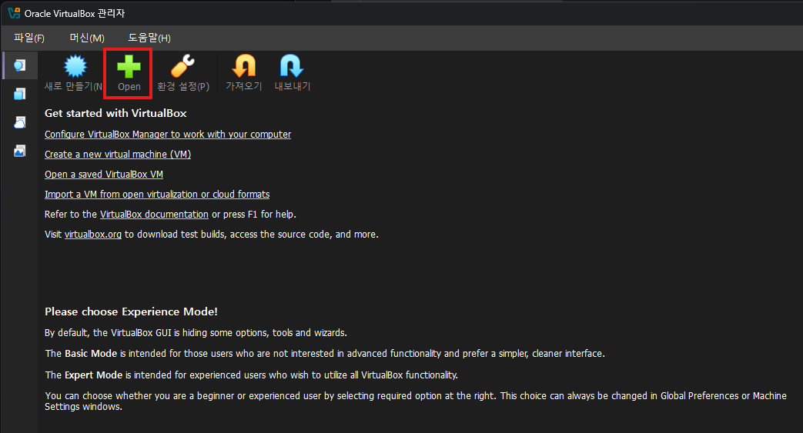
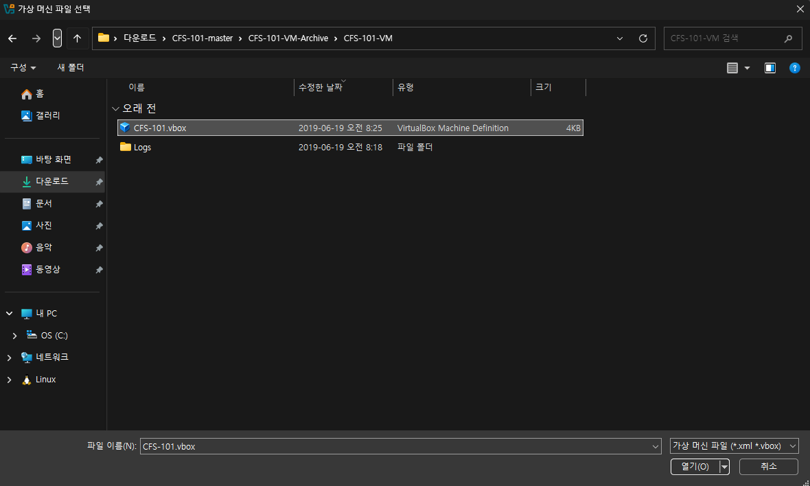
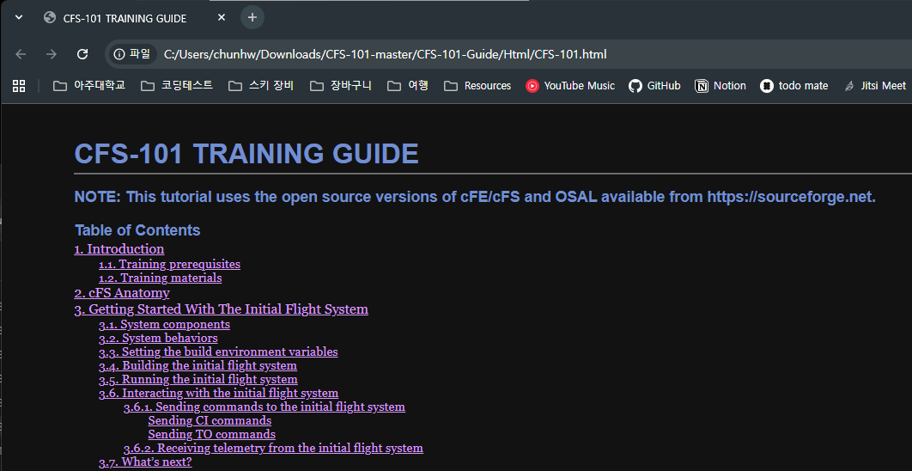
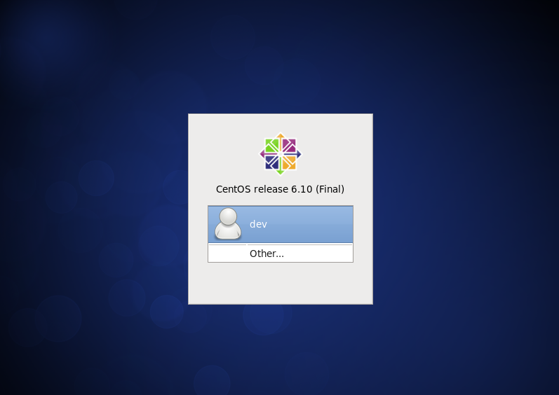
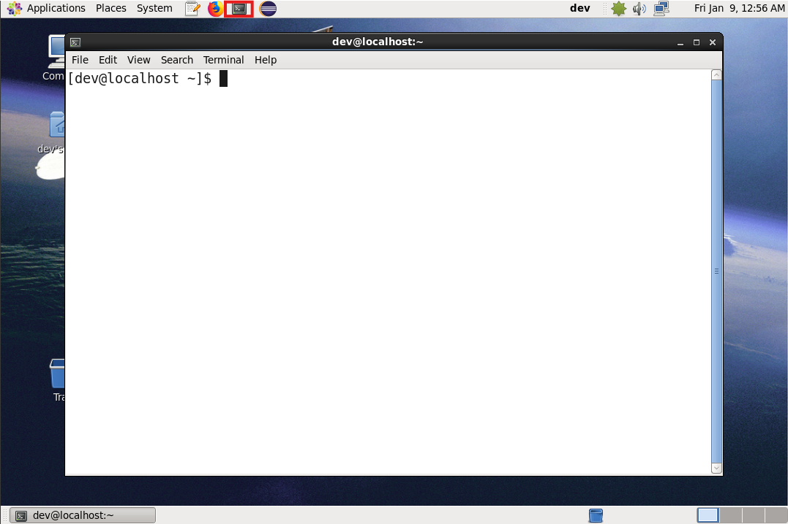
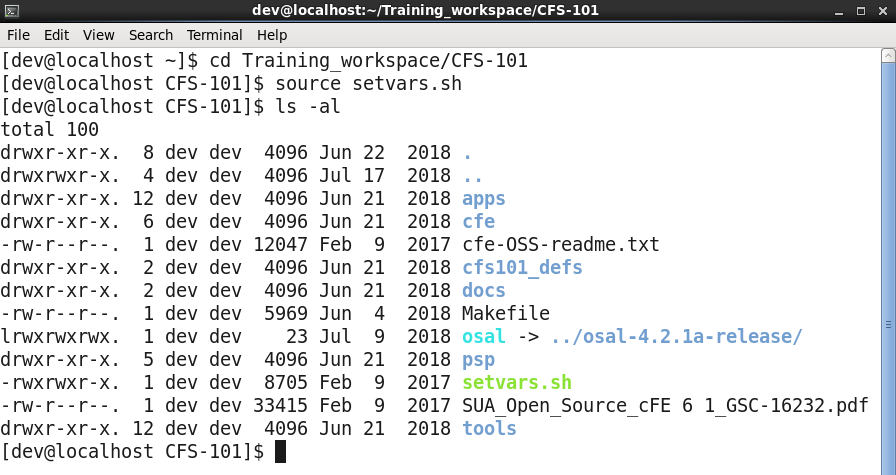
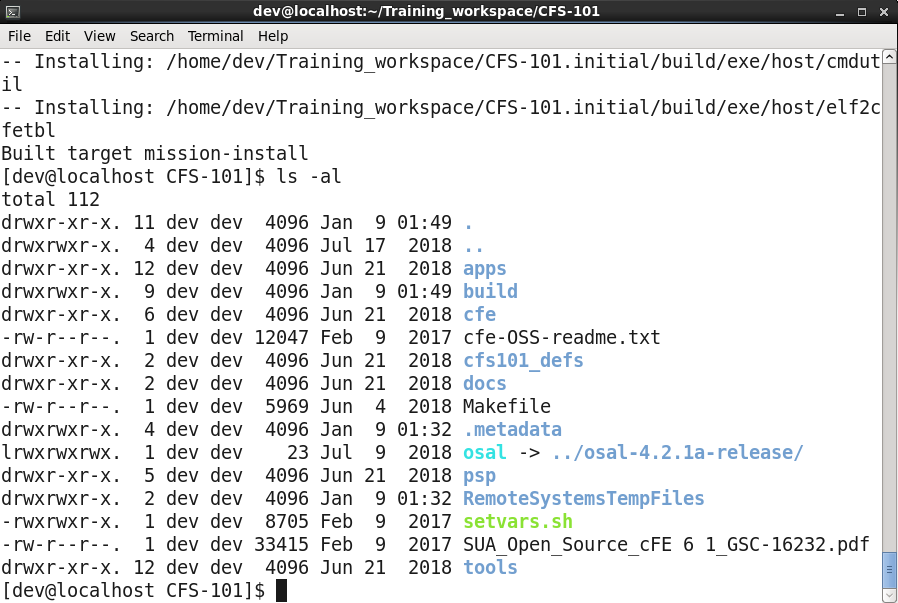

## 🚀 들어가며

NASA cFS 팀은 일반 사용자를 위한 교육 세션을 제공한다. 교육 목록은 [cFS 공식 웹사이트(클릭)](https://etd.gsfc.nasa.gov/capabilities/core-flight-system/training/)에서 확인할 수 있다.


다섯 개의 교육 과정 중 FSW101, CFS101, CFS102는 온라인 세션이며, CFS201, CFS202는 NASA GSFC에서 진행하는 오프라인 세션이다.

그 중에서도 CFS-101이 Github에 오픈소스로 공개되어 있어 학습에 활용해 보려 한다.

## 📚 CFS-101 교육자료 다운로드

[CFS-101 Github repository(클릭)](https://github.com/nasa/CFS-101)에서 프로젝트를 다운로드한다.

**주의**: 프로젝트 크기가 큰 편이기 때문에 clone 시에 시간이 굉장히 오래 걸린다. 꼭 사진처럼 **다운로드**하는 것을 권장한다.


약 5분 정도 소요되며, 이후 `CFS-101-master.zip` 파일의 압축을 풀고 파일이 잘 다운로드되었는지 확인한다. 이후 `README.txt` 파일의 지시를 따라 진행한다.



## 🤖 VirtualBox 다운로드

> 반드시 윈도우 PC에서 진행해야 합니다. MacOS에서는 CFS-101 컨테이너가 정상 작동하지 않습니다.

CFS-101은 모두에게 동일한 환경을 제공하기 위해 VirtualBox를 통한 VM을 사용한다. 먼저 [Oracle VirtualBox 다운로드 페이지(클릭)](https://www.virtualbox.org/)에 접속한다.



Windows hosts 패키지를 다운로드한다.



`VirtualBox-7.2.4-170995-Win.exe` 파일이 다운로드되면 해당 파일을 실행하고 설치 마법사의 지시에 따라 진행한다. VirtualBox 다운로드 과정까지 작성하기에는 글이 길어질 것 같아 생략하니 필요하다면 구글링 해보시길😉

## ⚡ VM Container 실행

컨테이너 파일을 압축 해제하기 위해서는 반디집이나 `7-Zip` 툴을 설치해야 한다. 나는 반디집으로 진행했는데, 공식 문서에서는 `7-Zip`을 권장하고 있다.


`CFS-101-VM.zip.001` 더블 클릭 후 반디집 내에서 '풀기'를 클릭하면 자동으로 압축 해제가 진행된다.

`7-Zip`을 사용하는 경우, `README.txt`의 설명대로 `CFS-101-VM.zip.001`을 우클릭하고 *`7-Zip` → Extract to "CFS-101-VM"* 을 차례로 선택해 압축을 해제한다.



VirtualBox를 실행하고 'Open' 버튼을 클릭한다.



아까 압축 해제한 폴더에 들어가 `CFS-101.vbox`라는 이름의 VirtualBox Machine Definition 파일을 열어 준다.


시작 버튼을 클릭하면 컨테이너가 정상 실행된다.

## 🚶 CFS-101 시작하기

### 교재 파일 압축 해제

`CFS-101-master` 폴더 내의 `CFS-101-Guide.7z` 파일도 마찬가지로 압축 해제한다. 이때는 반디집, 7-Zip, 윈도우 11 기본 압축 툴 모두 사용 가능하다.


`CFS-101.html` 파일을 열면 CFS-101 Guide 웹 페이지가 나타난다.



### VM 유저 로그인



`dev` 유저의 비밀번호 `cfs101!!`을 입력하여 로그인한다.

## ▶️ cFE Core 실행

컨테이너에 성공적으로 접속했다면 상단의 터미널 아이콘을 눌러 터미널을 열어 준다.



### Set Variables

다음 명령어로 데모 프로젝트 위치로 이동하고, cFS를 실행하기 위한 변수들을 설정한다.

```bash
cd /home/dev/Training_workspace/CFS-101
source setvars.sh
```

### Build executable



CFS-101 내부의 파일 목록을 살펴보면 `Makefile`이 있다. 이 `Makefile`을 사용하여 cFS를 빌드한다.

```bash
make prep
make
make install
```



빌드 후에는 사진과 같이 `build` 디렉토리가 생성된다. `build` 안에는 실행 파일과 실행에 필요한 스타트업 파일들이 위치한다.

### Execute core ELF file

다음 명령어로 cFE core를 실행한다.

```bash
cd /home/dev/Training_workspace/CFS-101/build/exe/cpu1
./core-cpu1
```

## 🧐 cFS 동작 살펴보기

성공적으로 `core-cpu1` 파일을 실행했다면 다음과 유사한 로그가 출력되었을 것이다.

    CFE_PSP: Default Reset Type = PO
    CFE_PSP: Default Reset SubType = 1
    CFE_PSP: Default CPU ID = 1
    CFE_PSP: Default Spacecraft ID = 42
    CFE_PSP: Default CPU Name: cpu1
    CFE_PSP: Starting the cFE with a POWER ON reset.
    CFE_PSP: Clearing out CFE CDS Shared memory segment.
    CFE_PSP: Clearing out CFE Reset Shared memory segment.
    CFE_PSP: Clearing out CFE User Reserved Shared memory segment.
    2028-156-18:56:44.85300 POWER ON RESET due to Power Cycle (Power Cycle).
    2028-156-18:56:44.85304 ES Startup: CFE_ES_Main in EARLY_INIT state
    CFE_PSP: CFE_PSP_AttachExceptions Called
    2028-156-18:56:44.85314 ES Startup: CFE_ES_Main entering CORE_STARTUP state
    2028-156-18:56:44.85314 ES Startup: Starting Object Creation calls.
    2028-156-18:56:44.85315 ES Startup: Calling CFE_ES_CDSEarlyInit
    2028-156-18:56:44.85324 ES Startup: Calling CFE_EVS_EarlyInit
    2028-156-18:56:44.85328 Event Log cleared following power-on reset
    2028-156-18:56:44.85329 ES Startup: Calling CFE_SB_EarlyInit
    2028-156-18:56:44.85338 ES Startup: Calling CFE_TIME_EarlyInit
    1980-012-14:03:20.00000 ES Startup: Calling CFE_TBL_EarlyInit
    1980-012-14:03:20.00015 ES Startup: Calling CFE_FS_EarlyInit
    1980-012-14:03:20.00046 ES Startup: Core App: CFE_EVS created. App ID: 0
    EVS Port1 42/1/CFE_EVS 14: No subscribers for MsgId 0x808,sender CFE_EVS
    EVS Port1 42/1/CFE_EVS 1: cFE EVS Initialized. cFE Version 6.5.0.0
    1980-012-14:03:20.05162 ES Startup: Core App: CFE_SB created. App ID: 1
    1980-012-14:03:20.05165 SB:Registered 4 events for filtering
    EVS Port1 42/1/CFE_SB 14: No subscribers for MsgId 0x808,sender CFE_SB
    EVS Port1 42/1/CFE_SB 1: cFE SB Initialized
    1980-012-14:03:20.10238 ES Startup: Core App: CFE_ES created. App ID: 2
    EVS Port1 42/1/CFE_SB 14: No subscribers for MsgId 0x808,sender CFE_ES
    EVS Port1 42/1/CFE_ES 1: cFE ES Initialized
    EVS Port1 42/1/CFE_SB 14: No subscribers for MsgId 0x808,sender CFE_ES
    EVS Port1 42/1/CFE_ES 2: Versions:cFE 6.5.0.0, OSAL 4.2.1.0, PSP 1.3.0.0, chksm 10387
    EVS Port1 42/1/CFE_SB 14: No subscribers for MsgId 0x808,sender CFE_ES
    EVS Port1 42/1/CFE_ES 91: Mission error/unknown.cfs101, error/unknown, error/unknown
    EVS Port1 42/1/CFE_ES 92: Build 201806051353 dev@localhost.localdomain
    1980-012-14:03:20.15302 ES Startup: Core App: CFE_TIME created. App ID: 3
    EVS Port1 42/1/CFE_TIME 1: cFE TIME Initialized
    1980-012-14:03:20.20345 ES Startup: Core App: CFE_TBL created. App ID: 4
    EVS Port1 42/1/CFE_TBL 1: cFE TBL Initialized.  cFE Version 6.5.0.0
    1980-012-14:03:20.25362 ES Startup: Finished ES CreateObject table entries.
    1980-012-14:03:20.25363 ES Startup: CFE_ES_Main entering CORE_READY state
    1980-012-14:03:20.25367 ES Startup: Opened ES App Startup file: /cf/cfe_es_startup.scr
    1980-012-14:03:20.25426 ES Startup: Loading shared library: /cf/sample_lib.so
    SAMPLE Lib Initialized.  Version 1.0.0.01980-012-14:03:20.25450 ES Startup: Loading file: /cf/sample_app.so, APP: SAMPLE_APP
    1980-012-14:03:20.25470 ES Startup: SAMPLE_APP loaded and created
    1980-012-14:03:20.25481 ES Startup: Loading shared library: /cf/io_lib.so
    1980-012-14:03:20.25496 IO Lib Initialized.  Version 1.0.0.0
    1980-012-14:03:20.25510 ES Startup: Loading file: /cf/ci.so, APP: CI
    1980-012-14:03:20.25521 ES Startup: CI loaded and created
    1980-012-14:03:20.25532 ES Startup: Loading file: /cf/to.so, APP: TO
    1980-012-14:03:20.25542 ES Startup: TO loaded and created
    1980-012-14:03:20.25554 ES Startup: Loading file: /cf/sch.so, APP: SCH
    1980-012-14:03:20.25572 ES Startup: SCH loaded and created
    EVS Port1 42/1/SAMPLE_APP 4: SAMPLE: RESET command
    EVS Port1 42/1/SAMPLE_APP 1: SAMPLE App Initialized. Version 1.0.0.0
    EVS Port1 42/1/CI 2: Application initialized
    EVS Port1 42/1/TO 2: Application initialized
    EVS Port1 42/1/SCH 1: SCH Initialized. Version 2.2.1.0
    1980-012-14:03:20.30586 ES Startup: CFE_ES_Main entering OPERATIONAL state
    EVS Port1 42/1/CFE_TIME 21: Stop FLYWHEEL
    EVS Port1 42/1/SCH 18: Multiple slots processed: slot = 96, count = 5
    EVS Port1 42/1/SCH 18: Multiple slots processed: slot = 96, count = 5
    . . . .

### 1. PSP 초기화

    CFE_PSP: Starting the cFE with a POWER ON reset.
    CFE_PSP: Clearing out CFE CDS Shared memory segment.

PSP가 먼저 리셋 타입을 결정하고, 공유 메모리 영역을 초기화한다.

리셋 타입은 `POWER ON reset`과 `PROCESSOR Reset`으로 구별되고, 각 리셋 타입에 따라 메모리 초기화 방식이 달라진다. Power On reset은 모든 공유 메모리를 완전히 초기화하는 cold boot이고, Processor Reset은 일부 중요 데이터(CDS 등)를 보존하면서 재시작하는 warm boot이다.

```c
/* psp/fsw/pc-linux/src/cfe_psp_start.c */

void CFE_PSP_DisplayUsage(char *Name)
{
    printf("        -R [ --reset ] Reset Type is one of:\n");
    printf("             PO   for Power On reset ( default )\n");
    printf("             PR   for Processor Reset\n");
}

if (reset_type == CFE_PSP_RST_TYPE_PROCESSOR)
{
    OS_printf("CFE_PSP: Starting the cFE with a PROCESSOR reset.\n");
}
else
{
    reset_type = CFE_PSP_RST_TYPE_POWERON;
    OS_printf("CFE_PSP: Starting the cFE with a POWER ON reset.\n");
}
```

### 2. Early Initialization

    ES Startup: CFE_ES_Main in EARLY_INIT state
    CFE_PSP: CFE_PSP_AttachExceptions Called
    ES Startup: CFE_ES_Main entering CORE_STARTUP state
    ES Startup: Calling CFE_ES_CDSEarlyInit
    ES Startup: Calling CFE_EVS_EarlyInit
    ES Startup: Calling CFE_SB_EarlyInit
    ES Startup: Calling CFE_TIME_EarlyInit
    ES Startup: Calling CFE_TBL_EarlyInit
    ES Startup: Calling CFE_FS_EarlyInit

Executive Services(ES)가 가장 먼저 시작되어 예외 처리기를 연결한다. 

이후 각 core 서비스(CDS, EVS, SB, TIME, TBL, FS)의 기본 자료구조와 내부 데이터를 초기화한다. 이때 아직 스레드/태스크로 생성되지 않은 상태이다.

### 3. Core Apps 생성

    ES Startup: Core App: CFE_EVS created. App ID: 0
    ES Startup: Core App: CFE_SB created. App ID: 1
    ES Startup: Core App: CFE_ES created. App ID: 2
    ES Startup: Core App: CFE_TIME created. App ID: 3
    ES Startup: Core App: CFE_TBL created. App ID: 4

각 core 서비스를 독립적인 스레드/태스크로 생성한다. 이제 각 서비스는 자신의 실행 컨텍스트를 가지게 된다.

### 4. User Apps 로딩 (CORE_READY 상태)

    ES Startup: CFE_ES_Main entering CORE_READY state
    ES Startup: Opened ES App Startup file: /cf/cfe_es_startup.scr
    ES Startup: Loading shared library: /cf/sample_lib.so
    ES Startup: Loading file: /cf/sample_app.so, APP: SAMPLE_APP

`/cf` 디렉토리에서 `cfe_es_startup.scr` 파일을 찾아 읽은 후, 같은 디렉토리에서 라이브러리와 애플리케이션들을 순차적으로 로드한다. 

`cfe_es_startup.scr`에는 미션 수행에 필요한 모듈이 기록되어 있으며, 유저가 구현한 mission-specific 애플리케이션을 자유롭게 추가할 수 있다.

```
CFE_LIB, cfe_assert,  CFE_Assert_LibInit, ASSERT_LIB,    0,   0,     0x0, 0;
CFE_LIB, sample_lib,  SAMPLE_LIB_Init,    SAMPLE_LIB,    0,   0,     0x0, 0;
CFE_APP, sample_app,  SAMPLE_APP_Main,    SAMPLE_APP,   50,   16384, 0x0, 0;
CFE_APP, ci_lab,      CI_Lab_AppMain,     CI_LAB_APP,   60,   16384, 0x0, 0;
CFE_APP, to_lab,      TO_Lab_AppMain,     TO_LAB_APP,   70,   16384, 0x0, 0;
CFE_APP, sch_lab,     SCH_Lab_AppMain,    SCH_LAB_APP,  80,   16384, 0x0, 0;
!
! Startup script fields:
! 1. Object Type      -- CFE_APP for an Application, or CFE_LIB for a library.
! 2. Path/Filename    -- This is a cFE Virtual filename, not a vxWorks device/pathname
! 3. Entry Point      -- This is the "main" function for Apps.
! 4. CFE Name         -- The cFE name for the APP or Library
! 5. Priority         -- This is the Priority of the App, not used for Library
! 6. Stack Size       -- This is the Stack size for the App, not used for the Library
! 7. Load Address     -- This is the Optional Load Address for the App or Library. Currently not implemented
!                        so keep it at 0x0.
! 8. Exception Action -- This is the Action the cFE should take if the App has an exception.
!                        0        = Just restart the Application
!                        Non-Zero = Do a cFE Processor Reset
!
! Other  Notes:
! 1. The software will not try to parse anything after the first '!' character it sees. That
!    is the End of File marker.
! 2. Common Application file extensions:
!    Linux = .so  ( ci.so )
!    OS X  = .bundle  ( ci.bundle )
!    Cygwin = .dll ( ci.dll )
!    vxWorks = .o ( ci.o )
!    RTEMS with S-record Loader = .s3r ( ci.s3r )
!    RTEMS with CEXP Loader = .o ( ci.o )
! 3. The filename field (2) no longer requires a fully-qualified filename; the path and extension
!    may be omitted.  If omitted, the standard virtual path (/cf) and a platform-specific default
!    extension will be used, which is derived from the build system.
```

### 5. 운영 모드 진입

    ES Startup: CFE_ES_Main entering OPERATIONAL state

## ✨ 마치며

이전 포스팅에서 cFS의 구조를 살펴봤다면 이번에는 실습을 해 보았다!😎 특히 OSAL과 PSP는 프로젝트 진행 과정에서 많이 들여다봤었는데, CFE는 비교적 코드를 뜯어보지 않아서 이번 기회에 정리할 수 있었다.

CFS-101은 이렇게 코어를 실행하는 것부터 시작해 GroundSystem으로 텔레메트리 송수신하기, 그리고 실제 애플리케이션 추가하기의 세 단계로 이루어져 있다.

다음 포스팅에서는 GroundSystem을 실행해서 실제 위성체와 지상 기지국이 어떻게 통신하는지 알아볼 예정이다.