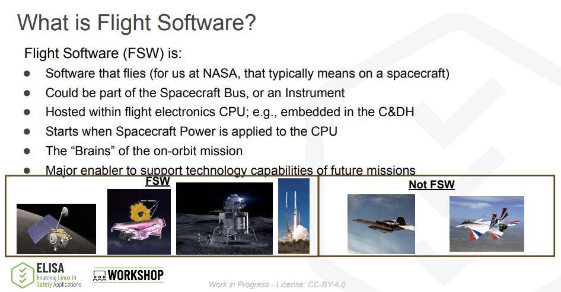
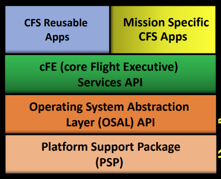
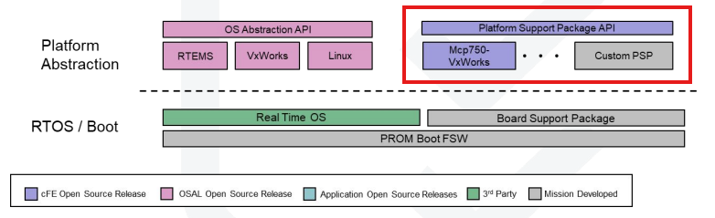
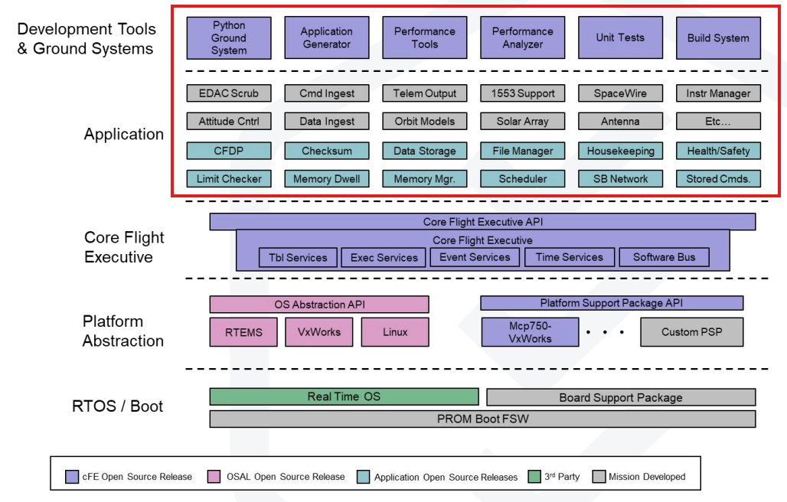

## 🚀 들어가며

최근 NASA의 Core Flight System(이하 cFS)을 접할 기회가 생겼다. cFS는 NASA가 실제 우주 미션에서 사용하고 2015년부터 오픈소스로 공개한 비행 소프트웨어 프레임워크이다. 

수억 달러가 투입되는 우주 미션에서 비행 소프트웨어가 어떤 구조로 설계되고, 어떻게 신뢰성을 보장하는지 직접 살펴볼 수 있는 오픈소스가 존재한다는 것은 흔치 않은 기회라고 생각한다.

이번 시리즈에서는 cFS를 자세히 살펴보고, 왜 많은 우주 프로젝트에서 채택되고 있는지, 실제 하드웨어에서 어떻게 활용될 수 있는지 공부할 예정이다. (주먹) 소스코드는 [NASA cFS 공식 Github(클릭)](https://github.com/nasa/cFS)에서 확인할 수 있다.

이번 포스트에서는 다음 두 영상을 참고했다.

### How NASA Recycles Software - What is cFS?

> 썸네일을 클릭하면 유튜브 영상을 시청하실 수 있습니다.

[](https://youtu.be/kzVDcbVvNrU?si=pFqT6iSEaSn2tqAr)

### cFS Overview Presentation

> 썸네일을 클릭하면 유튜브 영상을 시청하실 수 있습니다.

[](https://youtu.be/u71pGsSgKeQ?si=IZpIMFtZlmp4k2P8)

## FSW(Flight Software)란?

Flight Software(FSW)는 말 그대로 우주를 비행하는 소프트웨어로, 우주선의 On-Board Computer에서 실행되어 우주선에 전력이 공급되는 순간부터 작동을 시작한다. 

FSW는 실시간 운영체제(RTOS) 위에서 동작하면서, 우주선의 하드웨어를 제어하고 미션을 수행하는 모든 로직을 포함한다. 이를 보고 FSW를 우주선의 "두뇌"라고 표현하기도 한다.

다만 Spacecraft Bus의 일부이거나 탑재 장비(Instrument)의 일부일 수 있는데, 우주선 본체의 제어뿐만 아니라 과학 장비나 관측 장비에도 들어갈 수 있다는 뜻이다.



일반적인 임베디드 소프트웨어와 비교했을 때, FSW는 훨씬 더 높은 신뢰성과 안정성을 요구받는다. 한번 발사되면 물리적인 수리가 불가능하고, 통신 지연이 크며, 방사선 환경에서 동작해야 하기 때문이다.

## cFS 전체 구조

cFS는 계층화와 추상화를 사용하여 재사용성을 높인 프레임워크이다. 

모듈 구성은 크게 cFE, OSAL, PSP로 이루어져 있다.



OSAL은 운영체제를 추상화하고, PSP는 각 플랫폼(하드웨어 + OS)마다 별도로 구현되어 플랫폼 종속적인 기능을 제공한다. '플랫폼'이 무엇인지 아직 감이 안 올 수 있는데, 설명할 예정이니 걱정하지 않아도 된다.^^

이렇게 애플리케이션이 하드웨어와 운영체제로부터 분리되고, 그 위에서 cFE가 애플리케이션 실행 환경과 공통 서비스를 제공한다. 최상단의 애플리케이션들은 cFE API만을 사용하기 때문에 하드웨어나 OS를 전혀 신경 쓰지 않아도 된다.

### OSAL (Operating System Abstraction Layer)


각 RTOS는 태스크 생성, 동기화, 타이머 등 운영체제 기본 기능은 제공하지만 API가 모두 다르다. 예를 들어, 태스크 생성에 대한 API는 다음과 같다.

- POSIX: `pthread_create()`
- VxWorks: `taskSpawn()`
- RTEMS: `rtems_task_create()`

각기 다른 함수 때문에 OS를 바꾸려면 코드를 대량으로 수정해야 한다. OSAL은 이를 추상화하여 통일된 API를 제공하는 방법으로 문제를 해결한다.

간단하게 태스크를 종료하는 API로 알아보면, 운영체제별로 다음과 같이 별도 구현되어 있다.

```c
/* osal/src/os/posix/src/os-impl-tasks.c */

void OS_TaskExit_Impl()
{
  pthread_exit(NULL);
}
```

```c
/* osal/src/os/vxworks/src/os-impl-tasks.c */

void OS_TaskExit_Impl()
{
  taskExit(0);
}
```

```c
/* osal/src/os/rtems/src/os-impl-tasks.c */

void OS_TaskExit_Impl()
{
  rtems_task_delete(RTEMS_SELF);
}
```

이렇듯 OSAL은 운영체제에 따라 내부적으로 적합한 API를 선택하기 때문에 이식성이 좋고, 컴파일 툴체인만 교체하면 별도의 코드 수정 없이 소프트웨어를 사용할 수 있다.

### PSP (Platform Support Package)



PSP는 특정 플랫폼(하드웨어 + OS 조합)에 종속적인 기능들을 제공하는 계층이다. OSAL보다 한 단계 더 하드웨어에 가깝다고 볼 수 있다.

그러나 PSP에서도 OSAL이 추상화한 API를 사용하기 때문에, 앞쪽 검은 바탕의 `Core Flight Software Framework Architectural Layers` 이미지보다 흰 바탕의 이미지가 조금 더 정확하다. 

**플랫폼이란?**

PSP에서 말하는 '플랫폼'은 하드웨어 아키텍처와 OS의 조합이다. 

- `pc-linux`: x86 프로세서 + Linux OS
- `pc-rtems`: x86 프로세서 + RTEMS OS
- `bbb-rtems`: ARM BeagleBoneBlack 보드 + RTEMS OS
- `mcp750-vxworks`: PowerPC MCP750 보드 + VxWorks OS


같은 OS를 사용하더라도 하드웨어가 다르면 부팅 과정, 메모리 맵, 인터럽트 처리 방식이 각각 다르다. 이런 차이를 PSP에서 추상화한다.

플랫폼은 **BSP(Board Support Package)** 라는 개념과도 밀접한 관련이 있다.


세상에는 아두이노와 라즈베리파이부터 시작해 산업용 및 커스텀 보드까지, 다양한 보드가 존재한다. 각 RTOS는 이러한 다양한 하드웨어를 최대한 많이 지원하는데, 이때 OS와 보드를 연결해주는 일종의 미들웨어가 바로 BSP, 번역하면 보드별 지원 패키지이다. 

cFS의 PSP는 그 BSP를 사용해서 cFS에 필요한 플랫폼 서비스를 제공하는 것이다. 다시 말해 PSP는 BSP 위에서 동작하는 것!

- **pc-linux (x86 + Linux)**
```c
/* pc-linux/src/cfe_psp_start.c */
// 로컬 디렉토리를 /cf로 매핑
Status = OS_FileSysAddFixedMap(&fs_id, "./cf", "/cf");
```

- **pc-rtems (x86 + RTEMS)**
```c
/* pc-rtems/src/cfe_psp_start.c */
// 임베디드 시스템의 EEPROM을 /cf로 매핑
Status = OS_FileSysAddFixedMap(&fs_id, "/mnt/eeprom", "/cf");
```

- **bbb-rtems (ARM BeagleBone Black + RTEMS)**
```c
/* bbb-rtems/src/cfe_psp_start.c */
// 비휘발성 메모리 영역을 /cf로 매핑
Status = OS_FileSysAddFixedMap(&fs_id, "/nonvol", "/cf");
```

PSP는 각 플랫폼의 특성에 맞게 구현된다. 위 코드는 cFS의 `/cf` 디렉토리를 실제 파일시스템에 매핑하는 부분이다.

동일한 함수(`OS_FileSysAddFixedMap`)를 호출하지만, 매핑되는 실제 경로는 플랫폼의 하드웨어 특성을 따른다. Linux는 개발 환경이므로 현재 디렉토리의 `./cf`를 사용하고, RTEMS 기반 임베디드 시스템들은 각각 EEPROM이나 비휘발성 메모리 같은 실제 하드웨어 메모리를 사용한다.

### cFE (Core Flight Executive)


cFE는 cFS의 핵심 계층으로, OSAL과 PSP 위에서 동작하며 애플리케이션들이 공통적으로 필요로 하는 서비스들을 제공한다. cFE가 제공하는 주요 서비스는 다음과 같다.

- **Executive Services (ES)**: 애플리케이션 생명주기를 관리한다. 앱 시작, 중지, 재시작, 예외 처리, 성능 모니터링 등을 담당한다.

- **Software Bus (SB)**: 애플리케이션 간 메시지 기반 통신을 제공한다. Publish-Subscribe 패턴으로 동작하며, 애플리케이션들은 직접 연결되지 않고 소프트웨어 버스를 통해 메시지를 주고받는다.

- **Event Services (EVS)**: 시스템 이벤트와 로그 메시지를 관리한다. 이벤트를 필터링하고, 지상국으로 전송하거나 로그 파일에 기록한다.

- **Time Services (TIME)**: 시스템 시간과 우주선 시간을 관리한다. 타임스탬프 제공, 시간 동기화 등을 담당한다.

- **Table Services (TBL)**: 런타임에 변경 가능한 설정 데이터(테이블)를 관리한다. 지상에서 업로드한 설정을 검증하고 적용하는 메커니즘을 제공한다.

애플리케이션 개발자는 하드웨어나 OS를 전혀 신경쓰지 않고 cFE API만 사용하여 손쉽게 cFS 앱을 구현할 수 있다. 

예를 들어 다른 앱에 메시지 전송 시에는 `CFE_SB_TransmitMsg()`, 이벤트 로그 출력 시에는 `CFE_EVS_SendEvent()`, 테이블 로드 시에는 `CFE_TBL_Load()` 등의 API를 사용하면 되며 어떤 플랫폼에서든 동일하게 동작한다.

### cFS 애플리케이션 계층



cFS의 최상위 계층에는 실제 미션을 수행하는 애플리케이션들이 위치한다. 애플리케이션 및 툴은 크게 세 가지로 분류되는데, 대부분의 우주 미션에서 공통적으로 필요한 범용 앱들, 각 미션에 특화된 커스텀 앱들, 개발 및 테스트를 위한 도구들로 구분된다.

앱들의 종류는 위 이미지에서 색상으로 구별할 수 있다.

## cFS 프레임워크의 장점


cFS는 검증된 품질과 신뢰성, 개발 비용 및 시간 절감, 활발한 커뮤니티 등 여러 이점을 갖고 있다. NASA에서 사용되고 있는 만큼 장기적으로 높은 품질이 유지되고, 계속해서 업데이트되고 있으며, 새로운 미션을 시작할 때 뼈대 프로그램을 개발하는 데 시간을 쓰지 않아도 된다.

그러나 내가 생각하는 가장 큰 장점은 각 계층의 추상화를 통한 **이식성**에 있다. 툴체인만 바꿔서 재컴파일하면 그 어떤 보드와 운영체제에서도 멀쩡히 실행된다는 뜻인데, 이게 진가를 발휘하는 건 어떤 때냐! **바로 리눅스에서 개발 후 컴파일만 다시 하면 그대로 실제 보드에 올릴 수 있다**는 것이다.

사용하는 보드에 맞는 PSP만 준비되어 있다면 애플리케이션을 개발 단계에서 하드웨어가 구비되어 있을 필요가 전혀 없다. 물리적 상황에 구애받지 않고 개발이 가능하다는 점은 임베디드 개발에 있어 혁명과도 같다고 생각한다.

## ✨ 마치며

분명 머리로는 어느 정도 이해하고 있었는데, 아는 것을 글로 정리해 옮기는 건 언제나 어려운 일인 것 같다. 설명이 부족했던 부분은 없었길 ㅎㅎ 기도

시각 자료는 유튜브 영상에서 사용하는 것와 같은 자료이다. 개인적으로 영상 설명은 <*How NASA Recycles Software - What is cFS?*> 가, 자료는 <*cFS Overview Presentation*> 이 잘 구성되어 있는 것 같다고 생각해서 두 자료를 같이 사용했다.

아래 링크에서 PDF 파일을 바로 확인할 수 있다. 

~[How NASA Recycles Software - What is cFS?]()~: PDF 링크가 삭제되었습니다. 요청하시면 송부해 드리겠습니다.

[cFS Overview Presentation](https://directory.elisa.tech/workshops/2024-12-Maryland/cFS-Overview-Richard-Landau-NASA.pdf)