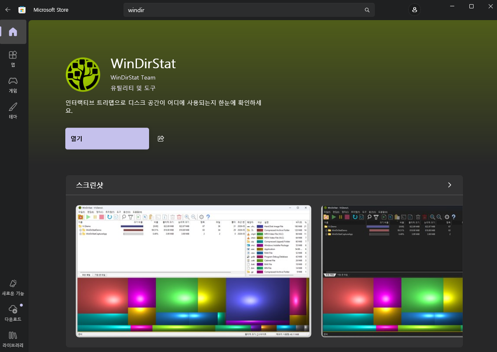
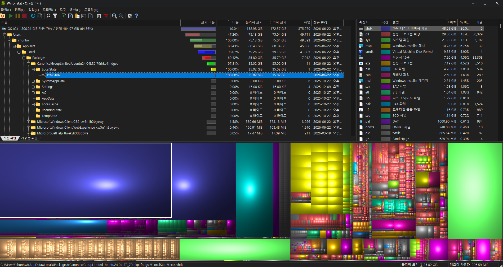
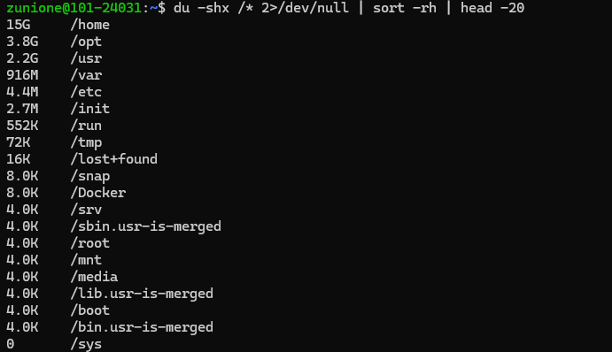

## 🚀 들어가며

OpenC3 COSMOS 도커 컨테이너를 활용해서 실습을 하면 텔레메트리 패킷이 계속해서 데이터로 쌓인다. 이 때문에 실습이 종료되면 컨테이너를 모두 중지해야 한다.

나는 이걸 잘 알지 못하고 컨테이너를 계속 열어둔 채로 방치했고..😭 그 결과 512GB HDD에 여유 공간이 10GB밖에 남아 있지 않는 상황이 벌어졌다.

지금은 원인을 명확히 알지만 당시 새빨간 C드라이브를 마주했을 때는 적잖이 당황했기 때문에, 이와 비슷한 상황이 벌어진다면 드라이브 용량을 어떻게 다시 풀 수 있는지 공유하려고 한다.

## 💽 왜 이런 일이 생기나: ext4.vhdx의 특성

WSL2는 리눅스 파일시스템 전체를 **`ext4.vhdx`** 라는 단일 가상 디스크 이미지 파일로 관리한다. 이 파일은 Windows 탐색기에서는 보이지 않는 경로에 존재한다.

```text
C:\Users\<username>\AppData\Local\Packages\
  CanonicalGroupLimited.Ubuntu<버전>\LocalState\ext4.vhdx
```

`ext4.vhdx`의 핵심적인 특성이 있다.

- WSL2 내부에서 파일을 추가하면 → `.vhdx` 크기가 자동으로 늘어난다.
- WSL2 내부에서 파일을 삭제해도 → `.vhdx` 크기는 자동으로 줄어들지 않는다.

이것이 문제의 근본 원인이다. 리눅스 입장에서는 블록을 "비었다"고 표시하지만, Windows 입장에서 `.vhdx` 파일 자체의 크기는 그대로 남는다. 따라서 Docker 볼륨이나 이미지가 아무리 쌓여도 평소에는 눈에 잘 띄지 않고, 어느 순간 C 드라이브가 꽉 차서야 알게 된다.


## 🕵🏻‍♀️ 문제 진단 과정

### Step 1. WinDirStat으로 Windows 측 확인

먼저 **[WinDirStat(다운로드 클릭)](https://windirstat.net/)** 을 설치해 C 드라이브를 스캔한다. 또는 Microsoft Store를 통해 손쉽게 설치할 수 있다.



설치 후 실행하면 각 드라이브를 빠르게 스캔하여 어떤 파일이 공간을 차지하고 있는지 한눈에 볼 수 있다.



단일 파일로는 WSL2 가상 디스크 `ext4.vhdx` 파일이 크기로 1위를 차지하고 있다. 지금은 문제를 해결해 30GB 정도이지만, 처음에는 혼자서 300GB를 잡아먹고 있었다.

### Step 2. WSL 내부에서 du로 범위 좁히기

`.vhdx`가 문제임을 확인했으면 이제 WSL 안으로 들어가서 어떤 디렉토리가 공간을 낭비하고 있는지 찾는다.

`du` 명령어를 사용할 텐데, 이때 `-x` 옵션을 꼭 설정해 주어야 한다. 현재 파일시스템(ext4) 내부만 탐색하는 옵션인데, 이게 없으면 `/proc`, `/sys` 같은 가상 파일시스템이나 마운트된 Windows 드라이브(`/mnt/c` 등)까지 전부 탐색하기 때문에 굉장히 오래 걸리게 된다.

```bash
du -shx /* 2>/dev/null | sort -rh | head -20
```



출력 결과에서 `/var`가 압도적으로 크게 나오면 Docker가 범인일 가능성이 높다. Docker는 기본적으로 `/var/lib/docker/` 아래에 이미지, 컨테이너, 볼륨 데이터를 저장한다.

### Step 3. docker system df로 도커 내부 확인

`/var` 디렉토리로 미루어 보아 도커가 의심이 된다면 이제는 그 내부를 들여다봐야 한다.

```bash
docker system df
```

```text
TYPE            TOTAL     ACTIVE    SIZE      RECLAIMABLE
Images          12        2         8.5GB     7.1GB (83%)
Containers      4         2         12MB      0B (0%)
Local Volumes   6         1         158GB     158GB (100%)
Build Cache     0         0         0B        0B
```

`Local Volumes` 항목을 보면 된다. OpenC3 COSMOS는 텔레메트리 데이터를 시계열 DB로 저장하는데, 컨테이너를 멈추지 않고 방치하면 이 볼륨이 끊임없이 불어난다. 위 예시에서는 **158GB**가 볼륨에 쌓인 것을 볼 수 있다.

어떤 볼륨인지 구체적으로 보고 싶다면 다음 명령어로 확인한다.

```bash
docker volume ls
docker volume inspect <volume_name>
```

## 🫧 낭비되는 용량을 되찾아 문제 해결 

### Step 1. Docker 정리

우선 실행 중인 cFS 및 COSMOS 컨테이너를 모두 중단한다.

```bash
docker stop cfs-1 cfs-2
${COSMOS-DIR}/openc3.sh stop
```

이후 불필요한 Docker 리소스를 정리한다. 각 명령어가 하는 일은 다음과 같다.

```bash
# 어떤 컨테이너에도 연결되지 않은 볼륨 삭제 (가장 효과가 크다)
docker volume prune

# 사용하지 않는 이미지 삭제
docker image prune -a

# 정지된 컨테이너 삭제
docker container prune
```

위 세 가지를 한 번에 처리하고 싶다면 다음 명령어를 쓸 수 있다. 단, **실행 중이지 않은 컨테이너, 이미지, 볼륨, 네트워크를 모두 삭제**하므로 다른 프로젝트 데이터도 날아갈 수 있다. 주의해서 사용한다.

```bash
# ⚠️ 주의: 모든 미사용 Docker 리소스 일괄 삭제
docker system prune -a --volumes
```

정리 후 다시 확인한다.

```bash
docker system df
```

아마 `Local Volumes`의 `SIZE`가 줄어든 것을 확인할 수 있을 것이다. 그러나 Windows에서 `.vhdx` 파일의 크기는 아직 그대로이다. 앞서 언급했듯이 ext4 입장에서는 블록이 비었지만, `.vhdx` 파일은 자동으로 정리되지 않기 때문이다.

### Step 2. WSL 내부에서 fstrim 실행

`fstrim`은 ext4 파일시스템에 "이 블록들은 이제 비어 있다"는 것을 명시적으로 알려주는 명령어다. 이 과정을 거쳐야 다음 단계의 압축이 효과를 발휘한다.

```bash
sudo fstrim /
```

출력이 없으면 정상적으로 초기화가 완료된 것이다.

### Step 3. diskpart로 vhdx 압축

이제 PowerShell 또는 명령 프롬프트를 관리자 권한으로 실행해 WSL을 종료한다. `.vhdx` 파일의 경로를 모른다면 다음 명령어로 확인할 수 있다.

```powershell
PS> wsl --shutdown
PS> (Get-ChildItem "$env:LOCALAPPDATA\Packages" -Recurse -Filter "ext4.vhdx" -ErrorAction SilentlyContinue).FullName
```

이후 `diskpart` 프로그램으로 디스크 압축을 시작한다.

```powershell
PS> diskpart

```

`diskpart` 프롬프트 안에서 순서대로 입력한다. `file=` 파라미터에 들어갈 경로는 위에서 확인한 경로를 넣으면 된다.

```text
DISKPART> select vdisk
DISKPART> file="C:\Users\<username>\AppData\Local\Packages\CanonicalGroupLimited.Ubuntu22.04LTS_79rhkp1fndgsc\LocalState\ext4.vhdx"
DISKPART> attach vdisk readonly
DISKPART> compact vdisk
DISKPART> detach vdisk
DISKPART> exit
```

`compact vdisk`는 `.vhdx` 내부의 비어 있는 블록을 제거해 파일 크기를 실제 사용량에 맞게 줄인다. 이때 10분 정도 소요된다.

압축이 끝나고 WinDirStat과 파일 탐색기에서 `.vhdx` 파일 크기를 다시 확인하면, 수십~수백 GB가 줄어든 것을 확인할 수 있을 것이다! 🧹🧹

## 🛡️ 재발 방지

### 실습 후 반드시 실행할 종료 루틴

COSMOS 실습이 끝날 때마다 아래 순서대로 종료한다.

```bash
# 1. cFS 컨테이너 중단
docker stop cfs-1 cfs-2

# 2. COSMOS 중단 (컨테이너와 데이터는 보존됨)
./openc3.sh stop
```

`./openc3.sh stop`은 컨테이너를 중단하지만 볼륨 데이터는 삭제하지 않으므로, 다음번에 `start`로 이어서 쓸 수 있다.

### 주기적으로 상태 확인하기

```bash
# Docker 리소스 사용량 요약
docker system df

# 볼륨별 상세 크기
docker system df -v

# WSL 내부 디스크 사용량 (빠른 버전)
df -h
du -shx /var/lib/docker
```

### Windows 측에서 vhdx 크기 확인

PowerShell에서 바로 확인할 수 있다.

```powershell
# PowerShell
$path = (Get-ChildItem "$env:LOCALAPPDATA\Packages" -Recurse -Filter "ext4.vhdx" -ErrorAction SilentlyContinue).FullName
"{0:N2} GB" -f ((Get-Item $path).Length / 1GB)
```

## ✨ 마치며

WSL2와 Docker의 조합은 편리하지만, 가상 디스크가 한 방향으로만 늘어난다는 점을 항상 염두에 두어야 한다. 실습 환경이라면 주기적으로 정리해주는 습관을 들이는 것이 가장 좋은 예방책이다.
