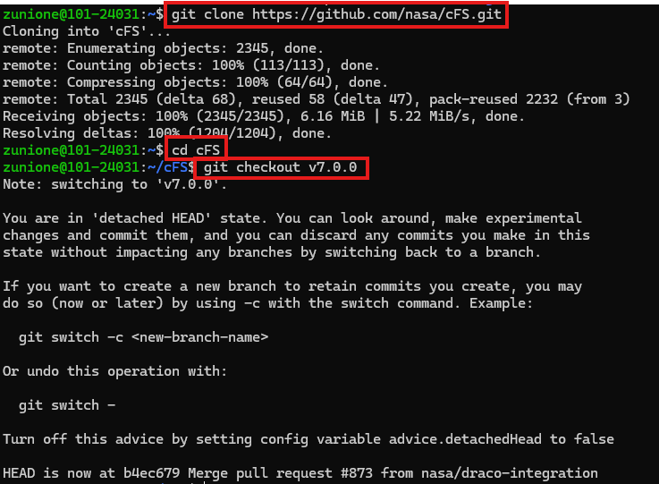
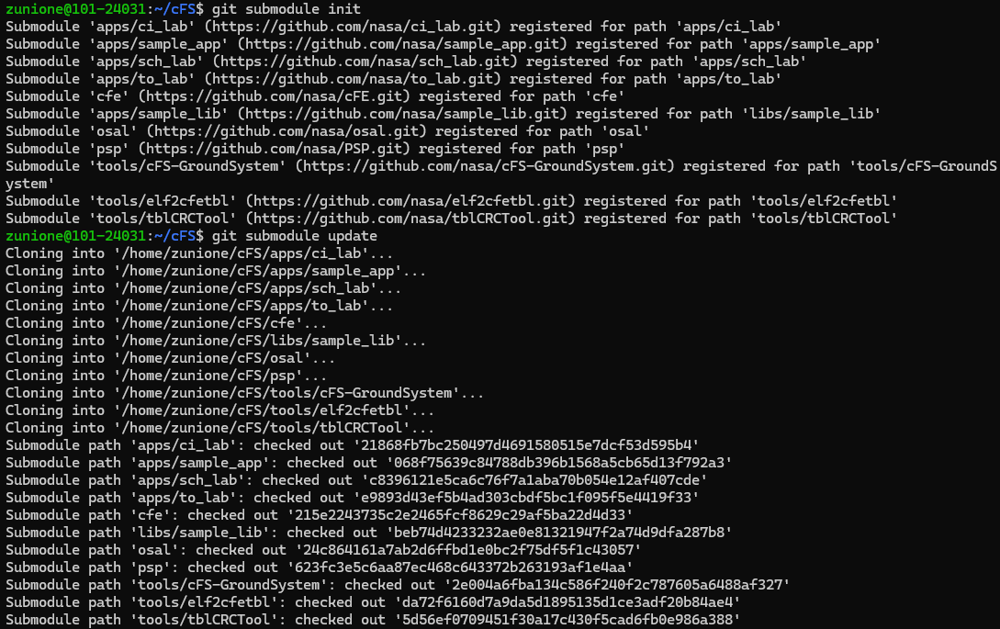
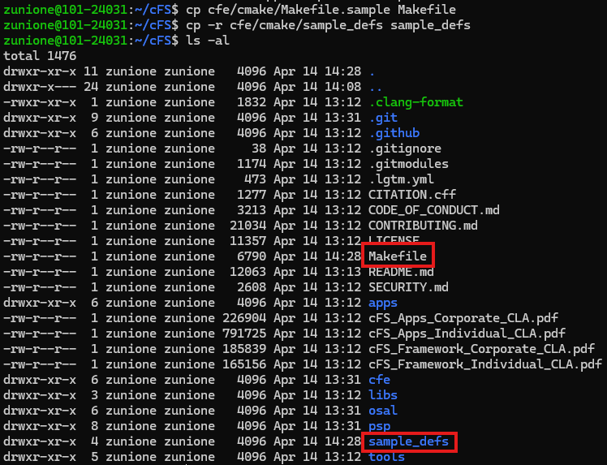
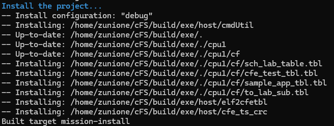
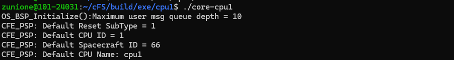
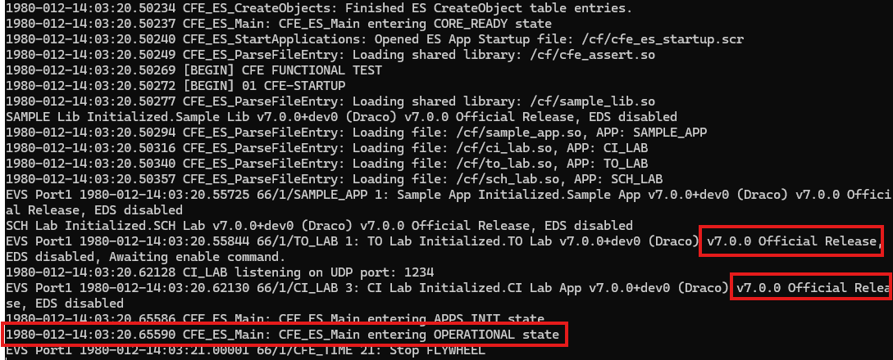
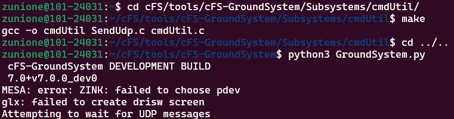
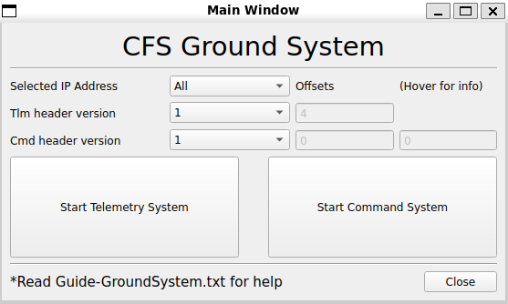
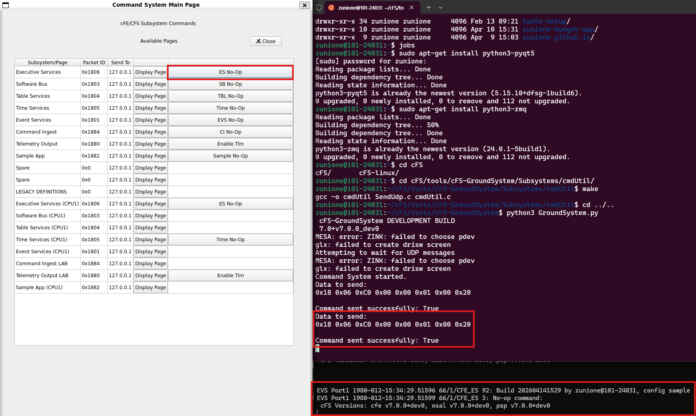
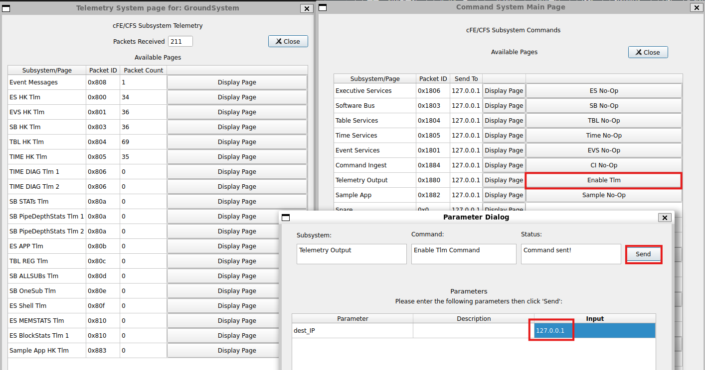

## 🚀 들어가며

> 실습에 앞서 WSL Ubuntu, 그리고 WSL 내에 Make, CMake, GCC, Git이 설치되어 있어야 합니다.

지금까지 CFS-101을 활용하여 cFS를 빌드하고, 실행하고, 앱을 추가하고, 통신하며, 앱을 수정하는 과정을 차근차근 실습했다. 이 정도면 cFS 입문은 가뿐히 넘어 초급자 수준에 도달했다 할 만 하다 생각한다.

다만 아쉬운 건 CFS-101의 cFS 버전이 굉장히 낮은 버전인 `Caelum`이라는 사실이다. 2021년 즈음 release candidate이 공개된지라 다소 outdated된 감이 있다.

그래서 우리는 좀 더 최신 버전으로 한 번 더 실습해볼 텐데, 원래는 Main Branch에서 클론하려 했으나 마침 26년 1월에 cFS Draco 버전이 공개되었다. 가변성이 있는 메인 브랜치보다는 변수가 적은 특정 릴리즈 버전으로 실습하는 게 더 안정성 있을 거라 판단되어 Draco 버전을 클론해 재실습하는 과정을 포스팅하려 한다.📌


## 🐉 Github으로부터 cFS Draco 불러오기

cFS를 불러올 디렉토리에서 다음 명령어를 입력해 Git 레포지토리를 클론하고 Draco 버전 브랜치로 체크아웃한다. Draco 버전은 공식 릴리즈이기 때문에 버전 숫자로 태그가 생성되어 있다.

```bash
git clone https://github.com/nasa/cFS.git
cd cFS
git checkout v7.0.0
```



PSP, OSAL, cFE 등의 여러 모듈들은 Git subdirectory로 포함되어 있다. 단순히 cFS만 클론한다고 불러와지지 않고, 직접 명령어로 초기화 및 업데이트해 주어야 한다.

```bash
git submodule init
git submodule update
```



## 🔩 프로그램 빌드 및 실행

### 컴파일 준비

빌드를 위한 샘플 Makefile과 Definition 설정이 cFE 서브모듈에 위치한다.

해당 파일들을 가장 상위 디렉토리로 복사해온다. `sample_defs`의 경우 컴파일러가 자동으로 `_defs` suffix를 찾기 때문에 나중에 mission-spicific한 이름으로 바꿀 수 있다.

```bash
cp cfe/cmake/Makefile.sample Makefile
cp -r cfe/cmake/sample_defs sample_defs
```

복사 후에는 `ls -al` 명령어로 결과를 확인한다.



### cFE Core 빌드 및 설치

이제 `make`를 사용하여 빌드할 수 있다. `distclean`의 경우 첫 빌드에서는 필요 없지만 이후 빌드에서는 깨끗한 환경으로 빌드하기 위해 꼭 선행해주는 것이 좋다.

cFS 빌드에 관련된 자세한 내용은 `cFE/cmake/README.md`를 참고하면 된다.

```bash
make distclean
    (For a clean build on subsequent runs)
make SIMULATION=native prep
make
make install
```



### cFE Core를 실행해서 확인

빌드가 끝나고 나면 실행파일이 있는 디렉토리로 이동해 `core-cpu1` 파일을 실행한다.

이때 시작 파일들의 위치 및 경로가 중요하기 때문에 반드시 `build/exe/cpu1/`에서 실행해야 한다.

```bash
cd build/exe/cpu1/
./core-cpu1
```


.
.
.


위 사진과 같이 OPERATIONAL State에 들어갔다면 정상적으로 시작된 것이다. 추가로 v7.0.0 Draco 버전이 잘 불러와진 것도 확인할 수 있다.

### `make prep` 옵션들

위에서 사용한 `make SIMULATION=native prep`은 디버그 모드 빌드로, deprecated 요소가 포함된 허용적인(permissive) 설정이다.

실제 배포를 위한 릴리스 빌드가 필요하다면 아래 옵션들을 추가해주면 된다.

| 옵션 | 설명 |
|---|---|
| `BUILDTYPE=release` | 릴리스 모드로 컴파일 |
| `OMIT_DEPRECATED=true` | deprecated 요소 빌드에서 제외 |
| `ENABLE_UNIT_TESTS=true` | 유닛 테스트 포함 |

```bash
# 릴리스 빌드
make BUILDTYPE=release OMIT_DEPRECATED=true prep

# 유닛 테스트 포함 시
make ENABLE_UNIT_TESTS=true prep
```

유닛 테스트를 활성화했다면 아래 명령으로 실행 및 커버리지 확인이 가능하다.

```bash
make test   # 테스트 실행
make lcov   # 커버리지 리포트 생성
```

## 🎭 GroundSystem Tool로 패킷 송수신

> GroundSystem 실행을 위해서는 `PyQt5`와 `PyZMQ`가 설치되어 있어야 합니다. 시스템에 따라 `libcanberra-gtk-module`을 필요로 할 수도 있습니다.
> ```bash
> sudo apt-get install python3-pyqt5
> sudo apt-get install python3-zmq
> sudo apt-get install libcanberra-gtk-module
> ```

cFS의 Tools 디렉토리를 확인해보면 cFS-GroundSystem이라는 지상국 송수신 툴이 있다. 이제 이 툴을 활용해서 실제 cFS 명령 송수신을 실습해볼 수 있다.

새로운 터미널을 열어, `cmdUtil`을 컴파일하고 GroundSystem을 실행한다.

```bash
cd tools/cFS-GroundSystem/Subsystems/cmdUtil
make
cd ../..
python3 GroundSystem.py
```



다음과 같은 작은 창이 나타나게 된다.



### Command System 활용

Start Command System 버튼을 클릭하면 Command System Main Page가 나타나고 각종 커맨드를 전송해 볼 수 있다.



커맨드 전송시에는 위와 같이 GroundSystem 터미널, cFS 터미널에 각각 로그가 찍힌다.

### Telemetry System 활용

Main Window에서 Start Telemetry System 버튼을 클릭하면 Telemetry System page for GroundSystem 창이 뜬다. 아직은 아무 패킷도 수신하고 있지 않으므로 Enable Tlm 명령으로 텔레메트리를 열어 주어야 한다.

**☠️그런데 오류가 발생했다.☠️** 막상 Enable Tlm을 전송해도 Packet Count가 올라가지 않는 것이다. 이 문제의 원인은 다음으로 파악되었다.

**원인 1 — to_lab_sub.tbl이 비어있음**

TO_LAB은 Software Bus에서 구독한 MsgId의 패킷만 골라 UDP로 지상국에 전송한다. 구독 목록은 `to_lab_sub.tbl`로 정의되는데, 소스 파일을 확인해보니 모든 항목이 주석 처리되어 있었다.

```c
// apps/to_lab/fsw/tables/to_lab_sub.c
TO_LAB_Subs_t Subscriptions = {
    .Subs = {
        {CFE_SB_MSGID_WRAP_VALUE(CFE_ES_HK_TLM_MID), {0, 0}, 4},
        {CFE_SB_MSGID_WRAP_VALUE(CFE_EVS_HK_TLM_MID), {0, 0}, 4},
        {CFE_SB_MSGID_WRAP_VALUE(CFE_SB_HK_TLM_MID), {0, 0}, 4},
        {CFE_SB_MSGID_WRAP_VALUE(CFE_TBL_HK_TLM_MID), {0, 0}, 4},
        {CFE_SB_MSGID_WRAP_VALUE(CFE_TIME_HK_TLM_MID), {0, 0}, 4},
        {CFE_SB_MSGID_WRAP_VALUE(CFE_TIME_DIAG_TLM_MID), {0, 0}, 4},
        {CFE_SB_MSGID_WRAP_VALUE(CFE_SB_STATS_TLM_MID), {0, 0}, 4},
        {CFE_SB_MSGID_WRAP_VALUE(CFE_TBL_REG_TLM_MID), {0, 0}, 4},
        {CFE_SB_MSGID_WRAP_VALUE(CFE_EVS_LONG_EVENT_MSG_MID), {0, 0}, 32},
        {CFE_SB_MSGID_WRAP_VALUE(CFE_EVS_SHORT_EVENT_MSG_MID), {0, 0}, 32},
        {CFE_SB_MSGID_WRAP_VALUE(CFE_ES_APP_TLM_MID), {0, 0}, 4},
        {CFE_SB_MSGID_WRAP_VALUE(CFE_ES_MEMSTATS_TLM_MID), {0, 0}, 4},
        {CFE_SB_MSGID_RESERVED, {0, 0}, 0}
    }
};
```

**원인 2 — sch_lab_table.tbl도 비어있음**

Enable Tlm 이후 Event Messages만 한 개씩 올라올 뿐 나머지 HK 텔레메트리는 수신되지 않았다. SCH_LAB은 각 앱에 주기적으로 SEND_HK 요청을 보내는 스케줄러 역할을 하는데, 이 테이블도 마찬가지로 비어있었다.

```c
// apps/sch_lab/fsw/tables/sch_lab_table.c
SCH_LAB_ScheduleTable_t Schedule = {
    .TickRate = 100,
    .Config   = {
        {CFE_SB_MSGID_WRAP_VALUE(CFE_ES_SEND_HK_MID), 100, 0},
        {CFE_SB_MSGID_WRAP_VALUE(CFE_TBL_SEND_HK_MID), 50, 0},
        {CFE_SB_MSGID_WRAP_VALUE(CFE_TIME_SEND_HK_MID), 98, 0},
        {CFE_SB_MSGID_WRAP_VALUE(CFE_SB_SEND_HK_MID), 97, 0},
        {CFE_SB_MSGID_WRAP_VALUE(CFE_EVS_SEND_HK_MID), 96, 0},
        {CFE_SB_MSGID_RESERVED, 0, 0},
    }
};
```

`TickRate = 100`은 100ms마다 틱이 발생함을 의미하고, 두 번째 숫자는 몇 틱마다 HK 요청을 전송할지를 나타낸다. 즉 `CFE_ES_SEND_HK_MID`는 100틱(10초)마다, `CFE_EVS_SEND_HK_MID`는 96틱마다 요청이 전송된다.

두 파일 모두 수정 후 재빌드한다.

```bash
cd ~/cFS
make && make install
```

재빌드 후 `core-cpu1`을 재시작하고 Enable Tlm을 전송하면 Telemetry System 창에서 Packet Count가 주기적으로 올라가는 것을 확인할 수 있다.



Packet Count가 올라가기 시작했다면 텔레메트리 수신에 성공한 것이다. 각 항목의 Display Page 버튼을 클릭하면 해당 서브시스템의 상세 텔레메트리 데이터를 확인할 수 있다.

## ✨ 마치며

예상치 못하게 버그가 있어서 당황했다 ㅎㅎ;; cFS 팀에서 README 업데이트를 해야 하지 않았나 싶다. 이슈를 생성해야 할지.. 의도가 있는 업데이트인지..

그래도 cFS Draco가 작년부터 나온다 나온다 했었으나 계속 미뤄지고 있었는데, 드디어 최신 공식 릴리즈가 배포되어서 굉장히 의미 있는 업데이트가 아닐 수 없다. 명심해야 할 것은 서브모듈을 불러오기 전에 반드시 원하는 브랜치 또는 태그로 체크아웃해야 한다는 것! 🎋