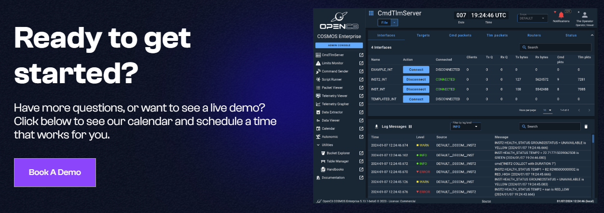
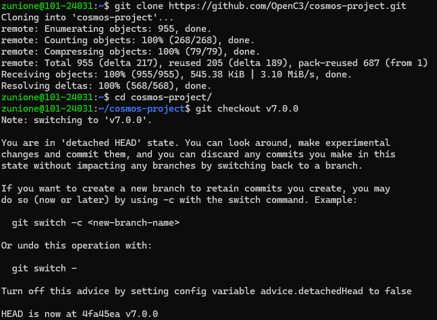
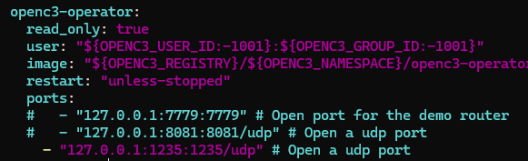
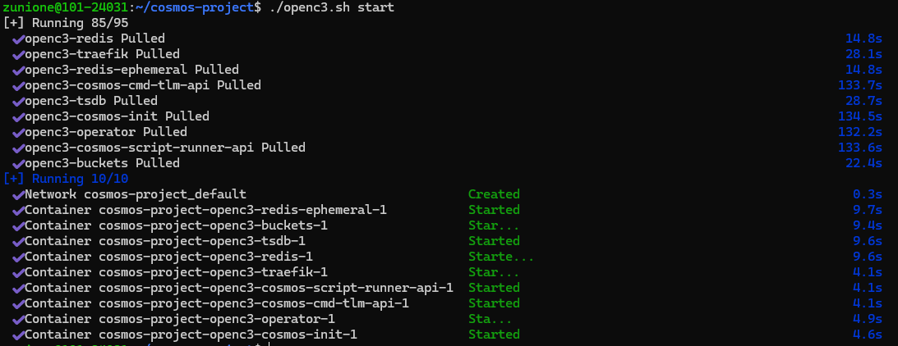
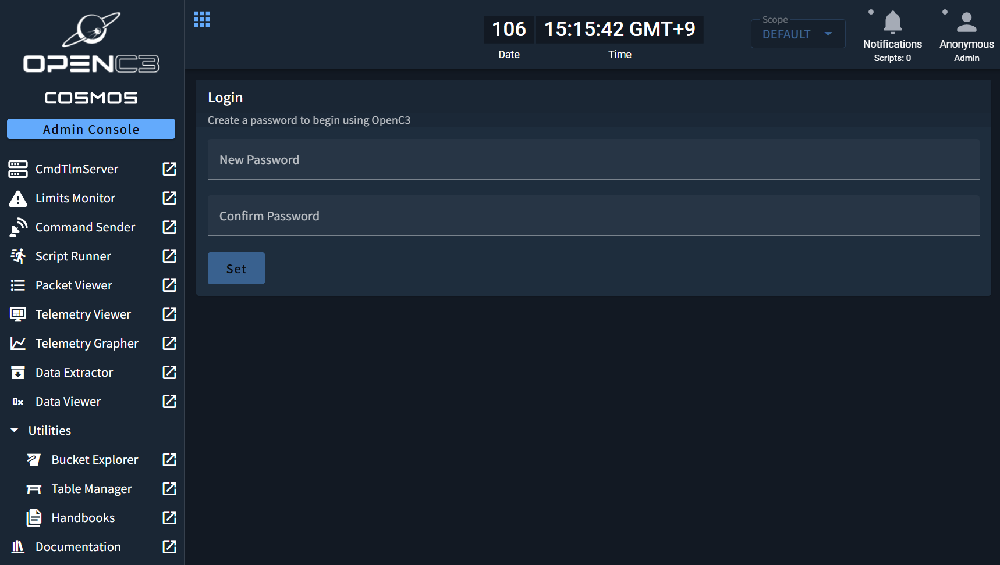
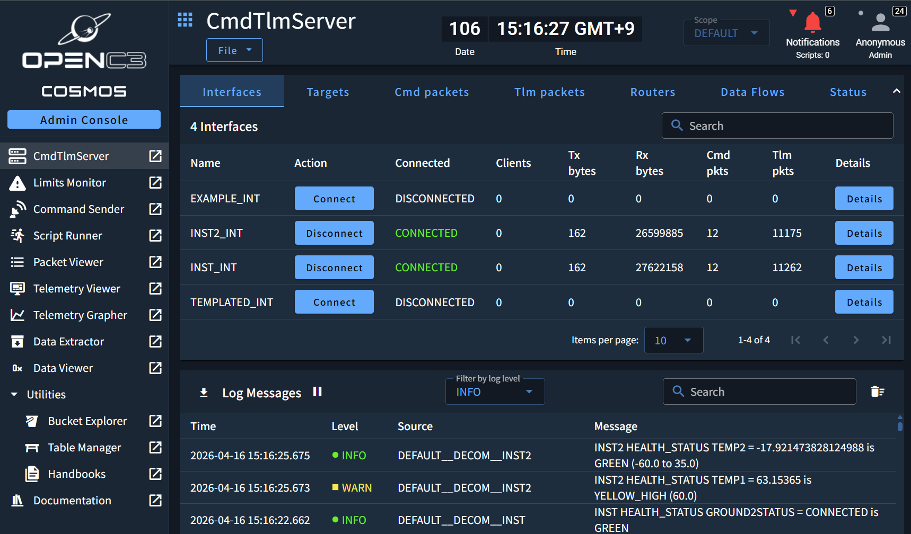

## 🚀 들어가며



cFS와 지상국이 통신할 수 있도록 하는 시스템이 cFS-GroundSystem 외에도 더 있는데, 가장 대표적인 것이 OpenC3의 COSMOS 소프트웨어이다. 

COSMOS 공식 문서에서 cFS Integration 가이드를 제공하는데다, 최신 브랜치를 보니 COSMOS를 공식 cFS Tool로 포함하려는 움직임이 보이고 있어 함께 다뤄보려 한다.

**참고자료**

- [COSMOS Getting Started ― Installation (클릭)](https://docs.openc3.com/docs/getting-started/installation)
- [COSMOS Guides ― COSMOS and NASA cFS (클릭)](https://docs.openc3.com/docs/guides/cfs)
- [Github ― nasa/cfs-cosmos-plugin (클릭)](https://github.com/nasa/cfs-cosmos-plugin)

## 🪐 COSMOS 설치

COSMOS 실습 또한 이전 cFS와 마찬가지로 WSL 환경에서 진행할 텐데, 먼저 Docker 및 Docker Compose가 미리 설치되어 있어야 한다. 도커 설치 관련해서는 다음 링크를 참고하면 된다.

리눅스의 경우 Docker Desktop은 설치하지 말라고 명시되어 있으니 주의해야 한다.

- [Install Docker Engine on Ubuntu](https://docs.docker.com/engine/install/ubuntu/)
- [Overview of installing Docker Compose](https://docs.docker.com/compose/install/)

### Github에서 클론해오기

원하는 위치에 COSMOS Repo를 클론하고 체크아웃한다. 이 포스트에서는 최신 안정 릴리즈인 v7.0.0으로 진행할 예정이다.

```bash
git clone https://github.com/OpenC3/cosmos-project.git
cd cosmos-project
git checkout v7.0.0 # <- change to the specific version you want
```



### 실행하고 로컬 브라우저에서 확인

COSMOS를 도커 위에서 실행하려면 `openc3.sh` shell script를 `run` 옵션과 함께 돌려주면 된다. 그런데 우리는 cFS와 결합해서 사용할 것이기 때문에, 약간 더 설정이 필요하다.

cFS 텔레메트리 구독을 위해 UDP 포트를 열어준다. `compose.yaml` 파일의 `openc3-operator` 필드에 포트 바인딩을 추가하면 된다.

```bash
openc3-operator:
  ports:
    - "127.0.0.1:1235:1235/udp"
```



그리고 변경된 사항을 포함해 컨테이너를 빌드하고 COSMOS를 실행한다.

```bash
./openc3.sh start
```



이후 [http://localhost:2900/](http://localhost:2900/)로 접속하면 다음과 같이 브라우저 내에서 대시보드 콘솔을 확인할 수 있다. 여기서 비밀번호를 설정해주면 된다.





그러면 이제 실제 패킷이 오고가는 걸 대시보드에서 확인할 수 있다. 🪄

도커 컨테이너 및 COSMOS 프로그램을 종료하고 싶다면 같은 셸 스크립트에 `stop` 인자를 주어 실행한다. `stop` 명령어는 컨테이너와 내부 데이터를 삭제하지 않으며, 언제나 다시 `run`으로 재개할 수 있다.

```bash
./openc3.sh stop
```

## ⛵ cFS를 Docker Container로서 실행하기

이전 포스트를 실습했다면 클론해놓은 cFS 디렉토리에서 그대로 진행하면 되고, 실습하지 않았다면 상위 디렉토리로 가서 cFS를 불러온다.

```bash
git clone --recurse-submodules https://github.com/nasa/cFS.git
```

이제 cFS 내부에 Dockerfile을 추가해 빌드 시 도커 컨테이너가 생성되게 한다.

```bash
cd cFS
vi Dockerfile
```

내용은 다음과 같다.

```Dockerfile
FROM ubuntu:25.04 AS builder

ARG DEBIAN_FRONTEND=noninteractive
ARG SIMULATION=native
ENV SIMULATION=${SIMULATION}
ARG BUILDTYPE=debug
ENV BUILDTYPE=${BUILDTYPE}
ARG OMIT_DEPRECATED=true
ENV OMIT_DEPRECATED=${OMIT_DEPRECATED}

RUN \
  apt-get update && \
  apt-get -y upgrade && \
  apt-get install -y build-essential git cmake && \
  rm -rf /var/lib/apt/lists/*

WORKDIR /cFS
COPY . .

RUN git submodule init \
  && git submodule update \
  && cp cfe/cmake/Makefile.sample Makefile \
  && cp -r cfe/cmake/sample_defs .

RUN make prep
RUN make
RUN make install

FROM ubuntu:25.04
COPY --from=builder /cFS/build /cFS/build
WORKDIR /cFS/build/exe/cpu1
ENTRYPOINT [ "./core-cpu1" ]
```

이제 도커 명령어를 실행해 cFS를 시작한다.

⚠️주의⚠️: 이전에 남아 있던 cFS를 사용한다면, `build` 디렉토리를 꼭 삭제해 주어야 한다.

```bash
# rm -rf build
docker build -t cfs .
docker run --cap-add CAP_SYS_RESOURCE --net=cosmos-project_default --name cfs -p1234:1234/udp -p1235:1235 cfs
```

## ✨ 마치며


