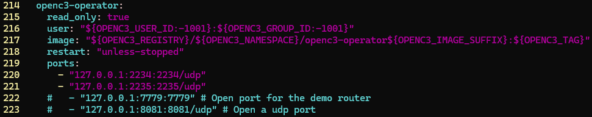
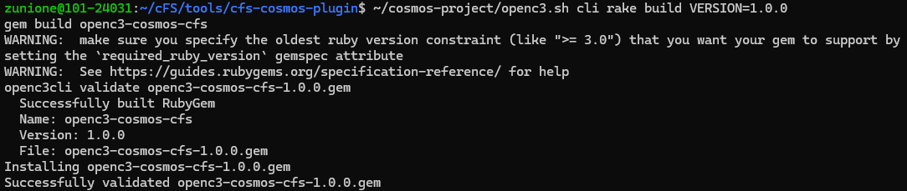
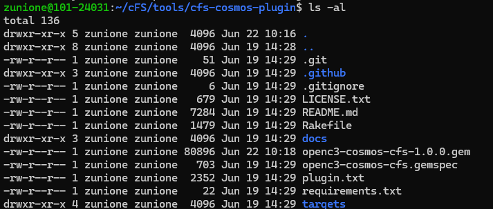
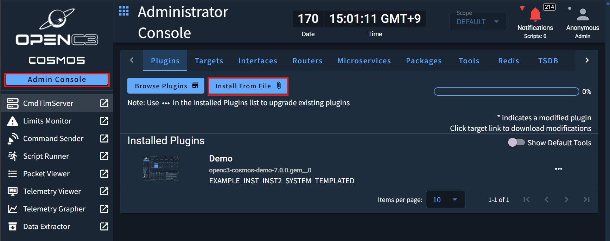
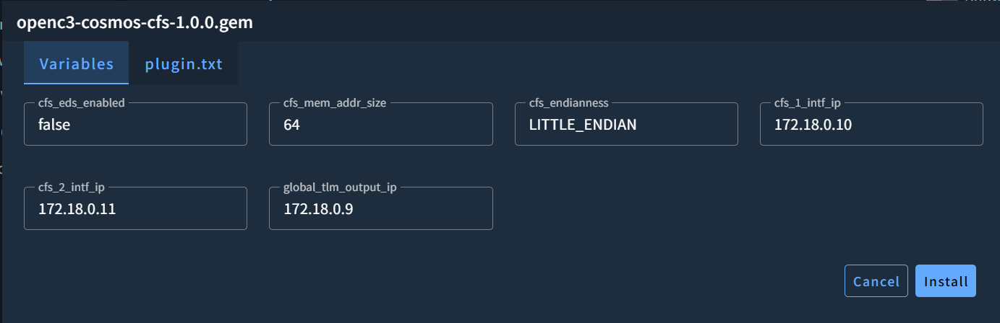
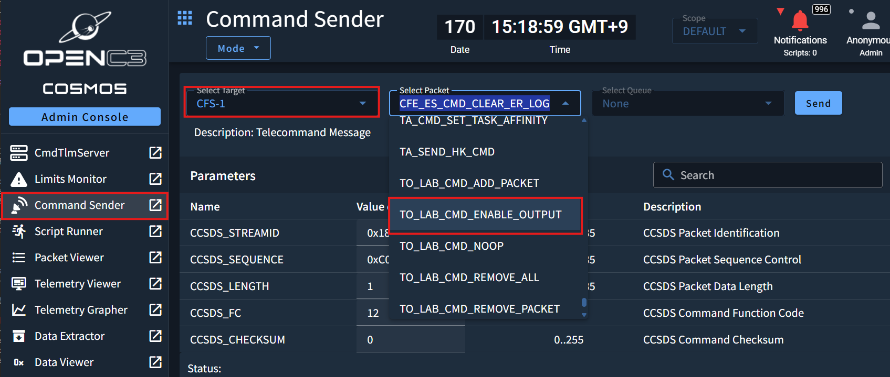
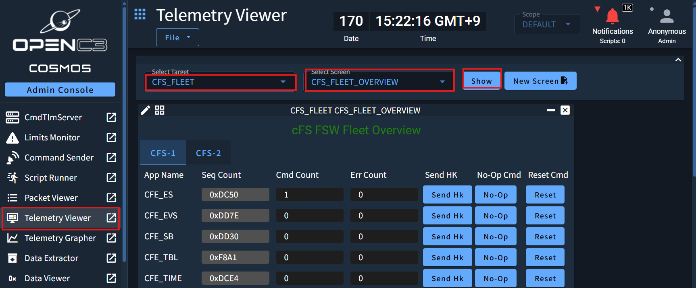

## 🚀 들어가며


cFS와 지상국이 통신할 수 있도록 하는 시스템이 cFS-GroundSystem 외에도 더 있는데, 가장 대표적인 것이 OpenC3의 COSMOS 소프트웨어이다. 

COSMOS 공식 문서에서 cFS Integration 가이드를 제공하는데다, 최신 브랜치를 보니 COSMOS를 공식 cFS Tool로 포함하려는 움직임이 보이고 있어 함께 다뤄보려 한다.

**참고자료**

- [COSMOS Getting Started ― Installation (클릭)](https://docs.openc3.com/docs/getting-started/installation)
- [COSMOS Guides ― COSMOS and NASA cFS (클릭)](https://docs.openc3.com/docs/guides/cfs)
- [Github ― nasa/cfs-cosmos-plugin (클릭)](https://github.com/nasa/cfs-cosmos-plugin)

## 🪐 COSMOS 설치

COSMOS 실습 또한 이전 cFS와 마찬가지로 WSL 환경에서 진행할 텐데, 먼저 Docker 및 Docker Compose가 미리 설치되어 있어야 한다. 도커 설치 관련해서는 다음 링크를 참고하면 된다.

리눅스의 경우 Docker Desktop은 설치하지 말라고 명시되어 있으니 주의해야 한다.

- [Install Docker Engine on Ubuntu](https://docs.docker.com/engine/install/ubuntu/)
- [Overview of installing Docker Compose](https://docs.docker.com/compose/install/)

### Github에서 클론해오기

원하는 위치에 COSMOS Repo를 클론한다. 이때 안정성을 위해서 특정 태그로 체크아웃해 진행하는 것을 권장한다.

```bash
git clone https://github.com/OpenC3/cosmos-project.git
cd cosmos-project
git checkout v7.0.0
```


### compose.yaml 포트 설정

COSMOS를 도커 위에서 실행하려면 `openc3.sh` shell script를 `start` 옵션과 함께 돌려주면 된다. 그런데 우리는 cFS와 결합해서 사용할 것이기 때문에, 약간 더 설정이 필요하다.

cFS 텔레메트리 구독을 위해 UDP 포트를 열어준다. `compose.yaml` 파일의 `openc3-operator` 필드에 포트 바인딩을 추가하면 된다.

```bash
cd cosmos-project
vi compose.yaml
```

특별히 NASA 공식 플러그인은 cFS를 **두 개의 인스턴스(CFS-1, CFS-2)** 로 운용하는 것을 전제로 한다. 각 인스턴스의 포트 구성은 다음과 같다. 우리는 TM 포트 두 개를 추가한다.
 
| 인스턴스 | TC 포트 (명령 수신) | TM 포트 (텔레메트리 송신) |
|----------|---------------------|--------------------------|
| CFS-1    | 1234/udp            | **2234**/udp             |
| CFS-2    | 1235/udp            | **2235**/udp             |

```yaml
openc3-operator:
  ports:
    - "127.0.0.1:2234:2234/udp"
    - "127.0.0.1:2235:2235/udp"
```



## 🎆 COSMOS 실행

변경된 사항을 포함해 컨테이너를 빌드하고 COSMOS를 실행한다.

```bash
./openc3.sh start
```


이후 [http://localhost:2900/](http://localhost:2900/)로 접속하면 다음과 같이 브라우저 내에서 대시보드 콘솔을 확인할 수 있다. 여기서 비밀번호를 설정해주면 된다.


그러면 이제 실제 패킷이 오고가는 걸 대시보드에서 확인할 수 있다. 🪄

도커 컨테이너 및 COSMOS 프로그램을 종료하고 싶다면 같은 셸 스크립트에 `stop` 인자를 주어 실행한다. `stop` 명령어는 컨테이너와 내부 데이터를 삭제하지 않으며, 언제나 다시 `start`으로 재개할 수 있다.

```bash
./openc3.sh stop   # stop
./openc3.sh start  # resume
```

## ⛵ cFS를 Docker Container로서 실행하기

이전 포스트를 실습했다면 클론해놓은 cFS 디렉토리에서 그대로 진행하면 되고, 실습하지 않았다면 상위 디렉토리로 가서 cFS를 불러온다.

`cfs-cosmos-plugin`은 cFS v7.0.1부터 포함되어 있기 때문에 해당 브랜치로 체크아웃하고 진행한다.

⚠️주의⚠️: 이전에 남아 있던 cFS를 사용한다면, `build` 디렉토리를 꼭 삭제해 주어야 한다.

```bash
cd ${cosmos-dir}/..
git clone https://github.com/nasa/cFS.git
cd cFS
git checkout v7.0.1
rm -rf build # Just to be sure
```

이제 cFS 내부에 Dockerfile을 추가해 빌드 시 도커 컨테이너가 생성되게 한다.

```bash
vi Dockerfile
```

내용은 다음과 같다.

```Dockerfile
FROM ubuntu:25.04 AS builder

ARG DEBIAN_FRONTEND=noninteractive
ARG SIMULATION=native
ENV SIMULATION=${SIMULATION}
ARG BUILDTYPE=debug
ENV BUILDTYPE=${BUILDTYPE}
ARG OMIT_DEPRECATED=true
ENV OMIT_DEPRECATED=${OMIT_DEPRECATED}

RUN \
  apt-get update && \
  apt-get -y upgrade && \
  apt-get install -y build-essential git cmake && \
  rm -rf /var/lib/apt/lists/*

WORKDIR /cFS
COPY . .

RUN git submodule init \
  && git submodule update

RUN make native_std.prep
RUN native_std.install

FROM ubuntu:25.04
COPY --from=builder /cFS/build-native_std /cFS/build-native_std
WORKDIR /cFS/build-native_std/exe/cpu1
ENTRYPOINT [ "./core-cpu1" ]
```

이제 도커 명령어를 실행해 cFS를 시작한다. 명령 수신 포트 1234, 1235를 바인딩해 주어야 한다.

```bash
docker build -t cfs .

docker run -d \
  --cap-add CAP_SYS_RESOURCE \
  --net=cosmos-project_default \
  --name cfs-1 \
  -p 1234:1234/udp \
  cfs

docker run -d \
  --cap-add CAP_SYS_RESOURCE \
  --net=cosmos-project_default \
  --name cfs-2 \
  -p 1235:1235/udp \
  cfs
```


## 🔌 NASA cFS COSMOS 플러그인

### 호스트에 cFS 빌드 트리 준비

`cfs-cosmos-plugin`의 `make gem`은 호스트 파일시스템에서 cFS의 cmake 빌드 디렉토리를 찾는다. 

앞서 Dockerfile로 빌드한 결과물은 도커 이미지 내부에만 존재하고 우리의 로컬 파일 시스템에는 반영되지 않으므로, 별도로 한 번 더 빌드를 거쳐야 한다.

```bash
cd ~/cFS
git checkout v7.0.1 # Just to be sure
git submodule init
git submodule update
make native_std.prep
make native_std.install 
```
 
### 플러그인 빌드
 
파일 트리 생성이 완료되었다면 NASA cFS 팀이 공식 배포하는 플러그인 디렉토리에서 빌드한다. 

`openc3.sh` 셸 스크립트는 PATH에 등록해도 되고, 아래 명령어처럼 경로를 명시적으로 알려주어도 된다. 빌드 버전은 자유롭게 지정할 수 있다.
 
```bash
cd cFS/tools/cfs-cosmos-plugin
~/cosmos-project/openc3.sh cli rake build VERSION=1.0.0
```


빌드 완료 시 `openc3-cosmos-cfs-1.0.0.gem` 파일이 생성된다.



이 파일을 꼭 로컬로 다운받아 주어야 한다.

```bash
cp openc3-cosmos-cfs-1.0.0.gem /mnt/c/${your_dir}
```
 
### 컨테이너 IP 확인
 
플러그인 설치 시 각 컨테이너의 IP 주소를 입력해야 한다. 아래 명령어로 확인한다.
 
```bash
docker network inspect cosmos-project_default
```
 
출력 결과의 `Containers` 섹션에서 각 컨테이너의 `IPv4Address`를 메모한다. 예시는 다음과 같다.
 
```text
"cfs-1":              "172.18.0.10/16"
"cfs-2":              "172.18.0.11/16"
"cosmos-project-openc3-operator-1":    "172.18.0.9/16"
```
 
### 플러그인 설치

이제 아까 다운받은 플러그인을 COSMOS에 설치할 차례이다.
 
브라우저에서 [http://localhost:2900/tools/admin](http://localhost:2900/tools/admin) 으로 접속한다.




Administrator Console의 Plugins 탭에서 'Install Rrom File' 버튼을 클릭하고 다운받아 놓았던 `.gem` 파일을 선택한 뒤, 아래 파라미터를 상황에 맞게 입력하고 Install 버튼을 누른다.
 
| 파라미터 | 기본값 | 설명 |
|----------|--------|------|
| `cfs_mem_addr_size` | 64 | 32비트 시스템이면 `32`로 변경 |
| `cfs_endianness` | `LITTLE_ENDIAN` | 빅엔디언 시스템이면 변경 |
| `cfs_1_intf_ip` | 172.18.0.10 | 위에서 확인한 **cfs-1** 컨테이너 IP |
| `cfs_2_intf_ip` | 172.18.0.11 | 위에서 확인한 **cfs-2** 컨테이너 IP |
| `global_tlm_output_ip` | 172.18.0.9 | 위에서 확인한 **openc3-operator** 컨테이너 IP |


---
 
## 📡 텔레메트리 활성화 및 확인
 
### 텔레메트리 활성화
 
플러그인을 설치해도 cFS는 곧바로 텔레메트리를 전송하지 않는다. TO_LAB 앱에 활성화 커맨드를 보내야 전송이 시작된다.
 
**Command Sender**([http://localhost:2900/tools/cmdsender](http://localhost:2900/tools/cmdsender))를 열고, Target을 `CFS-1` 또는 `CFS-2`로 선택한 뒤 `TO_LAB_CMD_ENABLE_OUTPUT` 커맨드를 전송한다.


 
커맨드를 수신한 cFS 인스턴스는 `global_tlm_output_ip`로 지정된 COSMOS operator 컨테이너를 향해 텔레메트리 전송을 시작한다.
 
### 텔레메트리 확인
 
**Telemetry Viewer**를 열고, Target `CFS_FLEET`, Screen `CFS_FLEET_OVERVIEW`를 선택하면 CFS-1과 CFS-2의 Housekeeping 텔레메트리를 한 화면에서 함께 확인할 수 있다.


 
각 앱 우측의 버튼으로 간단한 커맨드 전송도 가능하다.
 
| 버튼 | 동작 |
|------|------|
| Send Hk | 새 Housekeeping 패킷 요청 |
| No-Op | NOOP 커맨드 전송 (Command Count 증가 확인용) |
| Reset | 카운터 초기화 |
 
---
 
## ✨ 마치며
 
NASA cFS 팀이 직접 제공하는 공식 COSMOS 플러그인을 활용하면, 플러그인을 처음부터 직접 작성하는 것보다 훨씬 완성도 높은 TM/TC 인터페이스를 빠르게 구성할 수 있다. 특히 두 인스턴스를 동시에 운용하는 **CFS_FLEET** 구성은 실제 위성 운용 시나리오를 실습하기에도 좋은 구성이다.

실습이 끝났다면 반드시 다음 명령어로 도커 컨테이너를 중단할 것을 권장한다.

```bash
docker stop cfs-1
docker stop cfs-2
./openc3.sh stop
```

컨테이너 내에서 끊임없이 패킷을 수신하기 때문에 가상 디스크의 크기가 몇백 GB에 육박하게 늘어날 수 있다.

이 경우 컨테이너를 모두 내리고 디스크를 정리하고 압축해야 하는데, 그 과정이 번거롭기 때문에 미리 방지하는 것을 추천한다.