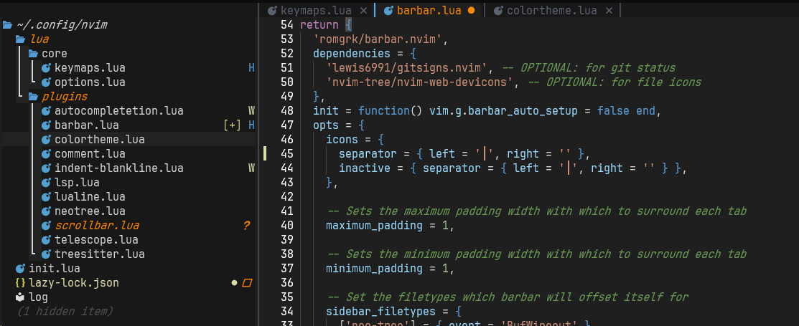

## 🚀 들어가며

이제 실제 NeoVim 화면을 그럴듯하게 꾸며볼 예정인데, 개인적으로 이 부분이 가장 재미있었다 ^_^

나는 VSCode에 익숙해서 VSCode 테마를 적용했지만 유저들이 만든 다른 테마들도 굉장히 많다. (사실 다른 테마 이것저것 적용해 봤는데, 다 눈이 너무 피곤했다.. VSCode가 확실히 컬러감을 잘 뽑은 듯.)


[dotfyle(클릭)](https://dotfyle.com/neovim/colorscheme/top)에 접속하면 여러 테마를 살펴볼 수 있다. 

## 폰트 설정

테마를 설정하기 전, 아이콘 지원을 위해 [Nerd Font Famliy](https://www.nerdfonts.com/)를 설치한다.



### 폰트 다운로드

Downloads 버튼을 클릭해 다운로드 페이지로 접속한다. 여러 폰트들이 있는데, 나는 `JetBrainsMono Nerd Font`를 선택했다. 

다운로드받고 압축을 풀면 여러 크기의 폰트 파일들이 있다. Light 폰트가 적용했을 때 가장 부담스럽지 않기 때문에 이 폰트만 설치하는 것을 권장한다.


세모주의세모: 뒤에 `Mono` 나 `Propo`가 붙어 있는 파일이 아닌 `JetBrainsMonoNerdFont`라고만 되어 있는 파일을 설치할 것! 다른 파일들은 아이콘이 작게 출력되는 문제가 생긴다.

### 터미널에 폰트 적용


윈도우 기준으로 설명하면, cmd 창을 켜고 상단 바에서 우클릭해 설정에 들어간다.


왼쪽 사이드바에서 '기본값'을 선택하고 '모양' 탭에 들어가 클꼴을 JetBrainsMono Nerd Font로 설정해주고, 크기와 높이를 선호에 맞게 조절한다.

우측 하단 '저장'을 누르고 다시 터미널로 돌아가면 변경사항이 적용된다!축하축하

## `vscode.nvim` 테마 플러그인 설치

이제 본격적으로 테마를 설정할 차례이다 ><

[vscode.nvim(클릭)](https://github.com/Mofiqul/vscode.nvim?tab=readme-ov-file)은 lazy 방식의 플러그인 설치에 대한 매뉴얼을 제공하고 있지 않다. 다음과 같이 작성하면 된다.

```lua
--[[ lua/plugins/colorscheme.lua ]]

return {
  'Mofiqul/vscode.nvim',
  lazy = false,
  priority = 1000,
  config = function()
    local c = require('vscode.colors').get_colors()
    require('vscode').setup({
      -- Alternatively set style in setup
      -- style = 'light'

      -- Enable transparent background
      transparent = false,

      -- Enable italic comment
      italic_comments = true,

      -- Enable italic inlay type hints
      italic_inlayhints = true,

      -- Underline `@markup.link.*` variants
      underline_links = true,

      -- Disable nvim-tree background color
      disable_nvimtree_bg = true,

      -- Apply theme colors to terminal
      terminal_colors = true,

      -- Override colors (see ./lua/vscode/colors.lua)
      color_overrides = {
        vscLineNumber = '#FFFFFF',
      },

      -- Override highlight groups (see ./lua/vscode/theme.lua)
      group_overrides = {
        -- this supports the same val table as vim.api.nvim_set_hl
        -- use colors from this colorscheme by requiring vscode.colors!
        Cursor = { fg=c.vscDarkBlue, bg=c.vscLightGreen, bold=true },
      }
    })
    vim.cmd.colorscheme('vscode')
  end
}
```

- lazy = false
- priority = 1000

이 부분들은 테마가 지연 로딩되지 않도록 한다. 테마가 항상 가장 먼저 적용되어 우리 눈에 보이도록 하는 설정이다.


플러그인을 추가하고 NeoVim을 재시작하면 사진처럼 VSCode와 동일한 컬러가 나타난다. 

중괄호 색이 다 똑같이 파란색이라는 게 아쉽지만..ㅠ 추후에 플러그인으로 해결할 예정이다.

참고로 `if-end` 사이에 나타나는 얇은 선도 플러그인이다. 나중에 설치하면 된다.

## Bufferline 플러그인 설치

Bufferline이 보이게 하는 플러그인으로는 크게 `bufferline.nvim`과 `barbar.nvim`이 있다. `bufferline.nvim`이 좀 더 보편적으로 사용되고 커스터마이징이 자유로운데, `barbar.nvim`은 단축어로 편리하게 버퍼 간 이동을 할 수 있다는 장점이 있어 `barbar.nvim`을 선택했다.

[`barbar.nvim` Github](https://github.com/romgrk/barbar.nvim)의 README에 Lazy를 사용해 플러그인을 설치하는 방법이 다음과 같이 나와 있다.

```lua
require('lazy').setup {
  {'romgrk/barbar.nvim',
    dependencies = {
      'lewis6991/gitsigns.nvim', -- OPTIONAL: for git status
      'nvim-tree/nvim-web-devicons', -- OPTIONAL: for file icons
    },
    init = function() vim.g.barbar_auto_setup = false end,
    opts = {
      -- lazy.nvim will automatically call setup for you. put your options here, anything missing will use the default:
      -- animation = true,
      -- insert_at_start = true,
      -- …etc.
    },
    version = '^1.0.0', -- optional: only update when a new 1.x version is released
  },
}
```

### 개인 설정 전체

나의 barbar 플러그인 전체 설정은 다음과 같다.

```lua
return {
  'romgrk/barbar.nvim',
  dependencies = {
    'lewis6991/gitsigns.nvim', -- OPTIONAL: for git status
    'nvim-tree/nvim-web-devicons', -- OPTIONAL: for file icons
  },
  init = function() vim.g.barbar_auto_setup = false end,
  opts = {
    icons = {
      separator = { left = '│', right = '' },
      inactive = { separator = { left = '│', right = '' } },
    },

    -- Sets the maximum padding width with which to surround each tab
    maximum_padding = 1,

    -- Sets the minimum padding width with which to surround each tab
    minimum_padding = 1,

    -- Set the filetypes which barbar will offset itself for
    sidebar_filetypes = {
      ['neo-tree'] = { event = 'BufWipeout' },
    },
  },

  config = function(_, opts)
    -- 1. 먼저 setup 실행
    require('barbar').setup(opts)

    -- 2. 색상 덮어쓰기
    -- 색상 설정
    local colors = {
      bg = '#1f1f1f',
      fg = '#ffffff',
      blue = '#51afef',
      orange = '#FF8800',
      gray = '#5c6370',
    }

    -- 현재 버퍼 (활성)
    vim.api.nvim_set_hl(0, 'BufferCurrent', { fg = colors.fg, bg = colors.bg, bold = true })
    vim.api.nvim_set_hl(0, 'BufferCurrentMod', { fg = colors.orange, bg = colors.bg })

    -- 비활성 버퍼
    vim.api.nvim_set_hl(0, 'BufferInactive', { fg = colors.gray, bg = '#181818' })
    vim.api.nvim_set_hl(0, 'BufferInactiveMod', { fg = colors.orange, bg = '#181818' })

    -- 탭라인 배경
    vim.api.nvim_set_hl(0, 'BufferTabpageFill', { bg = '#181818' })

    -- 구분선
    vim.api.nvim_set_hl(0, 'BufferCurrentSign', { fg = colors.blue, bg = colors.bg })
    vim.api.nvim_set_hl(0, 'BufferInactiveSign', { fg = '#3e4452', bg = '#181818' })
  end,

  version = '^1.9.0', -- optional: only update when a new 1.x version is released
}
```

### 구분선(Separator) 설정

버퍼 간의 구분선 문자를 중간에 위치한 얇은 세로선으로 변경한다.

기본 구분선은 왼쪽 정렬된 세로선인데, 파일 트리와 위치가 어긋나 수동으로 설정해 주었다.

```lua
icons = {
  separator = { left = '│', right = '' },
  inactive = { separator = { left = '│', right = '' } },
}
```

버퍼가 선택되어 있을 때와 선택되지 않았을 때를 따로 설정해야 한다.

### 패딩(Padding) 설정

공간이 충분할 경우 버퍼 크기가 꽤 커지는데, 여백이 너무 많으니 보기 좋지 않아서 각 버퍼 탭 양옆의 여백을 1로 고정했다.

```lua
maximum_padding = 1,
minimum_padding = 1,
```

### 사이드바 오프셋 설정

파일 탐색기 같은 사이드바가 열릴 때 버퍼라인을 자동으로 이동시킨다.

```lua
sidebar_filetypes = {
  ['neo-tree'] = { event = 'BufWipeout' },
}
```

`nvim-tree` 등 다른 파일 트리 플러그인에 대한 오프셋 설정도 플러그인 리드미에서 확인할 수 있다. 예시는 다음과 같다.

```lua
sidebar_filetypes = {
  NvimTree = true,
  undotree = { text = 'undotree' },
  Outline = { event = 'BufWinLeave', text = 'symbols-outline' },
}
```

### 색상 커스터마이징

`config` 함수에서 highlight 그룹을 직접 설정하여 원하는 색상 테마를 적용할 수 있다.

```lua
local colors = {
  bg = '#1f1f1f',      -- 활성 버퍼 배경
  fg = '#ffffff',      -- 활성 버퍼 텍스트
  blue = '#51afef',    -- 구분선 강조색
  orange = '#FF8800',  -- 수정 상태 표시
  gray = '#5c6370',    -- 비활성 텍스트
}
```

VSCode 테마가 barbar 플러그인에 최적화되어 있지 않은 것 같아서 `#1f1f1f` 등의 색상을 임의 적용했다.

```lua
-- 활성 버퍼
vim.api.nvim_set_hl(0, 'BufferCurrent', { fg = colors.fg, bg = colors.bg, bold = true })
vim.api.nvim_set_hl(0, 'BufferCurrentMod', { fg = colors.orange, bg = colors.bg })
vim.api.nvim_set_hl(0, 'BufferCurrentSign', { fg = colors.blue, bg = colors.bg })

-- 비활성 버퍼
vim.api.nvim_set_hl(0, 'BufferInactive', { fg = colors.gray, bg = '#181818' })
vim.api.nvim_set_hl(0, 'BufferInactiveMod', { fg = colors.orange, bg = '#181818' })
vim.api.nvim_set_hl(0, 'BufferInactiveSign', { fg = '#3e4452', bg = '#181818' })

-- 탭라인 배경
vim.api.nvim_set_hl(0, 'BufferTabpageFill', { bg = '#181818' })
```

색상 적용사항은 다음과 같다.

- 수정사항이 아직 저장되지 않은 버퍼는 오렌지색 글씨
- 활성 버퍼는 어두운 회색 (코드 스니펫과 같은 색)
- 비활성 버퍼는 검은색 (파일 트리와 같은 색)


Statusline Setup


## ✨ 마치며

처음 Neo-tree를 설치하면 파일 앞 아이콘이 깨져 보일 수 있다. 터미널 설정 폰트가 아이콘을 지원하지 않기 때문인데, 이는 `nerd font`를 설치하면 해결 가능하다.

다음 포스트에서 폰트 설정을 포함해 기본 UI 설정을 다룰 예정이다.