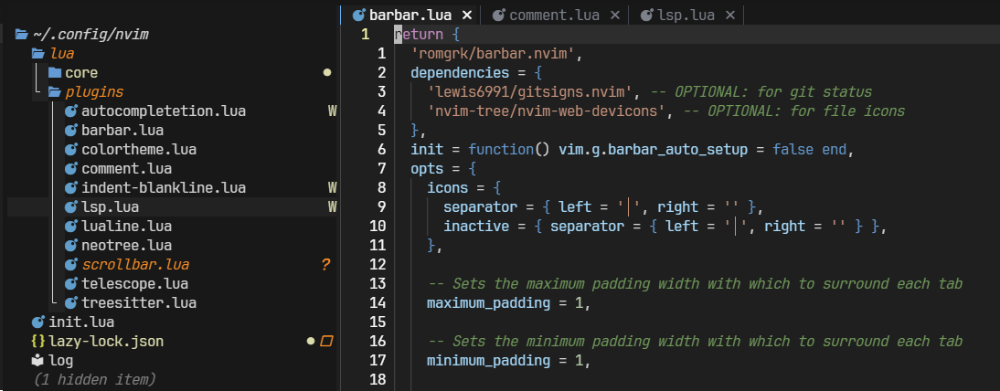
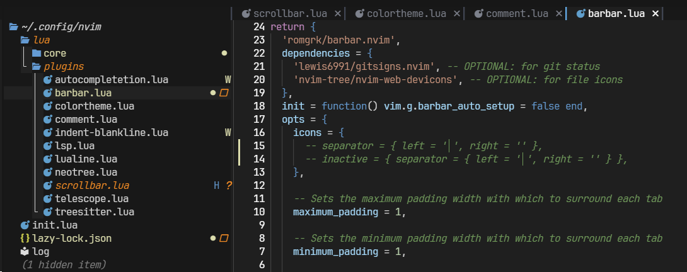
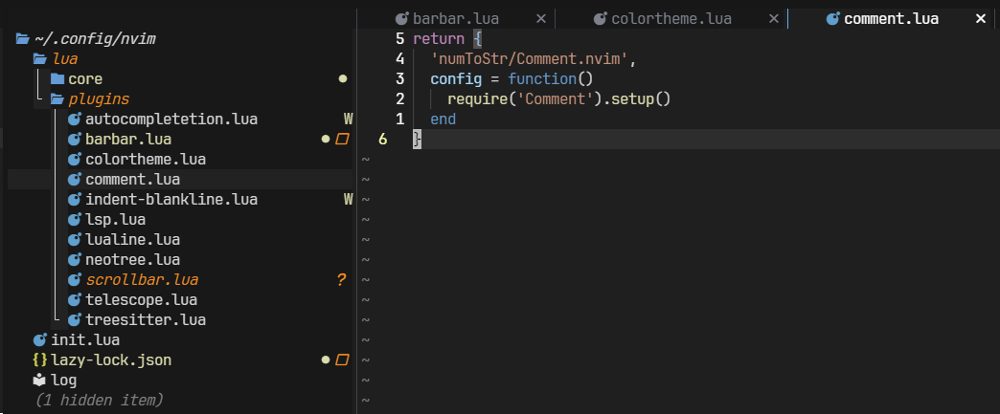
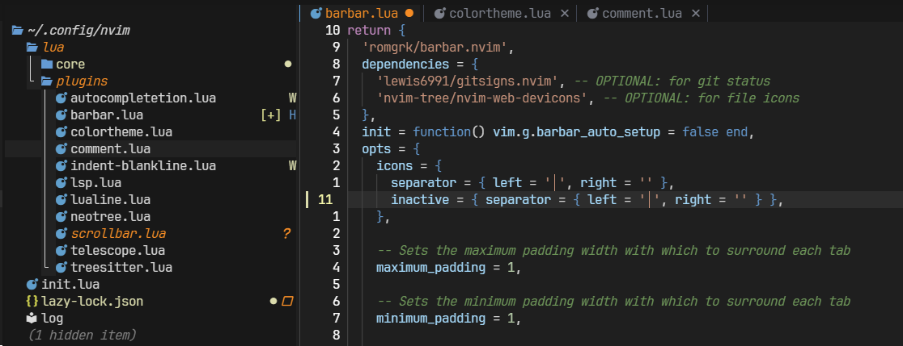
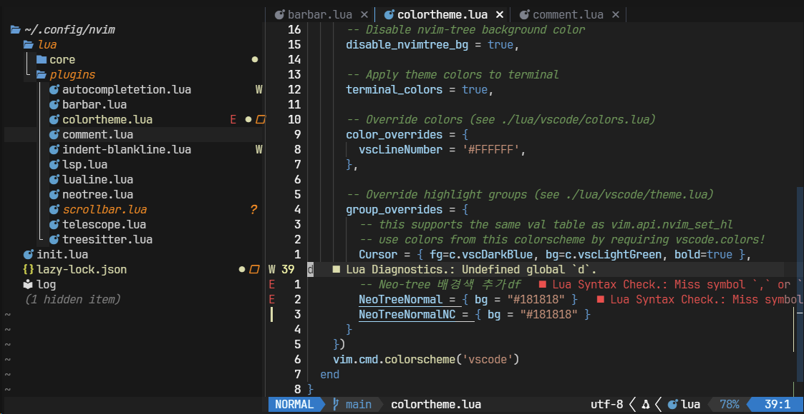
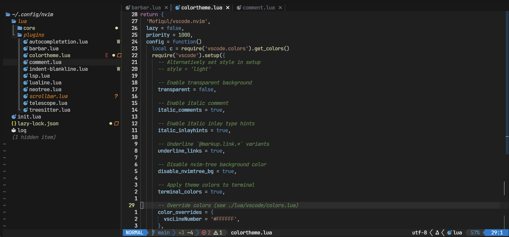

## 🚀 들어가며

화면 UI 구성을 마무리할 시간이다. 아직은 코드 화면과 파일 트리밖에 없어서 많이 불편감이 느껴질 텐데, 이제 정말 CUI가 뭔지 볼 수 있다 ㅎㅎ

Bufferline은 맨 위에 내가 열어놓은 파일 목록을 확인 할 수 있는 기능이고, statusline은 맨 밑에 각종 메타데이터를 확인할 수 있는 기능이다.

## 📑 Bufferline: `barbar.nvim`

Bufferline이 보이게 하는 플러그인으로는 크게 `bufferline.nvim`과 `barbar.nvim`이 있다. `bufferline.nvim`이 좀 더 보편적으로 사용되고 커스터마이징이 자유로운데, `barbar.nvim`은 단축어로 편리하게 버퍼 간 이동을 할 수 있다는 장점이 있어 `barbar.nvim`을 선택했다.

[`barbar.nvim` Github(클릭)](https://github.com/romgrk/barbar.nvim)의 README에 Lazy를 사용해 플러그인을 설치하는 방법이 다음과 같이 나와 있다.

```lua
-- [[ lua/plugins/barbar.lua ]]

require('lazy').setup {
  {'romgrk/barbar.nvim',
    dependencies = {
      'lewis6991/gitsigns.nvim', -- OPTIONAL: for git status
      'nvim-tree/nvim-web-devicons', -- OPTIONAL: for file icons
    },
    init = function() vim.g.barbar_auto_setup = false end,
    opts = {
      -- lazy.nvim will automatically call setup for you. put your options here, anything missing will use the default:
      -- animation = true,
      -- insert_at_start = true,
      -- …etc.
    },
    version = '^1.0.0', -- optional: only update when a new 1.x version is released
  },
}
```

### 개인 설정 전체

나의 barbar 플러그인 전체 설정은 다음과 같다.



```lua
return {
  'romgrk/barbar.nvim',
  dependencies = {
    'lewis6991/gitsigns.nvim', -- OPTIONAL: for git status
    'nvim-tree/nvim-web-devicons', -- OPTIONAL: for file icons
  },
  init = function() vim.g.barbar_auto_setup = false end,
  opts = {
    icons = {
      separator = { left = '│', right = '' },
      inactive = { separator = { left = '│', right = '' } },
    },

    -- Sets the maximum padding width with which to surround each tab
    maximum_padding = 1,

    -- Sets the minimum padding width with which to surround each tab
    minimum_padding = 1,

    -- Set the filetypes which barbar will offset itself for
    sidebar_filetypes = {
      ['neo-tree'] = { event = 'BufWipeout' },
    },
  },

  config = function(_, opts)
    -- 1. 먼저 setup 실행
    require('barbar').setup(opts)

    -- 2. 색상 덮어쓰기
    -- 색상 설정
    local colors = {
      bg = '#1f1f1f',
      fg = '#ffffff',
      blue = '#51afef',
      orange = '#FF8800',
      gray = '#5c6370',
    }

    -- 현재 버퍼 (활성)
    vim.api.nvim_set_hl(0, 'BufferCurrent', { fg = colors.fg, bg = colors.bg, bold = true })
    vim.api.nvim_set_hl(0, 'BufferCurrentMod', { fg = colors.orange, bg = colors.bg })

    -- 비활성 버퍼
    vim.api.nvim_set_hl(0, 'BufferInactive', { fg = colors.gray, bg = '#181818' })
    vim.api.nvim_set_hl(0, 'BufferInactiveMod', { fg = colors.orange, bg = '#181818' })

    -- 탭라인 배경
    vim.api.nvim_set_hl(0, 'BufferTabpageFill', { bg = '#181818' })

    -- 구분선
    vim.api.nvim_set_hl(0, 'BufferCurrentSign', { fg = colors.blue, bg = colors.bg })
    vim.api.nvim_set_hl(0, 'BufferInactiveSign', { fg = '#3e4452', bg = '#181818' })
  end,

  version = '^1.9.0', -- optional: only update when a new 1.x version is released
}
```

### 구분선(Separator) 설정

버퍼 간의 구분선 문자 기본 설정이 '왼쪽 정렬된 세로선'인데, 파일 트리와 코드 화면 분리선과 위치가 어긋나 보기 좋지 않았다 😖



이를 해결하기 위해 '중앙 정렬된, 더 얇은 세로선'으로 구분선을 변경해 주었다.

```lua
icons = {
  separator = { left = '│', right = '' },
  inactive = { separator = { left = '│', right = '' } },
}
```

버퍼가 선택되어 있을 때(`separator`)와 선택되지 않았을 때(`inactive-separator`)를 각각 설정해야 동일하게 적용된다.

### 패딩(Padding) 설정

공간이 충분할 경우 버퍼 크기가 꽤 커지는데, 여백이 너무 많으니 보기 좋지 않아서 각 버퍼 탭 양옆의 여백을 1로 고정했다.



```lua
maximum_padding = 1,
minimum_padding = 1,
```

### 사이드바 오프셋 설정

파일 탐색기 같은 사이드바가 열릴 때 버퍼라인을 자동으로 이동시킨다.

```lua
sidebar_filetypes = {
  ['neo-tree'] = { event = 'BufWipeout' },
}
```

`nvim-tree` 등 다른 파일 트리 플러그인에 대한 오프셋 설정도 플러그인 리드미에서 확인할 수 있다. 예시는 다음과 같다.

```lua
sidebar_filetypes = {
  NvimTree = true,
  undotree = { text = 'undotree' },
  Outline = { event = 'BufWinLeave', text = 'symbols-outline' },
}
```

### 색상 커스터마이징

`config` 함수에서 highlight 그룹을 직접 설정하여 원하는 색상 테마를 적용할 수 있다.

```lua
local colors = {
  bg = '#1f1f1f',      -- 활성 버퍼 배경
  fg = '#ffffff',      -- 활성 버퍼 텍스트
  blue = '#51afef',    -- 구분선 강조색
  orange = '#FF8800',  -- 수정 상태 표시
  gray = '#5c6370',    -- 비활성 텍스트
}
```

VSCode 테마가 barbar 플러그인에 최적화되어 있지 않은 것 같아서 `#181818` 등의 색상을 임의 적용했다.

```lua
-- 활성 버퍼
vim.api.nvim_set_hl(0, 'BufferCurrent', { fg = colors.fg, bg = colors.bg, bold = true })
vim.api.nvim_set_hl(0, 'BufferCurrentMod', { fg = colors.orange, bg = colors.bg })
vim.api.nvim_set_hl(0, 'BufferCurrentSign', { fg = colors.blue, bg = colors.bg })

-- 비활성 버퍼
vim.api.nvim_set_hl(0, 'BufferInactive', { fg = colors.gray, bg = '#181818' })
vim.api.nvim_set_hl(0, 'BufferInactiveMod', { fg = colors.orange, bg = '#181818' })
vim.api.nvim_set_hl(0, 'BufferInactiveSign', { fg = '#3e4452', bg = '#181818' })

-- 탭라인 배경
vim.api.nvim_set_hl(0, 'BufferTabpageFill', { bg = '#181818' })
```

색상 적용사항은 다음과 같다.

- 수정사항이 아직 저장되지 않은 버퍼는 **오렌지색 글씨**
- 활성 버퍼는 **어두운 회색** (코드 스니펫과 같은 색)
- 비활성 버퍼는 **검은색** (파일 트리와 같은 색)



설정을 저장하고 NeoVim을 재시작했을 때 버퍼라인의 모습이다. 

## 💫 Statusline: `lualine`

Statusline은 가장 많이 사용되는 [lualine(클릭)](https://github.com/nvim-lualine/lualine.nvim)으로 결정했다. 우리는 VSCode와 가장 비슷한 테마를 적용해야 하는데, statusline 플러그인 중 테마 호환이 가장 잘 되어 있는 플러그인이 `lualine`이다.

전체 코드는 다음과 같다.

```lua
-- [[ lua/plugins/lualine.lua ]]

return {
  'nvim-lualine/lualine.nvim',
  dependencies = { 'nvim-tree/nvim-web-devicons' },

  config = function()
    -- Variable for small window settings
    local hide_in_width = function()
      return vim.fn.winwidth(0) > 100
    end

    -- Diagnostics: Not shown if small window
    local diagnostics = {
      'diagnostics',
      sources = { 'nvim_diagnostic' },
      always_visible = false,
      cond = hide_in_width,
    }

    -- Git diff icon settings: Not shown if small window
    local diff = {
      'diff',
      cond = hide_in_width,
    }

    require('lualine').setup {
      options = {
        disabled_filetypes = { 'alpha', 'neo-tree' },
      },
      sections = {
        lualine_a = {'mode'},
        lualine_b = {'branch', diff, diagnostics},
        lualine_c = {'filename'},
        lualine_x = {'encoding', 'fileformat', 'filetype'},
        lualine_y = {'progress'},
        lualine_z = {'location'}
      },
      inactive_sections = {
        lualine_a = {},
        lualine_b = {},
        lualine_c = {'filename'},
        lualine_x = {'location'},
        lualine_y = {},
        lualine_z = {}
      },
      tabline = {},
      winbar = {},
      inactive_winbar = {},
      extensions = { 'fugitive' }
    }
  end,
}
```

### Lazy로 lualine 설치

`lualine.nvim`의 README에 Lazy 매니저로 플러그인을 설치하는 방법이 다음과 같이 나와 았다.

```lua
{
  'nvim-lualine/lualine.nvim',
  dependencies = { 'nvim-tree/nvim-web-devicons' }
}
```

### 창 크기에 따라 요소 조절하기

Statusline에 모든 요소가 항상 표시되면, 창 크기를 줄였을 때 중요한 정보들이 표시되지 않을 수 있다. 이를 방지하기 위해 반응형으로 statusline을 구성한다.

`hide_in_width` 함수를 선언해 윈도우 크기가 작아지면 `dianostics`와 `diff` 요소가 표시되지 않도록 했다. 이때 주의할 점은, `sections` 프로퍼티에서 문자열이 아닌 변수를 전달해야 한다.

```lua
sections = {
  lualine_a = {'mode'},
  lualine_b = {'branch', diff, diagnostics},
  lualine_c = {'filename'},
  lualine_x = {'encoding', 'fileformat', 'filetype'},
  lualine_y = {'progress'},
  lualine_z = {'location'}
},
```



반응형 statusline이 적용되면 위 사진과 같이 git 변경사항과 lsp 오류가 있음에도 상태바에 표시되지 않는다.

`lualine_b`에 `diff`와 `diagonstics` 변수를 전달한 것을 볼 수 있다. Statusline의 요소들은 pre-configured 그대로 사용하지 않아도 되고, 마음대로 커스터마이징할 수 있다.

### 파일 트리 오프셋

파일 트리에는 statusline이 나타나지 않게 하고 싶다면 `disabled_filetypes` 프로퍼티에 파일 트리를 추가해주면 된다.

```lua
options = {
  disabled_filetypes = { 'alpha', 'neo-tree' },
},
```



Bufferline과 statusline까지 구성하고 나면 이 정도의 화면이 완성되었을 것! 💃 `disabled_filetypes`에 파일트리를 추가했다면 왼쪽 하단 회색 글씨는 없어진다.

## 📜 Scrollbar: `nvim-scrollbar`

스크롤 자체는 마우스 휠이나 키보드의 'PGDN' 키로 할 때가 많아 괜찮지만, git diff를 스크롤바에서 바로 확인해서 그 위치로 가고 싶을 때가 있다. 검색을 할 때도 여간 불편한 게 아니다.

이를 해결하기 위해 스크롤바 플러그인을 설치하기로 결정했다.

README에 lazy 매니저를 활용한 설치 매뉴얼은 공식적으로 나와 있지 않지만 다음 [Github Issue(클릭)](https://github.com/petertriho/nvim-scrollbar/issues/112)에서 힌트를 얻을 수 있었다.

### TBD

스크롤바 플러그인을 몇 개 둘러봤지만,

1. 스크롤바 색상과 너비를 조절할 수 있고
2. VSCode처럼 파일 길이에 맞춰 스크롤바 크기가 고정되고
3. 모든 내용이 한 화면 안에 있어도 스크롤바가 사라지지 않는

세 가지 조건을 충족하는 스크롤바를 찾을 수 없었다. 개인적으로 플러그인을 수정해서 구현하기 전까지 이 파트는 최종 설정을 공유할 수 없을 것 같다.

## ✨ 마치며

이제 그럴듯한 화면 구성이 완료되었다. 스크롤바가 맘에 꼭 드는 게 없어서 아쉽지만, 추후에 직접 구현해 보는 것도 재미있을 것 같다. 

이대로 개발을 진행해도 되지만 코드 에디터를 쓰는 주된 이유는 빠른 에러 확인이기도 하다. 간단한 문법 오류는 에디터가 잡아내 줘야 생산성이 올라간다. 이후부터는 기능적인 면에 집중해서 IDE 구성을 진행할 예정이다.