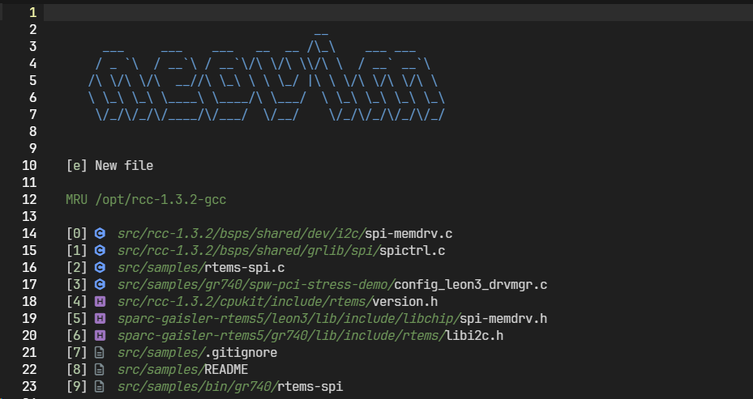
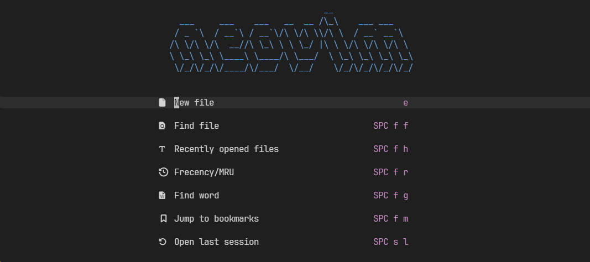

## 🚀 들어가며

지금까지 플러그인 매니저, 파일 트리, 버퍼라인, 각종 옵션, 코드 진단을 위한 언어 서버(LSP) 등을 살펴보았다.

직접 configuration이 가능한 만큼 NeoVim의 각종 설정과 플러그인은 무궁무진하다. 내 개인 설정은 NeoVim을 켜면 가장 먼저 대시보드가 뜨게 하는 플러그인과 터미널 플러그인을 구성하는 것으로 마무리하지만, NeoVim을 200% 활용하기 위해서는 이 외에도 자신에게 맞는 설정을 찾아다니는 것이 중요하다.

**참고**: NeoVim에서 필수로 여겨지지만 나에게 필요하지 않아서 추가하지 않은 플러그인에는 `treesitter`, `autocompletion`, `autoformatting`이 있다. 나는 주로 C 코드 분석만 하기 때문에 건너뛰었지만 이 기능이 필요하다면 유튜브 영상을 참고해 구성하는 것을 권장한다.

## 🌅 대시보드 플러그인: `alpha-nvim`

Barbar 플러그인을 설정하면 NeoVim을 켤 때 자동으로 빈 버퍼가 나타난다. 솔직히 미관상 별로이다.😑 다른 사람들도 그렇게 생각했는지 NeoVim을 켜면 대시보드가 나타나도록 하는 플러그인을 여러 가지 만들어 놓았다! 🤩

[`alpha-nvim` Github(클릭)](https://github.com/goolord/alpha-nvim)에서 설정을 복사해 `plugins` 폴더 내 새로운 파일을 만들어 추가한다.

현재 모든 아이콘을 `nvim-web-devicons` 라이브러리에서 가져다 쓰고 있으므로 동일하게 맞춰준다.

```lua
return {
  "goolord/alpha-nvim",
  -- dependencies = { 'nvim-mini/mini.icons' },
  dependencies = { 'nvim-tree/nvim-web-devicons' },
  config = function()
    local startify = require("alpha.themes.startify")
    -- available: devicons, mini, default is mini
    -- if provider not loaded and enabled is true, it will try to use another provider
    startify.file_icons.provider = "devicons"
    require("alpha").setup(
      startify.config
    )
  end,
}
```

### Startify 테마

기본 시작 설정은 startify 테마로, 대시보드에 최근 파일 목록이 나타난다.

대괄호 안의 숫자를 누르면 해당 파일 버퍼가 바로 켜져서 굉장히 유용하다. 나는 현재 이 설정을 사용하고 있다.



### Dashboard-nvim 테마

Dashboard-nvim 테마는 startify와 달리 적용된 아이콘 라이브러리를 자동 감지하기 때문에 명시적으로 아이콘을 설정하지 않아도 된다. config 함수 내부를 다음과 같이 수정한다.

```lua
return {
  "goolord/alpha-nvim",
  -- dependencies = { 'nvim-mini/mini.icons' },
  dependencies = { 'nvim-tree/nvim-web-devicons' },
  config = function()
    require("alpha").setup(require("alpha.themes.dashboard").config)
  end,
}   
```
테마를 적용하면 다음과 같이 간략한 메뉴가 나타난다.



### 다양한 커스텀 테마 적용

기본 아스키 아트 외에 유저들이 다양한 커스텀 설정을 [`alpha-nvim` Discussion #16 (클릭)](https://github.com/goolord/alpha-nvim/discussions/16)에서 공유하고 있다.

예쁜 아트들이 많으니 둘러보는 것을 권장한다. 나는 개인적으로 진격의 거인 자유의 날개 아트가 예뻐서 눈여겨보는 중이다. 🙈

## 🪄 파일 트리 자동 토글

일반적으로 VSCode는 파일 트리를 한 번 켜면 이후에 에디터를 켤 때도 파일 트리가 계속 나타난다. NeoVim에서도 마찬가지로 파일 트리가 무조건 나타나게 하고 싶었다.

Neo-tree 플러그인에서 자동 토글을 켜 봤는데, 대시보드를 가리는 형태로 나타나서 대시보드 플러그인에서 파일 트리를 토글하는 방식으로 변경했다.

```lua
-- alpha 대시보드가 켜질 때(파일 타입이 'alpha'가 될 때) neo-tree도 같이 열기
vim.api.nvim_create_autocmd("FileType", {
  pattern = "alpha", -- alpha 대시보드의 파일 타입
  group = vim.api.nvim_create_augroup("alpha_open_neotree", { clear = true }),
  callback = function()
    -- 'silent'는 Neotree를 연다는 메시지가 뜨지 않게 합니다.
    vim.cmd("silent Neotree")
  end,
})
```

## 📦 터미널 플러그인 설치

개발을 하다 보면 터미널로 Git 작업이나 빌드 및 컴파일 작업을 해야 할 때가 많다. 터미널을 써야 할 때마다 탭을 바꾸거나 에디터를 꺼야 하는 게 번거로워서 터미널 플러그인을 설치했다.

터미널 플러그인에도 종류가 몇 가지 있는데, 나는 이 중 [`toggleterm.nvim` (클릭)](https://github.com/akinsho/toggleterm.nvim)으로 설치했다.

### `Lazy.nvim`으로 설치하기

`toggleterm.nvim`의 README에 다음과 같이 플러그인 설치 방법이 소개되어 있다.

```lua
{
  -- amongst your other plugins
  {'akinsho/toggleterm.nvim', version = "*", config = true}
  -- or
  {'akinsho/toggleterm.nvim', version = "*", opts = {--[[ things you want to change go here]]}}
}
```

기본 토글 단축키는 `Ctrl + \`인데, 나는 단축키를 `Ctrl + t`로 변경할 예정이기 때문에 두 번째 configuration으로 구성했다.

```lua
return {
  'akinsho/toggleterm.nvim',
  version = "*",
  opts = {
    open_mapping = '<C-T>',
    terminal_mappings = true -- 터미널 내부에서도 같은 단축키로 토글
  }
}
```

### 터미널 위치 변경하기

나는 터미널을 윈도우의 가장 아래에 배치하는 기본 설정을 따르고 있는데, `float` 설정으로 사용하는 사람들도 굉장히 많다. 다음은 터미널이 hover 되게 하는 코드이다.

**1. 기본 설정에서 float로 지정**

```lua
require("toggleterm").setup{
  direction = 'float',
  float_opts = {
    border = 'double',  -- 'single', 'double', 'shadow', 'curved' 등
    width = 120,
    height = 30,
    winblend = 3,
  }
}
```

**2. 명령어 실행할 때 direction 지정**

    vim:ToggleTerm direction=float

**3. 특정 터미널만 float로 만들기**

```lua
local Terminal = require('toggleterm.terminal').Terminal
local float_term = Terminal:new({
  direction = "float",
  float_opts = {
    border = "double",
  },
  on_open = function(term)
    vim.cmd("startinsert!")
  end,
})

function _float_term_toggle()
  float_term:toggle()
end

vim.keymap.set("n", "<leader>ft", "<cmd>lua _float_term_toggle()<CR>", {noremap = true, silent = true})
```

## ✨ 마치며

내가 현재 사용하는 모든 NeoVim configuration에 대한 포스팅이 마무리되었다.

보통 여기에 LazyGit 등 Git configuration을 같이 넣는 경우가 많은데, 난 git은 그냥 터미널로 관리하는게 편해서 구성하지 않았다. 원본 영상에는 포함되어 있기 때문에 참고하면 좋을 것 같다.

에디터를 구성하며 가장 많이 한 생각은... VSCode가 얼마나 대단한 에디터인가에 대한 고찰... 이걸 대체 어떻게 한 거지 라는 놀라움...

특히 스크롤바 플러그인을 찾아다닐 때 많이 느꼈다. 😂 언젠가는 VSCode같은 스크롤바를 적용시켜 내야지! 점점 성장하는 내가 되었으면 좋겠다.