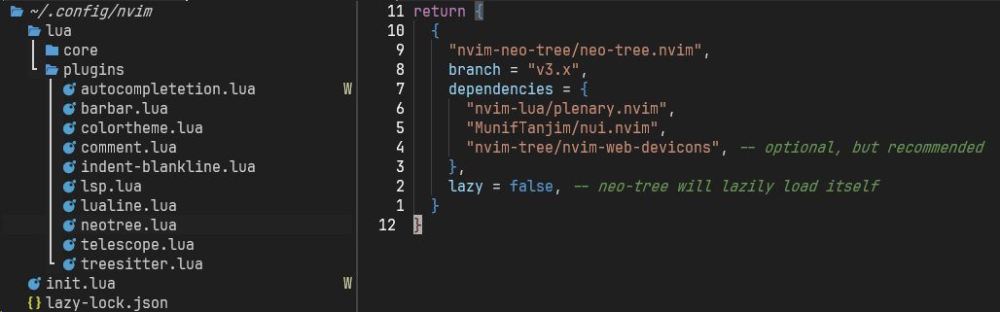
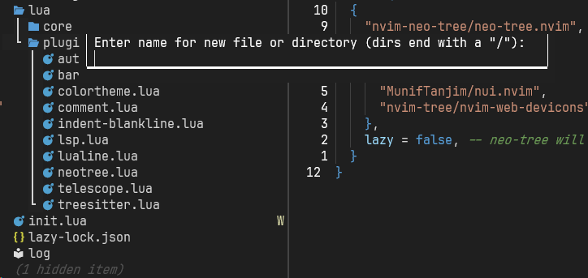

## 🚀 들어가며

NeoVim을 설치했으니 이제 나만의 configuration을 시작해볼 차례다. 가장 기본이 되는 플러그인 매니저 설치부터 시작한다. 💪

NeoVim이 처음 나왔을 때에 주로 사용되던 매니저는 `vim-plug`이다. 이전의 Vundle이나 Pathogen 같은 매니저들보다 훨씬 단순하고 설정이 간편했지만 VimScript 기반이라는 한계가 있었다.

NeoVim의 Lua 지원을 활용하기 위해 개발된 것이 `packer`이다. Lua는 Vimscript보다 빠르고 효율적이며, 현대적인 프로그래밍 언어의 기능들을 제공한다.

요즘 보편적으로 사용하는 플러그인 매니저는 `lazy.nvim`이다. 코드가 간결하고 이해하기 쉬우며, 지연 로딩(lazy loading) 최적화로 매우 빠른 실행 속도를 자랑한다.

## 🔌 Lazy.nvim 설치

### 초기 설치 코드 작성

Kickstart의 `init.lua` 파일에서 다음 부분을 복사헤, 나의 `init.lua`에 붙여넣기한다. Line 200 초중반에 있고, `lazy` 키워드로 검색하면 편하다.

```lua
-- [[ Install `lazy.nvim` plugin manager ]]
--    See `:help lazy.nvim.txt` or https://github.com/folke/lazy.nvim for more info
local lazypath = vim.fn.stdpath 'data' .. '/lazy/lazy.nvim'
if not (vim.uv or vim.loop).fs_stat(lazypath) then
  local lazyrepo = 'https://github.com/folke/lazy.nvim.git'
  local out = vim.fn.system { 'git', 'clone', '--filter=blob:none', '--branch=stable', lazyrepo, lazypath }
  if vim.v.shell_error ~= 0 then
    error('Error cloning lazy.nvim:\n' .. out)
  end
end

---@type vim.Option
local rtp = vim.opt.rtp
rtp:prepend(lazypath)

-- [[ Configure and install plugins ]]
--
--  To check the current status of your plugins, run
--    :Lazy
--
--  You can press `?` in this menu for help. Use `:q` to close the window
--
--  To update plugins you can run
--    :Lazy update
--
-- NOTE: Here is where you install your plugins.
require('lazy').setup({
```

주석은 최소한으로 남기고 지우는 것을 권장한다.

```lua
-- [[ init.lua ]]

-- [[ Install `lazy.nvim` plugin manager ]]
local lazypath = vim.fn.stdpath 'data' .. '/lazy/lazy.nvim'
if not (vim.uv or vim.loop).fs_stat(lazypath) then
  local lazyrepo = 'https://github.com/folke/lazy.nvim.git'
  local out = vim.fn.system { 'git', 'clone', '--filter=blob:none', '--branch=stable', lazyrepo, lazypath }
  if vim.v.shell_error ~= 0 then
    error('Error cloning lazy.nvim:\n' .. out)
  end
end

---@type vim.Option
local rtp = vim.opt.rtp
rtp:prepend(lazypath)

-- [[ Configure and install plugins ]]
require('lazy').setup('plugins')
```

### 플러그인 설치 방식

플러그인 설치 코드를 작성하는 방법은 두 가지가 있다.

1. `plugins` 폴더에 있는 모든 플러그인을 무조건 설치한다.

플러그인은 `lua/plugins/` 폴더에서 관리한다. 다음과 같이 코드를 작성하면 해당 폴더의 모든 플러그인이 항상 설치된다.

```lua
require('lazy').setup('plugins')
```

2. 설치할 플러그인을 명시적으로 설정한다.

플러그인 폴더에서 원하는 플러그인들을 직접 작성한다. 

사용하지 않는 플러그인을 삭제하지 않고 백업용으로 둘 수 있다는 장점이 있는 반면에, 새로운 플러그인을 추가할 때는 다소 귀찮다는 단점이 있다. 나는 1번 방법으로 하고 있다.

```lua
require('lazy').setup({
  require 'plugins.telescope',
  require 'plugins.treesitter',
})
```

## 📂 파일 트리 설치

첫 플러그인으로 파일 트리 중 하나인 [neo-tree(클릭)](https://github.com/nvim-neo-tree/neo-tree.nvim) 플러그인을 설치한다. 파일 트리 플러그인에는 neo-tree와 nvim-tree가 제일 많이 사용되는데, neo-tree가 더 현대적인 기능이 많다.

```lua
-- [[ lua/plugins/neotree.lua ]]

return {
  {
    "nvim-neo-tree/neo-tree.nvim",
    branch = "v3.x",
    dependencies = {
      "nvim-lua/plenary.nvim",
      "MunifTanjim/nui.nvim",
      "nvim-tree/nvim-web-devicons", -- optional, but recommended
    },
    lazy = false, -- neo-tree will lazily load itself
  }
}
```

위와 같이 `neotree.lua` 파일을 작성하고 NeoVim을 다시 실행하면 플러그인이 설치된다.



`:Neotree` 명령어로 파일 트리를 켜고, `:Neotree close`로 닫을 수 있다.



폴더에 포커스가 주어진 상태에서 `a`키를 누르면 새로운 파일이나 디렉토리를 만들 수 있다. 이름을 입력하고 마지막에 슬래시(`/`)를 붙이면 디렉토리가 생성된다.

## ✨ 마치며

처음 Neo-tree를 설치하면 파일 앞 아이콘이 깨져 보일 수 있다. 터미널 설정 폰트가 아이콘을 지원하지 않기 때문인데, 이는 `nerd font`를 설치하면 해결 가능하다.

다음 포스트에서 폰트 설정을 포함해 기본 UI 설정을 다룰 예정이다.