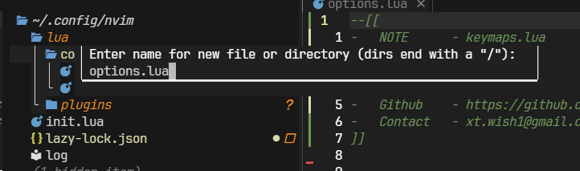
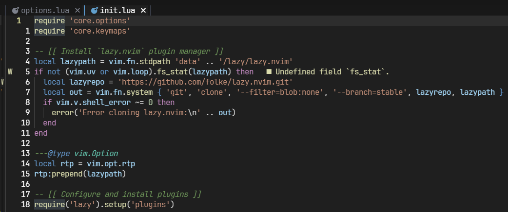
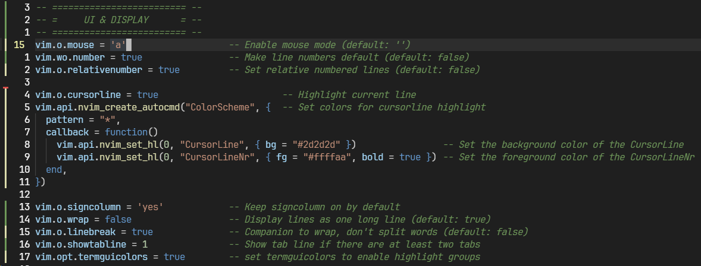
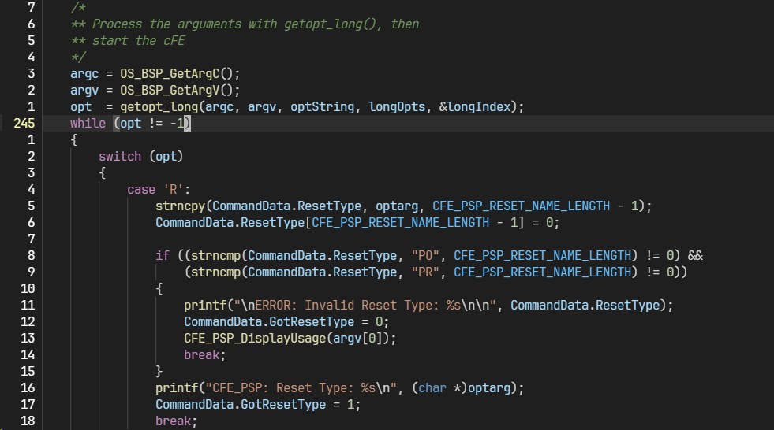

## 🚀 들어가며

지금까지 올렸던 캡처 화면을 보면, 코드 화면 왼쪽에 라인 넘버가 표시되는 걸 볼 수 있다.

그런데 조금 이상한 게 있다는 걸 눈치챘다면 당신은 똑똑이🤭 커서가 있는 라인만 실제 라인 넘버가 표시되고, 그 외에는 아래위로 몇 줄을 가야 하는지가 표시된다.

NeoVim을 쓰려고 한다면 웬만한 Vim 기능은 알고 있겠지만, 이렇게 상대적 라인 넘버가 표시되면 `10j`(위로 10줄 이동), `5k`(아래로 5줄 이동), `3dd`(3줄 오려내기)처럼 라인 수를 지정하는 명령어를 입력하기가 한결 편하다.

이번 포스트에서는 이런 라인 넘버 설정처럼 유용한 NeoVim 설정을 다루려고 한다.

## 🎯 파일 생성 및 적용

먼저 `lua/core/options.lua` 파일을 생성해 저장한다. 파일 트리에서 `a`키로 생성 가능하고, 터미널에서 `touch` 명령어로 생성할 수도 있다.



그 후 `init.lua` 파일에 생성한 `options.lua` 파일을 import한다.

```lua
require 'core.options'
```



## 🎨 UI & DISPLAY - 화면 표시 설정



### 마우스와 라인 번호

```lua
luavim.o.mouse = 'a'
vim.wo.number = true
vim.o.relativenumber = true
```

- `mouse`: 모든 모드에서 마우스 사용 가능. 터미널 환경에서도 클릭, 스크롤이 편리하다.
- `number` + `relativenumber`: 절대 라인 번호와 상대 라인 번호를 함께 표시한다.

```lua
vim.o.cursorline = true
vim.api.nvim_create_autocmd("ColorScheme", {
  pattern = "*",
  callback = function()
    vim.api.nvim_set_hl(0, "CursorLine", { bg = "#2d2d2d" })
    vim.api.nvim_set_hl(0, "CursorLineNr", { fg = "#ffffaa", bold = true })
  end,
})
```

- `cursorline`: 현재 커서가 있는 라인을 하이라이트해, 코드 작성 중 현재 위치를 쉽게 파악할 수 있다.
- `색상 설정`: 디폴트 커서라인 하이라이트가 배경과 크게 차이나지 않아 매뉴얼하게 변경하였다.


### 화면 구성

```lua
luavim.o.signcolumn = 'yes'
vim.o.wrap = false
vim.o.linebreak = true
vim.o.showtabline = 1
vim.opt.termguicolors = true
```

- `signcolumn`: Git 변경사항이나 LSP 진단 표시를 위한 컬럼을 항상 표시한다.
- `wrap`: 긴 줄을 자동으로 줄바꿈하지 않는다.
- `linebreak`: wrap을 켰을 때 단어 중간에서 끊지 않도록 설정한다.
- `showtabline`: 탭이 2개 이상일 때만 탭 라인을 표시한다.
- `termguicolors`: 24비트 트루 컬러를 활성화해 색상 테마가 훨씬 예쁘게 보이게 한다.

## 📏 INDENT - 들여쓰기 설정



이전 Lua 파일은 2칸 들여쓰기를, 위 사진의 C 파일은 4칸 들여쓰기를 적용하였다.

### 기본 들여쓰기 동작

```lua
luavim.o.smartindent = true
vim.o.autoindent = true
vim.o.breakindent = true
```

- `smartindent`: C언어 스타일의 스마트한 자동 들여쓰기
- `autoindent`: 새 줄 생성 시 이전 줄의 들여쓰기를 유지한다.
- `breakindent`: 줄바꿈 시 들여쓰기를 시각적으로 유지한다.

### 탭과 스페이스

```lua
luavim.o.shiftwidth = 4
vim.o.tabstop = 4
vim.o.softtabstop = 4
```

NeoVim의 디폴트 인덴트는 8칸인데, 익숙하지 않아 가독성이 조금 떨어졌다. 보다 보편적인 4칸 들여쓰기로 변경했다.

### 파일 타입별 설정

```lua
luavim.api.nvim_create_autocmd("FileType", {
  pattern = {"lua", "dart", "javascript", "typescript", "typescriptreact", "javascriptreact"},
  callback = function()
    vim.opt_local.shiftwidth = 2
    vim.opt_local.tabstop = 2
    vim.opt_local.softtabstop = 2
  end,
})
```

2칸 들여쓰기가 더 많이 쓰이는 Lua, JavaScript, TypeScript 등에 대해 인덴트 설정을 따로 해주었다.

## ✏️ EDITING - 편집 설정

```lua
luavim.o.expandtab = true
vim.o.backspace = 'indent,eol,start'
vim.opt.formatoptions:remove { 'c', 'r', 'o' }
```

- `expandtab`: Tab 키를 누르면 스페이스로 변환해 탭과 스페이스 혼용 문제를 방지한다.
- `backspace`: 들여쓰기, 줄 끝, 줄 시작 위치에서 자유롭게 백스페이스 사용이 가능하도록 한다.
- `formatoptions`: 주석 자동 생성 기능을 제거한다.


## 🔍 SEARCH - 검색 설정

```lua
luavim.o.smartcase = true
vim.o.ignorecase = true
```

이 두 옵션이 조합되면
- 소문자로만 검색하면 대소문자 구분 없이 검색하고(`/test` → `Test`, `TEST` 모두 검색), 
- 대문자가 포함되면 대소문자를 구분하게 된다(`/Test` → `Test`만 검색).

## 🗂️ SYSTEM & FILES - 시스템 및 파일 설정

```lua
luavim.o.clipboard = 'unnamedplus'
luavim.o.undofile = true
vim.o.fileencoding = 'utf-8'
vim.opt.runtimepath:remove '/usr/share/vim/vimfiles'
```

- `clipboard`: 시스템 클립보드와 Neovim을 연동한다. 다만 이 기능은 완전 리눅스 환경에서만 되는 것 같다. 내 경우 NeoVim 내부에서 복사하면 외부로 붙여넣기가 안 되고, 이후에 키 매핑으로 `Ctrl+V`를 `p`와 같은 동작을 하도록 했지만 이전에 시스템에서 복사했던 것이 붙여넣기되었다. 아마도 윈도우에서는 `Ctrl+V`가 무조건 시스템 클립보드에서 붙여넣기하도록 우선순위가 설정되어 있는 것 같다.
- `undofile`: Undo 히스토리를 파일로 저장해, 파일을 닫았다 열어도 실행 취소 가능하도록 했다.
- `fileencoding`: 한글 지원을 위해 UTF-8로 파일을 저장한다.
- `runtimepath`: 설정 오류 방지를 위해 Vim 플러그인 경로를 제거하고 Neovim 전용 환경을 구성한다.

## ✨ 마치며

인덴트 설정을 제외하면 모두 웬만한 NeoVim 유저들이 적용하고 있는 설정이기 때문에 일단 추가해두면 유용한 옵션 위주로 모아 보았다. 좋은 구성을 발견하면 계속해서 업데이트할 예정이다.

클립보드가 원하는 대로 작동이 안 되는 것이 좀 아쉬웠다. OSC52 등 이것저것 시도를 해봤는데, 일단 NeoVim 내부에서 복사한 것은 `Ctrl+V`가 안 먹고 normal 모드에서 `p`로 붙여넣기하는 방법밖에는 없는 것 같다.

추후에 파티션을 나눠 Linux Mint 등을 깔게 되면.. 그때는 제대로 동작하나 다시 한번 검증을 해 봐야겠다.