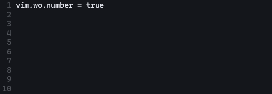
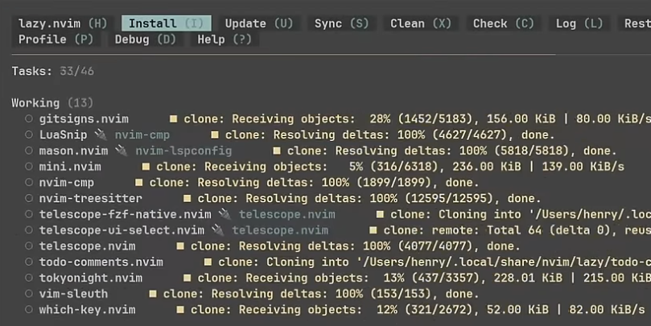
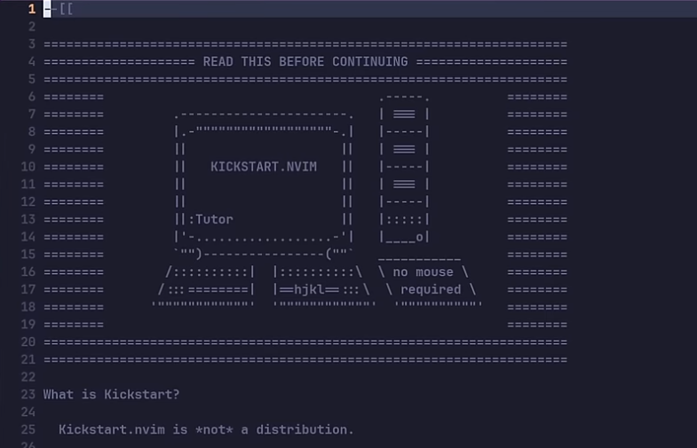
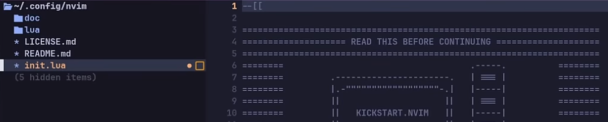

## 🚀 들어가며

본 포스트는 Neovim 설치 과정과 간단한 configuration을 담고 있습니다. 여기서 진행하는 설정은 모두 리셋하고 다시 personal config를 셋업할 예정이니 참고하시기 바랍니다.

---

<br>

여러 환경 문제로 VSCode를 사용할 수 없는 난관에 빠졌다.. 개발을 하면서 GUI를 사용할 수 없다니.. 말도 안 돼 😱😱 

되는 대로 vim 에디터를 쓰다가 생산성이 너무 떨어져 대안을 찾아 나섰다. 그렇게 추천받은 에디터가 CUI를 사용하는 Neovim이다. 

처음에는 예쁜 디자인에 끌려 NvChad 디스트로를 설치해 사용해 보았는데, 이미 모든 configuration이 완성되어 있다 보니 나에게 익숙하지 않은 키맵이 너무 많아 그냥 raw vim을 쓰는 것과 크게 다르지 않게 느껴졌다.

### Full Neovim Setup from Scratch

> 썸네일을 클릭하면 유튜브 영상을 시청하실 수 있습니다.

[](https://youtu.be/KYDG3AHgYEs?si=zX4IFnZvH9rJVbW7)

나에게 익숙한 건 단연 VSCode. Neovim을 VSCode 및 윈도우 환경과 최대한 비슷하게 구축하는 것을 목표로 삼고, 위 유튜브 영상을 참고해 커스터마이징을 시작했다!

`Neovim으로 개발환경 구축하기` 시리즈에서는 위 영상을 일부 번역하는 동시에 나의 개인 설정을 기록하려 한다. 영상이 매우 잘 설명되어 있어서, 혹시 이 게시물을 참고한다면 영상 또한 시청하는 것을 권장한다.

### 나의 Neovim dotfile

이번 시리즈에 나오는 모든 코드는 [나의 Github repository(클릭)](https://github.com/zunione/nvim)에서 확인할 수 있다.

## 📥 Neovim 최신 Release 다운로드

### 우분투 패키지 다운로드

우분투 패키지 매니저에서 다운로드받을 수 있다. 다만 내가 했을 때는 v0.6.1이 다운로드되는 불상사가 발생했다. 😅

최신 Neovim은 v0.11.x이며 deprecated된 요소들이 있으므로, 다음 목차에서 소스 코드로 다운로드받는 것을 권장한다.

```bash
sudo apt update
sudo apt install neovim
nvim --version
```

```
NVIM v0.6.1
Build type: Release
LuaJIT 2.1.0-beta3
Compiled by team+vim@tracker.debian.org

Features: +acl +iconv +tui
See ":help feature-compile"

   system vimrc file: "$VIM/sysinit.vim"
  fall-back for $VIM: "/usr/share/nvim"

Run :checkhealth for more info
```

### 소스 코드로부터 다운로드

[Neovim Release(클릭)](https://github.com/neovim/neovim/releases) 페이지에서 `nvim-linux-x86_64.tar.gz` 파일을 다운로드한다.

appimage 파일 자체를 다운로드하는 방법과 압축 파일을 다운로드 하는 방법이 있는데, TAR 압축 파일을 해제하는 것이 더 전통적이다.

```bash
cd /usr/bin/
# Latest stable release가 업데이트되었다면 해당 파일을 다운로드한다.
(sudo) wget https://github.com/neovim/neovim/releases/download/v0.11.4/nvim-linux-x86_64.tar.gz
(sudo) tar xzvf nvim-linux-x86_64.tar.gz
(sudo) rm nvim-linux-x86_64.tar.gz
echo "PATH=/usr/bin/nvim-linux-x86_64/bin:$PATH" >> ~/.bashrc
source ~/.bashrc
```

설치 이후 설정 커스텀을 위한 디렉토리를 생성하고, PATH 정상 등록과 Neovim 버전을 확인한다.

```bash
mkdir -p ~/.config/nvim
cd ~/.config/nvim
which nvim
nvim --version
```

## 👀 Neovim custom config 맛보기

맛보기 부분은 추후 모두 삭제(`rm -rf`)하고 다시 설정을 진행하게 되니 참고용으로만 활용하면 된다.

### `init.lua` 생성

Neovim의 커스텀 설정은 `~/.config/nvim` 디렉토리에서 이루어지며, 시작점은 `init.lua` 파일이다.

```bash
cd ~/.config/nvim
touch init.lua
nvim init.lua
```

```lua
-- [[ init.lua ]]

-- Enable line number
vim.wo.number = true
```

`vim.wo.number`는 vim의 `:set number`와 같은 기능을 하는 설정이다. 이를 저장하고 다시 `nvim` 명령어를 실행하면 사진과 같이 라인 넘버가 나타난다.



### 개인 설정을 `options.lua`에서 설정하기

`vim.wo.number`와 같은 설정들을 `options.lua` 파일에 한 데 모아 관리할 수 있다. `init.lua`는 프로그램의 시작점이므로 개인 옵션들은 따로 파일로 빼는 것이 바람직하다.

```bash
cd ~/.config/nvim
mkdir lua
cd lua
touch options.lua
nvim options.lua
```

```lua
-- [[ init.lua ]]

require 'options'
```

```lua
-- [[ lua/options.lua ]]

-- Enable line number
vim.wo.number = true
```

이후 `nvim` 명령어를 입력하면 이전과 동일하게 라인 넘버가 나타난다.

## ⚡ `kickstart.nvim`으로 플러그인 맛보기

`kickstart.nvim`은 Neovim 커스터마이징의 시작점을 제공하며, LSP 등 복잡한 코드를 요구하는 설정들이 매우 잘 구현되어 있어 참고하기에 좋다. 이후 몇몇 플러그인을 설치할 때 kickstart를 참고할 예정이다.

### Kickstart 시작하기

`nvim` 디렉토리를 삭제하고 `kickstart.nvim`을 클론해서 살펴본다. 이 또한 추후 삭제하게 된다.

```bash
cd ~/.config
rm -rf nvim
git clone https://github.com/nvim-lua/kickstart.nvim.git nvim
cd nvim
nvim init.lua
```



Neovim을 실행하면 사진과 같이 플러그인들이 설치된다. 이때 플러그인 매니저는 `lazy.nvim`을 사용하게 된다. 이전까지 사용되던 매니저는 `vim.plug`나 `packer`였는데, 코드나 구조가 다소 복잡해 대안으로 개발된 프로그램이 `lazy.nvim`이고, 이제는 가장 보편적으로 사용되고 있다.

위 사진에 보이는 화면이 `lazy.nvim`의 플러그인 매니저 창이고, `:Lazy` 명령어로 켤 수 있다.



`q` 버튼으로 `lazy`의 창을 닫으면 위 사진과 같은 주석과 함께 `init.lua` 파일이 보이게 된다. 

kickstart는 특정 배포 버전이 아니라 개인 설정을 위한 시작점을 제공한다는 내용으로 시작하며, 이 `init.lua` 파일의 각종 주석을 잘 읽으면 굉장한 인사이트를 얻을 수 있다! 👻

### 플러그인 추가하기

`init.lua` 파일의 Line 900 중반에 파일 트리 플러그인을 추가할 수 있도록 하는 주석이 있다. 이를 주석 해제한다.

```lua
-- other plugins..
require 'kickstart.plugins.neo-tree',
-- other plugins..
```

저장하고 Neovim을 재시작하면 플러그인이 설치된다. kickstart의 파일 트리 토글 버튼은 `/`(백슬래시)로, 백슬래시를 누르면 파일 트리가 열린다.



파일 트리 플러그인 추가 코드에서 조금 더 밑으로 내려가면 커스텀 플러그인을 import할 수 있는 코드가 있다. 여기를 주석 해제하면 `lua/custom/plugins` 디렉토리에 있는 모든 플러그인이 설치된다.

```lua
-- { import = 'custom.plugins' },
```

## ✨ 마치며

이제 진짜 custom config를 위해 kickstart도 지워주면 된다. 추후에 코드를 참고하기 위해 다른 디렉토리로 옮겨도 무방한데, 나는 github에서 바로바로 보는 게 편해서 아예 지워 버렸다.

Neovim을 설정하면서 느낀 건, 설정하는 데는 시간이 좀 걸리지만 확실히 편하다! 나는 맥이랑 윈도우를 모두 사용하는데, 단축키를 내 마음대로 설정할 수 있다 보니 맥/윈도우 단축키 중 내가 편하다고 느끼는 것들을 모두 Neovim에 이식했다.

확실히 개발자는.. 이런 게 제일 재밌는 것 같다 ㅎㅎ