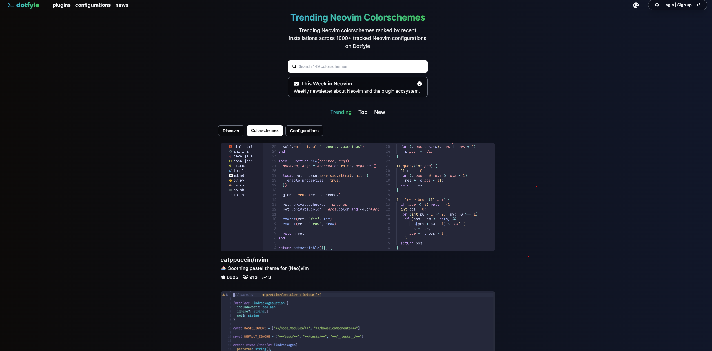
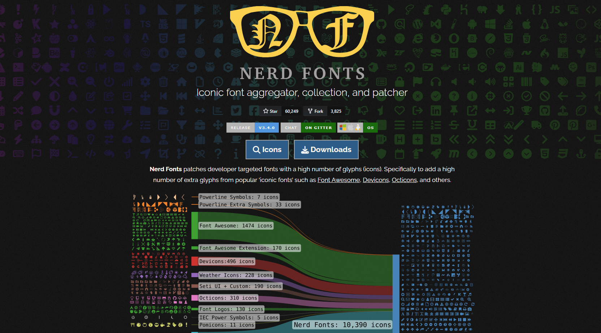
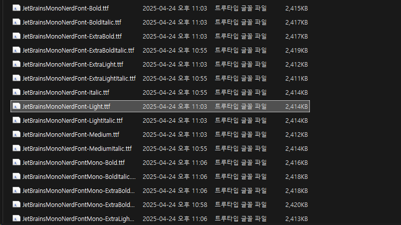
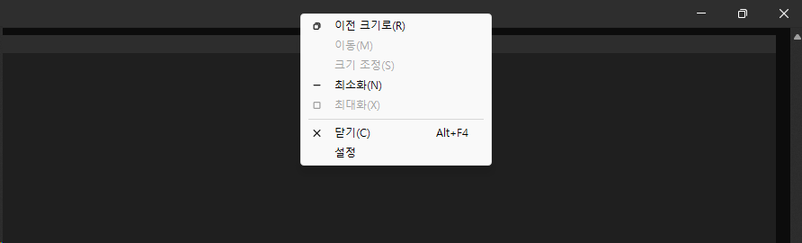
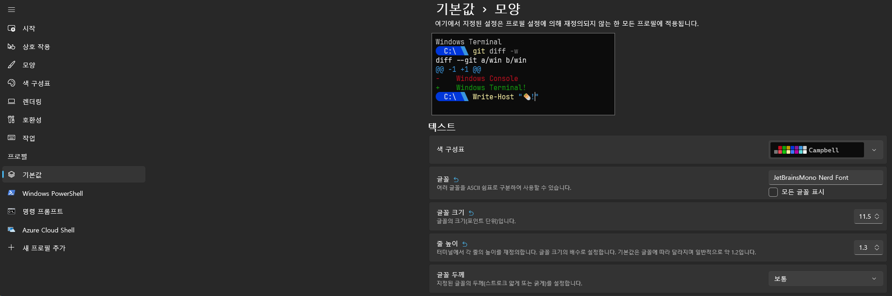
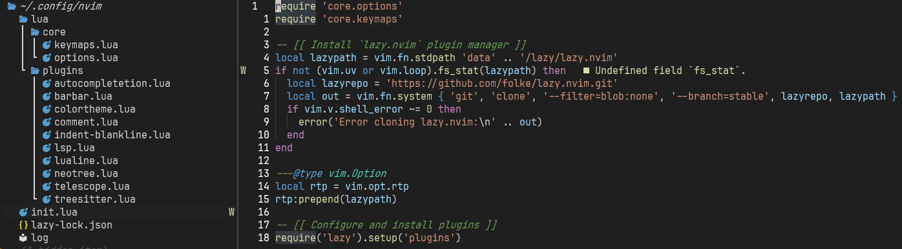

## 🚀 들어가며

이제 실제 NeoVim 화면을 그럴듯하게 꾸며볼 예정인데, 개인적으로 이 부분이 가장 재미있었다 ^_^

나는 VSCode에 익숙해서 VSCode 테마를 적용했지만 유저들이 만든 다른 테마들도 굉장히 많다. (사실 다른 테마 이것저것 적용해 봤는데, 다 눈이 너무 피곤했다.. VSCode가 확실히 컬러감을 잘 뽑은 듯.)



[dotfyle(클릭)](https://dotfyle.com/neovim/colorscheme/top)에 접속하면 여러 테마를 살펴볼 수 있다. 

## 폰트 설정

테마를 설정하기 전, 아이콘 지원을 위해 [Nerd Font Famliy](https://www.nerdfonts.com/)를 설치한다.



### 폰트 다운로드

Downloads 버튼을 클릭해 다운로드 페이지로 접속한다. 여러 폰트들이 있는데, 나는 `JetBrainsMono Nerd Font`를 선택했다. 

다운로드받고 압축을 풀면 여러 크기의 폰트 파일들이 있다. Light 폰트가 적용했을 때 가장 부담스럽지 않기 때문에 이 폰트만 설치하는 것을 권장한다.



세모주의세모: 뒤에 `Mono` 나 `Propo`가 붙어 있는 파일이 아닌 `JetBrainsMonoNerdFont`라고만 되어 있는 파일을 설치할 것! 다른 파일들은 아이콘이 작게 출력되는 문제가 생긴다.

### 터미널에 폰트 적용



윈도우 기준으로 설명하면, cmd 창을 켜고 상단 바에서 우클릭해 설정에 들어간다.



왼쪽 사이드바에서 '기본값'을 선택하고 '모양' 탭에 들어가 클꼴을 JetBrainsMono Nerd Font로 설정해주고, 크기와 높이를 선호에 맞게 조절한다.

우측 하단 '저장'을 누르고 다시 터미널로 돌아가면 변경사항이 적용된다!축하축하

## `vscode.nvim` 테마 플러그인 설치

이제 본격적으로 테마를 설정할 차례이다 ><

[vscode.nvim(클릭)](https://github.com/Mofiqul/vscode.nvim?tab=readme-ov-file)은 lazy 방식의 플러그인 설치에 대한 매뉴얼을 제공하고 있지 않다. 다음과 같이 작성하면 된다.

```lua
--[[ lua/plugins/colorscheme.lua ]]

return {
  'Mofiqul/vscode.nvim',
  lazy = false,
  priority = 1000,
  config = function()
    local c = require('vscode.colors').get_colors()
    require('vscode').setup({
      -- Alternatively set style in setup
      -- style = 'light'

      -- Enable transparent background
      transparent = false,

      -- Enable italic comment
      italic_comments = true,

      -- Enable italic inlay type hints
      italic_inlayhints = true,

      -- Underline `@markup.link.*` variants
      underline_links = true,

      -- Disable nvim-tree background color
      disable_nvimtree_bg = true,

      -- Apply theme colors to terminal
      terminal_colors = true,

      -- Override colors (see ./lua/vscode/colors.lua)
      color_overrides = {
        vscLineNumber = '#FFFFFF',
      },

      -- Override highlight groups (see ./lua/vscode/theme.lua)
      group_overrides = {
        -- this supports the same val table as vim.api.nvim_set_hl
        -- use colors from this colorscheme by requiring vscode.colors!
        Cursor = { fg=c.vscDarkBlue, bg=c.vscLightGreen, bold=true },
      }
    })
    vim.cmd.colorscheme('vscode')
  end
}
```

- lazy = false
- priority = 1000

이 부분들은 테마가 지연 로딩되지 않도록 한다. 테마가 항상 가장 먼저 적용되어 우리 눈에 보이도록 하는 설정이다.



플러그인을 추가하고 NeoVim을 재시작하면 사진처럼 VSCode와 동일한 컬러가 나타난다. 

중괄호 색이 다 똑같이 파란색이라는 게 아쉽지만..ㅠ 인덴트를 표시해주면 쓸만하다. 레인보우로 중괄호를 표시해주는 플러그인이 있긴 한데, 어지러울 것 같아서 나는 설치하지 않았다.

## 인덴트 표시하기

VSCode 스타일의 테마를 적용한다고 바로 인덴트 보조선이 나타나진 않고, 플러그인을 설치해야 한다.

가장 보편적인 플러그인은 [indent-blankline(클릭)](https://github.com/lukas-reineke/indent-blankline.nvim)이다. README에 lazy로 설치하는 방법이 나와 있다.

```lua
return {
  'lukas-reineke/indent-blankline.nvim',
  main = 'ibl',
  ---@module "ibl"
  ---@type ibl.config
  opts = {
    indent = {
      char = "▏",
    },
    scope = {
      enabled = false,
    },
  },
}
```

기본으로 적용되는 기호가 너무 두꺼워서 옵션을 수정해 좀 더 얇은 기호로 변경했다.

저장하고 재시작하면 이전 사진처럼 예쁜 인덴트 보조선이 나타난다!

## 파일 트리 테마 수정

VSCode에서는 파일 트리가 코드 스니펫보다 어둡다. 이를 반영하기 위해 한 가지 수정사항을 추가한다.

```lua
-- Override highlight groups (see ./lua/vscode/theme.lua)
group_overrides = {
  -- this supports the same val table as vim.api.nvim_set_hl
  -- use colors from this colorscheme by requiring vscode.colors!
  Cursor = { fg=c.vscDarkBlue, bg=c.vscLightGreen, bold=true },

  -- Neo-tree 배경색 추가
  NeoTreeNormal = { bg = "#191926" },
  NeoTreeNormalNC = { bg = "#191926" },
}
```

`group_overrides` 프로퍼티 안에 neo-tree의 기본/포커스 시 색상 설정을 추가한다.

## ✨ 마치며

이제 VSCode와 비슷한 UI가 완성되었다! 축하축하

NeoVim을 구성하는 데 걸림돌이 되는 것 중 하나가 눈에 익지 않은 컬러감과 요소 배치라고 생각한다. 개인적으로 잘 만들어진 UI도 익숙함을 이길 수 없다고 생각하기 때문에.. 더 나은 걸 찾기보다는 내가 몇 년 간 익숙해진 VSCode를 똑같이 따라하는 데 주안점을 뒀다.

다음 포스트에서 Bufferline과 StatusLine을 구성하면 이제 화면 관련된 설정은 끝난다.