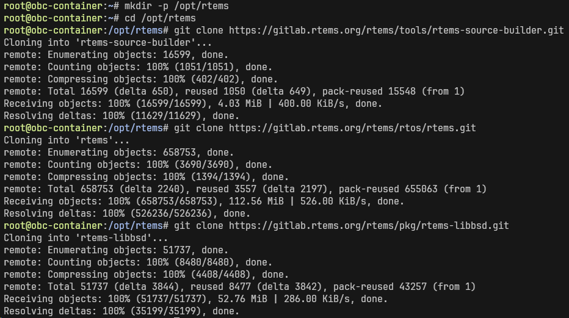
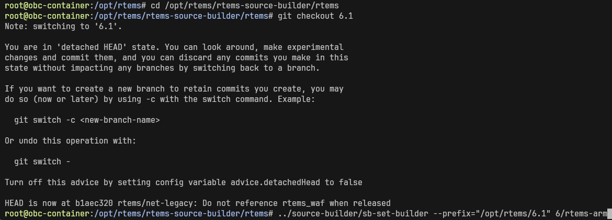

## 🚀 들어가며


RTOS를 처음 시작할 때 FreeRTOS로 입문하는 경우가 가장 많을 것이다. 가볍고 오픈소스이기 때문인데, RTEMS 역시 오픈소스 RTOS이며 NASA 및 ESA 임무에서 오랫동안 쓰여온 헤리티지를 바탕으로 우주항공 분야에서 꾸준히 활용되고 있다.

RTEMS는 다양한 아키텍처와 보드를 지원하며, 각 보드에 맞는 BSP(Board Support Package)를 선택해서 빌드하게 된다. 예를 들어 x86 아키텍처의 pc686, ARM의 Raspberry Pi, SPARC의 leon3 등이 있고, 당연히 비글본 시리즈 보드를 위한 BSP도 준비되어 있다.

단점이라면 보드가 바뀌면 장장 두 시간이 걸리는 빌드 과정을 또 거쳐야 한다는 점.. 정도가 되겠다. 그러나 이 부분은 하드웨어와 긴밀한 상호작용을 해야 하는 RTOS 특성상 어쩔 수 없는 부분인 것 같다.

**참고자료**

- [RTEMS Quick Start: Preparation](https://docs.rtems.org/docs/main/user/start/preparation.html)
- [Getting started with RTEMS on Beaglebone black - part I](https://blog.thelunatic.dev/getting-started-bbb-1/)
- [Getting started with RTEMS on Beaglebone black - part II](https://blog.thelunatic.dev/getting-started-bbb-2/)

## ⏱️ RTEMS 및 추가 패키지 설치

### 1. RTEMS 소스 트리 준비

RTEMS 빌드를 위해서는 RTEMS Source Builder(RSB)와 본체 RTEMS 소스코드가 필요하다. RSB는 크로스 컴파일 툴체인을 소스부터 빌드해주는 도구이고, rtems는 커널과 각 보드용 BSP 소스가 들어 있는 메인 저장소이다.

또한 네트워크 스택이나 디바이스 드라이버 같은 추가 기능을 쓰기 위해 rtems-libbsd도 함께 받는다. rtems-libbsd는 FreeBSD에서 포팅한 네트워크 스택·디바이스 드라이버 등을 RTEMS에서 쓸 수 있게 해주는 라이브러리이다.

```bash
mkdir -p /opt/rtems
cd /opt/rtems

git clone https://gitlab.rtems.org/rtems/tools/rtems-source-builder.git
git clone https://gitlab.rtems.org/rtems/rtos/rtems.git
git clone https://gitlab.rtems.org/rtems/pkg/rtems-libbsd.git
```



### 2. RSB로 크로스 컴파일 툴체인 빌드

ARM 타겟용 크로스 컴파일 툴체인을 빌드한다. 이제부터는 꼭 6.1 버전 브랜치로 체크아웃해 버전을 맞춰 주어야 한다.

빌드 결과물은 `/opt/rtems/6.1`에 설치된다.

```bash
cd /opt/rtems/rtems-source-builder/rtems
git checkout 6.1
../source-builder/sb-set-builder --prefix="/opt/rtems/6.1" 6/rtems-arm
```



### 3. BeagleBone Black BSP로 RTEMS 설치

다음은 실제 RTEMS를 설치하는 과정인데, 이때 BSP를 지정해 줌과 동시에 POSIX API를 활성화해야 한다. POSIX 없이 소스를 빌드하면 나중에 libBSD 설치 과정에서 에러가 발생한다.

```bash
export PATH=/opt/rtems/6.1/bin:"$PATH"

cd /opt/rtems/rtems
git checkout 6.1

# The official command
#echo -e "[arm/beagleboneblack]" > config.ini

# In our case
sudo tee config.ini << EOF
[arm/beagleboneblack]
RTEMS_POSIX_API = True
EOF
```

RTEMS 6 계열부터는 Python 기반의 Waf라는 빌드 시스템을 사용한다. 이전 RTEMS 5.x까지는 GNU autoconf/automake 기반이었기 때문에 bootstrap 스크립트를 별도로 실행해야 했는데, 이제는 간편하게 여러 타겟 아키텍처를 빌드할 수 있게 되었다.

Waf는 단일 Python 스크립트로 배포되는 빌드 시스템으로, 프로젝트 저장소에 직접 포함시켜 별도 설치 없이 바로 사용할 수 있다. RTEMS도 마찬가지로 waf 스크립트가 루트 디렉터리에 이미 존재한다.

```bash

./waf configure --prefix "/opt/rtems/6.1"
./waf
./waf install
```

### 4. libBSD 라이브러리 빌드

libBSD도 마찬가지로 6.1 버전으로 체크아웃하고, Waf 업데이트까지 진행해 준다.

```bash
cd /opt/rtems/rtems-libbsd
git checkout 6.1
git submodule init
git submodule update rtems_waf
```

올바른 BSP와 설정 파일을 사용해 빌드한다.

```bash
./waf configure --prefix="/opt/rtems/6" \
    --rtems-bsps=arm/beagleboneblack \
    --buildset=buildset/default.ini
./waf
./waf install
```

## 🎻 RTEMS 부팅 파일 구성

이전에 리눅스 이미지를 업데이트했던 것처럼, SD 카드 FAT 파티션에 RTEMS 부팅을 위한 파일들을 저장해 MMC1 부팅을 해 보자.

### RTEMS 커널 이미지

먼저 실제 운영체제가 담겨 있는 커널 이미지를 생성한다. RTEMS 소스에 미리 포함된 예제 실행파일을 사용하면 컴파일이 필요 없으므로 이를 복사해 온다.

만약 `/opt/rtems`가 아닌 다른 곳에 설치했다면 환경에 맞게 바꿔 주면 된다.

```bash
cp -r /opt/rtems/rtems/build/arm/beagleboneblack/testsuites/samples/ ~/rtems-samples
cd ~/rtems-samples
```

각 예제의 실제 소스코드가 궁금하다면 `/opt/rtems/rtems/testsuites/samples/` 디렉토리에서 확인할 수 있다. 

`hello.exe`는 ELF 포맷이므로 U-Boot가 인식할 수 있는 이미지로 변환해야 한다. `objcopy`로 raw binary를 추출하고, gzip으로 압축한 뒤 `mkimage`로 U-Boot 헤더를 붙인다.

```bash
arm-rtems5-objcopy hello.exe -O binary hello.bin
gzip -9 hello.bin
mkimage -A arm -O linux -T kernel -a 0x80000000 -e 0x80000000 -n RTEMS -d hello.bin.gz rtems-hello.img
```

`mkimage` 명령어의 여러 옵션들은 각각 다음과 같은 의미를 가진다.

| 옵션 | 설명 |
|:---:|---|
|-A | Architecture |
|-O | OS |
|-T | Type of image |
|-a | load address |
|-e | entry point |
|-n | image name |
|-d | The image data file |

### `uEnv.txt`

U-Boot는 부팅 시 `uEnv.txt` 파일을 읽어 초기 환경 변수를 설정한다. 여기에는 어떤 파일을 메모리의 어느 주소에 올릴지, 그리고 그것을 어떻게 실행할지에 대한 정보가 담겨 있다.

이전에 데비안 이미지를 SD카드로 업데이트한 적이 있다면 `uEnv.txt`가 이미 있을 것이다. 이 경우 파일을 그대로 사용하면 되고, 없다면 다음 내용을 담아 파일을 생성한다.

```ini
setenv bootdelay 5
uenvcmd=run boot
boot=fatload mmc 0 0x80800000 rtems-app.img ; fatload mmc 0 0x88000000 am335x-boneblack.dtb ; bootm 0x80800000 - 0x88000000
```

세미콜론까지가 모두 `boot` 변수에 포함되므로 줄바꿈을 하지 말고 그대로 넣도록 한다.


### device tree blob (dtb) 
It is now compulsory to use a device tree blob (dtb) file to load the device tree during bootin. So we need the am335x-boneblack.dtb file.


그러면 이미 DTB가 있습니다.

RTEMS libbsd 빌드 시 DTB가 함께 생성됩니다. 찾아보세요:

bash
find /opt/rtems -name "am335x-boneblack.dtb" 2>/dev/null

또는 libbsd 빌드 디렉토리 안:

bash
find ~/libbsd -name "*.dtb" 2>/dev/null

있으면 FreeBSD clone 없이 그걸 그대로 SD 카드에 복사하면 됩니다.
```bash
git clone https://github.com/freebsd/freebsd.git
MACHINE='arm' freebsd/sys/tools/fdt/make_dtb.sh \
freebsd/sys \
freebsd/sys/gnu/dts/arm/am335x-boneblack.dts \
$(pwd)
```


**cpp 옵션**

- `-P` : 라인 마커 출력 안 함 (전처리된 순수 코드만)
- `-x assembler-with-cpp` : 어셈블러 형식으로 처리 (DTS 파일이 C 매크로를 사용하므로)`
- `-D__DTS__` : `__DTS__` 매크로 정의 (조건부 컴파일용)
- `-I ../../../../include` : 헤더 파일 경로 지정 (여기서 `dt-bindings/` 등의 헤더를 찾음)
→ `#include`와 매크로(`GPIO_ACTIVE_HIGH` 등)를 처리하기 위해서

**dtc 옵션**

- `-I dts` : 입력 형식은 Device Tree Source (텍스트)
- `-O dtb` : 출력 형식은 Device Tree Blob (바이너리)
- `-o ~/am335x-boneblack.dtb` : 출력 파일 경로


## ✨ 마치며
