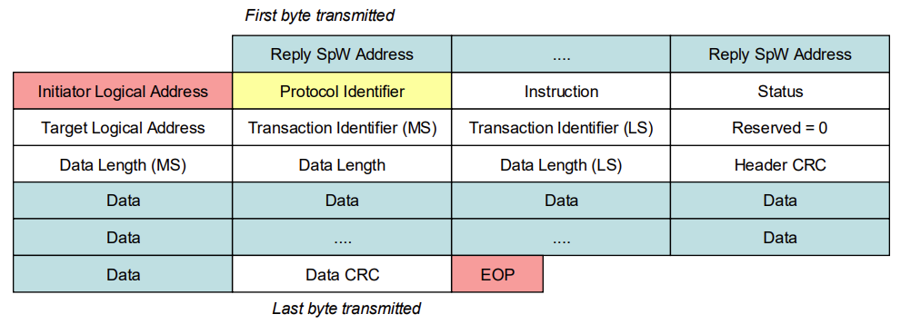
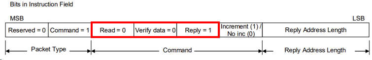
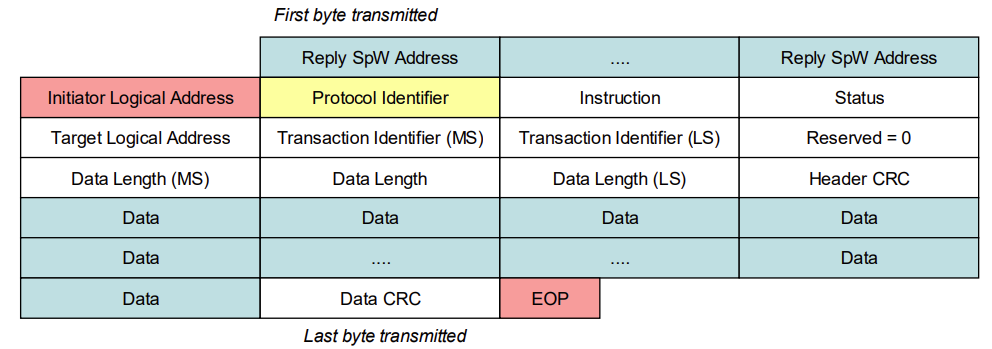
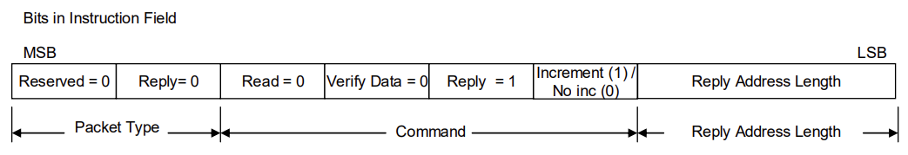
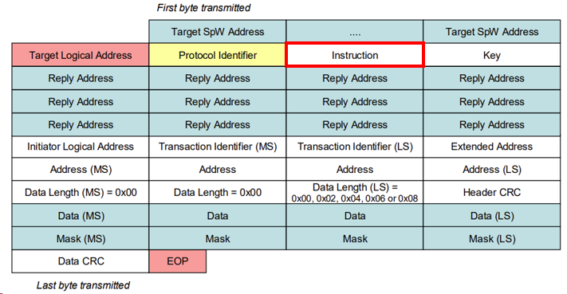
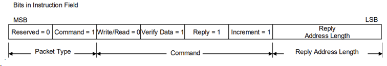
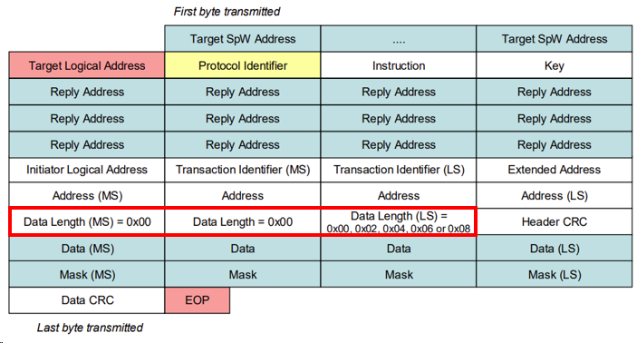
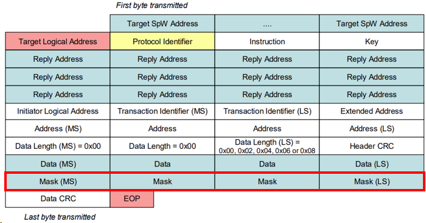
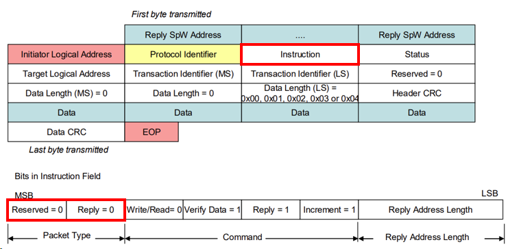
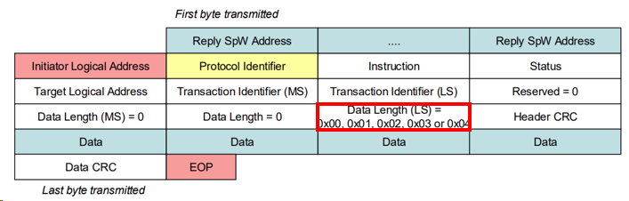

## 🚀 들어가며

RMAP의 웬만한 패킷 필드와 트랜잭션을 살펴보기에는 Write Command 만한 것이 없다. 하지만 그렇다고 나머지 트랜잭션을 뭉뚱그리고 넘어갈 수는 없는 법.

Read 및 Read-Modify-Write 명령어도 기본 골조는 같지만 세부 설정과 신경써야 할 부분이 다르다. 이번 포스트에서는 이 두 명령어를 다루어 보려 한다.

**참고자료**

- [ECSS-E-ST-50-52C – SpaceWire – Remote memory access protocol (5 February 2010) (Web)](https://ecss.nl/standard/ecss-e-st-50-52c-spacewire-remote-memory-access-protocol-5-february-2010/)
- [ECSS-E-ST-50-52C – SpaceWire – Remote memory access protocol (5 February 2010) (PDF)](https://ecss.nl/wp-content/uploads/standards/ecss-e/ECSS-E-ST-50-52C5February2010.pdf)

> **저작권 안내**
> 
> 본 포스트에 포함된 일부 이미지는 ECSS(European Cooperation for Space Standardization) 문서(ECSS-E-ST-50-52C 등)에서 발췌 캡처한 것이며, 해당 이미지의 저작권은 ESA/ECSS에 있습니다. 본 캡처는 비상업적 개인 기술 블로그에서의 학습 및 정보 공유 목적으로만 사용되었으며, 각 이미지 하단에 출처 문서를 표기하였습니다. 저작권 관련 문제가 있을 경우 알려주시면 즉시 수정 또는 삭제하겠습니다.
> 
> **Copyright Notice**
> 
> Some images in this post are captured excerpts from ECSS (European Cooperation for Space Standardization) documents (e.g., ECSS-E-ST-50-52C), and copyright for those images belongs to ESA/ECSS. These captures are used solely for non-commercial, educational purposes on a personal technical blog, with the source document noted below each image. If you have any copyright issues, please contact me and I will edit or remove the content promptly.

## 🔖 Read Command

Read Command는 거의 모든 필드가 Write Command와 구조가 같다. 단 읽기 액션이므로 Data 내용과 Data CRC는 포함되지 않았다.

Read Command의 Instruction 필드에서 살펴볼 부분은 다음과 같다.

1. 비트 5는 Write=1, Read=0 이므로 0으로 고정된다.
2. Data CRC가 없으므로 Verify 비트는 0으로 고정된다.
3. 읽은 내용을 받아야 하므로 Reply(Acknowledge) 비트는 1로 고정된다.

## 📥 Read Reply

반대로 Read Reply에 Data와 Data CRC가 포함되어 있다.

Reply 패킷이므로 `Packet Type=00` 이다.

## 🔮 Read-Modify-Write

Read-Modify-Write(RMW)는 지난 두 명령어와 다르게 대량의 데이터를 다룰 수 있는 것이 아닌, 레지스터의 원자적 접근을 위한 명령어이다.

여러 하드웨어가 같은 레지스터를 공유하는 경우, write로 레지스터를 덮어쓰면 그 사이에 다른 하드웨어가 바꿔놓은 비트를 날려버릴 수 있다. RMW는 비트 마스크를 사용하여 target 쪽에서 이 문제를 비트 단위로 처리할 수 있게 한다.

    Data   [[1]] [0] [0] [0] [[1]] [[0]] [[0]] [0]
    Mask   [[1]] [0] [0] [0] [[1]] [[1]] [[1]] [0] <- This has to be 1
    Read   [[1]] [1] [1] [0] [[0]] [[0]] [[1]] [1]
    Result [[1]] [1] [1] [0] [[1]] [[0]] [[0]] [1]

이중 대괄호로 표시된 것처럼 Mask 비트가 1인 위치는 Data 필드의 값으로 덮어써지고, Mask 비트가 0인 위치는 원래 Read 값이 그대로 유지된다.

## 🪡 Read-Modify-Write Command

### Instruction

RMW의 Instruction 필드는 모든 값이 고정되어 있다.

- Packet Type: `01`=Command
- Write/Read=`0`: Read 명령과 동일하게 clear 상태로 설정한다.
- Verify=`yes`: RMW를 일반 Read 명령과 구분짓는다.
- Reply=`yes`: 해당 주소에 원래 들어있던 값을 반환받는다.
- Increment=`yes`: 여러 바이트에 걸쳐 RMW가 적용될 경우 주소가 자동으로 증가한다.

### Data Length

RMW의 Data Length 필드는 Data 필드와 Mask 필드의 길이를 합한 값을 가진다. 예를 들어 2바이트 워드를 RMW하는 경우 Data 2바이트 + Mask 2바이트로 Data Length는 0x04가 된다.

최대 4바이트를 수정할 수 있으므로 Data Length는 0x00, 0x02, 0x04, 0x06, 0x08 중 하나의 값만 가지게 된다.

### Mask

앞에서 설명한 것과 같이 메모리에 실제로 어떤 값을 써넣을지 결정하는 데 사용된다. Data와 조합하는 방식은 다음과 같다.

    Written Data = (Mask AND Command_Data) OR (NOT Mask AND Read_Data)

다만 Read 값과 Mask, Data를 조합하는 구체적인 방식 자체는 규격에서 강제하지 않고 target 쪽 애플리케이션의 구현에 맡겨져 있다. 위 방식은 하나의 예시일 뿐이며, target에 따라 test-and-set과 같은 다른 조합 방식을 구현할 수도 있다.

## 👌🏻 Read-Modify-Write Reply

RMW Reply에는 Modify하기 전 Read 값이 함께 실려서 반환된다. Initiator는 이 값을 통해 수정 전 레지스터 상태도 같이 확인할 수 있다.

### Instruction

- Packet Type: `00`=Reply

### Data Length

Command에서는 Data와 Mask를 모두 보내기 때문에 그 둘을 합한 값이지만, Reply에서는 Data만 담겨 있으므로 0x00 ~ 0x04의 값을 가진다.

## ✨ 마치며

RMAP이 RMW를 효과적으로 지원하지만, 실제 자주 사용되는 것은 Write/Read Command인 것 같다. 매뉴얼을 살펴보면 RMW를 제외하고 구현하는 것도 지원된다고 적혀 있으니, 만약 공식 스펙을 바탕으로 IP를 만든다면 상황에 맞게 선택해 구현하는 것도 가능해 보인다.

SpaceWire의 상위 프로토콜로는 CCSDS packet transfer protocol이 또 있다. 기회가 된다면 이 프로토콜도 공부하여 다뤄 보고 싶다.