## 🚀 들어가며

SpaceWire 프로토콜 자체는 패킷 전송을 위한 껍데기이다. 노드와 라우터를 연결하고, 그 사이 링크를 모두 수립하고 패킷을 주고받을 수 있게 되면, 이제 중요한 것은 '어떤 데이터를 송수신하는지'에 대한 문제이다.

SpaceWire는 공식적으로 두 개의 상위 프로토콜을 제공한다. 메인 메모리에 데이터를 읽고 쓸 수 있도록 하는 RMAP(Remote Memory Access Protocol)과, 패킷 여러 개를 송수신할 수 있게 하는 CCSDS packet transfer protocol이다.

**참고자료**

- [ECSS-E-ST-50-52C – SpaceWire – Remote memory access protocol (5 February 2010) (Web)](https://ecss.nl/standard/ecss-e-st-50-52c-spacewire-remote-memory-access-protocol-5-february-2010/)
- [ECSS-E-ST-50-52C – SpaceWire – Remote memory access protocol (5 February 2010) (PDF)](https://ecss.nl/wp-content/uploads/standards/ecss-e/ECSS-E-ST-50-52C5February2010.pdf)

> **저작권 안내**
> 
> 본 포스트에 포함된 일부 이미지는 ECSS(European Cooperation for Space Standardization) 문서(ECSS-E-ST-50-52C 등)에서 발췌 캡처한 것이며, 해당 이미지의 저작권은 ESA/ECSS에 있습니다. 본 캡처는 비상업적 개인 기술 블로그에서의 학습 및 정보 공유 목적으로만 사용되었으며, 각 이미지 하단에 출처 문서를 표기하였습니다. 저작권 관련 문제가 있을 경우 알려주시면 즉시 수정 또는 삭제하겠습니다.
> 
> **Copyright Notice**
> 
> Some images in this post are captured excerpts from ECSS (European Cooperation for Space Standardization) documents (e.g., ECSS-E-ST-50-52C), and copyright for those images belongs to ESA/ECSS. These captures are used solely for non-commercial, educational purposes on a personal technical blog, with the source document noted below each image. If you have any copyright issues, please contact me and I will edit or remove the content promptly.

## 🗞️ RMAP Command의 종류

RMAP에는 **Write Command**, **Read Command**, 그리고 **Read-Modify-Write Command** 세 가지 명령이 존재한다. 세 Command 모두 타겟 노드의 메모리 공간에 접근한다는 공통점을 가지며, 접근 방식과 Reply 발생 여부에서 차이가 있다.

| Command | 목적 | Reply 패킷 |
|---|---|---|
| Write | Target 메모리에 데이터 쓰기 | 선택적 응답 |
| Read | Target 메모리에서 데이터 읽기 | 항상 응답 |
| Read-Modify-Write | 메모리 값을 읽고 일부 비트만 수정해 재기록 | 항상 응답 |

응답을 받을지 받지 않을지에 대한 설정은 패킷 내부의 Instruction 필드로 결정된다. 오늘의 포스트에서는 패킷 필드를 가장 폭넓게 살펴볼 수 있는 Write Command를 먼저 다룬다.

## 🧢 Write Command Header

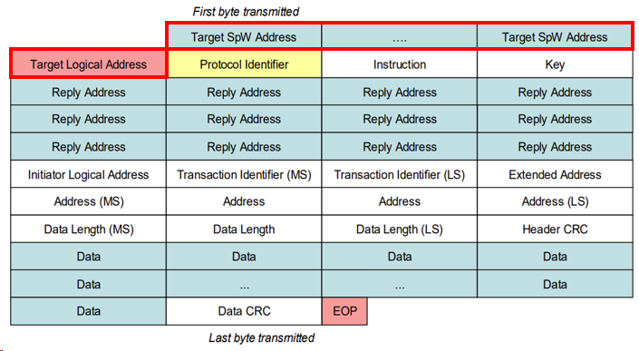

SPW 패킷의 헤더는 항상 "타겟으로 가는 경로"이다. 이전 포스트에서 설명했듯 네트워크가 path addressing을 채택하고 있다면 경로 정보를 모두 담고, logical addressing을 채택하고 있다면 TLA만 담도록 한 후 라우터에 라우팅 테이블을 모두 구성해야 한다.

## 🖊️ Write Command Cargo

### Protocol ID

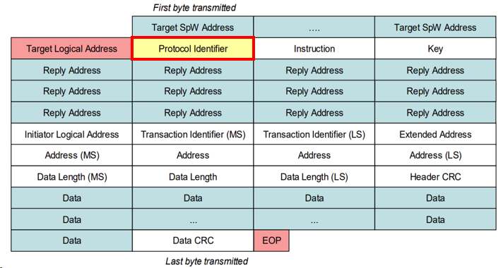

SPW Target Hardware는 최종 카고를 받으면 가장 먼저 첫 바이트를 확인해 이것이 어떤 패킷인지 확인한다.

예를 들어 RMAP의 Protocol ID는 0x01, CCSDS는 0x02이므로 이 값을 받는다면 자동으로 해당 프로토콜에 따라 처리하고, 그 외의 값을 받는다면 일반 SPW 패킷으로 처리한다.

### Instruction

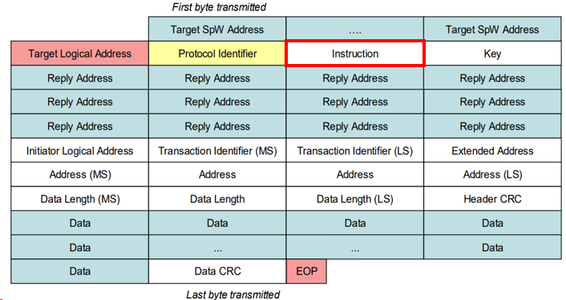

Instruction 필드는 내부 8비트 각각이 모두 정보값을 갖는다.

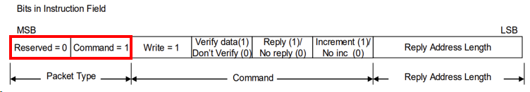

비트 7, 6은 패킷 타입을 정의한다.

- Packet Type 01 = Command Packet
- Packet Type 00 = Reply Packet

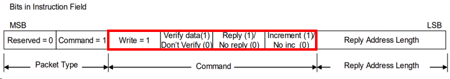

비트 5~2는 명령에 대한 세부 설정을 담고 있다.

- Read/Write: `Read=0`, `Write=1`
- Verify: 수신한 데이터가 정확한지 Data CRC를 먼저 검증해 확인한다. 이때 데이터를 저장해 CRC를 계산할 버퍼가 넉넉해야 하기 때문에 너무 큰 데이터는 에러를 반환한다.
- Reply(Acknowlege): Write 수행 시 패킷만 제대로 전송되면 정상 동작으로 처리할지, 아니면 응답을 받아 리턴 코드 및 타임아웃을 확인할지 결정하는 비트이다.
- Increment: 워드 단위의 데이터를 같은 주소에 계속해서 쓸지, 아니면 4바이트씩 주소를 증가시켜 가며 쓸지 결정하는 비트이다. 

> Reply Address Length는 Reply Address Field 섹션에서 함께 설명한다.

### RMAP Key

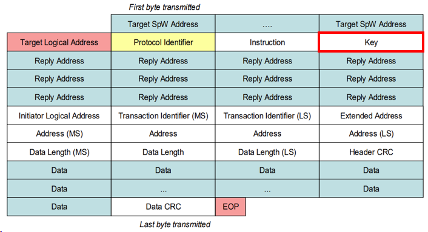

타겟 하드웨어에는 TLA 외에도 RMAP Key라는 검증용 필드가 존재한다. 하드웨어의 키와 패킷에 설정된 키값이 동일해야 하며, 다를 경우 패킷은 폐기된다.

### Reply Address

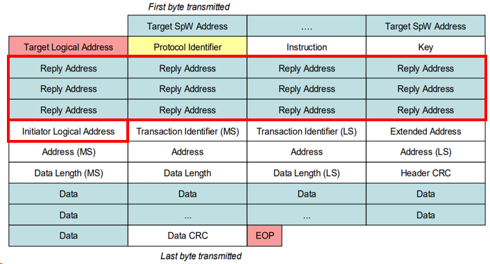

RMAP 패킷 대부분은 응답을 받는다. 이때 자동으로 경로가 저장되지 않으므로 따로 응답 패킷이 돌아올 경로를 알려줘야 한다. Target Address와 마찬가지로 네트워크 규약에 따라 path addressing, logical addressing 각 방식에 맞게 필드를 채워 주면 된다.

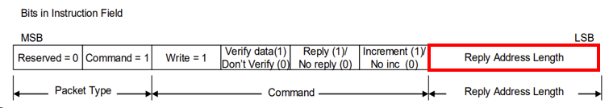

⚠️ 꼭 알아두어야 할 점: Reply Address는 항상 4 byte 정렬된다. ⚠️

예를 들어, 돌아올 경로가 3번 포트, 1번 포트 두 개라면 앞에 패딩을 주어 `0x00` `0x00` `0x03` `0x01`로 패킷에 담긴다.

또한 Instruction Field의 Reply Address Length 2비트로 Reply Address가 총 몇 바이트인지 결정된다.

- `00` = 0 byte
- `01` = 4 bytes
- `10` = 8 bytes
- `11` = 12 bytes

따라서 응답 패킷을 생성할 때는 먼저 Reply Address Length를 파악하고, 앞쪽 0x00 패딩을 모두 제거한 후 응답 패킷 헤더에 해당 경로를 붙인다.

### Transaction ID

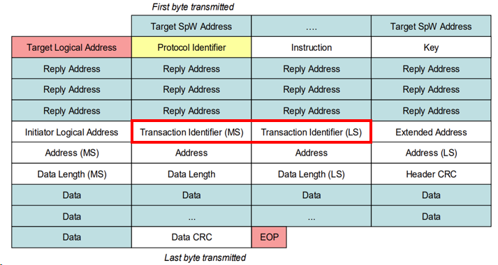

Initiator가 연속해서 여러 개의 패킷을 전송하는 경우, 여러 개의 응답이 들어왔을 때 해당 응답이 어떤 요청과 매칭되는지 구별할 수 있어야 한다. Transaction ID는 이러한 상황에서 패킷 구별이 가능하도록 패킷별로 부여되는 ID이다.

### Address

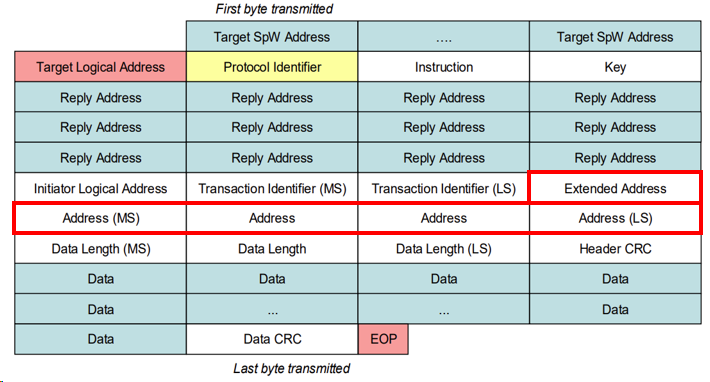

데이터를 쓸(읽을) 타겟 노드의 내부 주소이다. 이 중 Extended Address는 40 bit 주소를 지원하기 위한 추가 상위 8비트인데, 많은 경우 단순히 0으로 채워져 있다.

### Data Length

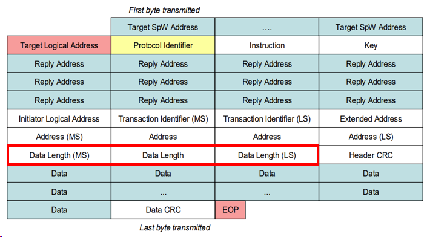

Data Length Field는 총 24비트로, RMAP 패킷은 이론적으로 최대 16MB(정확하게는 16MB-1) 데이터를 한 번에 전송할 수 있다.

### Header/Data CRC

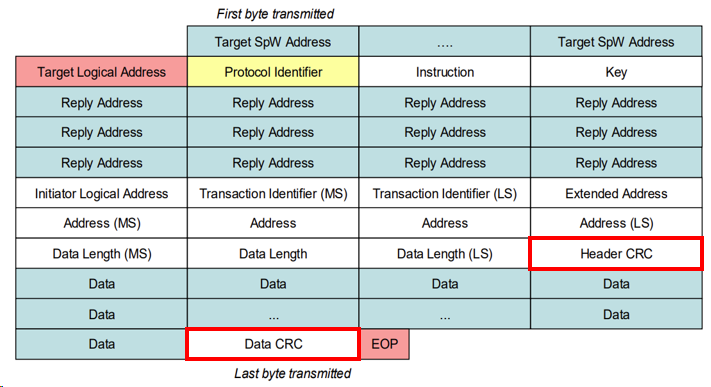

RMAP CRC는 표준 256-entry 룩업 테이블 방식을 사용하며, 테이블은 ECSS-E-ST-50-52C 문서 Annex A.3에서 확인할 수 있다.

타겟 하드웨어는 데이터를 읽기 전에 먼저 헤더 CRC를 확인해 오류가 없는지 검증하고, 그 뒤에 데이터를 읽는다. 손상된 헤더 정보로 인한 오동작을 조기에 방지하고, 불필요한 데이터 처리를 막기 위한 방침이다.

데이터 CRC는 Verify 비트 설정에 따라 동작이 다르다. 비트가 1일 경우 쓰기 수행 전에 버퍼에서 CRC를 검증하고, 틀리면 에러 반환 후 아예 동작을 수행하지 않는다. 반면 0일 경우 일단 메모리에 쓴 후 CRC를 검증하며, 틀리면 에러를 반환하게 된다.

## 💬 Write Reply Header

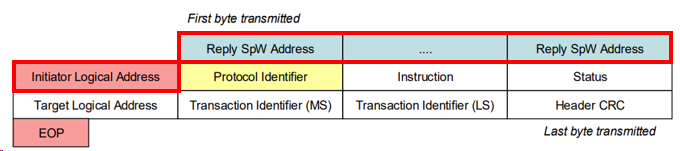

Reply Address도 동일하게 동작하며, 이는 Command Packet에 포함되어 있던 값들이다.

## ☸️ Write Reply Cargo

### Instruction

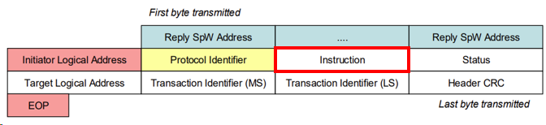

Reply Packet의 Instruction 필드는 Command와 유사하지만, 몇몇 값이 변경되거나 고정되어 있다.

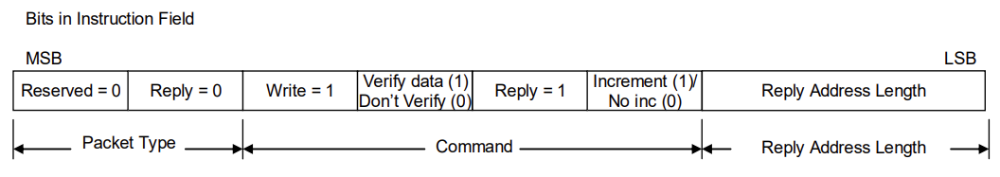

- Packet Type 00 = Reply
- Reply(Acknowledge) Bit = 1

### Status

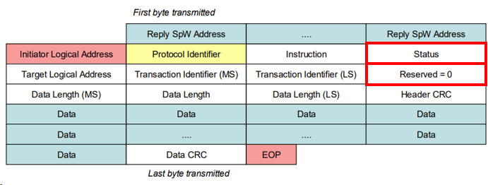

가장 중요한 필드라고 할 수 있다. Status 필드가 0이면 정상 동작이며, non-zero이면 에러이다. 에러 코드에 대한 내용은 아래에서 후술한다.

추가로 패킷 형식을 맞추기 위한 reserved 필드가 있다.

## 🎌 RMAP Status Codes

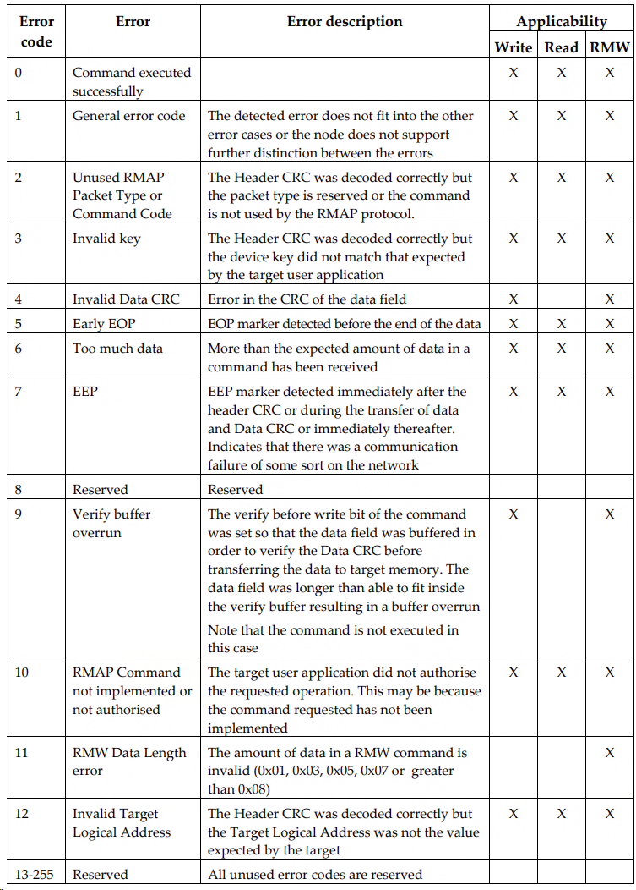

Non-zero 에러코드는 위 표에서 볼 수 있듯이 11종류이다.

이 중 General Error Code 1이 조금 애매한데, 발생하는 데에는 여러 이유가 있지만 주로 접근할 수 없는 주소에 접근했을 때 발생한다. `0x0040_0000`에 접근해야 하는데 `0x4000_0000`에 접근하는 경우를 예시로 들 수 있다.

이 status code를 확인하기 위해 Write Command를 수행할 때 웬만하면 Acknowledge 비트를 켜 두는 것을 권장한다.

## ✨ 마치며

내가 처음 RMAP을 공부할 때 가장 헷갈렸던 것이 각 패킷 필드의 역할과 어떤 값으로 채워야 하는지였다. 특히 프로토콜 ID, TLA, RMAP Key, Transaction ID 등 내 눈에 똑같아 보이는 식별값이 너무 많아 힘들었는데, 그래서 이번 포스트에 이 필드들과 관련된 내용을 최대한 잘 담으려 노력했다. 서술이 잘 되었으려나 😅

Read Command와 Read-Modify-Write Command도 기본적인 필드 구성은 Write Command와 크게 다르지 않지만, 한 번씩 다룰 필요가 있다. 다음 글에서는 이 두 Command를 다루고, Write/Read 트랜잭션이 실제로 어떤 순서로 주고받아지는지 시퀀스 다이어그램과 함께 정리해보려 한다.