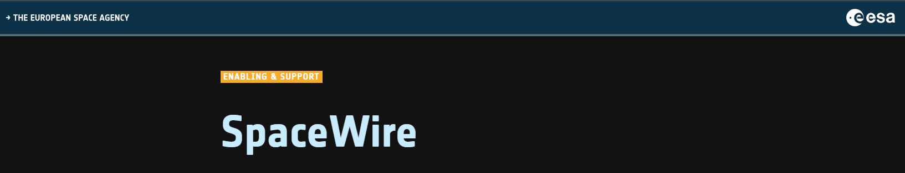
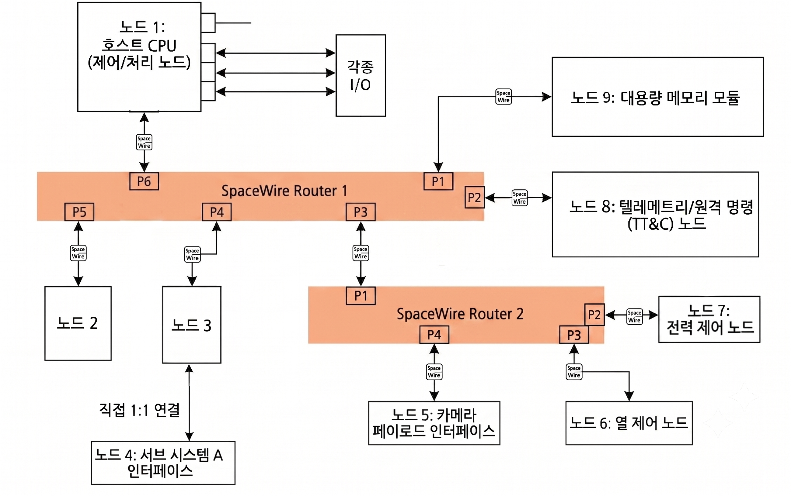
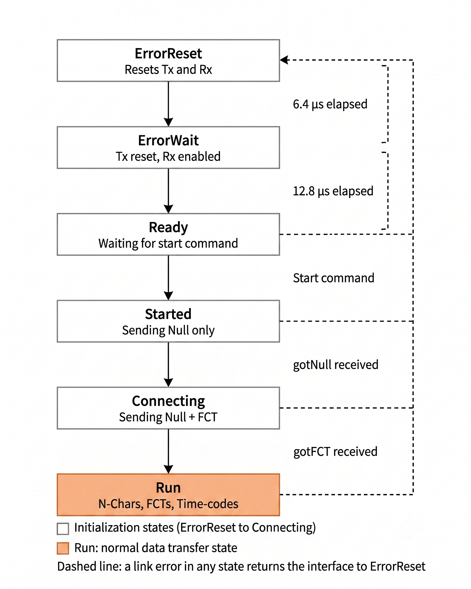
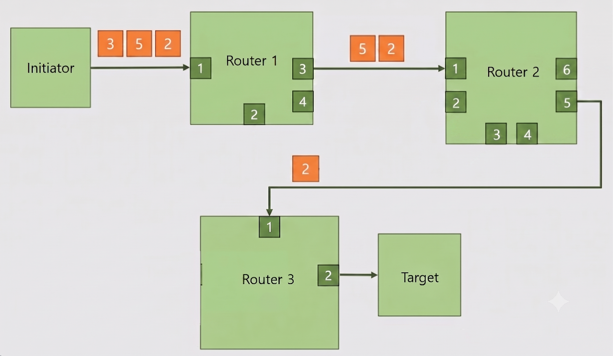
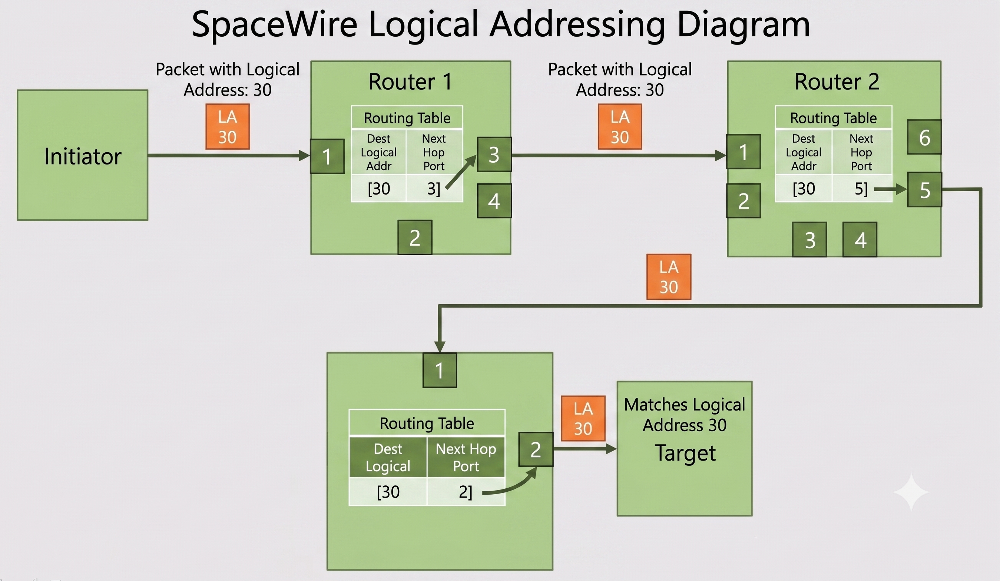

## 🚀 들어가며

위성 내에서는 수많은 컴퓨터와 센서, 메모리, 텔레메트리 시스템이 유기적으로 작동한다. 이 장치들이 서로 데이터를 주고받지 못하면 위성은 그냥 비싼 고철 덩어리일 뿐이다. 💥😢

SpaceWire는 ESA가 표준화한 직렬 통신 프로토콜로, 위성 탑재 컴퓨터와 센서, 메모리 유닛, 텔레메트리 모듈 등을 하나의 네트워크로 묶어 패킷을 송수신하게 해 준다. Gaia, ExoMars, BepiColombo, James Webb Space Telescope, GOES-R, Lunar Reconnaissance Orbiter 등 다양한 ESA·NASA 미션에서 채택되어 온 표준이다.

**참고자료**

- [ESA - SpaceWire - European Space Agency](https://www.esa.int/Enabling_Support/Space_Engineering_Technology/Onboard_Computers_and_Data_Handling/SpaceWire)
- [STAR-Dundee SpaceWire User’s Guide (Web)](https://www.star-dundee.com/spacewire/spacewire-users-guide/)
- [STAR-Dundee SpaceWire User’s Guide (PDF)](https://www.star-dundee.com/wp-content/star_uploads/general/SpaceWire-Users-Guide.pdf)
- [ECSS-E-ST-50-12C Rev.1 – SpaceWire – Links, nodes, routers and networks (15 May 2019) (Web)](https://ecss.nl/standard/ecss-e-st-50-12c-rev-1-spacewire-links-nodes-routers-and-networks-15-may-2019/)
- [ECSS-E-ST-50-12C Rev.1 – SpaceWire – Links, nodes, routers and networks (15 May 2019) (PDF)](https://ecss.nl/wp-content/uploads/2019/05/ECSS-E-ST-50-12C-Rev.1(15May2019).pdf)

## 🪢 SpaceWire 네트워크 구성 예시

SpaceWire 네트워크는 크게 노드와 라우터로 구성된다. 노드와 노드를 연결하는 방법에는 1:1 다이렉트 링크로 직접 연결하는 방식과, 라우터를 거쳐 연결하는 방식이 있다.

라우터는 여러 개의 SpaceWire 포트를 가지고 있고, 패킷에 적힌 주소를 보고 어느 포트로 내보낼지 결정한다. 패킷이 출발지에서 목적지까지 가는 동안 여러 라우터를 거칠 수도 있는데, 이렇게 노드와 라우터가 링크로 얽혀 있는 전체 구조를 SpaceWire 네트워크라 한다.

예를 들어, CPU(노드 1)가 열 제어 모듈(노드 6)에 명령을 내릴 경우 헤더에는 경로 주소인 4, 3을 붙이고, 응답이 필요하다면 데이터(cargo) 영역에 회신용 경로 정보인 1, 8번 포트 정보를 담아서 보내면 된다.

## ⚖️ 포트 간 링크 협상

두 SpaceWire 포트가 처음 연결되면 먼저 서로 몇 가지 신호를 주고받으며 link-up을 해야 한다. 통신할 준비가 완료되었는지 확인하는 과정이라 할 수 있다. 교환하는 문자로는 `NULL`과 `FCT` 등이 있는데, 이때 주의! 🙀 `NULL`은 우리가 흔히 생각하는 `\0`이 아니라 SpaceWire에서 사용하는 특수한 제어 코드이다.

### SpaceWire 문자의 종류

<table style="width: 100%;">
  <colgroup>
    <col style="width: 15%;">
    <col style="width: 12%;">
    <col style="width: 18%;">
    <col style="width: 55%;">
  </colgroup>
  <thead>
    <tr>
      <th>분류</th>
      <th>이름</th>
      <th>구성</th>
      <th>역할</th>
    </tr>
  </thead>
  <tbody>
    <tr>
      <td><strong>데이터 문자</strong></td>
      <td>—</td>
      <td>제어 플래그(0) + 8비트 + 패리티</td>
      <td>실제 데이터를 담는 문자</td>
    </tr>
    <tr>
      <td rowspan="4"><strong>Control Character</strong></td>
      <td>FCT</td>
      <td>단일 제어 문자</td>
      <td>흐름 제어 (Flow Control Token)</td>
    </tr>
    <tr>
      <td>EOP</td>
      <td>단일 제어 문자</td>
      <td>패킷 정상 종료</td>
    </tr>
    <tr>
      <td>EEP</td>
      <td>단일 제어 문자</td>
      <td>패킷 오류 종료 (에러 발생 시)</td>
    </tr>
    <tr>
      <td>ESC</td>
      <td>단일 제어 문자</td>
      <td>뒤에 오는 문자와 결합해 Control Code를 구성</td>
    </tr>
    <tr>
      <td rowspan="2"><strong>Control Code</strong></td>
      <td>NULL</td>
      <td>ESC + FCT</td>
      <td>링크 유휴 상태 유지, 링크 단절 감지</td>
    </tr>
    <tr>
      <td>Time-code</td>
      <td>ESC + 데이터 문자</td>
      <td>네트워크 전체 시간 동기화 정보 전달</td>
    </tr>
  </tbody>
</table>

SpaceWire는 문자(character)를 데이터 문자와 제어 문자(Control Character) 두 종류로 구분하고, 제어 문자를 ESC로 조합해 Control Code까지 확장한다.

이때 모든 문자 앞에 제어 플래그 비트를 두어 데이터 문자(플래그 0)와 Control Character(플래그 1)를 손쉽게 구분한다. 그 덕분에 데이터가 흐르는 도중 FCT 같은 Control Character나 NULL 같은 Control Code를 끼워 넣어도 데이터로 오인되지 않고, EOP/EEP만으로 패킷의 끝과 정상/오류 여부를 즉시 판단할 수 있다.

특히 Control Code의 경우 문자가 두 개이므로, 먼저 ESC(flag=1, 타입 = ESC)를 보고 "지금부터 제어 코드가 시작된다"를 알고, 바로 다음 문자 하나를 더 읽어 그게 FCT면 NULL, 데이터 문자면 Time-code로 확정할 수 있게 된다.

### 6단계 링크 초기화 순서

표준은 링크 협상 과정을 다음 6단계로 정의한다.

1. **ErrorReset**: Tx와 Rx를 모두 리셋한다. 6.4 µs가 지나면 다음 단계로 넘어가며,
   이후 어느 단계에 있든 링크 에러가 감지되면 즉시 이 상태로 돌아온다.
2. **ErrorWait**: Tx는 비활성 상태를 유지하고, Rx만 활성화되어 상대방이 보내는
   신호를 받을 준비를 한다. 12.8 µs 동안 에러 없이 유지되면 다음 단계로 넘어간다.
3. **Ready**: LinkStart 신호를 기다리는 대기 상태이다. LinkStart 신호를 받으면
   Started로 넘어가며, 사용하는 IP에 따라 Autostart 비트가 활성화되어 있는 경우에는 `NULL`을 수신하는 것만으로도 자동으로 전이될 수 있다. LinkDisable 비트가 켜져 있으면 이 상태에 머무른다.
4. **Started**: Tx가 활성화되어 `NULL`을 보내기 시작한다. 상대방으로부터 `NULL`을
   수신하면(gotNull) Connecting으로 넘어간다.
5. **Connecting**: 양쪽이 `NULL`과 FCT를 주고받는다. FCT는 "수신 버퍼에 여유가
   있다"는 신호로, 상대방으로부터 FCT를 수신하면(gotFCT) Run으로 넘어간다.
6. **Run**: 링크가 정상 동작 상태이다. N-Char(실제 데이터), FCT, Time-code를
   모두 주고받을 수 있다.

이 6단계 중 어느 단계에 있든, 단선이나 패리티 오류, 버퍼 오버플로우 같은
링크 에러가 감지되면 즉시 ErrorReset으로 돌아간다. 또한 각 단계에 정해진
시간 안에 조건이 충족되지 않으면 타임아웃되어 마찬가지로 ErrorReset으로
복귀한다.

## 🪆 패킷 구조

.png)

SpaceWire 패킷은 헤더(주소) + 카고(cargo) + EOP(혹은 EEP)로 구성된다.

헤더는 이 패킷이 어디로 가야 하는지를 나타내고, 카고는 실제로 전달하려는 데이터이다. 이때 SpaceWire 프로토콜 자체는 카고 안에 뭐가 들어있는지 전혀 신경 쓰지 않는다. 

보통 카고의 가장 첫 바이트가 'Protocol Identifier'인데, SPW 하드웨어는 이 바이트를 읽고 상위 프로토콜로 처리할지, 일반 SpaceWire 패킷으로 처리할지 결정한다. 

즉 SpaceWire는 '이 바이트들을 정해진 목적지까지 안전하게 옮겨준다'는 역할만 수행할 뿐이다.

## 🗺️ 패킷 라우팅

SpaceWire 하드웨어는 서로 1:1 연결이 되어 있을 수도, 라우터를 통해 연결되어 있을 수도 있다.

라우터를 통해야 하는 경우 패킷이 목적지까지 가려면 헤더에 경로 정보가 있어야 한다. 이 경로 정보를 해석하는 방법은 두 가지가 있는데, 바로 path addressing과 logical addressing이다.

두 방식을 구분하는 건 아주 단순하다. 값이 0x00 ~ 0x1F라면 해당 바이트는 path address, 0x20 ~ 0xFF라면 logical address로 처리된다. 이때 라우터는 패킷 전체가 도착하기를 기다리지 않고 헤더만 보자마자 다음 홉으로 넘기는 웜홀 라우팅(wormhole routing)을 수행한다.

### Path Addressing

라우터 경로를 헤더에 모두 나열하고, 라우터는 이 바이트를 읽어 포트를 매핑하는 방식이다.

예를 들어 헤더가 [3, 5, 2]라면, 첫 번째 라우터는 3번 포트로 내보내면서 헤더 맨 앞의 3을 떼어내고(strip), 다음 라우터는 [5, 2]를 받아 5번 포트로, 그다음은 [2]를 받아 2번 포트로 내보낸다. 

라우팅 테이블을 구성하지 않아도 되지만, 패킷을 보내는 쪽이 네트워크 토폴로지(어떤 포트로 가면 어디로 이어지는지)를 미리 알고 있어야 한다는 단점이 있다.

### Logical Addressing

경로를 일일이 나열하는 것이 아니라, 1바이트의 논리 주소로 타겟을 찾아가는 방식이다.

패킷 헤더 첫 번째 값이 0x20 ~ 0xFF의 logical address 값일 경우 Logical Addressing 방식에 해당한다. 라우터는 자신의 라우팅 테이블에서 해당 논리 주소와 매핑되는 포트를 찾고, 첫 바이트를 떼지 않고 그대로 패킷을 전송한다.

Path addressing과 반대로, 패킷을 보내면서 토폴로지를 몰라도 되지만 모든 라우터에 라우팅 테이블을 구성해야 네트워크가 올바르게 작동할 수 있다.

### 참고사항

> path addressing과 logical addressing은 라우터나 네트워크에 따로 설정하는 것이 아니다.
> 라우터는 헤더의 첫 바이트를 보고 0x00 ~ 0x1F이면 path, 0x20 ~ 0xFF이면 logical address로 판단하고 처리할 뿐이다.

> 각 노드는 모두 logical address를 가지고 있으며, 사용자가 설정하지 않았을 경우 0xFE가 디폴트 논리 주소로 설정된다.  
> 이 때문에 많은 노드들은 실제 본인의 논리 주소 외에도 0xFE를 통과시키는 설정을 가지고 있는 경우가 있다.

## ✨ 마치며

SpaceWire 네트워크에 있어서, 또는 모든 네트워크에서 핵심은 모든 연결이 정상적으로 수립되고 패킷이 오류 없이 오고 가는 것이라고 생각한다. 그래서 오늘의 포스트에서는 노드 간 연결과 패킷에 대해 중점적으로 서술하였다.

이 외에도 물리 레이어를 포함한 5단계의 통신 레이어, time-code 등 여러 중요한 개념들이 있으니 매뉴얼을 상세히 읽어 보면 좋을 것 같다. API 레벨에서 해결 가능한 경우가 많지만 분명히 이해에 도움이 될 것이다.
